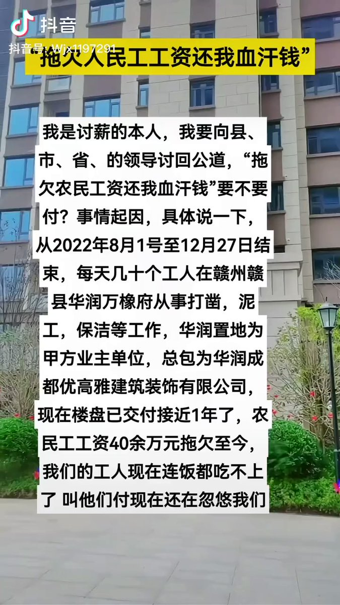
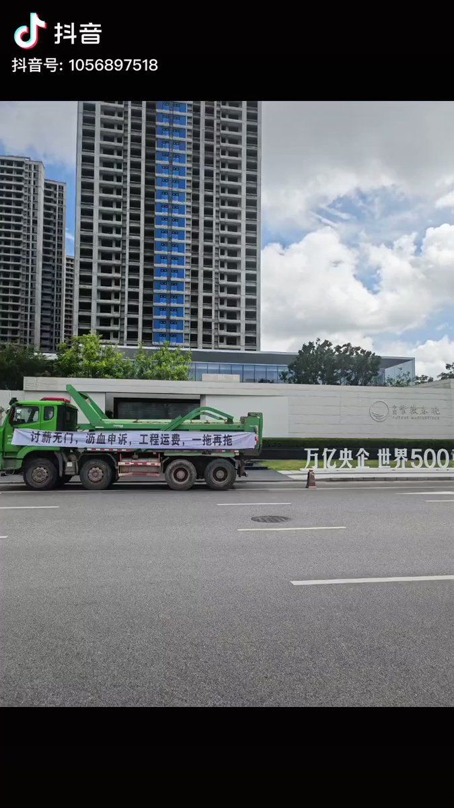

谁将十万横扫三江 北京时间 2023-09-24T13:42:52Z 1705820074035364325 山东省聊城市，一党校建设项目拖欠工人工资，工人在工地门口拉横幅讨薪
时间：2023-09-22
地点：山东省聊城市茌平区
行业：建筑业
公司名称：中交一公局集团有限公司
企业性质：国有企业
项目名称：中国共产党聊城市茌平区委员会党校建设项目
行动类型：堵塞出入交通/拉横幅
诉求：欠薪
参与人数：1-100
资料来源：
https://t.co/lz5g78iCSj
https://t.co/fSMpcVX3Ob
https://t.co/DGdFfyXSMY   谁将十万横扫三江 北京时间 2023-09-24T11:31:14Z 1705786944519872673 RT @SeresMadhouse: 新视频来了！🥰
https://t.co/fIHDu908IJ
在上期节目，我们批判了简中互联网的伪马克思主义以及对人性论的误解，并阐述了真正的马克思主义人性观。在这期节目，我们会详细探讨这种伪马克思主义与对人性论的误解的根源究竟是什么。…   谁将十万横扫三江 北京时间 2023-09-24T12:07:27Z 1705796060130705701 江苏省南京市，一房产项目物业公司拖欠保洁员工资，保洁员罢工
时间：2023-09-18
介绍：
【（摘自原作者视频简介）南京朗诗物业拖欠保洁人员工资长达五个月！导致保洁罢工，交付未满一年的新小区垃圾成灾，物业无辜受牵连！请问交房时缴纳的几百万的物业费去哪里了？！朗诗物业的良心去哪儿了？！】
地点：江苏省-南京市-江宁区-万安北路与天云路交汇口（玖峰兰庭小区）
行业：服务业/卫生和社会工作
公司名称：南京朗诗物业管理有限公司
企业性质：民营企业
项目名称：玖峰兰庭
行动类型：罢工
诉求：欠薪
参与人数：1-100
资料来源：
https://t.co/pLr04PEGKO
https://t.co/p6HeIuG2tO
https://t.co/33MZlpad4A
https://t.co/auFeYqwU0B   谁将十万横扫三江 北京时间 2023-09-24T08:02:30Z 1705734414314172629 山东省烟台市，一健身服务公司拖欠员工工资及社保，员工向有关部门反映、仲裁均无果
时间：2023-09-18～2023-09-20
介绍：
【（摘自原作者视频描述）欺负人可以，但不能太过了，新动力共欠我1.3w工资，社保交到2021年12月，在我离职之前，共欠我一年零7个月社保，且是一直从我个人工资里扣除我个人应缴部分，共计8000多，共计2.1w多，在我离职后，一分钱没发的情况让我签这种无赖条约，本着好聚好散沟通的情况解决，但是给我的最终结果是于12月31日前开始给我发工资，而且是分期，一期大约两三千块钱，得发到明年夏天，还不是百分百确定，聊天记录，电话我都有录音。天天说什么烟台健身本土品牌，一共欠2w多块钱跟个老赖似的，以后谁敢去？现在都2023年了，老百姓要个工资就这么难？正义只会迟到，一定不会缺席！黑白横幅已买，咱们保利见。事情不解决，我一定维权到底！】
地点：山东省-烟台市-莱山区-清泉路-保利广场五层Z501商铺［新动力健身俱乐部（保利MALL店）］
行业：服务业/体育休闲
公司名称：烟台新动力健身有限公司
企业性质：民营企业
行动类型：要求劳动司法等机关介入/诉讼/申请仲裁
诉求：欠薪/社保
参与人数：1-100
官方反应：政府不作为
资料来源：
https://t.co/HZmHwVvhrM
https://t.co/shdkrZ9WkR
https://t.co/Qnfz47fhvz
https://t.co/HACkkJoAnd   谁将十万横扫三江 北京时间 2023-09-24T08:03:09Z 1705734579313938586 江西省赣州市赣县，一房产项目装饰装修工程拖欠工人工资，工人讨薪
时间：2023-09-21
介绍：
【（节选自原作者视频描述）从2022年8月1号至12月27日结束，每天几十个工人在赣州赣县华润万橡府从事打凿，泥工，保洁等工作，华润置地为甲方业主单位，总包为华润成都优高雅建筑装饰有限公司，现在楼盘已交付接近1年了，农民工工资40余万元拖欠至今，我们的工人现在连饭都吃不上了，叫他们付现在还在忽悠我们。】
地点：江西省-赣州市-赣县区-梅林镇贡江大道北16号
行业：建筑业/装饰装修
公司名称：华润成都优高雅建筑装饰有限公司
企业性质：民营企业
项目名称：华润·万橡府
行动类型：请求劳动司法等机关介入
诉求：欠薪
参与人数：1-100
资料来源：
https://t.co/OpyMs1DZrR
https://t.co/VCp9UfQKaT
https://t.co/jU29imwigl   谁将十万横扫三江 北京时间 2023-09-24T08:05:29Z 1705735167774748849 广东省惠州市，一房产建设项目拖欠工程运输车司机运费，司机拉横幅讨要
时间：2022-08-21
地点：广东省-惠州市-惠城区-胜利大道临3号
行业：交通运输/工程运输车
公司名称：惠州中交置业有限公司
企业性质：国有企业
项目名称：中交紫薇春晓
行动类型：拉横幅
诉求：欠薪
参与人数：1-100
资料来源：
https://t.co/qELNUDSm9O
https://t.co/zQlkKYN7ZF
https://t.co/ZsAKHdNULp
https://t.co/YfBnTh0uwY   