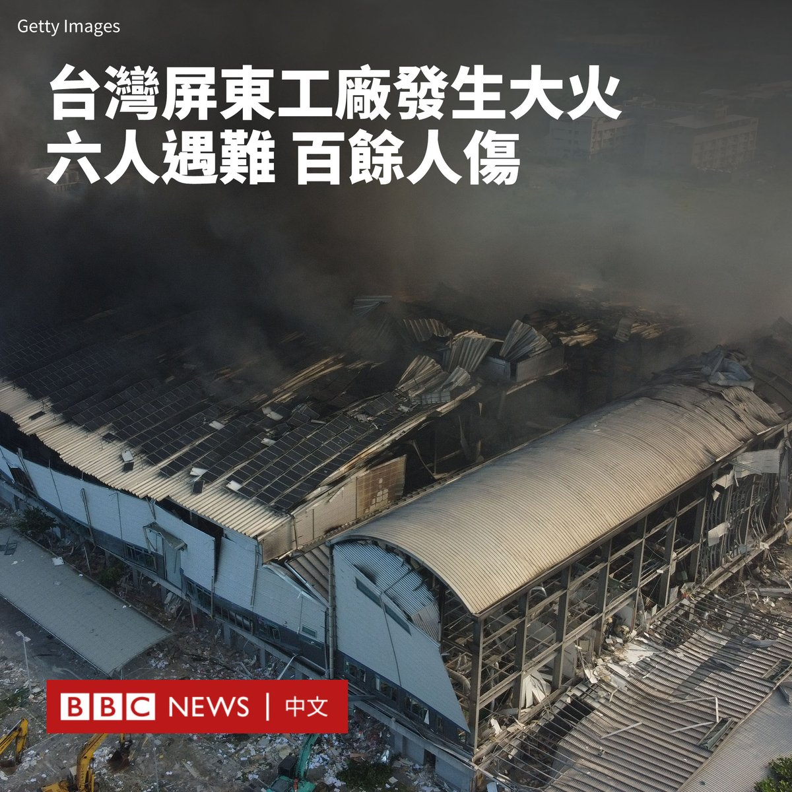

D英国广播公司BBC 北京时间 2023-09-23T19:59:58Z 1705552582691918081 台湾南部屏东县的一家科技工厂发生大火和爆炸事故，目前已至少导致六人死亡，超过100人受伤。遇难者中包括三名消防员。

发生火灾的工厂是屏东科技园区的一家高尔夫球具工厂。据台湾媒体报导，大火自周五（9月22日）傍晚开始燃烧，持续了22个小时后仍未完全扑灭。

据报道，大火发生时导致了多次爆炸，建筑物也发生了坍塌，导致有消防员和员工被困。

当地消防局表示，这座2万平方米的工厂里堆满了用于生产高尔夫球的易燃材料，因此灭火工作困难。

中央社引述屏东县长周春米称，消防人员在刚进入现场后就发生爆炸，目前尚有4名员工1名消防人员失踪。

目前，大火的原因尚不清楚，有分析指可能是原物料起火后引发粉尘爆炸。台湾总统蔡英文表示，内政部已展开调查。

多家台湾媒体报导称，发生火灾的明扬国际公司过去曾多次违反劳动和安全规定，引发人们质疑该事故是否与该公司的疏忽有关。

台湾劳动部表示，当局将于一周内对明扬母公司明安国际所有厂房完成劳动检查，如有违反法规请况，将予以严处。   D英国广播公司BBC 北京时间 2023-09-23T18:02:04Z 1705522913191833968 TikTok前员工与用户对BBC指出，抖音国际版TikTok的演算法鼓励受众在现实社会中作出损人不利己的行为。

https://t.co/bwz7JO0O7D   D英国广播公司BBC 北京时间 2023-09-23T13:21:17Z 1705452251228291193 今年6月，流亡加拿大的印度锡克教独立组织领袖哈迪普·辛格·尼贾尔（Hardeep Singh Nijjar）遭到不明人士枪杀身亡。

近日，加拿大总理特鲁多（Justin Trudeau）指控印度政府参与了该起暗杀行动。该指控扩大了加印两国之间日益扩大的裂痕，更让一些分析人士认为其将导致西方国家陷入“选边站”的两难。 https://t.co/3PhgMPF9Ih   D英国广播公司BBC 北京时间 2023-09-23T13:21:33Z 1705452318936739916 刚刚过去的一周，BBC中文以下新闻内容受到读者的关注。如果你错过了它们，我们带你一一回顾。

https://t.co/h2G3yrJpW9   