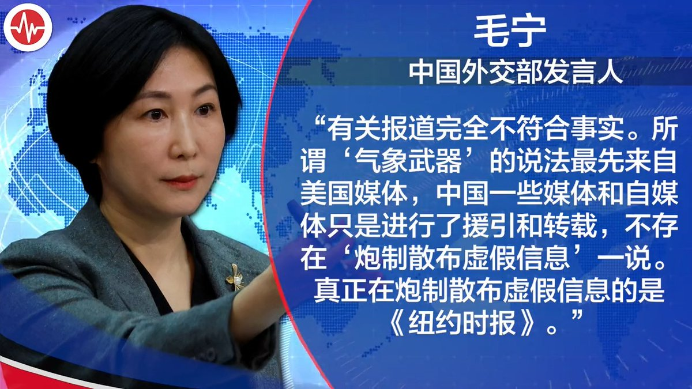
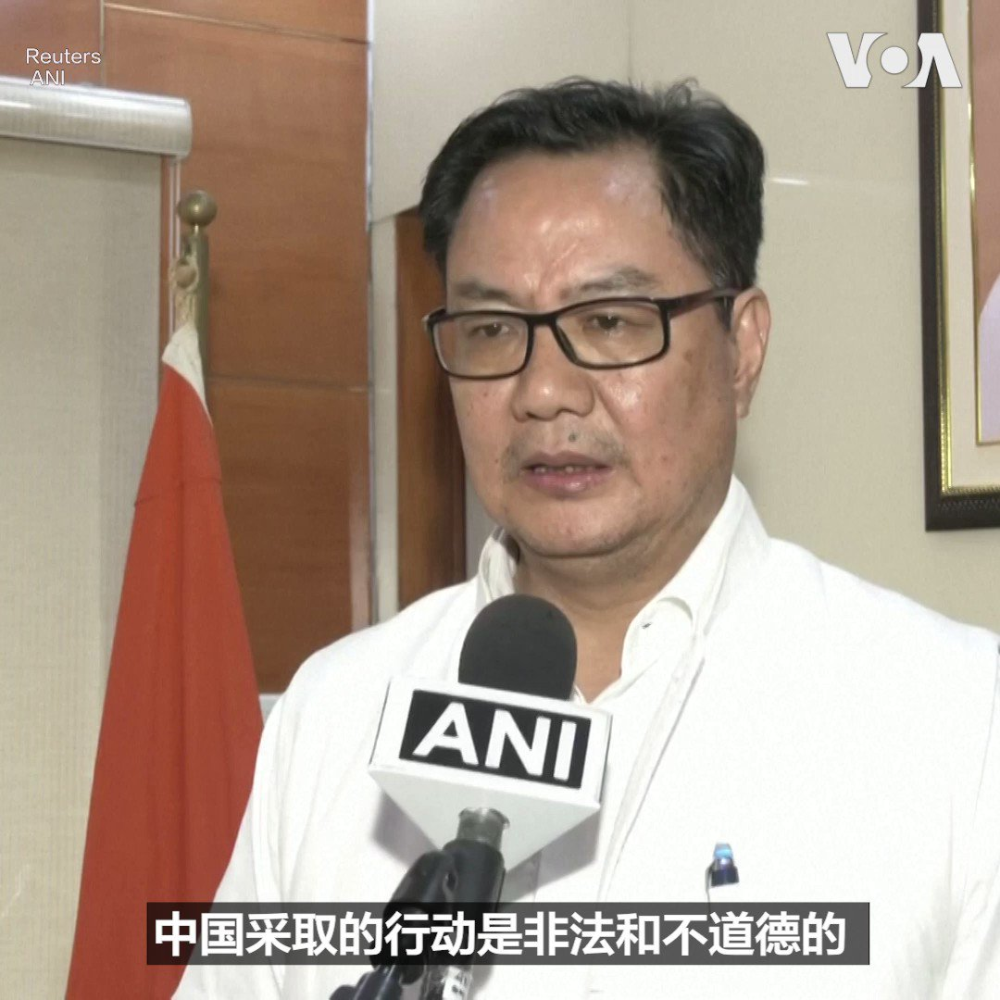

美国之音中文网 北京时间 2023-09-23T22:15:00Z 1705586565789983070 中国国家医保局公布，医保覆盖面达95%。可是医保并不起作用。中国医改专家咨询委员会外籍专家萧庆伦说，中国把钱投入到三甲医院，用最贵的技术和药物来治疗小病，一般人付不出这个钱，造成因病致贫。 #完整版：https://t.co/tFwHFQg7zk https://t.co/9w11pdM35Z   美国之音中文网 北京时间 2023-09-23T19:50:00Z 1705550075336774101 【家事国事天下事，你有何见解】
中国气候变化事务特使称逐步淘汰化石燃料“不符合实际”。但气候变化对世界各国都是严重威胁，对中国来说不但会导致洪灾等自然灾害更加频繁，而且也会导致长江、黄河稳定的水源喜马拉雅山冰川快速融化和消失。国际媒体注意到，中国官方媒体几乎不报道或评论这样的问题。 https://t.co/0kMC1fcXco   美国之音中文网 北京时间 2023-09-23T19:57:40Z 1705552007401197727 中国异议人士陈思明22日在他搭乘的航班在台湾桃园机场中转时“跳机”。他在机场接受台湾 TVBS电视台采访时说他希望到美国去寻求政治庇护。
报道：https://t.co/ARrmPQIwEG https://t.co/5KxKcUn7aT   美国之音中文网 北京时间 2023-09-23T15:39:35Z 1705487058700206450 美韩日对俄朝军事合作表示“严重关切” https://t.co/OGGFcqfiFV   美国之音中文网 北京时间 2023-09-23T13:06:05Z 1705448428761973143 联合国报告：俄罗斯对异议人士和公民社会的镇压达到前所未有的水平 https://t.co/zAwsC5ZgSI   美国之音中文网 北京时间 2023-09-23T05:57:36Z 1705340594175049956 亚利桑那州长访台，宣布台积电在该州芯片厂开工时间返回原计划 https://t.co/atWdXECamr   美国之音中文网 北京时间 2023-09-23T07:52:57Z 1705369624123003348 中共中央反腐小组20日宣布反腐五年计划，称中共坚持“刀刃向内推进党的自我革命”。中共中央党史文献研究院院长曲青山发文说“反腐败是最彻底的自我革命”，“必须把反腐败斗争进行到底”。而随着习近平提拔不久的爱将纷纷落马，不禁让人怀疑，是反腐药不够猛，还是这病就没法治？ https://t.co/5pRRxV6mXg   美国之音中文网 北京时间 2023-09-23T09:15:04Z 1705390290520154179 纽约峰会后，美国希望与中亚建立更密切关系 https://t.co/eLOAaItsHd   美国之音中文网 北京时间 2023-09-23T11:08:32Z 1705418847111823397 美国承诺给海地新援助，敦促联合国授权安全使团 https://t.co/2dHeYN6aZh   美国之音中文网 北京时间 2023-09-23T11:53:06Z 1705430058951950736 美国进入全世界多冲突国前50名 https://t.co/pz2drNcl98   美国之音中文网 北京时间 2023-09-23T04:28:34Z 1705318188245033376 联邦检察官宣布参议员梅嫩德斯及妻子被控受贿 https://t.co/9paDxpIUJA   美国之音中文网 北京时间 2023-09-23T06:29:02Z 1705348508742754614 塔利班参加杭州亚运会队伍全为男性，但阿富汗妇女从世界各地前往参赛  https://t.co/au63LGMuY7   美国之音中文网 北京时间 2023-09-23T07:00:01Z 1705356305517728186 中国医改几十年，从政府到市场，又从市场到政府，两轮路线相反的医改都没有解决看病难看病贵问题。中国国务院医改咨询专家委员会外籍专家萧庆伦说，高压医药反腐只能暂时降低医疗成本，把钱花在高科技三甲医院，从病人身上赚钱，反而造成恶性循环。请看9月23日《#纵深视角》。 https://t.co/oVTSkljtod   美国之音中文网 北京时间 2023-09-23T07:13:05Z 1705359592170135989 乌克兰宣布对导弹袭击克里米亚俄黑海舰队总部负责 https://t.co/sW3Wrcr3l0   美国之音中文网 北京时间 2023-09-23T07:50:00Z 1705368881345224902 【家事国事天下事，你有何见解】
中国气候变化事务特使称逐步淘汰化石燃料“不符合实际”。但气候变化对世界各国都是严重威胁，对中国来说不但会导致洪灾等自然灾害更加频繁，而且也会导致长江、黄河稳定的水源喜马拉雅山冰川快速融化和消失。国际媒体注意到，中国官方媒体几乎不报道或评论这样的问题。 https://t.co/oAxTeyN3Ng   美国之音中文网 北京时间 2023-09-23T08:41:05Z 1705381739097674038 最新研究数据：中国对非洲贷款大幅减少 https://t.co/HKwlmQDnzq   美国之音中文网 北京时间 2023-09-23T10:05:06Z 1705402882521252161 泽连斯基感谢加拿大帮助拯救“成千上万的生命” https://t.co/sLkPAU0gyn   美国之音中文网 北京时间 2023-09-23T00:26:06Z 1705257171783708980 卫星图像显示，俄中美的核试验场近几年动作不断，或为恢复核试验做准备 https://t.co/stKUGqiB57   美国之音中文网 北京时间 2023-09-23T05:00:05Z 1705326120781164865 中国拒绝三名印度运动员参加亚运会引发新的外交纷争 https://t.co/lMs7bDo9IW   美国之音中文网 北京时间 2023-09-23T05:29:04Z 1705333415208521739 香港前民主派区议员组海外网络 继续争取港人权利 https://t.co/9qhPyDrKfy   美国之音中文网 北京时间 2023-09-23T05:44:10Z 1705337216581648815 碳排放壁垒，反补贴调查，中国电动汽车梦断欧洲? https://t.co/Th7FOa6fBN   美国之音中文网 北京时间 2023-09-23T05:44:58Z 1705337417295688167 对中国游客来说，泰国是理想的国外度假胜地之一。在新冠疫情之前，每年有1千万中国人到泰国旅游，疫情后泰国采取了许多措施吸引中国游客重返，但是一部爆红电影《孤注一掷》和各种网络传闻使得许多人将泰国与境外诈骗等联系起来 ；这对泰国的旅游业造成了影响。 https://t.co/t4CxSTcWXI   美国之音中文网 北京时间 2023-09-23T05:46:49Z 1705337880594297131 美国贸易代表戴琪周五参加大西洋理事会举办一场活动谈到各界关注的美国何时会完成对华301关税的审核时表示，“目标是希望在年底前完成这项工作”。至于拜登政府内阁官员接连访问北京，她是否也有访华的计划？戴琪这样回答。详细报道：https://t.co/ZayOWpY9Vg https://t.co/cI9C2G07Jx   美国之音中文网 北京时间 2023-09-23T06:00:01Z 1705341205373219219 #揭谎频道 ：中国散布有关夏威夷火灾的阴谋论 文字报道：https://t.co/Kj50S7RjAm https://t.co/TTOerBMgQe   美国之音中文网 北京时间 2023-09-23T03:11:06Z 1705298694902513689 部分中国网民呼吁抵制印度产iPhone 15，称: “怕有咖喱味” https://t.co/HVF2ZKLPGW   美国之音中文网 北京时间 2023-09-23T03:25:34Z 1705302336430919836 美国汽车工人罢工扩大至20州38处设施 https://t.co/jDPzuGSwND   美国之音中文网 北京时间 2023-09-23T04:16:03Z 1705315040264646665 戴琪：望年底前完成对华301关税审核 https://t.co/RWftV8Xj1q   美国之音中文网 北京时间 2023-09-23T00:15:22Z 1705254471603835250 印度22日抗议中国向参加亚运会的印度运动员发放无效签证。路透社说，这三名武术运动员来自阿鲁纳恰尔邦；印度外交部说他们得到的是另纸签证，并非盖章签证，但印度不接受另纸签证。 印度官员指责中国的行动是“非法和不道德的”。中国表示不承认阿鲁纳恰尔邦（中国称藏南地区），并称这里属于中国领土。 https://t.co/ZdYBfVBxVy   美国之音中文网 北京时间 2023-09-23T01:20:15Z 1705270799509111170 iPhone 15系列9月22日当地时间上午8时在苹果上海旗舰店正式发售。逾百名果粉一早排队进入店内领取预订的新款苹果手机。苹果公司负责中国地区业务的高管也来到现场与果粉互动。中国媒体援引苹果店工作人员报道说，本次发售的状况与往年大体类似。 https://t.co/TQyGFBswLB   美国之音中文网 北京时间 2023-09-23T01:54:33Z 1705279432636936656 美驻日大使愈战愈勇，发图文揭露中国渔船到日本沿海捕捞“污染”海鲜之虚伪 https://t.co/eOxIGaeDHo   美国之音中文网 北京时间 2023-09-23T00:21:28Z 1705256003636285753 位于台北的台湾资讯环境研究中心9月21日发布报告，揭露中共操作“疑美论”的证据，并直指在台湾既有的疑美矛盾中，有高达83%的论述经中共行为者操弄“放大”。专家表示“疑美论”是中共对台心理战，旨在影响选情；“疑美论”也呼应中共的大外宣，为华语受众打造符合中国利益的世界观。https://t.co/3IO3NgAER3 https://t.co/LHmyLQOA5R   