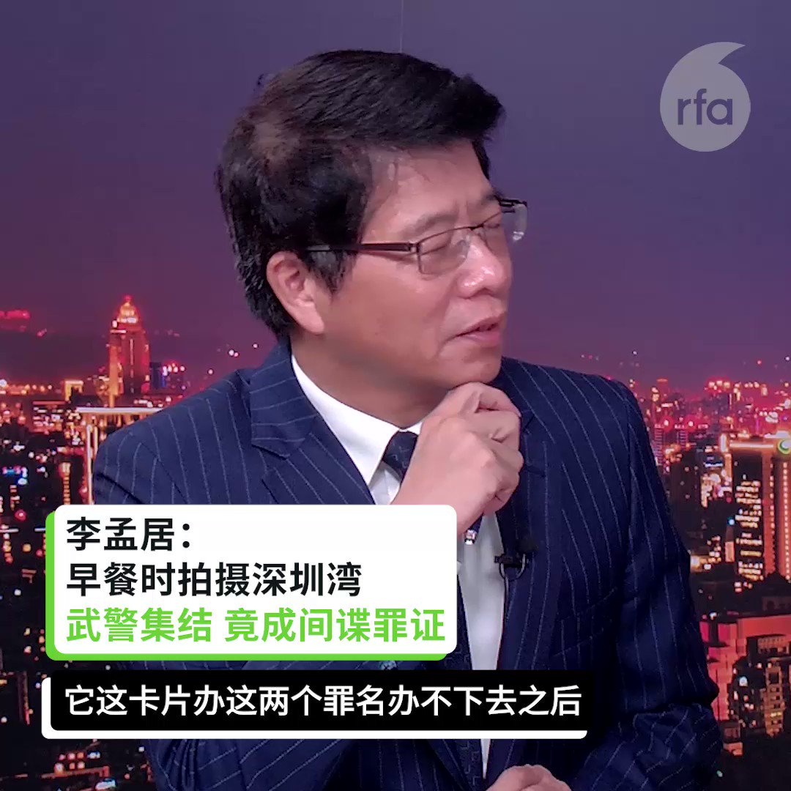

自由亚洲电台 北京时间 2023-09-23T01:39:28Z 1705275635889737974 【#李孟居：网络随处可见的影像 却莫名因此被判间谍 】
【宋国诚：#全民抓间谍 国家恐怖主义 人民互疑 确保红色江山】
https://t.co/q9TUPsi7vU https://t.co/3SEFThJfFT   自由亚洲电台 北京时间 2023-09-23T01:58:16Z 1705280364879675573 #印度 外交部在 #杭州亚运会 开幕的前一天（22日）发表声明，强烈抗议中国向部分参加亚运会的印度运动员发放无效签证的决定。声明还说，为表达抗议，印度体育部长阿努拉格·塔库尔（Anurag Thakur）取消了前往亚运会的行程。
 https://t.co/rIU2heYcmE   自由亚洲电台 北京时间 2023-09-23T00:11:47Z 1705253570126471580 为支持 #黎智英 问鼎 #诺贝尔和平奖，成长于香港的澳大利亚人权律师塔兰特（Mark Tarrant）推出一个名为“#铁链中的黎智英”（Jimmy Lai in Chains）的霓虹灯箱装置，于悉尼街头展出。 https://t.co/vw8h4sGRW6   