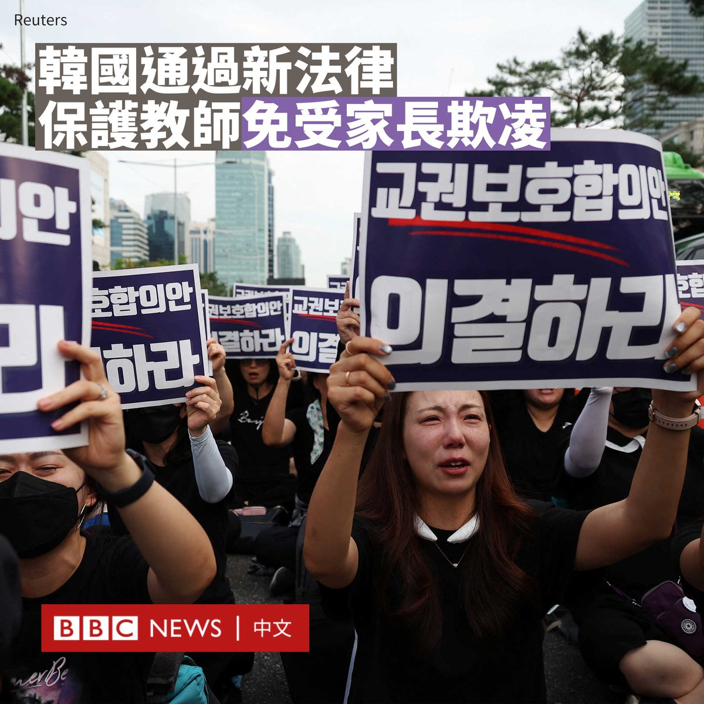
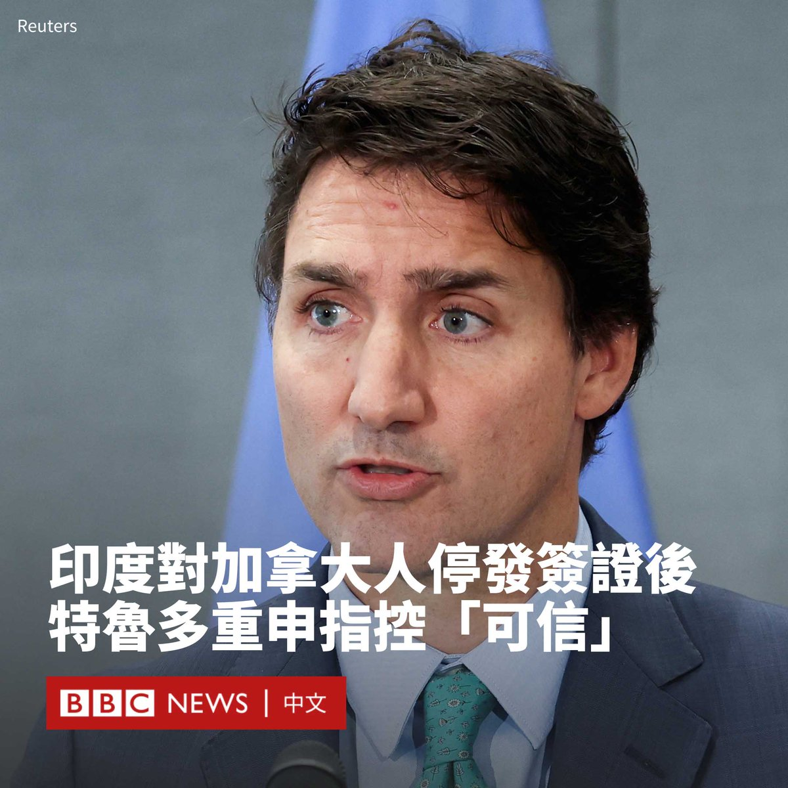
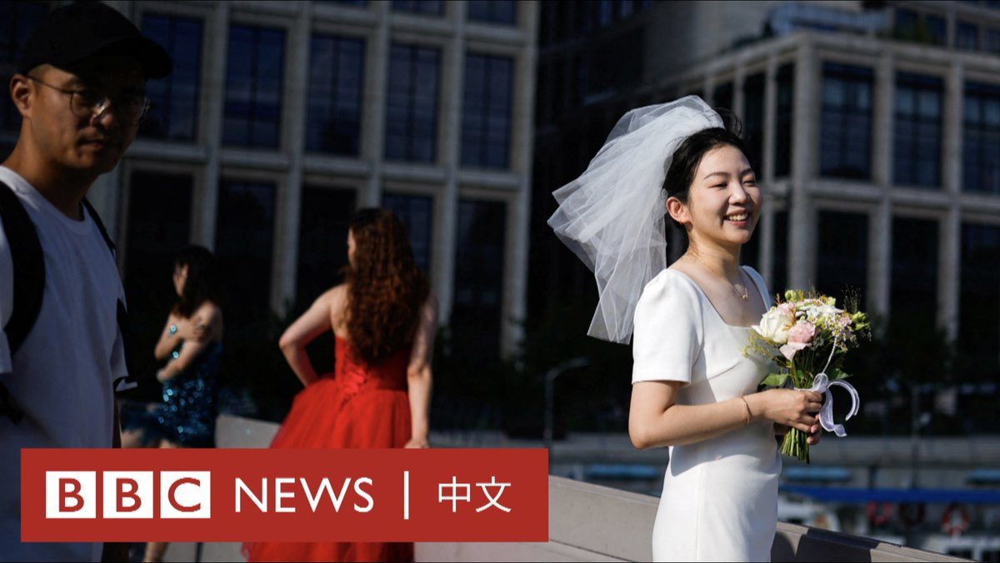
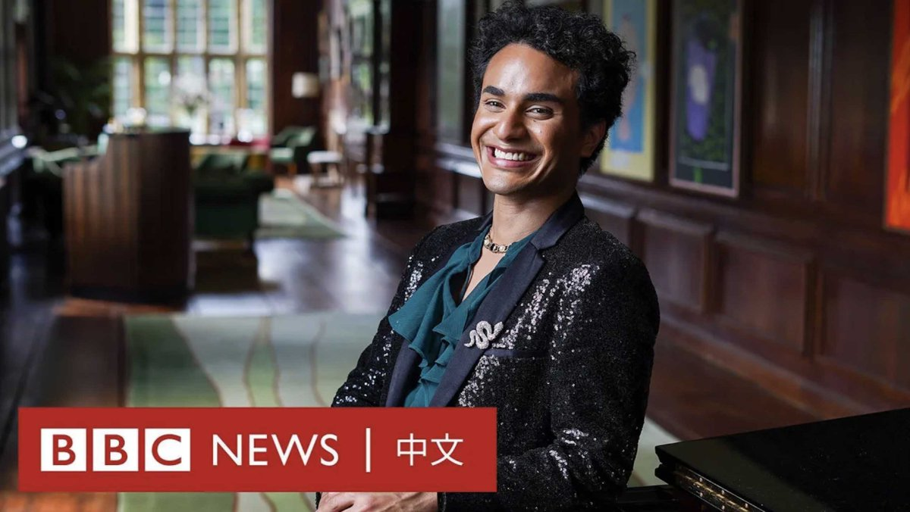

D英国广播公司BBC 北京时间 2023-09-22T20:34:26Z 1705198871000064299 第19届亚洲运动会将于周六（9月23日）在中国杭州开幕，本届亚运会曾因新冠疫情而推迟一年举办。这座中国东部城市为亚运会的举办投入巨资以及大量人力。杭州市民对此怎么看？ https://t.co/aR01K4vtSJ   D英国广播公司BBC 北京时间 2023-09-22T17:17:27Z 1705149297342206129 近几个月来，中国多位高级官员的“失踪”或被撤职引发了外界对于北京难以捉摸的高层政治的关注。这是局势不稳的迹象，还是习近平强大的标志？https://t.co/5l5ndOd3lO   D英国广播公司BBC 北京时间 2023-09-22T13:00:22Z 1705084602409476523 韩国通过了一项新法律，以更好地保护教师免受家长的滥诉。此前，韩国一名小学老师的自杀促使各地教师连续九周走上街头，呼吁保障教师权利。

很多韩国老师表示，他们经常受到学生家长的骚扰和霸凌，甚至恶意举报他们虐待儿童，以使得一些老师被解雇。

一些老师表示，他们曾因管教有暴力行为的儿童而被举报，或因训斥学生受到批评。

这些教师指责家长利用2014年通过的一项儿童福利法，该法规定被控虐待儿童的教师将自动停职。

韩国国会周四（9月21日）表决通过了四项法律修正案，规定校方不得在无正当理由的情况下解除被举报虐童教师的职务，也不得将教师正当的生活指导视为虐待儿童。

法案还将为打官司的教师提供财政支持，校长也将承担更多保护其员工的责任。

今年7月，一名23岁的小学教师疑不堪家长投诉而轻生，点燃了韩国教师的抗议运动。老师们开始分享自己被霸道的学生家长和不守规矩的孩子欺负的经历。 数以万计的小学老师走上街头罢课。

本月早些时候出台的新政府指引明确，教师可以将捣乱的学生从课堂上赶走，并在必要时对他们进行管教。

此外，首尔教育厅本周宣布，计划对所有家长给老师打的电话进行录音，并引进一款聊天咨询机器人，以减轻家长投诉给教师带来的压力。   D英国广播公司BBC 北京时间 2023-09-22T16:04:55Z 1705131045983821839 印度和加拿大因锡克教领袖遇害事件而产生的外交争端不断升级。印度外交部周四（9月21日）宣布，印度已暂停向加拿大公民发放签证。

德里表示，这一举措是因为印度驻加拿大使团遭遇了“安全威胁”。

加拿大总理特鲁多（Justin Trudeau）则于同日重申，有“可信的理由”相信印度特工是锡克教分离主义分子哈迪普·辛格·尼贾尔（Hardeep Singh Nijjar）在加拿大遇害的幕后黑手。

特鲁多在周一首次提出这一指控，但印度进行了强烈驳斥，称其“荒谬”。两国的外交关系随之跌落谷底，双方均驱逐了对方的一名外交官。

尼贾尔于2020年被印度定性为恐怖分子，他于6月在一座寺庙外被枪杀。

周四，特鲁多在参加纽约联合国大会间隙对记者发表讲话，重复了他早些时候的一些说法。

“正如我周一所说，有可信的理由相信，印度政府特工参与了在加拿大领土上杀害一名加拿大人的事件。”他说道，并称加拿大提出指控是为了捍卫“我们所信奉的基于规则的国际秩序”。

当被记者问及证据“有多广泛和可靠”时，特鲁多没有直接回答，但表示加拿大有“严格和独立的司法系统”，“我们允许这些司法程序以最完整的方式展开”。

他还表示，分享这些指控的决定并非轻率之举，而是“极其严肃”的。

在特鲁多周四再次表态前的几个小时前，印度外交部发言人表示，德里已经明确表示，“我们愿意查看提供给我们的任何具体信息。但到目前为止，我们还没有收到任何此类具体信息。”   D英国广播公司BBC 北京时间 2023-09-22T14:19:11Z 1705104435435729126 台湾总统大选将在明年初举行，独立参选的鸿海集团创办人郭台铭支持度一直敬陪末座，并被指可能让民进党参选人赖清德“躺赢”，变相助该党打破台湾民主政治的“八年魔咒”，得以连续执政。

郭台铭为何执意参选，这将给台湾政坛带来什么样的变数？https://t.co/4dszirHErB   D英国广播公司BBC 北京时间 2023-09-22T11:40:37Z 1705064532194787822 在中国经济放缓与低结婚率的夹击下，曾经欣欣向荣的婚礼产业受到冲击。有业内人士观察到，近年来年轻人举办婚礼的数量和规模都在不断缩小。

根据官方数据，中国的结婚人数已连续九年下降。2022年约有680万对夫妇登记结婚，较2021年减少了80万对，成为自1986年有记录以来的最低水平。 https://t.co/PWpmVcb5uH   D英国广播公司BBC 北京时间 2023-09-22T09:30:53Z 1705031882709303699 来自委内瑞拉的塞缪尔·马里诺（Samuel Mariño）是世界上为数不多的男高音歌唱家。尽管29岁的他以前在学校屡遭霸凌，甚至被劝说动手术，但他现在正以独特的嗓音和个性激励着他人。 https://t.co/puxj5h2Lp7   