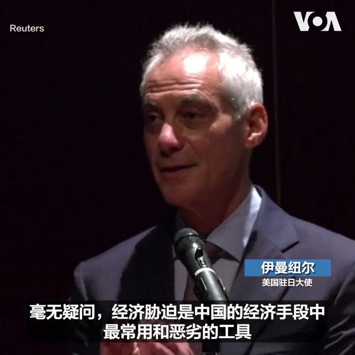
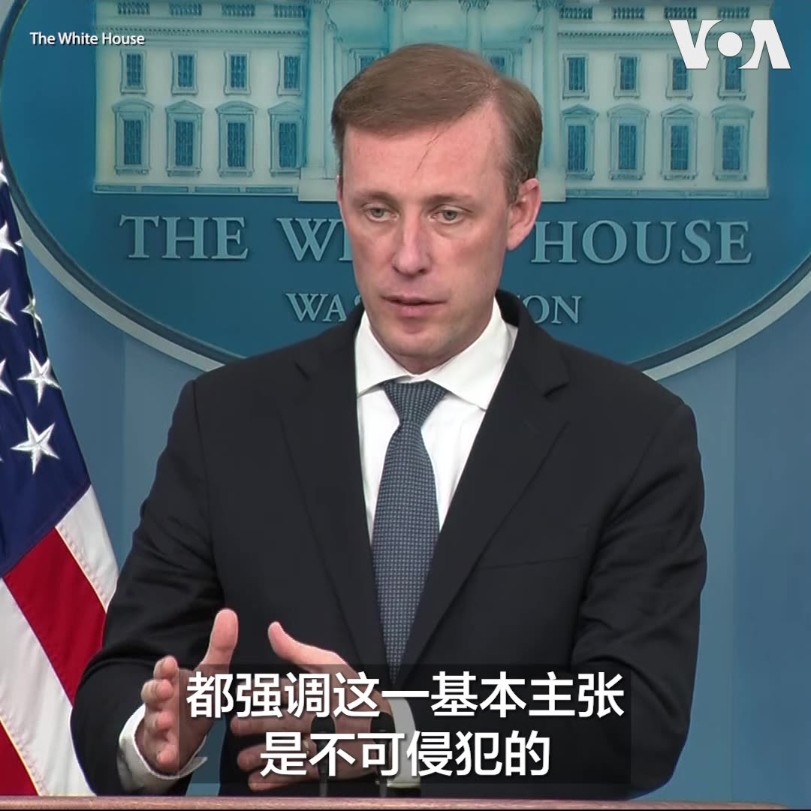
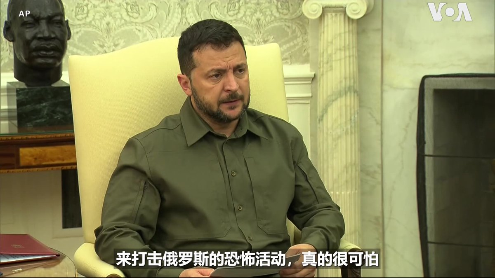

美国之音中文网 北京时间 2023-09-22T23:21:34Z 1705240929882493243 中国禁止三位印度女运动员参加亚运会引发印度强烈不满 https://t.co/o4aH299THZ   美国之音中文网 北京时间 2023-09-22T21:49:03Z 1705217650672984231 美国驻日本大使伊曼纽尔22日在东京的一次讲话中指责中国对日本、澳大利亚、韩国和立陶宛等国家使用经济胁迫手段。他说，这些国家都因为相关的政策成为中国经济报复的目标。 https://t.co/uyEmpkj4CT   美国之音中文网 北京时间 2023-09-22T23:52:05Z 1705248611112755453 美中成立经济和金融工作组，定期进行实质性政策讨论 https://t.co/PDaSEGUu6B   美国之音中文网 北京时间 2023-09-22T20:41:42Z 1705200701209477516 数千名外籍移民自8月底陆续涌现美国边境，他们不断通过巴士和货运列车抵达墨西哥边境城镇或涌入加州的圣迭戈市及德州的艾尔帕索和伊格尔帕斯市。这些美墨边界激增的移民潮，恐对打算竞选连任的美国总统拜登带来新的政治挑战。 https://t.co/wGVf7xsn8z   美国之音中文网 北京时间 2023-09-22T21:01:00Z 1705205557043343800 9/22【#时事大家谈】热点快评：韩正联合国发言：他扮演了习近平信使角色？中国是邪恶帝国？如何看美国总统竞选人抨击中共现象？美企赚钱越来越难欧企投资强劲，中国营商环境究竟如何？    

Youtube🔗 https://t.co/tNttKboMS8 https://t.co/TkIyOGHw9w   美国之音中文网 北京时间 2023-09-22T21:50:33Z 1705218027418190117 美国商务部推出芯片法执行细则 确保中国半导体行业不会从527亿补贴中受益 https://t.co/3eDe86VD6L   美国之音中文网 北京时间 2023-09-22T21:54:29Z 1705219015952433507 乌克兰总统弗拉基米尔·泽连斯基9月22日抵达加拿大进行访问。加拿大总理特鲁多在渥太华机场迎接泽连斯基和夫人。这是泽连斯基在乌俄战争爆发后首次访问加拿大。此前，泽连斯基在纽约出席了联大会议，随后还访问了华盛顿。泽连斯基在联大发言时呼吁国际社会向乌克兰提供更多支持。 https://t.co/6qHkosYQ92   美国之音中文网 北京时间 2023-09-22T22:05:35Z 1705221809078169621 中国当局以“颠覆”罪名庭审女权活动人士、独立记者黄雪琴与维权人士王建兵 https://t.co/OmkRXM1F4f   美国之音中文网 北京时间 2023-09-22T17:44:07Z 1705156009772351960 菲律宾就珊瑚礁被中国“破坏”问题 研拟再告国际法院 https://t.co/BI5IY9UtVw   美国之音中文网 北京时间 2023-09-22T18:42:35Z 1705170721276903873 中国异议人士陈思明“跳机”抵台湾 盼获美加政治庇护 https://t.co/c0brIHGsBD   美国之音中文网 北京时间 2023-09-22T19:50:00Z 1705187688096448833 【家事国事天下事，你有何见解】中国当局在鼓励人们买房，试图通过挽救房市来挽救经济，然而成效甚微，因为投资买房需要人们对经济发展前景有信心。但批评者说，中共当局的所作所为恰恰是毁坏而不是提振信心，连小粉红也信心丧失，否则小粉红们应当在踊跃购房。中共有何招法提振人们对它管经济的信心？ https://t.co/3c8f97wVDv   美国之音中文网 北京时间 2023-09-22T18:01:07Z 1705160288214106531 中国气候特使：逐步淘汰化石燃料“不符合实际 https://t.co/9xAH0raB1k   美国之音中文网 北京时间 2023-09-22T13:31:05Z 1705092332687921531 加拿大官员：对锡克教领袖被杀害的指控 是基于对印度驻加拿大外交官的监视 https://t.co/AxF6NXU7dW   美国之音中文网 北京时间 2023-09-22T14:22:34Z 1705105288200962147 巴基斯坦将于明年一月举行全国选举 https://t.co/LiwpnGdQBz   美国之音中文网 北京时间 2023-09-22T11:37:34Z 1705063765216198893 朝鲜最高层讨论金正恩访俄跟进举措 https://t.co/CfgWea5Ii1   美国之音中文网 北京时间 2023-09-22T08:14:33Z 1705012674856390852 中国大陆两名主教在中梵关系出现紧张后将出席教廷重要会议 https://t.co/LnM67TAgqr   美国之音中文网 北京时间 2023-09-22T09:00:00Z 1705024112412987459 #揭谎频道  一份最新报告证实，在野火席卷美国夏威夷毛伊岛的同时，互联网上一个由亲中国网红组成的网络推动了有关美国军方气象武器实验纵火的阴谋论。https://t.co/edN4RKticl   美国之音中文网 北京时间 2023-09-22T04:31:34Z 1704956558189466108 巴拉圭向中国投资招手 但重申与台湾关系稳固 https://t.co/U2LhZ5F9PC   美国之音中文网 北京时间 2023-09-22T04:49:05Z 1704960965094048023 俄罗斯总统普京将于10月访问北京，和中国国家主席习近平会晤。9月21日，在乌克兰总统泽连斯基紧锣密鼓地在华盛顿与两党政要及拜登总统会晤同天，有记者问白宫国安顾问沙利文，他希望习近平在乌克兰问题上，向普京传达什么信息？沙利文这样回答。 https://t.co/vFoyzWUl3L   美国之音中文网 北京时间 2023-09-22T05:19:52Z 1704968710543302910 周四（9月21日）中国国家副主席韩正在联合国大会一般性辩论中发言。法轮功和维吾尔抗议者在联合国对面举行示威，抗议北京对法轮功的镇压和对维吾尔人的种族灭绝。 https://t.co/DvtOXMnmtk   美国之音中文网 北京时间 2023-09-22T05:58:05Z 1704978330905403708 鲁比奥等共和党议员推出法案，禁止中共党员获取庇护 https://t.co/fr8nsdC9RI   美国之音中文网 北京时间 2023-09-22T06:28:04Z 1704985877217452179 中国批准芯片材料镓和锗的出口许可 https://t.co/URp0UBxxMY   美国之音中文网 北京时间 2023-09-22T06:51:03Z 1704991660399038545 “美国人民决心竭尽全力确保世界与你们站在一起，这是我们眼下的压倒性目标，”美国总统拜登9月21日在白宫对来访的乌克兰总统泽连斯基说。泽连斯基表示，美国与乌克兰之间的定期对话表明两国是真正的盟友，而他这次来华盛顿是为了进一步加强双边联盟。 https://t.co/JgjHjBkKSJ   美国之音中文网 北京时间 2023-09-22T06:57:33Z 1704993294877700247 韩正联大发言: 愿尽最大努力争取和平统一台湾 场外维吾尔人抗议: 回去清理你的后院 https://t.co/zfDaypXWSr   美国之音中文网 北京时间 2023-09-22T07:00:01Z 1704993917874364572 美国大选候选人纷纷尖锐批评中国。前副总统彭斯说中国“正在努力成为一个邪恶帝国”。争取连任的现总统拜登称习近平是“独裁者”。这是两党对中国认识的共识还是竞选策略？美国公司在中国赚钱越来越难，但欧洲国家如德国公司今年对华投资持强劲趋势。中国营商环境到底如何？请看22日上午9点《时事大家谈》 https://t.co/9167WXkSa9   美国之音中文网 北京时间 2023-09-22T07:11:05Z 1704996700904128704 面对与中国爆发贸易战可能,欧盟表示不惧怕 https://t.co/h4LhX7iiPg   美国之音中文网 北京时间 2023-09-22T07:50:00Z 1705006493521805334 【家事国事天下事，你有何见解】中国当局在鼓励人们买房，试图通过挽救房市来挽救经济，然而成效甚微，因为投资买房需要人们对经济发展前景有信心。但批评者说，中共当局的所作所为恰恰是毁坏而不是提振信心，连小粉红也信心丧失，否则小粉红们应当在踊跃购房。中共有何招法提振人们对它管经济的信心？ https://t.co/eTv0F5rBdi   美国之音中文网 北京时间 2023-09-22T08:18:18Z 1705013614740930979 【#原声带·格雷老师：不当“洋五毛”，我要帮中国人争自由】我叫格雷，我是一个毕业于伯克利音乐学院的音乐家，一个吉他手。文字报道：https://t.co/r5pDWMdvhQ https://t.co/DkzG9wuCyX   美国之音中文网 北京时间 2023-09-22T08:46:06Z 1705020610831929671 盟友公开争吵:波兰表示不再给乌克兰武器，美国对争端淡化处理 https://t.co/jLQtWUXJLG   美国之音中文网 北京时间 2023-09-22T09:14:47Z 1705027830747152816 日中关系专家表示，日本新任防相的首要任务是对于“日本有事”做好万全准备。台湾学者认为，建立台日安保合作机制尚需时间。报道：https://t.co/yzlTQyA8N3 https://t.co/f8oMEudPat   美国之音中文网 北京时间 2023-09-22T04:31:36Z 1704956566078992893 美国议员敦促严格执行维吾尔人权政策法和防止强迫维吾尔人劳动法 https://t.co/YL07aRjmd0   美国之音中文网 北京时间 2023-09-22T04:45:08Z 1704959971061010693 泽连斯基告诉美国议员：没有美国的援助乌克兰将输掉战争 https://t.co/uiK2z2WAeM   美国之音中文网 北京时间 2023-09-22T04:59:06Z 1704963486277935415 东盟首办联合军演迈出历史性一步 但抗中扩张力道仍不足 https://t.co/OeaSqYtyFZ   美国之音中文网 北京时间 2023-09-22T05:26:23Z 1704970354307862544 东盟正在印尼巴淡岛举行为期五天的联合军演，展现区域团结。观察人士表示，此举显示东盟正致力维护其中心性，但在应对北京海上扩张行径上仍缺乏共识，而未来为了避免惹怒中国，可能先在南中国海进行科学研究、而非立即扩大军演规模 https://t.co/GNCu4ZH5tY https://t.co/aS2Gyj1bPS   美国之音中文网 北京时间 2023-09-22T06:14:33Z 1704982474361880841 原声带·格雷老师：不当“洋五毛”，我要帮中国人争自由 https://t.co/iI6RQm3Whk   美国之音中文网 北京时间 2023-09-22T01:13:27Z 1704906700002566193 因新冠疫情而推迟一年举行的杭州亚运会即将在本周末拉开帷幕，届时中国领导人习近平也将出席开幕式。在后疫情时代中国经济状况不佳之际举办这样的大型赛事，中国民众怎么看？路透社在杭州采访了几位本地居民和游客。https://t.co/T9Y4cCNCQh https://t.co/hwzgX4Bzj0   美国之音中文网 北京时间 2023-09-22T01:15:11Z 1704907134943826127 马绍尔群岛愿与美国续签“自联协定” 但要美国解决核试遗留问题 https://t.co/NUVHrCuboJ   美国之音中文网 北京时间 2023-09-22T02:25:46Z 1704924897800007905 乌克兰总统泽连斯基21日到五角大楼会晤了美国国防部长奥斯汀；随后泽连斯基与夫人在五角大楼的911纪念园献花。泽连斯基21日还与美国国会两党领袖们见面，并将在白宫会晤拜登总统。 https://t.co/NVPQSTZ77l   美国之音中文网 北京时间 2023-09-22T03:00:06Z 1704933538775363957 香港民主党中委推荐8人参与区选 学者指背后或有政治压力“入闸”成疑 https://t.co/SmnC58bdEB   美国之音中文网 北京时间 2023-09-22T03:58:06Z 1704948134215131341 阿塞拜疆和亚美尼亚族在纳卡地区停火后开始谈判 https://t.co/ul4yRE4BE1   美国之音中文网 北京时间 2023-09-22T04:17:20Z 1704952975750263256 美国总统拜登和第一夫人吉尔·拜登9月21日下午在白宫欢迎乌克兰总统泽连斯基和第一夫人奥莱娜·泽连斯卡(Olena Zelenska)的到访。随后，拜登在椭圆形办公室与泽连斯基举行双边会谈。在此之前，泽连斯基到国会山与参众两院两党领袖会晤，对美国国会及美国人民对乌克兰的支持表示衷心感谢。 https://t.co/Lr1Yz0EuD2   美国之音中文网 北京时间 2023-09-22T00:41:35Z 1704898682137481575 正在法国访问的英国国王查尔斯三世和王后卡米拉在法国第一夫人布里吉特·马克龙陪同下21日来到巴黎郊外的圣但尼 Saint-Denis ，与当地的体育社团会面。卡米拉王后和马克龙夫人还进行了一场“乒乓对决”。圣但尼将是2024年奥运会的主要比赛场地。 https://t.co/74ULXu7d5c   美国之音中文网 北京时间 2023-09-22T01:00:06Z 1704903338134012184 日本新防相是对中鹰派，专家:做好“日本有事”的万全准备 https://t.co/pb1xJDD8do   美国之音中文网 北京时间 2023-09-22T01:15:07Z 1704907120368632192 台NGO报告揭中共炒作疑美论 分析：对台心理战 https://t.co/cL1NJIg5OI   美国之音中文网 北京时间 2023-09-22T01:15:13Z 1704907142409715840 美军首次在靠近中国的西太平洋部署无人水面舰艇 为可能与中国发生的冲突做准备 https://t.co/1yrPvHtjpo   美国之音中文网 北京时间 2023-09-22T01:58:02Z 1704917919224746354 【#原声带 出品 美东时间今晚6点不见不散】 
用中文在哔哩哔哩上教吉他让他一度在防火长城内走红，针砭中国时政的原创歌曲也让他一夜间被封杀。“我们人类跟共产党这个体系在未来不能共存，”格雷老师对美国之音说。“我们的责任就是让这个体系垮台！” 
YouTube：https://t.co/Z4CToAcFnK https://t.co/RNnnPXWKPS   美国之音中文网 北京时间 2023-09-22T02:16:34Z 1704922581550445013 VOA专访前德国驻中国大使史丹泽: 德中关系: 从伙伴到竞争与对抗 https://t.co/4JsZIEXtIF   