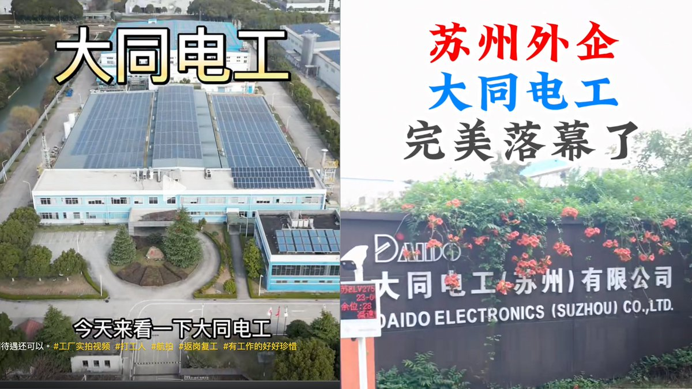
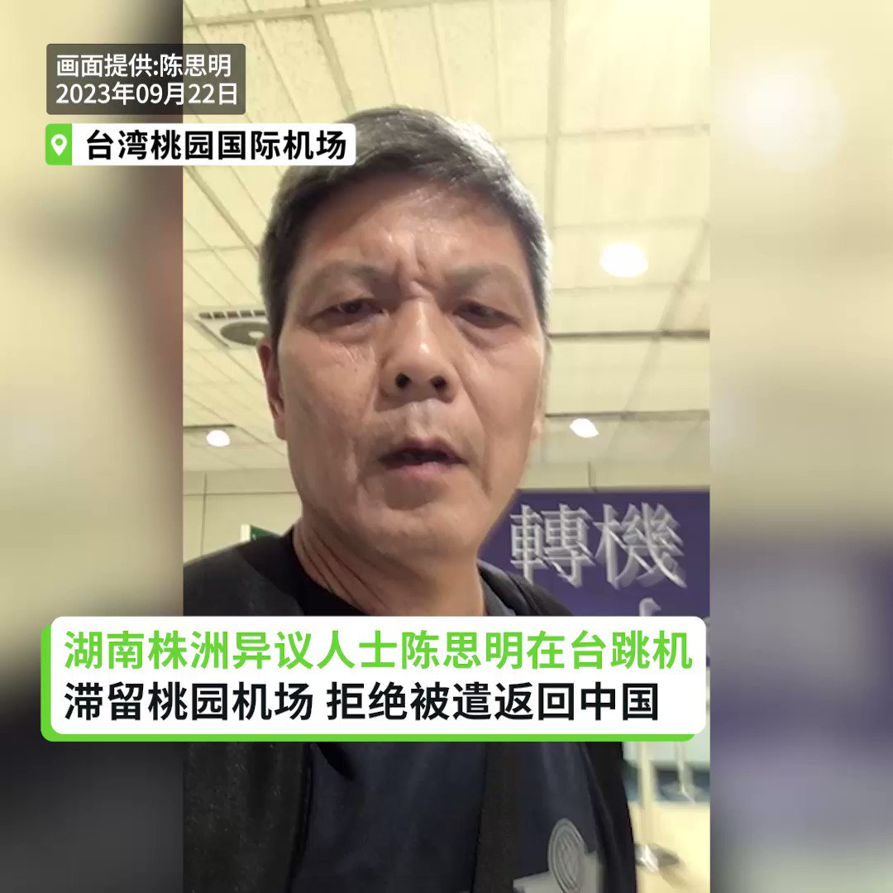
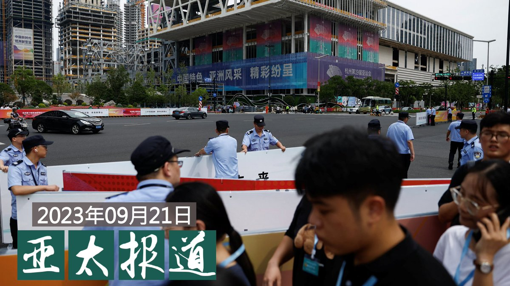
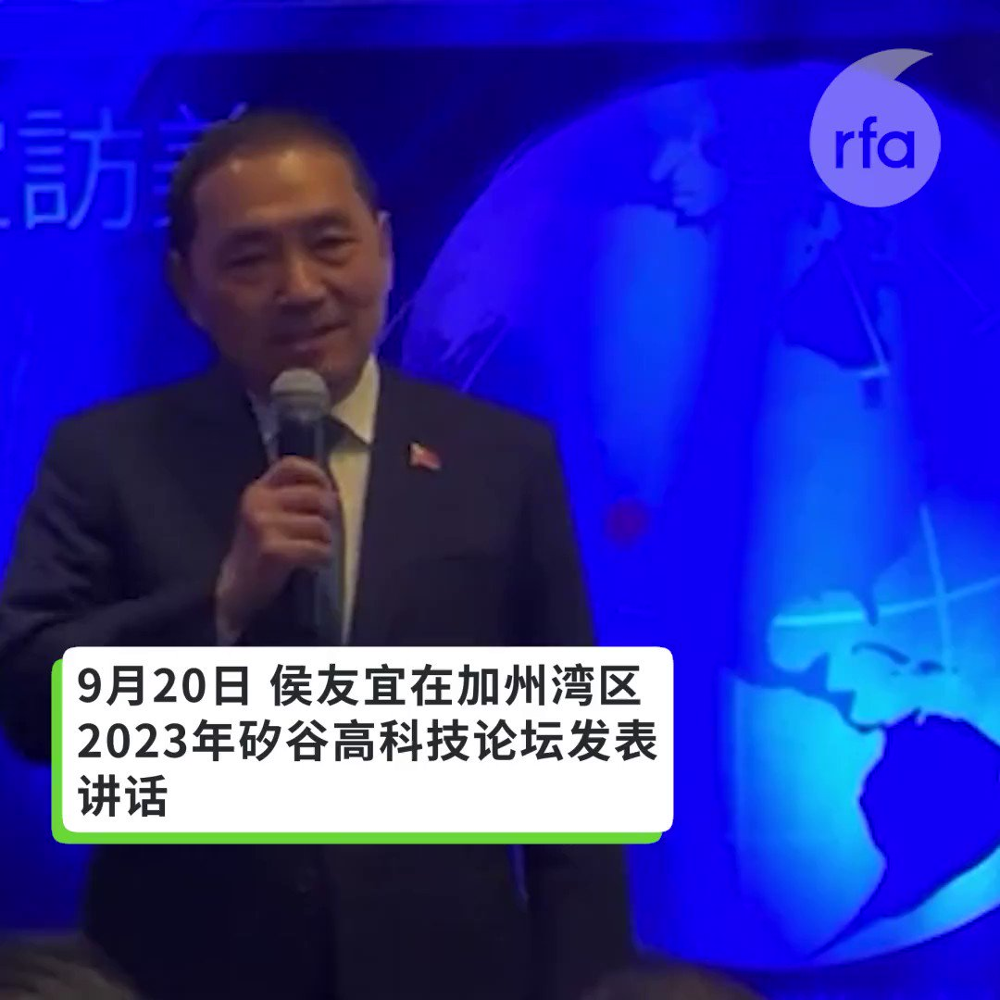

自由亚洲电台 北京时间 2023-09-22T21:28:07Z 1705212381326929969 RT @RFA_Chinese: 【湖南维权人士陈思明在台跳机 拒绝返回中国】
#陈思明 接受自由亚洲电台访问时表示，他在7月22日从中国逃出后，曾先到老挝，看到中国人权律师 #卢思位 被捕的消息，他相当害怕，决定转往泰国，并取得难民身份。不过，他担心在泰国随时会被抓捕进移民监…   自由亚洲电台 北京时间 2023-09-22T19:52:24Z 1705188294399836227 RT @RFA_Chinese: 【#红砖巷涂鸦 主创一鹊：我的作品是面镜子 别人评价它时也在评价自己｜#观点】
https://t.co/kZQ6PD3s6k
 #一鹊 @ArtYique 理解某些人看来东伦敦的24个字像是纳粹符号，他鼓励大家二次创作，但对一个想要引发讨论揭…   自由亚洲电台 北京时间 2023-09-22T19:57:00Z 1705189451712880673 RT @RFA_Chinese: 今年3月，国际刑事法院以 #普京 涉嫌在乌克兰犯有战争罪为由，对他发出逮捕令。之后普京除了前往俄罗斯占领的乌克兰地区，一直没有离开俄罗斯。
中国是 #国际刑警组织（ICAO）成员，#习近平邀普京访中 公然挑战国际刑事法院逮捕w令？ https:…   自由亚洲电台 北京时间 2023-09-22T14:34:00Z 1705108166558863516 【北京朝阳区住建委拍卖154套住宅】
【苏州日企 #大同电工 宣布撤资】
北京市朝阳区住建委在网上拍卖154套商品房，住房面积74至101平方米，每平方米拍卖起价为九万多元，总计超过十亿元人民币，低于市场价格。另外，日资巨头大同苏州有限公司向员工发出解散及遣散通知。详细报道：https://t.co/KSaCakdNXV   自由亚洲电台 北京时间 2023-09-22T13:47:44Z 1705096521430045139 RT @RFA_Chinese: 【#红砖巷涂鸦 主创一鹊：我的作品是面镜子 别人评价它时也在评价自己｜#观点】
https://t.co/kZQ6PD3s6k
 #一鹊 @ArtYique 理解某些人看来东伦敦的24个字像是纳粹符号，他鼓励大家二次创作，但对一个想要引发讨论揭…   自由亚洲电台 北京时间 2023-09-22T13:48:20Z 1705096672311705600 RT @RFA_Chinese: 欢迎收听和订阅播客【亚太报道】 https://t.co/MjLNSvVeAE
【#亚太报道（2023-9-21）】
#习近平 将出席 #杭州亚运会 维权民众遭殃 / #王炳章 患重病减刑无望 / 中国前央行行长 #易纲 吁加大调控政策 / #…   自由亚洲电台 北京时间 2023-09-22T13:53:00Z 1705097846666469511 RT @RFA_Chinese: 【RFA独家：中国留美学生为民主发声　国内家人遭骚扰】
https://t.co/AYsfLamnHA
美国大学校园本应是学子积极向学、勇于发表看法的安全空间。不过，就读于华盛顿特区乔治城大学（Georgetown University）法学院…   自由亚洲电台 北京时间 2023-09-22T09:37:52Z 1705033641397772335 本周四，多位中国问题专家表示，中国日前发布《#全球治理变革和建设的中国方案》，旨在将中国议程纳入国际讨论，并通过外交手段将其合法化。

 https://t.co/uFPgoIU4Fm   自由亚洲电台 北京时间 2023-09-22T09:56:25Z 1705038310132039939 【湖南维权人士陈思明在台跳机 拒绝返回中国】
#陈思明 接受自由亚洲电台访问时表示，他在7月22日从中国逃出后，曾先到老挝，看到中国人权律师 #卢思位 被捕的消息，他相当害怕，决定转往泰国，并取得难民身份。不过，他担心在泰国随时会被抓捕进移民监狱，所以在21日买了张回中国的机票，在 #桃园机场 转机时拒绝返回中国。希望 #台湾 政府协助。
https://t.co/cbRU4QwKmf   自由亚洲电台 北京时间 2023-09-22T00:55:49Z 1704902262936715382 #叙利亚 总统 #阿萨德 周四（21日）抵达中国杭州。这是他自叙利亚冲突爆发12年以来首次访华。在西方制裁下，叙利亚长期处于外交孤立状态，而北京是阿萨德政权的主要支持者之一。
 https://t.co/aPvzU1B5rc   自由亚洲电台 北京时间 2023-09-22T06:30:01Z 1704986365811892296 据本台英文组报道，去年3月被美国司法部起诉、涉嫌为中国政府充当代理人的纽约华裔人士 #王书君，将于2024年7月15日接受庭审。美国纽约东区地方法院法官布罗迪（Chief Judge Margo Brodie）周四（21日）宣布了这一庭审日期。消息受到了检察官的欢迎。

 https://t.co/moYb3Py9WI   自由亚洲电台 北京时间 2023-09-22T07:00:10Z 1704993953223700755 欢迎收听和订阅播客【亚太报道】 https://t.co/MjLNSvVeAE
【#亚太报道（2023-9-21）】
#习近平 将出席 #杭州亚运会 维权民众遭殃 / #王炳章 患重病减刑无望 / 中国前央行行长 #易纲 吁加大调控政策 / #日本对华出口 断崖式下跌 / 台湾5友邦在 #联大辩论会 上发言挺台 https://t.co/sVGSxtJ8YB   自由亚洲电台 北京时间 2023-09-22T04:35:16Z 1704957489874366590 #易纲 建议北京当局应该“因城施策”，透过租房贷款优惠以及适当补助地方政府，改善住房需求、扩大地方政府的房产收购量，同时，藉由 #户籍改革 推动都市化，将农民工带入城镇，由于城市新住民会有较高消费意愿，便能扩大内需... https://t.co/mMp2gS66SY   自由亚洲电台 北京时间 2023-09-22T04:41:03Z 1704958945100783772 对于中共领导人扑朔迷离的举措和经济表现疲软，澳大利亚莫纳什大学研究中国问题的讲师凯大熊（Kevin Carrico）认为, 责任不完全在 #习近平 一人身上，而是中国共产党制度缺陷的缩影。 https://t.co/CjsIbUjH5p   自由亚洲电台 北京时间 2023-09-22T04:54:50Z 1704962412821275035 美国的人权组织 #对话基金会 21日援引中国政府内部一个消息来源称，维吾尔族知名知识分子和民俗传统专家热依拉· 达吾提（راھىلە داۋۇت,）教授因涉嫌危害国家安全的罪名，被判处无期徒刑，并剥夺政治权利终身。这是首次有中国政府的可靠消息来源确认她被判终身监禁。

 https://t.co/bnnHwhJbfB   自由亚洲电台 北京时间 2023-09-22T04:56:29Z 1704962829437087850 【#您怎么看？ 英语四六级和学位证脱钩，中国和世界脱钩？】
#西安交通大学 2023年9月21日宣布，不再将 #大学英语四六级、校内英语水平考试以及其他各类英语考试作为本科生毕业及学位授予的条件。
网友议论纷纷，有的赞其减轻学生考试压力，有的看全面脱钩的端倪。西安交大教务处工作人员回应，消息属实，这是通过商议决定的，其他学校也有，并不是一个奇怪的决定。#您怎么看？   自由亚洲电台 北京时间 2023-09-22T05:30:00Z 1704971262731444516 #事实查核｜墨西哥或为“全球首个承认外星人存在的国家”？
 https://t.co/TxmLXGkGrf   自由亚洲电台 北京时间 2023-09-22T01:05:22Z 1704904664666489004 专栏 | #中国透视: 三代而丧天命— #中共建政74周年 祭
 https://t.co/hi6rLPAsug   自由亚洲电台 北京时间 2023-09-22T02:25:11Z 1704924752731930704 宋国诚："在外交的情绪上，或者是民族主义的斗争当中，中国可能是胜了一个回合；可是...如果中日仇恨继续下去，只会减少日本资本进入中国，甚至导致日本的企业退出中国，等同是'损人八百，自损一千'，得不偿失而且适得其反。这是愚蠢外交的结果。"

 https://t.co/lv78ij7EJb   自由亚洲电台 北京时间 2023-09-22T03:06:19Z 1704935102659387642 专栏 | #军事无禁区：政治忠诚无限上纲－#习近平 治军困境
 https://t.co/ec3Ck9RtJK   自由亚洲电台 北京时间 2023-09-22T03:18:04Z 1704938062537711677 美国参议院周三（20日）以83比11的压倒性多数，通过由拜登总统提名的美国空军参谋长查尔斯·布朗（Charles Q. Brown）为新任参谋长联席会议主席。他将接替在月底退役的现任参联会主席、陆军上将马克·米利(Mark Milley)。

 https://t.co/KIlm6lBuwh   自由亚洲电台 北京时间 2023-09-22T04:07:33Z 1704950512221639074 9月20日，侯友宜在加州湾区2023年矽谷高科技论坛发表讲话。 https://t.co/tRkeJ113Dl   自由亚洲电台 北京时间 2023-09-22T04:15:45Z 1704952575014195587 当地时间9月20日，出访美国的台湾国民党总统参选人 #侯友宜 抵达加州旧金山湾区，与当地科技界和侨界人士举行会晤。这里也是侯友宜美国之行的最后一站。

 https://t.co/qpu0qNK78C   自由亚洲电台 北京时间 2023-09-22T00:28:02Z 1704895268225966201 第78届 #联合国大会 总辩论19日展开,累计两天内至少有5个台湾友邦元首为台湾发声。此外,捷克总统帕维尔(Petr Pavel)则以非友邦元首身份公开表达支持。

 https://t.co/c50G2DIOwg   自由亚洲电台 北京时间 2023-09-22T02:00:56Z 1704918648794886240 近日，遭中国当局以“间谍罪”和“组织、领导恐怖组织罪”判处无期徒刑的民运人士 #王炳章 获得家属探视。这也是自疫情爆发以来，王炳章首次和子女会面。据家属透露，王炳章高血压严重，有生命危险。但由于王炳章坚持拒绝认罪，也使得家属对他能获得保外就医的愿望落空。

 https://t.co/sdhUBSU8od   自由亚洲电台 北京时间 2023-09-22T00:14:24Z 1704891838099009656 今年3月，国际刑事法院以 #普京 涉嫌在乌克兰犯有战争罪为由，对他发出逮捕令。之后普京除了前往俄罗斯占领的乌克兰地区，一直没有离开俄罗斯。
中国是 #国际刑警组织（ICAO）成员，#习近平邀普京访中 公然挑战国际刑事法院逮捕w令？ https://t.co/0TBXPmm3JS   