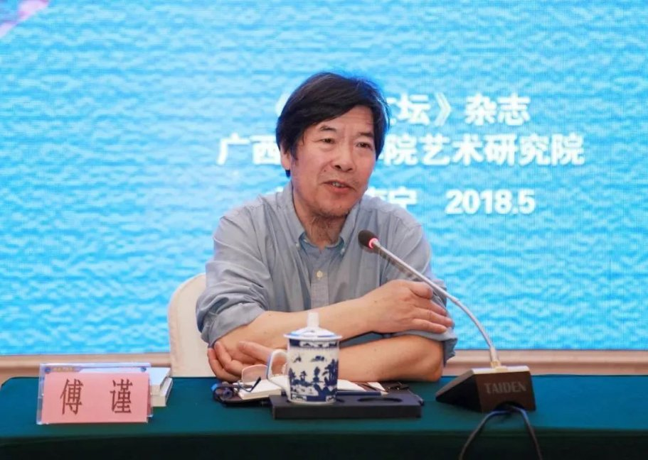
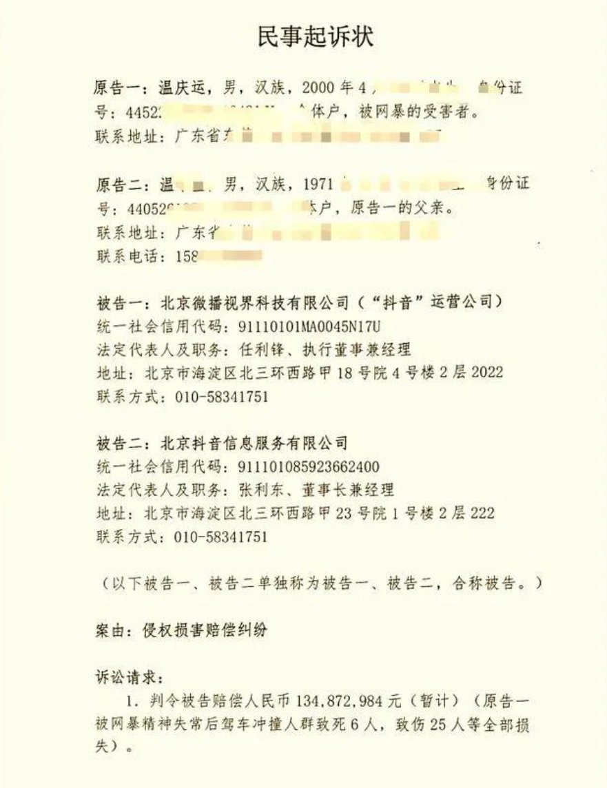
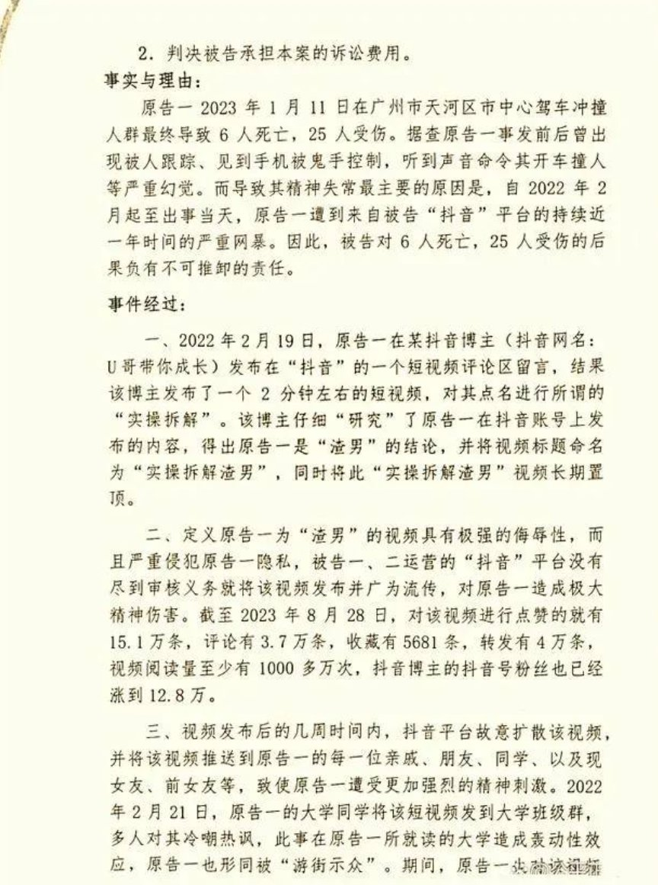
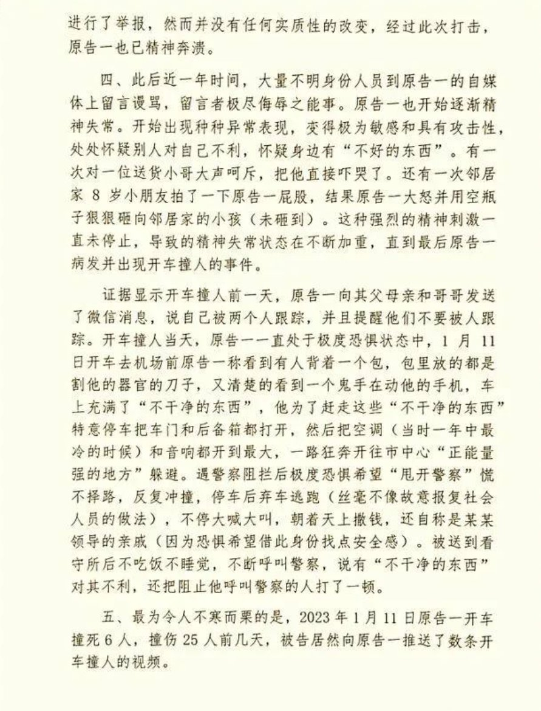
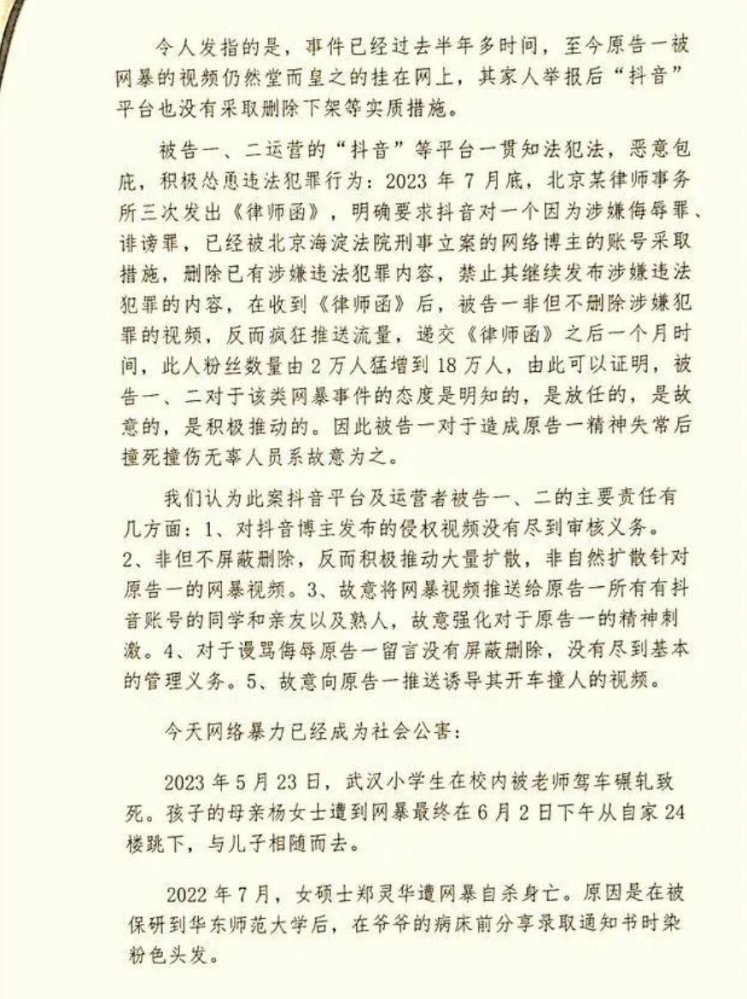
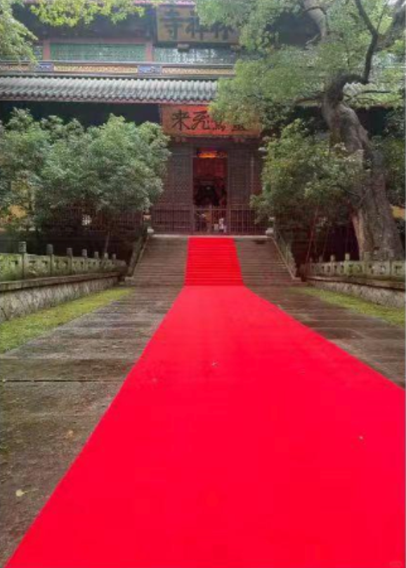
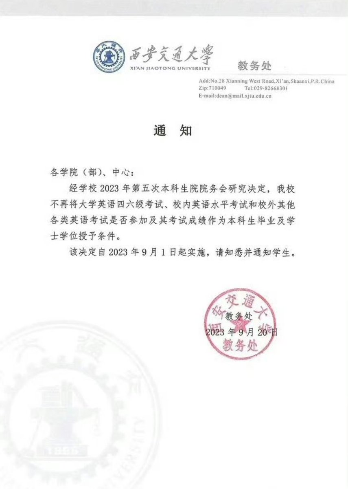

A李老师不是你老师 北京时间 2023-09-21T22:29:57Z 1704865553372811531 9月21日，一则《浙江传媒学院青年教师徐晨实名举报山东师范大学教授、博导傅谨性侵害》的文章在墙内艺术学院的师生间广为传播。

全文如下：

本人徐晨，女，1989年生，2019年中国传媒大学博士毕业，随后到浙江传媒学院任职。现实名举报山东师范大学新闻与传媒学院院长、中国文艺评论家协会副主席、第七届国务院学位委员会学科评议组（戏剧与影视学）成员、国家艺术基金专家委员会委员、中国戏曲学院原校学术委员会主任、中央戏剧学院中国戏剧学研究中心主任、人大复印报刊资料《舞台艺术》（戏曲、戏剧）编委会主任，教授、博士生导师傅谨对我的残害。我与傅谨只见过三次面：

第一次见面是他参加我的博士论文答辩，并担任答辩委员会主席。答辩结束后，我与其他老师、同学一起设宴答谢答辩专家。在导师的鼓励下，我加了傅谨的微信，并敬了他一杯酒。傅谨笑眯眯地端起酒杯说：“平时我不喝酒的，今天是破例了呦！”然后一饮而尽。作为晚辈、学生，我当时对傅谨教授的善意非常感激。

第二次见面是在一次学术会议上。会后，傅谨教授被一群人围住，临走时却特意经过我的座位对我笑笑，之后还主动发信息给我。我因此感到愧疚，觉得自己太不懂礼貌，竟然没有主动去跟前辈打招呼。

没想到，第三次见面却直接成为了我的噩梦。

那是2019年10月31日，入职不久的我第一次获得出差机会，参加在福州举办的第十六届中国戏剧节。我的同事曹南山（以下所述事件的证明人）由于工作原因无法跟我同时出发，因而特意叮嘱我，参会期间要多多拜访前辈老师，尤其是傅谨教授。对于一个此前三十年一直在学校读书，没有社会经验的我而言，独自拜访老师是很恐惧的。思前想后，我独自入住了其他酒店，只通过微信向我唯一认识的前辈傅谨报告了自己的行程。傅谨不仅主动关心问询我，还与我交流那几天观剧的心得，我于是积极认真地把自己的所做所想向他一一汇报。之后，傅谨多次邀请我去参加他主持的研讨会，而我因为另有安排，并未参加。也就是说，在曹南山抵达福州前，我与傅谨没有单独见过面。

11月4日，曹南山到达福州。得知我没有拜访傅谨等前辈，甚至还没有入住参会酒店，只是通过微信交流，再次教导我要知礼节。我于是退了此前的酒店，跟曹南山一起去会议举办地福州聚春园会展酒店办理入住。由于我们不是受邀专家，酒店只能按原价给我们提供住宿（八百左右）。考虑到我刚参加工作不久，没有积蓄，曹南山想到可以请求傅谨教授帮我们争取参会专家的内部价格（四百左右）。那时我的公务卡刚刚办好，正在从杭州邮寄到福州的途中，我只好询问前台可不可以先刷其他卡，之后结账再转成公务卡（出差前妈妈特意给我转了5000块钱以备不时之需）。傅谨在旁听见，非常豪爽地把自己的公务卡直接拿给前台替我垫付。我推辞再三，不愿接受，但傅谨表示，用他的公务卡酒店才好给内部价，而且是预付款，不必担心，还有很多天才退房，到时可以再想办法。被一个长辈如此关照，我当时非常感激。随后和曹南山到酒店对面超市买了许多水果、零食，打算晚些时候送给傅谨教授以表感谢。

想到自己之前的不懂事，我特意询问曹南山要不要早点去拜访傅谨。南山让我不要着急，说傅谨是大忙人，刚才见过面，等晚上看完戏再一起送水果过去更好。可南山话音未落，我便接到傅谨的微信，要我去他房间坐一坐。我立即告诉南山，然后两个人连忙拿着水果送到傅谨的房间。大家简单聊了几句便一起出发去看戏。看戏回来的路上，傅谨没有坐专家团队的头车，而是带着我和曹南山坐在第二辆大巴车里交流看戏的感受，并约好回酒店后再去他房间里聊天。下车后我小声问南山，这么晚了还打扰老师休息是否合适。南山让我不要多虑，说傅谨一直是这个作息，精力比年轻人更旺盛，还告诉我他们之前参加戏曲评论培训时也是这样：看完戏立刻讨论，收获特别大，让我不要错过跟前辈学习的机会。我深以为然，并想到万一要聊很久，在别人的房间里使用卫生间不方便，就告诉曹南山我先去酒店大堂使用卫生间，稍后去傅谨的房间跟他们会合。

噩梦就此开始了。

走进傅谨的房间后，我发现只有自己一个人，曹南山并不在（南山第二天告诉我，他本来是像往常一样跟随傅谨进入房间的。但这一次傅谨进入房间后，立刻转身把已经一只脚迈进房间的曹南山赶了出去，说太晚不聊了。南山虽然觉得很突然，也只好回到自己的房间。后来我们才想明白，傅谨先假意约我们一起聊天，暗中把曹南山支走，只等着不知情的我送上门。一切都是蓄谋已久的圈套）。我当时猜测南山也许跟我一样去了卫生间。在跟傅谨聊了一会儿之后，南山还没到，我开始觉得有些不自在，觉得即使对方是年长我三十几岁的前辈，但毕竟是异性，终究不便，于是决定离开。然而，傅谨一会儿谈我的博士论文，一会儿谈戏，一会儿谈如何才能做好学问。我虽然着急离开，但还是秉承尊重老师的传统，每等一个话题结束时，我才趁机提出离开请求，但傅谨一再拒绝。

随着时间的流逝，我意识到曹南山肯定不会来了，便决然起身离开。傅谨终于点头同意，也站起了身。我以为傅谨要送我，赶忙加快脚步往门口走并摆手示意，不必劳烦相送。万万没想到，傅谨突然追上来一把抱住我，挡在我和门之间，还把脸凑过来。事情发生得太突然了！我根本来不及反应就被傅谨扑倒在床上。我几次挣扎着想要起身，却没想到自己这个青年女子，在力量上竟然完全无法对抗一个年过花甲的老年男性。傅谨油腻的头发、稀疏卷曲的胡茬子，带着一股恶臭一起向我扑来。有那么几秒钟，我好像失去了意识，只看见傅谨的脸在酒店泛青的灯光下，像一个活死人。直到现在，每每想起这个画面，我就像被一个僵尸太监吸到血一般，既惊恐，又恶心。

感谢上天！我那天穿的是一条全是纽扣的牛仔裤和套头卫衣，并不容易解开，故而能在他解我扣子的时候成功挣脱，猛地起身跳下床。我拼命地拽住自己的衣服，浑身僵硬，无法动弹。傅谨见我反应激烈，换了套路。他坐在床上，抓住我的手，死死地盯着我说：“你想清楚了吗？我从不勉强别人，你可不要后悔哦！”并将这句话反复说了几次。那是我第一次真真切切地感受到什么叫皮笑肉不笑。我一边咬着嘴唇努力不让自己哭出来，一边怕自己受到进一步的恐吓与威胁，只凭借着逃生的本能往门的方向走。傅谨又跟上来拽住我，说不放心我一个人走，要送我回房间。我手脚发抖，完全摆脱不开他的控制，仿佛是被他架着出了门、坐上电梯，走到自己的房间门口。刚到房门口，傅谨就一把抢过我的房卡，直接刷卡进门，并在进门的第一时间拉上房间的窗帘，一屁股坐在了我的床上。

我的心态完全崩了！站在门口不知道该怎么办。我本以为他是意识到伤害了我，怕我出事，所以才送我回来，却没想到他其实是贼心不死！我更没想到他竟然猖狂到如此地步，不仅敢在他的房间里图谋不轨，还敢在处处是监控的酒店来到我的房间里试图再一次侵犯！一个人竟然连在自己的房间里都没有一丝安全感，这太可怕了！我定了定神，终于鼓足勇气走进房间，请他出去。

傅谨意味深长地看着我，把“你以后不要后悔！”这句话又讲了几遍。我几乎带着绝望请求他说：“老师，你放过我吧！你走吧！”类似的对话重复了几个回合，傅谨终于被我推着出了房门，我才忍不住大哭起来。整整一晚，我的胃像一只被扔在火堆里的兔子，一边抽搐，一边被烤焦。我只能蜷缩着身体，用枕头抵住胃以缓解疼痛。这是一个不眠夜，我在疼痛的间隙给几位亲近的朋友发消息讲述刚发生的事，还强打着精神不敢放松警惕——门外的每一个脚步声都让我心惊肉跳，怕傅谨又突然返回，因为以他的本事在前台要到我的房卡也不是什么难事。

也许是惊吓过度，第二天上午我全身乏力，无法出门。曹南山觉得蹊跷，打电话给我要我赶快下楼，一起去看戏，不要让傅谨等我们。我出于无奈，只好将此事原原本本地告诉了曹南山。南山当时非常吃惊，说他虽然以前也听说过傅谨有很多这方面的劣迹，但一直出于对师长的尊重，不愿意去相信，还一直在外人面前维护傅谨的形象。曹南山一根接一根地抽烟，怎么也想不明白傅谨何以如此胆大妄为，在一个全是监控的高级酒店里，就敢对我这个跟他几乎没有交集的晚辈施暴，且如此急不可耐！并恍然大悟为什么昨晚明明事先约好三个人一起聊天，而后却被傅谨生硬地打发走。我想到报警，但由于南山当时正在跟随傅谨做事，且对傅谨心存敬意，在得知傅谨的强奸行为没有成功后，劝我息事宁人。我表示不甘心，曹南山苦苦劝我，要我多考虑自己未来的发展，不要只想着出眼前一口气。一旦得罪傅谨，有可能断送自己的前程。况且以前那么多人举报过他，都没成功，我根本不是他的对手。

我找不到支持，只能给妈妈打电话。妈妈跟我一样善良、简单，她劝我既然逃脱了魔掌，能忍就忍吧。妈妈还告诉我，戏剧节还没结束，我的工作还没完成，在此期间不要跟傅谨闹得太僵，躲着不再见面就好，以免遭受打击报复。我理解妈妈的心疼与无奈，她不是怕事情闹僵，而是担心我在离老家2000公里外人生地不熟的地方，孤立无援，再次受到伤害。我反过来安慰妈妈，跟她保证我不会想不开，也不会去闹，便挂了电话。想了好久，我最终还是没敢告诉爸爸。因为我知道，以我父亲对我的爱，他绝对是要讨回公道的。我希望傅谨受到惩罚，但因为惩罚他而影响到我们家的安宁生活，太不值了。

第二天下午，傅谨给我发了一条道歉信息。他把对我的侵犯解释成对我的喜欢，还说在答辩当天第一次看见我便动了心。我看了只觉得恶心，截图发给知情的朋友，并把手机递给曹南山看。南山认为既然傅谨已经主动道歉，就不要再让这件事情影响到以后的相处，相信傅谨也不敢再做出什么越界的事情。再三劝我不如装作什么事情都没发生，正常回复信息，把这件事淡化掉，该看戏看戏，该打招呼打招呼，以后不要单独接触就好了。我拒绝了一起看戏的提议，只是最低限度地回复傅谨的信息。

傅谨的“歉意”愈发真诚，提出当面道歉，解释清楚的提议。我善良惯了，觉得傅谨既然承认了错误，能做到这个地步，肯定是真心悔过，于是同意在酒店大堂当面说清楚。而且我还有一个目的：我想把这件事了结，让他知道，他确实对我造成了伤害，但我并没有告发他的打算。这样做一方面是出于同情，给一个认错的长辈留一点脸面；另一方面是出于恐惧，让他不要害我。我想证明自己是无害的——谁会去逼死一个无害的人呢？

然而，事实证明我错了，且错得多么离谱。我为我的天真、善良、退避与忍让付出了太多惨痛的代价！有些人是没有良心的，受害者越善良，施害者就越没底线—当害人没成本、没损失，作恶就成了一种变态的乐趣。当然，这是后话，是傅谨在接下来的四年屡次迫害我后，我得出的教训。

在大堂碰面后，傅谨说大堂人太多不方便说话，酒店外不远处有个戏台，希望可以边走边解释。我想着青天白日没什么可怕的，便同意了。在此过程中，他先是再次表达了对我的喜欢，表示以后可以教我读书写文章扶持我的事业，接着又举出多个例子证明自己的人品好。傅谨说，有一个女生对他爱慕有加，到处跟别人说自己和他谈过恋爱，他走到哪，那个女生就跟到哪。他还故作愤慨地说，其实是那个女生脑子有毛病，喜欢他、勾引他，他不愿意，所以那个女生发了疯，故意报复他、诋毁他。事后我反应过来，这不正是某些坏男人惯用的污蔑、打压、残害女人的方法吗——通过把一个女人塑造成疯子的形象以达到让她的一切言行都失去合理性的目的。

看到我怀疑的眼神，傅谨紧接着说：“我这人很干净的。你想啊，我为那么多演员评奖，如果我是那么脏的人，我的名声不是早就坏掉了吗？”我看着傅谨努力地自证清白，觉得这个世界实在是太荒谬、太混乱了！我甚至有些恍惚，连坐在椅子上休息时被他用手机拍下照片都没印象。我只是本能地不想再跟这个人相处，匆匆地结束了谈话。

让我震惊的是，在酒店电梯里即将分开的时候，傅谨突然又抓住我的手，笑道：“去我房间里坐一坐啊？”就在那一刻，我终于彻底清醒了：傅谨约我出来见面根本不是为了道歉，而是仍在设套骗我！在接下来的几天里，我一直避免跟他碰面，但傅谨仍旧每天发信息给我。我无法逃会，只能硬着头皮偶尔回复，并在收到公务卡的第一时间退回傅谨之前帮忙垫付的房费然后告知他此事，依然对他的帮忙表示感谢。傅谨也依然避重就轻，东拉西扯，试图创造见面机会。但无论傅谨说什么，认识到他本质的我，再也没有答应过任何见面。

戏剧节的最后一天，曹南山约傅谨和我们一起吃饭（后来得知是傅谨私下要求南山这样做）。傅谨很会表演，在曹南山面前仍然摆出一副长辈的样子，而就在曹南山离开饭桌结账的空隙，立刻换了一副嘴脸。傅谨再次表示，只要我愿意，他会多来浙传。我强撑着不想撕破脸，无比厌恶地吃完这顿饭，随后跟曹南山一起返回杭州。在回杭的路上，我把所有细节都告诉了曹南山。南山虽然也觉得傅谨的行为太过分，但他同样人微言轻，只能安慰我，并劝我不要把事情闹大。自此，我再也没有跟傅谨有过任何交集，整整四年。

也许是由于此前惊恐过度，我回杭州后一病不起，不愿出门，不愿见人，连去学校都很困难，只是每天躲在家里。我的精神状态极差，经常走神，偶尔莫名落泪，甚至多次想要结束自己的生命。虽然傅谨对我身体上的侵害是有限的，但却给我的心灵留下了难以抹去的阴影。我失去了对男性的信任，失去了对师生关系的信任，失去了对学术神圣性的信任。在杭州这个举目无亲的地方，我无依无靠，既怕自己挺不过这一遭，更怕自己的前途与学术生命像傅谨三番五次威胁的那样，尚未起步即告结束。

我很怕，也不知怎么办。我无法跟爸妈倾诉；朋友跟我一样，羽翼未丰、势单力薄，我不忍他们为我难过。我无处诉说，悲愤与苦闷积压心头，病情日益严重。最终我扛不住了，于11月28日忍病前往杭州市第一医院临床心理科做了全套检查与心理咨询。报告显示，我处于抑郁状态。医生询问我的情况，我言辞闪烁，不愿提及傅谨的事。但病人在医生的眼里是没有秘密的，尤其是面对一位专业、敏锐的女心理医生。只几句话，医生便小心翼翼地问我是不是最近受到了侵犯。我避而不答，不愿把这件事记录在册，起身就走。医生很负责，叫住我，告诉我放心，我没说出口的，她也都明白、理解。医生给我开了药，留了联系方式，告诉我希望我按嘱服药，并跟她保持联系。而我由于太难过，且医院离家20多公里，没能继续治疗，每天对着抑郁症诊断书发呆，失去了正常生活的能力，感觉世界一片灰暗。

由于太久没去学校，我所在院系的办公室主任发现了我的反常，在电话里再三询问，我只好把抑郁症的报告发给她。主任非常担心，连忙向我当时的部门领导汇报，领导要我无论如何来学校一趟。面对着领导的一再追问，我压抑许久的情绪终于爆发，将事情说了出来，濒临崩溃的状态总算得到了一点舒缓。直到现在我都非常感激当年领导和同事对我的关怀和帮助，他们让我度过心灵上的至暗时刻。

傅谨给我留下的伤痛从未消退过。我一直忍让、躲避，都是为了生存。然而，在这接下来的四年里，傅谨一次次滥用职权，只要遇到我的文章、课题，就以各种堂而皇之的理由疯狂打压。他的行为反常、过火到令其他在场的人感到费解，他们问我为何与傅谨结冤如此之深。如果说逃脱强奸也是结冤，我真是有口难辩。为了摆脱恶魔的迫害，我唯一的活路就是告发他，以免不明就里的人们还被蒙在鼓里，任由坏人巧舌如簧，颠倒是非，踩着受害者的尸骨越爬越高，掌握的权力越来越大。

傅谨每一次对我学术上的加害，我都清清楚楚。他的这些恶霸行为，不仅证明了早在几年前就流传甚广的中国戏曲学院教师联名举报信上的内容：服从他的，变成后宫，扶持有加；不服从的，心狠手辣，屡次加害。也验证了当年他在酒店房间里让我“以后不要后悔”的威胁恐吓。

当我决定站出来揭发他的丑恶嘴脸，身边的师友、同事都担心我是否能够承受面对公众舆论的压力。因为在中国，作为一名女性，遭受性侵本身就是一种耻辱，公之于众必然带来二次伤害。当事情从案发时的密闭空间转移到可以被肆意评论的公共空间，施暴者对受害者的迫害便由此从身体转移到心灵上。

然而，我走投无路，忍无可忍，躲无可躲，避无可避。我相信这个世界并不属于一个自以为一手遮天的坏人，我相信公众的判断力以及对正义的支持。当委屈求不了全，当好人没有好报，当退一步没有海阔天空，忍一步没有风平浪静，我才知道，恶不能被感化，也无法自净，只能被铲除。我此时此刻的难过、绝望、愤怒与反抗，不是来自于一个领袖或英雄以一己之力对抗邪恶势力之时被残忍地摧毁；而是在于，一个受害者，在既没犯错，也没故意作对，甚至想要息事宁人、委曲求全、一再退让且顾全对方颜面的情况下，依然被恐吓、被威胁、被剥夺、被赶尽杀绝。再不豁出一切站出来，便是协助坏人作恶，便是帮凶。

傅谨，我不怕死，怕的是死得糊里糊涂、不明不白，而世人甚至还不知晓你这头披着羊皮的狼还在嗅着每一个机会到处作恶。是你让我必须站出来，我别无选择。

我，一个34岁，刚毕业就被你欺辱、打压至今的青年学者。你，一个68岁，在几乎所有相关学校任职过的资深教授、博导，帽子无数，享受国务院特殊津贴，到处以“戏曲研究第一人”的名头招摇撞骗。你的履历金光闪闪，早已获得你想要的一切。可在这闪光的履历背后，你到底用你的假面诱骗过多少一心向学的单纯女生？到底毁掉了多少无辜女性的身心健康？又到底毁掉了多少青年学者的光明前程？我不敢想。也正是因为不敢想象，我才必须要站出来。化用鲁迅先生的话：当我翻开你的履历表一查，这履历没有年代，歪歪斜斜每页上都写着‘仁义道德’几个字。我横竖睡不着，仔细看了半夜，才从字缝里看出来，满本都写着两个字，‘吃人’。

人不是草木，可以被随意伤害、践踏。如果一个人可以靠权力，把另一个活生生的人如蝼蚁一般对待，那么即使低微如蝼蚁，也要以自己的力量进行反抗。你早年以著作《草根的力量》获得业界的认可，而我想说，傅谨，你不配。你没有资格为草根代言，你做的都是斩草除根、伤天害理的事！而我虽然力量微薄，像一根野草，却总会在下一个春天里再次发芽。我不怕你，也没有任何害怕失去的东西。我不会再向你屈服，更不会继续任你宰割。在揭发你丑恶嘴脸的路上，我会咬着牙往前走。勇气和信心我都具备，即使明日天寒地冻、路远马亡。如果前路黑暗，我便燃烧掉自己，做那微弱却真实的光，决不如你所愿，做那个“消失的她”。因为面对黑暗的邪恶势力，怕的不是阳光照不进裂缝，而是自己不敢再向往光明。

我原本就一无所有，没有比这更强的武器了。   A李老师不是你老师 北京时间 2023-09-21T19:08:46Z 1704814923585319171 9月20日，广州撞死6人司机温某起诉“抖音”索赔1.34亿  
今年1月11日，温某某在广州市天河区市中心驾驶宝马车冲撞人群最终导致6人死亡，25人受伤。
据查，温某事发前后曾出现严重幻觉。而导致其精神失常最主要的原因是温某遭到来自“抖音”平台的持续近一年时间的严重网暴。  
2023年9月4日，温某某及家人诉至北京市第一中级人民法院，要求“抖音”赔偿1.34亿元，用于补偿死伤者及家属，目前北京市第一中级人民法院已经受理此案   A李老师不是你老师 北京时间 2023-09-21T19:30:58Z 1704820512478654638 9月21日，网传杭州灵隐寺铺设了一条红毯从入口直达正门。 https://t.co/WzZ0TthONl   A李老师不是你老师 北京时间 2023-09-21T17:41:34Z 1704792978093379942 9月20日，西安交通大学教务处宣布不再将大学英语四六级，及各类英语考试的成绩作为本科生毕业及学位授予的条件。 https://t.co/6U1X77SFpP   A李老师不是你老师 北京时间 2023-09-21T19:18:12Z 1704817298920419768 9月21日，江西抚州，一名男子爬上了高压电塔，在电线杆之间来回行走并脱衣。
据传疑似是因为骑电瓶车未带头盔，在被交警查车时情急之下爬上了电塔。 https://t.co/ytYmfp8fxu   A李老师不是你老师 北京时间 2023-09-21T19:56:41Z 1704826983518253320 【信访不如信网】
9月20日，媒体报道，陕西省商洛市洛南县住建局信访办主任多次实名举报洛南县住建局副局长存在利益输送，巨额财产来源不明等违法问题。 https://t.co/8g9DLuuIuh   A李老师不是你老师 北京时间 2023-09-21T17:39:10Z 1704792375619457220 9月21日，上海中环高架，近汶水路万荣路，疑有车辆自燃，现场可听到爆炸声。
消防公安已抵达现场。具体情况不详。 https://t.co/pBR2Txu0go   A李老师不是你老师 北京时间 2023-09-21T17:43:28Z 1704793457984717020 9月21日，河北沧州东光县一工厂发生爆炸。 https://t.co/2fvc9t0Rvk   A李老师不是你老师 北京时间 2023-09-21T14:15:00Z 1704740994334224477 9月20日，媒体报道称重庆一职业技术学校安排的校外实习中，包含给男顾客洗澡、按摩生殖器三角区等业务。
学生向班主任反映后不了了之，9月14日，学生家长向重庆警方报案。
涉事实习单位称，学生所作的是自愿行为。 https://t.co/De1JPCCRoC   A李老师不是你老师 北京时间 2023-09-21T05:34:52Z 1704610101166854640 事件后续
石班瑜称，目前派出所已经联系并了解了情况，自己已经彻底搬出了原先的工作室。
视频被下架了，不是被删除的。 https://t.co/sHcwmSi774   A李老师不是你老师 北京时间 2023-09-21T02:10:33Z 1704558683361849784 赛后，武汉球迷在场外点燃并撕毁了日本国旗 https://t.co/bzHxqiX4rO   