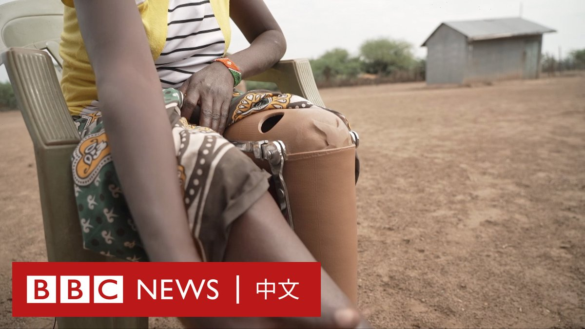

D英国广播公司BBC 北京时间 2023-09-21T17:50:55Z 1704795334243946649 想参观皇家艺术研究院（Royal Academy of Arts）新展的访客现在需要通过一关考验——从两个紧挨的裸体模特身间挤进去。

这件不同寻常的作品是塞尔维亚知名行为艺术家玛丽娜·阿布拉莫维奇（Marina Abramović）50年职业回顾展的一部分。

展览另设有一个入口，以供那些并不想参与的人通过。

皇家艺术研究院展览负责人安德里亚·塔尔西亚（Andrea Tarsia）表示，该表演旨在迫使访客陷入“裸体、性别、性取向和欲望的对抗”。

1977年，阿布拉莫维奇和她当时的德国搭档乌雷（Ulay）首次表演了这个特殊的作品。他们俩一丝不挂地站在门口，迫使访客从他们身间经过。

阿布拉莫维奇是皇家艺术研究院成立255年以来，首个在主廊举办个展的女性艺术家。

这次展览收到了褒贬不一的评价。《卫报》称其“至关重要”，而《泰晤士报》则形容其是“冷酷的”。   D英国广播公司BBC 北京时间 2023-09-21T14:40:43Z 1704747465453564239 【现场画面】叙利亚总统巴沙尔·阿萨德（Bashar al-Assad）抵达中国杭州。中国商务部长王文涛等官员在机场迎接。

这是阿萨德近20年来首次访华。他将参加杭州亚洲运动会开幕式，并预计与中国国家主席习近平会面。他曾在2004年首次访华，会见了时任中国领导人胡锦涛。

自2011年叙利亚内战爆发以来，由于受到西方和阿拉伯世界的孤立，阿萨德很少外访。今年5月，他前往沙特，十多年来首次出席阿拉伯国家联盟峰会。   D英国广播公司BBC 北京时间 2023-09-21T15:55:12Z 1704766210884456803 中国西南部的凉山州警方抓捕了11名网红主播，指他们通过编造虚假信息以诱导网友消费。这些主播中有多人拥有100万以上粉丝。

他们的团队成员也遭到拘捕。警方发布的信息称，共有54人被拘留，14家相关公司被查处。

据官方媒体报道，以“凉山曲布”、“赵灵儿”、“凉山孟阳”为代表的网络红人在社交媒体通过拍摄影片和直播等方式，虚假地讲述自己的悲情故事。在博取网友同情后，他们再低价买入农产品并高价卖出，攫取利润。

报道称，他们专门挑选无人居住的生产用房、破壁残垣作为直播背景，通过设计剧本打造淳朴的主角形象，再通过编造“悲惨经历”来进行欺诈活动。

例如，凉山孟阳自称是一名19岁的凉山女孩。影片中的她起初头发蓬乱，外表邋遢。她称自己家境贫寒，出门打工被骗。她很快便拥有了300多万粉丝。

但当她的私生活被曝光时，人们发现她身穿名贵衣服、出入高档场所，和影片中所展示的形象有着天壤之别。

警方表示，这些网红由专门的网红孵化公司进行包装，并雇人在网上发表评论，以提高热度。

当局表示，目前已有18人被正式批捕，冻结涉案资金500余万元人民币（68.5万美元）。   D英国广播公司BBC 北京时间 2023-09-21T13:00:00Z 1704722121253958048 一场强劲的龙卷风周二（9月19日）袭击了中国东部的宿迁市，给房屋和道路造成破坏。影片显示，有输电线起火，汽车也被掀翻。

据官方媒体报道，该龙卷风造成5人死亡。附近的盐城市也在同日发生龙卷风，另造成5人死亡。

当地气象部门负责人表示，在9月中下旬发生龙卷风很罕见，和江淮气旋影响有关。 https://t.co/bHBE6xj00i   D英国广播公司BBC 北京时间 2023-09-21T11:58:34Z 1704706659644211494 香港加密货币交易平台JPEX被警察立案调查诈骗，报案人数超过2000，涉案金额达13亿港元。案件涉及多位网络红人使其尤其瞩目。https://t.co/GkXHVnTby4   D英国广播公司BBC 北京时间 2023-09-21T09:27:02Z 1704668526798372990 肯尼亚巴林戈湖附近生活的居民正日益担忧他们的生活，无论是去湖边打水还是捕鱼，都要随时小心藏在湖中伺机发起袭击的尼罗鳄。

不断扩大的湖面还让这些鳄鱼闯进居民的家园，而他们只能不断搬离。现在，数十名居民正在向政府提起集体诉讼，他们认为当局并未有足够作为应对气候危机。 https://t.co/RzqLERSztT   