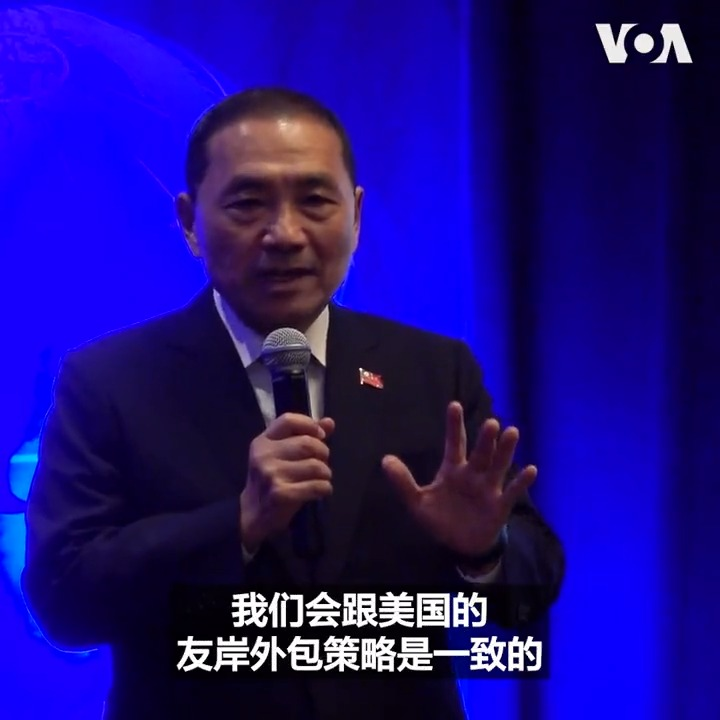
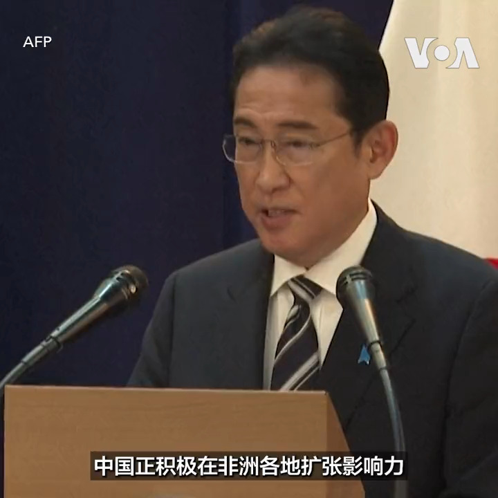
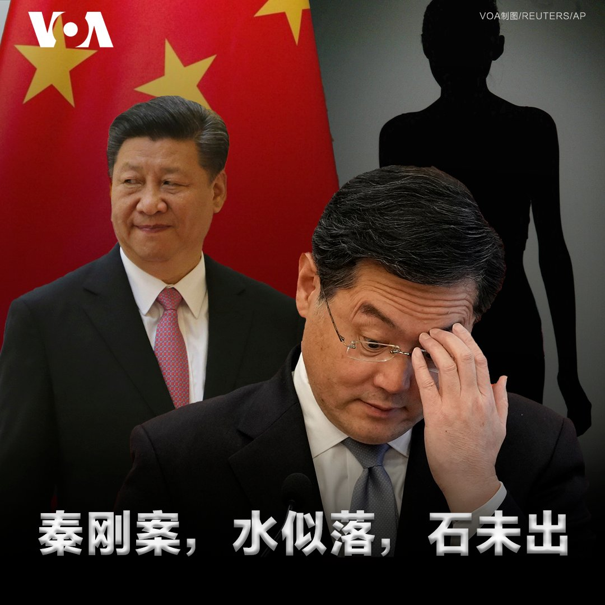
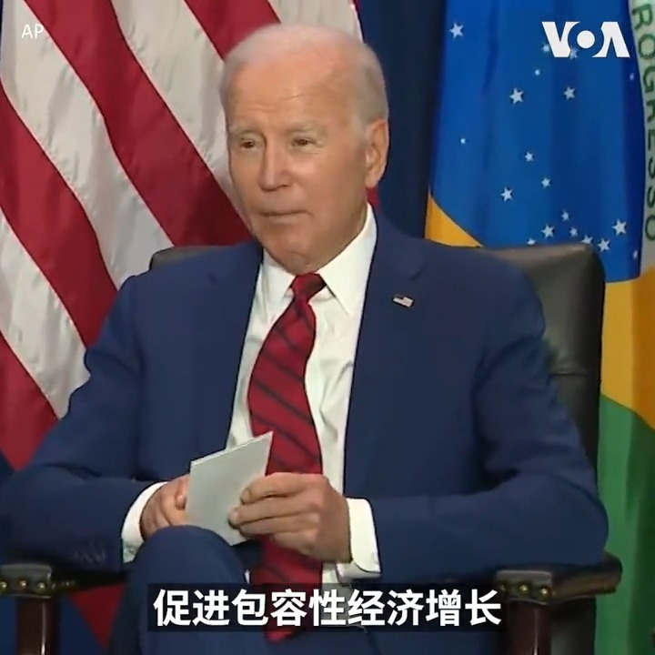

美国之音中文网 北京时间 2023-09-21T20:40:25Z 1704837988948029824 欧洲理事会主席米歇尔9月20日于联合国安理会上向中国喊话，他要求北京采取更多行动，來协助终结俄乌战事，并敦促俄罗斯尊重联合国宪章的原则。 https://t.co/L6PUifXZDh   美国之音中文网 北京时间 2023-09-21T21:47:04Z 1704854762578182613 杭州亚运会开幕在即，政府不顾经济低迷斥引起民怨 https://t.co/xUVaV4MhFe   美国之音中文网 北京时间 2023-09-21T22:04:06Z 1704859050285117825 经济如何走出困境？中国的改革派和凯恩斯派专家各出高招 https://t.co/ebqT9UzPhf   美国之音中文网 北京时间 2023-09-21T22:16:35Z 1704862190279201179 国民党总统候选人侯友宜20日出席硅谷高科技论坛时说，他在回应美方各界关于台湾高科技如何因应国际情势转变及风险的问题时表示，台湾高科技产业开始转型并调整全球布局，将与美国的友岸外包策略一致，逐渐减少对中国生产的依赖。侯友宜旧金山之行后结束8天访美行程返台。https://t.co/vbUEyTNuzX https://t.co/BfLNMs7n59   美国之音中文网 北京时间 2023-09-21T18:38:05Z 1704807203365068866 叙利亚总统阿萨德抵杭州将出席亚运会开幕式 与习近平同框盼终结外交孤立 https://t.co/fmUe7WdjWt   美国之音中文网 北京时间 2023-09-21T19:30:00Z 1704820266424009036 【家事国事天下事，你有何见解】
中国官方媒体近日报道中共领袖习近平致函当年援助中国抵抗日本侵略的美国老兵，声言美中两国应当也必须和平共处。但习不久前也声言美国是当今世界最大乱源。习近平有关美国的大异其趣的说法令人困惑：他是自相矛盾？与时俱进思想转变？世人究竟应当相信哪一个习近平？ https://t.co/oEQTxdb811   美国之音中文网 北京时间 2023-09-21T20:19:31Z 1704832728842072096 日本首相岸田文雄9月20日于纽约召开记者会，再次强烈谴责俄罗斯对乌克兰的侵略，并重申绝不可容忍俄罗斯的威胁。他还说，将密切关注中国在非洲扩张影响力的动向。 https://t.co/wXA89GmYod   美国之音中文网 北京时间 2023-09-21T20:32:20Z 1704835953582338097 运载着乌克兰粮食的“坚韧非洲号”（Resilient Africa）号货船21日抵达土耳其博斯普鲁斯海峡。 这艘装载了3000吨粮食的货船上星期驶离乌克兰的切尔诺莫斯克港。俄罗斯今年夏天放弃了保障乌克兰粮食出口的一项协议后，乌克兰上个月宣布了人道走廊，向非洲和亚洲市场运送粮食。 https://t.co/1Cbxy2BBCa   美国之音中文网 北京时间 2023-09-21T16:28:33Z 1704774605116932337 孔子学院向下扎根？ 美众院听证会关注孔子课堂渗透中小学 https://t.co/YD6WzjIlCO   美国之音中文网 北京时间 2023-09-21T16:45:06Z 1704778767556837823 美国共和党议员担忧一些电动车电池制造商可能受控于北京 https://t.co/F321eR1mfy   美国之音中文网 北京时间 2023-09-21T10:13:06Z 1704680117237407802 参议院确认布朗将军出任美参联会主席 https://t.co/9dfWNsjKga   美国之音中文网 北京时间 2023-09-21T10:42:06Z 1704687415569654018 英国发表香港半年度报告 严厉批评中国破坏香港司法体系 https://t.co/xVcdYA2FlF   美国之音中文网 北京时间 2023-09-21T13:40:33Z 1704732327220568243 普京10月访华前先会见王毅 称俄中加强战略合作“抵制霸权” https://t.co/eUEHlUdBCf   美国之音中文网 北京时间 2023-09-21T14:11:10Z 1704740032417046617 接任美军参谋首长联席会议主席获确认 布朗曾指挥太平洋空军抗衡中国空中战略 https://t.co/zIX78qUtsx   美国之音中文网 北京时间 2023-09-21T07:30:00Z 1704639073443336233 【家事国事天下事，你有何见解】
中国前外长秦刚突遭免职案有了最新消息，说是肇由“生活作风”问题。但也有论者说，在当今中国有生活作风（婚外情）或贪腐问题者甚众，是否查处全看上头是否有保护。秦刚的上头被广泛认为是习近平，于是秦刚案的问题在诸多观察家看来就一直是习近平缘何不得不舍弃秦刚？ https://t.co/wnJvBoXK8H   美国之音中文网 北京时间 2023-09-21T10:42:09Z 1704687429800931345 协防台湾“战略模糊”走向“战略清晰”？美国会两党议员陷入分歧 https://t.co/Y2Pfgwfch9   美国之音中文网 北京时间 2023-09-21T05:20:30Z 1704606483596341412 “西半球两个最大的民主国家正在捍卫世界各地和这个半球的人权，其中包括工人的权利，”拜登总统9月20日在纽约与参加联大会议的巴西总统卢拉举行双边会晤时说。两人宣布建立美国-巴西工人权利伙伴关系。卢拉表示，这是一个历史性的时刻，而且两国越来越接近。他今年2月访问了白宫。 https://t.co/wg9D7EEUfh   美国之音中文网 北京时间 2023-09-21T06:44:12Z 1704627547886256222 中文恶意软件可能“挑战”俄罗斯在网络犯罪中的龙头地位 https://t.co/FQlPrrqJ3D   美国之音中文网 北京时间 2023-09-21T08:58:33Z 1704661357839483083 欧盟报告说，欧洲面临依赖中国电池的风险 https://t.co/62pThrSOqI   美国之音中文网 北京时间 2023-09-21T10:22:53Z 1704682583185870860 一键解锁 #美国热搜 榜1、德国外长严重“辱包”，戳了中共马蜂窝2、习近平赏秦刚“生活作风问题”罪名的用意3、苹果辱华，叶公好印4、财政没钱，中学老师社保断缴5、任正非自称是果粉6、教室里每人一个监控探头7、苹果华为专卖店人气大比拼8、房兵的战争狂言 https://t.co/z7ASBprchf https://t.co/eFYGO7WGTF   美国之音中文网 北京时间 2023-09-21T04:29:34Z 1704593666860597614 美国警告跨国镇压案件在增多 https://t.co/Jwk6At2TTA   美国之音中文网 北京时间 2023-09-21T04:29:38Z 1704593682392104978 VOA独家专访: 躲避战争兵役，逃亡芬兰的俄罗斯人 https://t.co/O2RAAbhja9   美国之音中文网 北京时间 2023-09-21T04:44:33Z 1704597437737058630 匈牙利悄悄接待因涉嫌在新疆侵犯人权而受到美国制裁的新疆官员 https://t.co/20gR4hacrq   美国之音中文网 北京时间 2023-09-21T07:00:02Z 1704631530734403704 美中高层密集会晤之际，中国官媒公开习近平给飞虎队老兵的复信。他在信中追忆美中在二战中的合作，称两国“应该也必须”和平共处。北京是否在内忧外患之下有意求和？又是否在搞温情、战狼两套宣传？与此同时，中国军机在两日内超过150架次侵扰台海，到底意欲何为？请留言参与9/21时事大家谈。 https://t.co/ya8SAAjZ1e   美国之音中文网 北京时间 2023-09-21T08:27:33Z 1704653557792923827 拜登会晤巴西总统卢拉，倡导劳工权利 https://t.co/nPiVyidPXn   美国之音中文网 北京时间 2023-09-21T09:00:01Z 1704661726904602792 一键解锁#美国热搜 榜1、德国外长严重“辱包”，戳了中共马蜂窝2、习近平赏秦刚“生活作风问题”罪名的用意3、苹果辱华，叶公好印4、财政没钱，中学老师社保断缴5、任正非自称是果粉6、教室里每人一个监控探头7、苹果华为专卖店人气大比拼8、房兵的战争狂言 https://t.co/z7ASBprK6N https://t.co/4E06qjMC62   美国之音中文网 北京时间 2023-09-21T09:12:09Z 1704664781972779068 联大会议之际，美参议院外委会两党领袖呼吁加大对台湾的国际支持 https://t.co/cPsDe8UCcX   美国之音中文网 北京时间 2023-09-21T04:01:10Z 1704586518504096070 黄雪琴王建兵“煽颠”案即将开庭 人权组织要求放人吁声援关注 https://t.co/41dIg9Lq8Q   美国之音中文网 北京时间 2023-09-21T04:29:36Z 1704593674301292801 德国考虑5G网禁用华为与中兴部件 https://t.co/J2vHYst2yY   美国之音中文网 北京时间 2023-09-21T04:31:00Z 1704594025758511381 “我们会挺身而出，而不是袖手旁观，” 美国国务卿布林肯周三在联合国安理会针对乌克兰问题的部长级会议上发表讲话，谴责俄罗斯侵乌的战争罪行，并警告俄罗斯和其他“想要成为侵略者的人”，美国会继续支持乌克兰，追究俄罗斯的责任，继续维持国与国之间和平关系的支柱。 https://t.co/Xwao4l3G30   美国之音中文网 北京时间 2023-09-21T04:44:35Z 1704597445274120242 美联储维持利率不变，示意今年可能再加息一次 https://t.co/r9f3WwuTqe   美国之音中文网 北京时间 2023-09-21T04:58:00Z 1704600820430549322 人工智能（AI）技术飞速发展下，美国科技业和立法部门有越来越多的呼声建议设立专门的 “裁判”机构、为AI技术的使用建立许可制度。 从立法角度来说，美国的AI立法有点“落后”于中国。专家指出，美国AI监管步伐谨慎是为了保护科技创新的自由竞争环境和维护言论自由。https://t.co/XWnCKBIcI2 https://t.co/GoYyfxhAr4   美国之音中文网 北京时间 2023-09-21T05:01:06Z 1704601600080363914 内塔尼亚胡与拜登在联大会议间歇举行了期待已久的会晤 https://t.co/Rthy8ENpgB   美国之音中文网 北京时间 2023-09-21T05:16:07Z 1704605381413294292 “拜习会”幕后悄然准备 美中谁是真正“多边主义”竞争拉开序幕 https://t.co/uHNB8fQO3m   美国之音中文网 北京时间 2023-09-21T05:59:34Z 1704616315384905877 中国放松签证要求振兴旅游业 https://t.co/e7ttbnGwTJ   美国之音中文网 北京时间 2023-09-21T02:26:06Z 1704562595712114937 “让中国走向国际社会，这是目前尊者的最大意愿，”西藏人民议会议长堪布索朗丹培在接受美国之音(VOA)专访时说。他说，藏人流亡政府一直对与北京展开对话持开放态度，但北京未有积极响应。在达赖喇嘛继任者问题上，他警告说，中共若违背达赖喇嘛和西藏人民意愿去强制认定，只会是徒劳。 https://t.co/gxZ1Y0cBPq   美国之音中文网 北京时间 2023-09-21T03:02:52Z 1704571848820691194 乌克兰总统弗拉基米尔·泽连斯基9月20日在联合国安理会敦促俄罗斯立即从乌克兰领土上撤出所有军事和准军事人员。一天前，泽连斯基在联大会议上发言时表示，俄罗斯对乌克兰的侵略将影响未来的国际秩序。他说，乌克兰不会通过不平等的谈判结束战争。详细：https://t.co/LFqTXHcmcG https://t.co/XthmmeqMWV   美国之音中文网 北京时间 2023-09-21T03:18:07Z 1704575685296275665 渥太华调查锡克族活动人士遇刺事件之际，印度发出针对加拿大的旅行警示 https://t.co/SbLX2Birp9   美国之音中文网 北京时间 2023-09-21T04:01:06Z 1704586503744340411 AI监管呼声日渐强烈，美国AI立法为什么“落后”于中国？ https://t.co/WhbbPV9Fm0   美国之音中文网 北京时间 2023-09-21T04:06:38Z 1704587895296630809 拜登总统20日在纽约与以色列总理内塔尼亚胡举行双边会谈前发表讲话时说，他们会讨论一些棘手的问题，包括民主价值观以及民主体制中的制衡机制，但他重申了对以色列的坚定承诺。内塔尼亚胡表达了他对中东和平与民主的承诺。这是他去年领导右翼政府执政并进行引起广泛争议的司法改革后首次与拜登会晤。 https://t.co/PtF4qgDQed   美国之音中文网 北京时间 2023-09-21T01:36:22Z 1704550079741280548 俄罗斯总统普京9月20日宣布 ，他正式接受中国主席习近平的访问邀请，将于今年10月访华。与此同时，中国外长王毅正在俄罗斯访问。有分析指，王毅访俄可能是为普京访华并出席北京“一带一路”国际合作高峰论坛做准备。详细：https://t.co/yz9RzmFOmS https://t.co/H9CNupgXuL   美国之音中文网 北京时间 2023-09-21T01:44:04Z 1704552016033497259 美国国会研究处报告：美中在南中国海、东中国海战略竞争日趋激烈 https://t.co/vtqR64osAy   美国之音中文网 北京时间 2023-09-21T00:04:08Z 1704526865862738380 黎智英还押近千日 儿子三年来首次见近照 担心其健康 https://t.co/g2nBpeEsot   美国之音中文网 北京时间 2023-09-21T00:04:11Z 1704526881880764910 日本要求中国“立即撤除”中国在尖阁诸岛附近设置的浮标 https://t.co/3lomiLJ1dq   