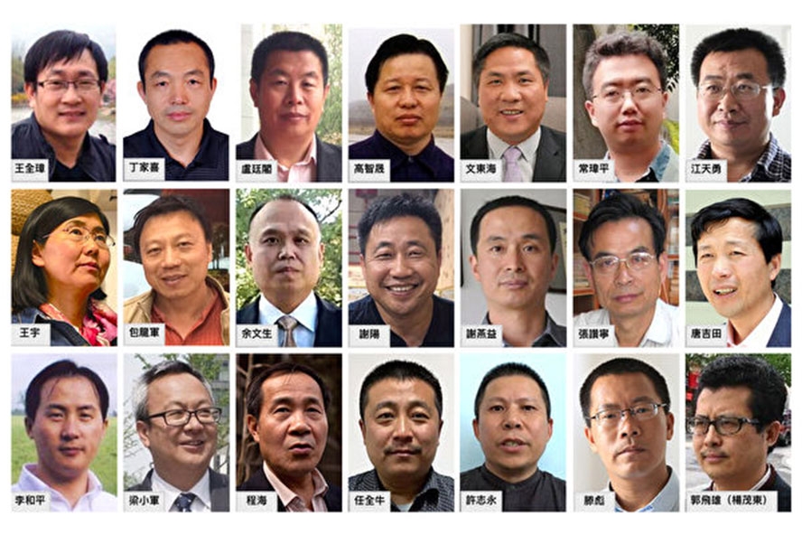
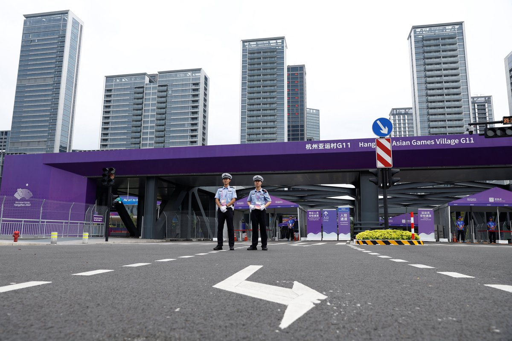
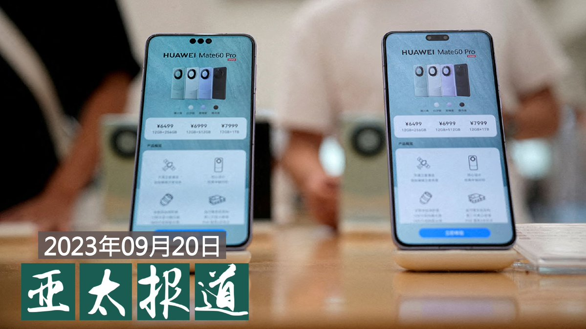

自由亚洲电台 北京时间 2023-09-21T22:56:24Z 1704872207967572442 专栏 | #绿色情报员：绿潮起浪（下）“打浒”战役如同“打怪”？
#浒苔 
https://t.co/h1GiI0uE9O   自由亚洲电台 北京时间 2023-09-21T18:34:41Z 1704806346200150186 RT @RFA_Chinese: 欢迎收听和订阅播客【亚太报道】 https://t.co/MjLNSvVMqc
【#亚太报道（2023-9-20）】
#郭飞雄 再度绝食生命垂危 / 蒙古国史诗剧《#失传的玉玺》遭停演/#任正非 自称是苹果 #果粉 / #华为 新款手机实现重大…   自由亚洲电台 北京时间 2023-09-21T23:09:04Z 1704875397349797928 RT @RFA_Chinese: 【#红砖巷涂鸦 主创一鹊：我的作品是面镜子 别人评价它时也在评价自己｜#观点】
https://t.co/kZQ6PD3s6k
 #一鹊 @ArtYique 理解某些人看来东伦敦的24个字像是纳粹符号，他鼓励大家二次创作，但对一个想要引发讨论揭…   自由亚洲电台 北京时间 2023-09-21T23:27:17Z 1704879983293018391 【起底 #疑美论  谁是挑拨离间的高手？】
台湾资讯环境研究中心(IORG)公布“#疑美论和它们的产地”。调查发现，中共是 #疑美论 最大的外国影响力来源，占比约84%。
中共放大论述的介入程度高，而发起论述的介入程度低，即中共倾向“加入”并传播既有疑美论述，而非创造新论述。

 https://t.co/8RwI5Dq4c4   自由亚洲电台 北京时间 2023-09-21T21:03:20Z 1704843755944091913 RT @RFA_Chinese: 【RFA独家：中国留美学生为民主发声　国内家人遭骚扰】
https://t.co/AYsfLamnHA
美国大学校园本应是学子积极向学、勇于发表看法的安全空间。不过，就读于华盛顿特区乔治城大学（Georgetown University）法学院…   自由亚洲电台 北京时间 2023-09-21T21:29:32Z 1704850349612560470 【#中国人权律师团 特稿 |向中国人权律师团致敬】
高智晟宁折不弯；江天勇愈挫愈勇；王宇嫉恶如仇；谢阳义无反顾；唐吉田统筹帷幄；李和平坚忍不拔；周世锋勇于担当；余文生大义凛然；刘书庆理性客观；蔺其磊不辞劳苦；莫少平深谙有理有利有节之道；王全章落难方显英雄本色...
https://t.co/eviQuvarav https://t.co/xTPYcUkx6l   自由亚洲电台 北京时间 2023-09-21T18:34:03Z 1704806187454140623 RT @RFA_Chinese: 【#红砖巷涂鸦 主创一鹊：我的作品是面镜子 别人评价它时也在评价自己｜#观点】
https://t.co/kZQ6PD3s6k
 #一鹊 @ArtYique 理解某些人看来东伦敦的24个字像是纳粹符号，他鼓励大家二次创作，但对一个想要引发讨论揭…   自由亚洲电台 北京时间 2023-09-21T20:18:44Z 1704832531151884707 RT @RFA_Chinese: 【#您怎么看？】
最近中国驻美使领馆大力号召在美中国公民下载“中国领事”APP，并尽快真实、准确、完整地进行“#海外公民登记”，以便有针对性地推送安全信息，为在美中国公民提供及时有效的领事保护与协助。
中国为什么要敦促大家安装这个手机APP，收…   自由亚洲电台 北京时间 2023-09-21T12:51:58Z 1704720097766703539 【#习近平 出席 #亚运会 开幕】
【杭州异议维权人士和访民被严控】
中共总书记习近平将出席本周在杭州举行的亚运会开幕式。在此之前，习近平已经抵达浙江义乌进行考察。然而，杭州当地的异议人士和维权人士受到了严格控制。详细报道：https://t.co/2cyuCrKFnx https://t.co/y2WL1SNynN   自由亚洲电台 北京时间 2023-09-21T11:47:21Z 1704703835938398384 他是本台《#观点》栏目中绝无仅有，要求在访谈前做公开声明的人。
他的犹豫和纠结本身，也是耐人寻味的 ...
#红砖巷涂鸦 #一鹊 @ArtYique
  
 https://t.co/2pjZ4KF1fO   自由亚洲电台 北京时间 2023-09-21T07:00:08Z 1704631559435997197 欢迎收听和订阅播客【亚太报道】 https://t.co/MjLNSvVMqc
【#亚太报道（2023-9-20）】
#郭飞雄 再度绝食生命垂危 / 蒙古国史诗剧《#失传的玉玺》遭停演/#任正非 自称是苹果 #果粉 / #华为 新款手机实现重大技术突破了吗？ / #拜登 总统联大演讲谈美中关系 https://t.co/VMDcgA9OM0   自由亚洲电台 北京时间 2023-09-21T05:42:32Z 1704612027992297689 【#您怎么看？】
最近中国驻美使领馆大力号召在美中国公民下载“中国领事”APP，并尽快真实、准确、完整地进行“#海外公民登记”，以便有针对性地推送安全信息，为在美中国公民提供及时有效的领事保护与协助。
中国为什么要敦促大家安装这个手机APP，收集海外公民信息？
您会参与登记吗？为什么？
有什么办法可以逃避登记？   自由亚洲电台 北京时间 2023-09-21T06:30:00Z 1704623976327327851 #事实查核｜因 #核处理水 排放，美国2023年减少进口 #日本海鲜？
 https://t.co/OuYRYlfGKN   自由亚洲电台 北京时间 2023-09-21T07:31:08Z 1704639360371482686 【数据来了！日本驻华大使馆接到40多万通骚扰电话】
据日本共同社报道，自8月24日日本 #福岛核电站排水 以来，位于北京的日本驻华大使馆接到来自中国国内的骚扰电话超过40万通。

日本政府的相关人士透露，日本大使馆高峰时一天能接到骚扰电话4万通。8月底前后，骚扰电话频率降低，但每天仍然有1万通左右，这让一次可接30通电话的大使馆交换机陷入瘫痪。日本政府曾向中国政府报告此事，但并没有得到改善。

报道指出，这些骚扰电话大多数是对日本的谩骂或威胁，也有无声电话。大使馆对性质恶劣的电话记录了电话号码，并向警方发去了报告。日本政府相关人士强调，绝不会忍气吞声。日本政府也将继续劝说中方对此加以管制。   自由亚洲电台 北京时间 2023-09-21T03:17:08Z 1704575437291274425 美国负责全球刑事事务的无任所大使贝丝·范·沙克（Beth Van Schaak）：“来自人权组织的数据显示，在超过15000名已知被判刑的 #新疆 居民中，超过95%的人被以 #分裂主义 或 #危害国家安全 等非常模糊的罪名指控，刑期为5到20年，在某些情况下是无期徒刑。”

 https://t.co/3jM9P8ffnm   自由亚洲电台 北京时间 2023-09-21T04:29:39Z 1704593688771641686 专栏 | #网络博弈：#内蒙 等地“雷暴哮喘”背后的敏感禁区
 https://t.co/mWYODqRr7V   自由亚洲电台 北京时间 2023-09-21T04:48:02Z 1704598314061283646 中国经济持续放缓之际，有最新的调查显示，在 #东南亚经济 受到冲击的同时，外国企业在中国也面临经营困境。

 https://t.co/8vI9JyKVtt   自由亚洲电台 北京时间 2023-09-21T05:17:32Z 1704605737723613501 本周二，美国总统 #拜登 在第78届 #联合国大会 上发表演讲，他表示美中之间应该要 #去风险（de-risk）而不是 #脱钩（decouple）。同时，他也谈到 #新疆人权 议题，并呼吁对联合国进行改革。

 https://t.co/ycNqs2YEWW   自由亚洲电台 北京时间 2023-09-21T05:35:24Z 1704610232574574893 美国商务部长雷蒙多（Gina Raimondo）本周二还在美国众议院的听证会上表示，#华为 在她访华期间推出采用先进芯片的新款手机，让她感到不适。
此外，她还告诉立法者：“我们没有任何证据表明华为能够大规模制造 #7纳米芯片。” https://t.co/lbURnjBWb5   自由亚洲电台 北京时间 2023-09-21T06:06:00Z 1704617933346128157 【#红砖巷涂鸦 主创一鹊：我的作品是面镜子 别人评价它时也在评价自己｜#观点】
https://t.co/kZQ6PD3s6k
 #一鹊 @ArtYique 理解某些人看来东伦敦的24个字像是纳粹符号，他鼓励大家二次创作，但对一个想要引发讨论揭露问题的艺术家进行暴力人肉搜索和攻击，那一定是错误的
#艾未未  #陈丹青  #梁文道 https://t.co/fhfg8QmQ3l   自由亚洲电台 北京时间 2023-09-21T03:41:42Z 1704581618999181791 英国政府发布最新香港《#半年报告书》，批评中国继续违背《#中英联合声明》，以“国家安全”为名打压香港人权及自由，并点名关注正在审理的“#47人初选案”，以及香港传媒大亨 #黎智英 的案件。中方则再度跳脚，批评英方“粗暴干涉香港事务和中国内政”。

 https://t.co/LrAOl6P70x   自由亚洲电台 北京时间 2023-09-21T01:30:41Z 1704548650440081676 美国联邦调查局长：中国黑客是美国的五十倍。 https://t.co/sZM9lkMyLF   自由亚洲电台 北京时间 2023-09-21T02:10:23Z 1704558639888085020 特稿|#中国人权律师团 特稿|家园・乐土・理想国（三）
 https://t.co/a7aJl2UaJB   自由亚洲电台 北京时间 2023-09-21T00:00:10Z 1704525870642401711 #任正非 坦承是“#果粉”  “#华为粉”情何以堪？

 https://t.co/UFAWQtuUlI   