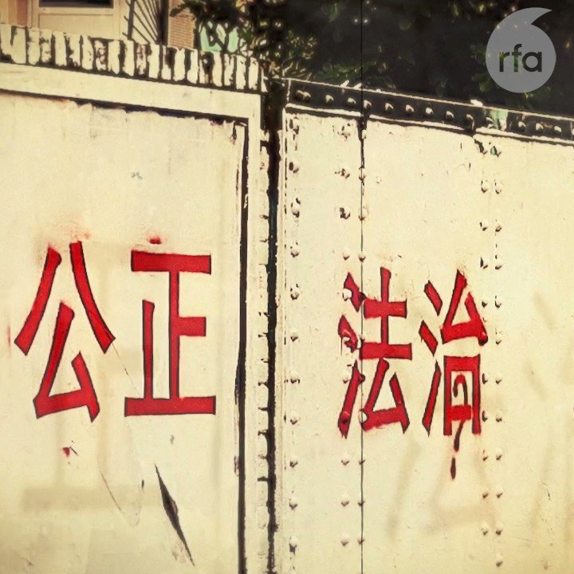

自由亚洲电台 北京时间 2023-09-21T04:29:39Z 1704593688771641686 专栏 | #网络博弈：#内蒙 等地“雷暴哮喘”背后的敏感禁区
 https://t.co/mWYODqRr7V   自由亚洲电台 北京时间 2023-09-21T04:48:02Z 1704598314061283646 中国经济持续放缓之际，有最新的调查显示，在 #东南亚经济 受到冲击的同时，外国企业在中国也面临经营困境。

 https://t.co/8vI9JyKVtt   自由亚洲电台 北京时间 2023-09-21T05:17:32Z 1704605737723613501 本周二，美国总统 #拜登 在第78届 #联合国大会 上发表演讲，他表示美中之间应该要 #去风险（de-risk）而不是 #脱钩（decouple）。同时，他也谈到 #新疆人权 议题，并呼吁对联合国进行改革。

 https://t.co/ycNqs2YEWW   自由亚洲电台 北京时间 2023-09-21T05:35:24Z 1704610232574574893 美国商务部长雷蒙多（Gina Raimondo）本周二还在美国众议院的听证会上表示，#华为 在她访华期间推出采用先进芯片的新款手机，让她感到不适。
此外，她还告诉立法者：“我们没有任何证据表明华为能够大规模制造 #7纳米芯片。” https://t.co/lbURnjBWb5   自由亚洲电台 北京时间 2023-09-21T06:06:00Z 1704617933346128157 【#红砖巷涂鸦 主创一鹊：我的作品是面镜子 别人评价它时也在评价自己｜#观点】
https://t.co/kZQ6PD3s6k
 #一鹊 @ArtYique 理解某些人看来东伦敦的24个字像是纳粹符号，他鼓励大家二次创作，但对一个想要引发讨论揭露问题的艺术家进行暴力人肉搜索和攻击，那一定是错误的
#艾未未  #陈丹青  #梁文道 https://t.co/fhfg8QmQ3l   自由亚洲电台 北京时间 2023-09-21T03:41:42Z 1704581618999181791 英国政府发布最新香港《#半年报告书》，批评中国继续违背《#中英联合声明》，以“国家安全”为名打压香港人权及自由，并点名关注正在审理的“#47人初选案”，以及香港传媒大亨 #黎智英 的案件。中方则再度跳脚，批评英方“粗暴干涉香港事务和中国内政”。

 https://t.co/LrAOl6P70x   自由亚洲电台 北京时间 2023-09-21T01:30:41Z 1704548650440081676 美国联邦调查局长：中国黑客是美国的五十倍。 https://t.co/sZM9lkMyLF   自由亚洲电台 北京时间 2023-09-21T02:10:23Z 1704558639888085020 特稿|#中国人权律师团 特稿|家园・乐土・理想国（三）
 https://t.co/a7aJl2UaJB   自由亚洲电台 北京时间 2023-09-21T00:00:10Z 1704525870642401711 #任正非 坦承是“#果粉”  “#华为粉”情何以堪？

 https://t.co/UFAWQtuUlI   