谁将十万横扫三江 北京时间 2023-09-21T23:22:10Z 1704878694723162454 亚美尼亚，抗议者要求当局退出俄罗斯主导的集安组织。

  昨天亚美尼亚人在俄罗斯驻埃里温（Yerevan）大使馆前焚烧俄罗斯护照。 https://t.co/bQZZSBEZNw   谁将十万横扫三江 北京时间 2023-09-21T23:23:45Z 1704879094557720866 军训，到时候和台湾人比站军姿，我站死他 https://t.co/QUx09YBLMW   谁将十万横扫三江 北京时间 2023-09-21T21:24:13Z 1704849013164605789 【吹哨记者】大批抗议者在马赛警察局门前举行集会，要求警方释放Disclose杂志记者阿丽亚娜·拉夫里勒。

周二黎明时分，吹哨记者拉夫里勒的家遭到警方突袭，她的财产被查抄，人被拘留。

此次行动源于记者拉夫里勒在调查网站 Disclose 上发表了一系列文章，这些文章基于数百份泄露的机密文件。据称，这些内容显示了开罗如何利用法国在埃及反情报行动的信息对利比亚边境沿线的走私者进行任意杀戮。

Disclose 将此次逮捕描述为“对新闻消息来源保密性的不可接受的攻击”。法国电视台记者协会和无国界记者组织（RSF）都在谴责法国镇压当局针对这名记者的攻击行为。   谁将十万横扫三江 北京时间 2023-09-21T21:32:02Z 1704850977134977142 致诸暨市人民政府：
       位于诸暨市暨阳街道艮塔路9号银证大厦4楼浙江合丰园林工程有限公司拖欠农民工工资，以各种理由推脱发放工资，9月8号民工到公司讨薪，公司以结清证明先签为由让每个人签了字，都签好后说章不在公司当时就报警了暨阳街道城中派出所来到了现场也一无所措，工人们也在公司一直到第二天的凌晨1点多，孙松裕（副总）和朱怡吃不消了又报警托关系 ，来了5个民警，说我们走路炒到楼下了，叫我们到门口呆着，把孙松裕和朱怡带回派出所做笔录，我想说第一次报警的时候不用做笔录吗？半夜了要做笔录了？做完笔录直接让他们回去了 ，人家民工都是老百姓都是血汗钱，作为人民警察事情不处理，还联合公司一起打压民工，这样的做法是不是也要讨个合理的解释？浙江合丰公司次次都是以各种套路让下面民工签字，不签钱打不了以这样的方式逼签，朱怡还满口谎话 她从没见到合丰的章过也没盖过合丰的章，公司盖章支付都是她负责的，朱怡是浙江兴发园林工程有限公司的法人由她负责所有业务的支付工作，他们在一起的有 浙江六星园林工程有限公司、浙江兴发园林工程有限公司、浙江中丰园林工程有限公司、浙江万众园林工程有限公司、浙江宝达园林工程有限公司、浙江兴兴园林工程有限公司、浙江大星园林工程有限公司所有的结算支付都是她在管的，公司的幕后老板一个叫项祖生、说是老赖，未发工资36人共计294100元，现在工资也还没发放，大家都签了结清证明了也不发，这样的公司你们诸暨市人民政府是不是也该管管了？建设局是不是也该管管了？   谁将十万横扫三江 北京时间 2023-09-21T21:38:45Z 1704852668995547620 咸阳读者热议择校黑市，曝出之前中专生杀人埋尸案

@经邦济民日前刊发了陕西咸阳有读者投诉择校黑市的文章后，众多读者在后台留言热议这件事情。几乎所有留言都认为，这种择校黑市已经威胁教育公平，而黑市的存在，本身又是教育不公平存在的原因。近日，更有读者向@经邦济民 透露，近些年，咸阳市因择校黑市出现了几起重大案件。

有读者留言：在择校这个问题上，不能头痛医头，脚痛医脚。政府要搞清楚问题产生旳根源。抓几个校托、中介只是政府平息舆论推脱责任之举。就如同医托、车托一样，每年都要处理一批人，但这些现象这么多年依然屡禁不止！大家心知肚明，都知道这些现象的存在主要是教育资源分布不公，教育主管部门应对此负有不可推卸的责任！

有读者留言：咸阳这个现象太普遍，家长为了孩子上好学校，不惜血本，费尽心机，教育部门真该好好管管了，还咸阳教育一片净土。

有读者留言：咸阳市择校问题愈演愈烈，家长苦不堪言，关键在于教育资源不平衡，家长想让娃上好学校，苦于没有渠道，只好寻人找关系、花钱，许多人拿着钱怕花不出去，找个跟教育局学校有关系的人，都觉得自己烧高香了，千恩万谢。

有读者留言：咸阳择校费收费很严重，想让娃上心仪的学校就得花钱，娃们上学真的太难了

有读者留言：情形确实是这样！满天飞的条子搞的学校领导苦不堪言！学校受校舍所限，放又放不下，得罪又得罪不起！开学前后的一段时间，真是度日如年！

据大风新闻报道：畅师傅的孩子去年小升初，想择校去西咸新区的秦汉中学上学，便四处打听托关系找朋友。谁料一圈下来，却遭遇了一场骗局，三万元“择校费”打了水漂，孩子险些没学上。

去年7月份，畅师傅因孩子小学毕业该上初中了，发朋友圈看谁能帮忙上好学校。没几天，畅师傅生意上的朋友王某反馈说他的亲戚是咸阳教育系统的，能和秦汉中学说上话，给孩子办入学。畅师傅去打听了一下，这王某所言不假，确实有亲戚在咸阳市秦都区教育局任职。他便委托王某帮忙办理孩子初中入学事宜。

“之后他又让我问问周围还有学生要办这个学校的没，那边还有一些名额。”畅先生又联系了三名孩子同学的家长，这三名孩子的家长将钱交了畅师傅，随后由畅师傅将共计9.8万元转交给了王某。

结果整个王某是和骗子，收钱不就后关机失踪。

也有读者向@经邦济民 反映，他们有十几个人向一位自称能帮忙办入学的人送了几十万元，结果此人失联，至今钱还未要到，家里人也不管。

还有读者反映，当地教育界乱象频出，前些年还发生过数名中专生杀人埋尸案。 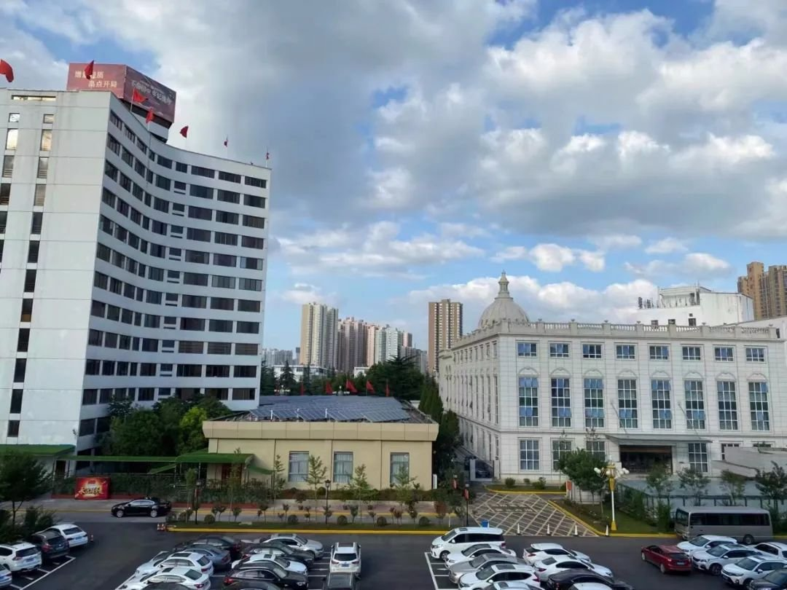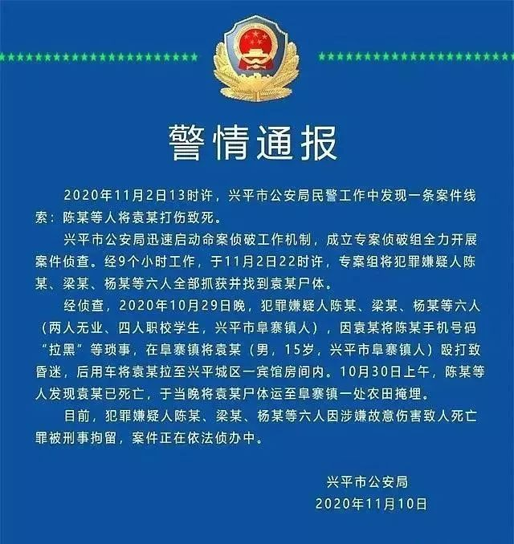  谁将十万横扫三江 北京时间 2023-09-21T21:42:37Z 1704853639876231205 9月20日，媒体报道称重庆一职业技术学校安排的校外实习中，包含给男顾客洗澡、按摩生殖器三角区等业务。
学生向班主任反映后不了了之，9月14日，学生家长向重庆警方报案。
涉事实习单位称，学生所作的是自愿行为。

三方协议的甲方为实习单位上海永琪美容美发经营管理有限公司，王糖霏的实习地点被安排到了位于重庆湖津支路的这家加盟门店。根据校方、学生和实习单位三方签订的协议书约定，实习单位不得安排或要求实习学生对异性进行身体护理。然而，她7月15日向班主任老师反映后，也不了了之，直到被王糖霏的母亲得知情况后，才选择了报警。

而门店负责人对记者声称“王糖霏所做的事是她自愿的”，因为房内没有监控，也不知是否属实。

王糖霏的班主任对记者矢口否认王糖霏向他反映过此事，但是王糖霏提供的聊天记录显示，她的确于7月15日向班主任李某反映过门店安排她们接待男顾客并要做私密部位的事，李某还回复称“男客人私密部位不可以”

记者暗访时，发现涉事门店已经收起了项目菜单，也停止了洗澡服务，且对外称从没有洗澡服务，没有“前列腺保养”服务，但王糖霏提供的她与门店经理杨某的聊天记录却显示，她的确曾被门店安排给男顾客洗澡：

如今，门店还反过来聘请了律师，准备起诉王糖霏诬告

2020年12月，据媒体报道，陕西一职校多名未成年女生被诱导陪酒，当地警方却称：“被诱导陪酒女生过分追求吃穿，应增强对诱惑的抵抗力”。与此次回应如出一辙 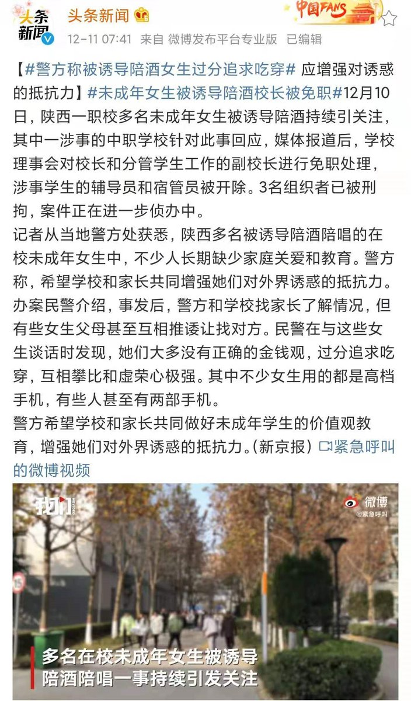  谁将十万横扫三江 北京时间 2023-09-21T21:45:18Z 1704854318393012233 RT @whyyoutouzhele: 9月19日，浙江大学环境与资源学院的一名延毕硕士生在紫金港校区内的启真湖中跳湖自尽。
据称该学生的导师要求其退学，家属表示学校对自杀事件态度冷漠。… https://t.co/pEatlNJFnO 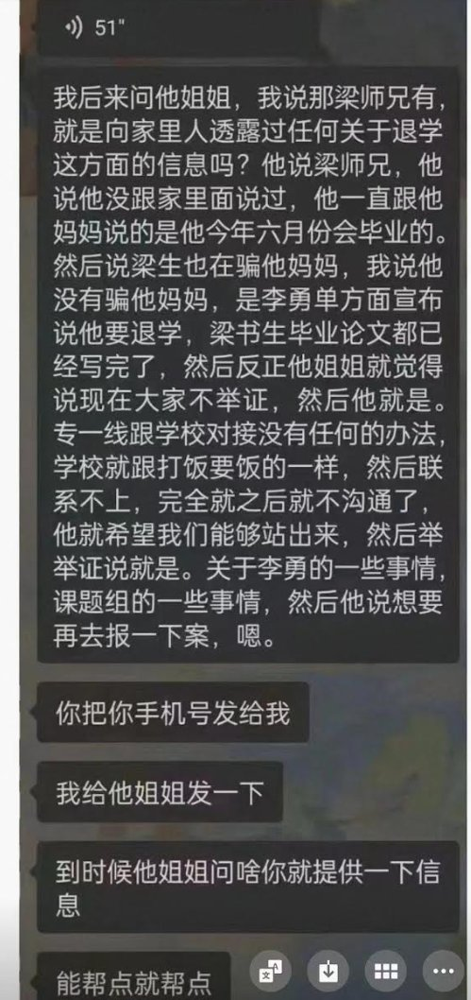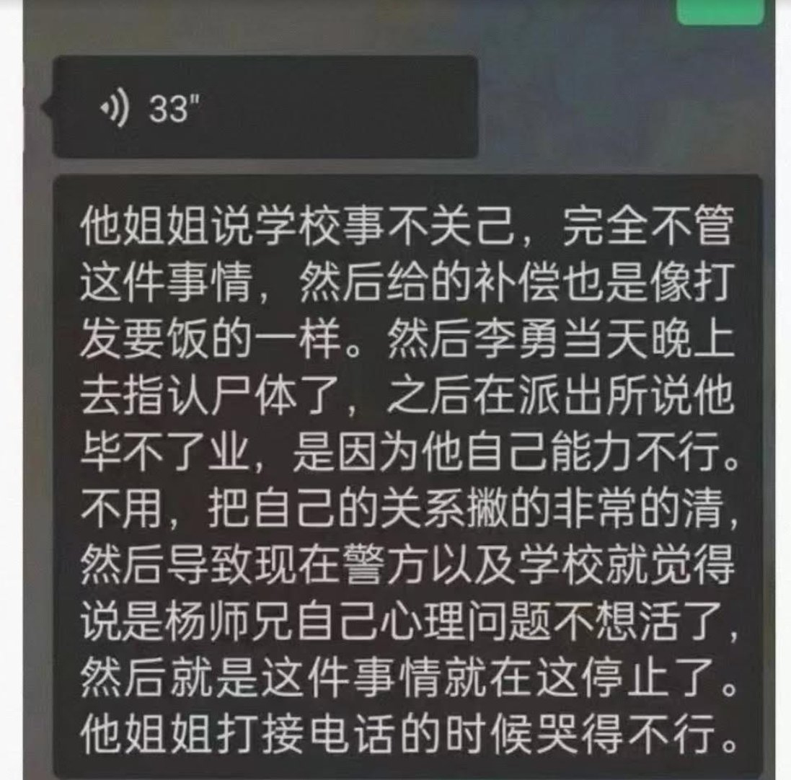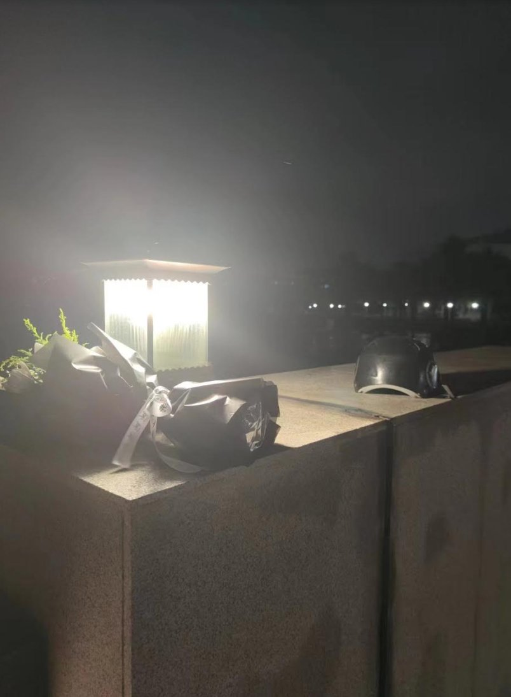  谁将十万横扫三江 北京时间 2023-09-21T21:53:05Z 1704856276310827079 遥遥领先！华为昇腾AI算力芯片登上央视，每个中国人都有自己的电幕 https://t.co/z1t2JaZuq7   谁将十万横扫三江 北京时间 2023-09-21T22:06:34Z 1704859669364400345 15岁女生在雅圣思学校被人性侵，“学校”封锁消息两个月

学校能封锁消息吗？还不是政府   谁将十万横扫三江 北京时间 2023-09-21T22:08:19Z 1704860108491284707 它肯定花了好长时间才学会这样走路的，路人说它出过车祸，被一位好心的茶室姐姐救了，并且收养了它 https://t.co/TJv5ezNmS2   谁将十万横扫三江 北京时间 2023-09-21T06:35:24Z 1704625331192439185 南宁银海三雅学校，女霸王霸凌同学遭家长写联名信投诉 https://t.co/xKRfCpHdiw 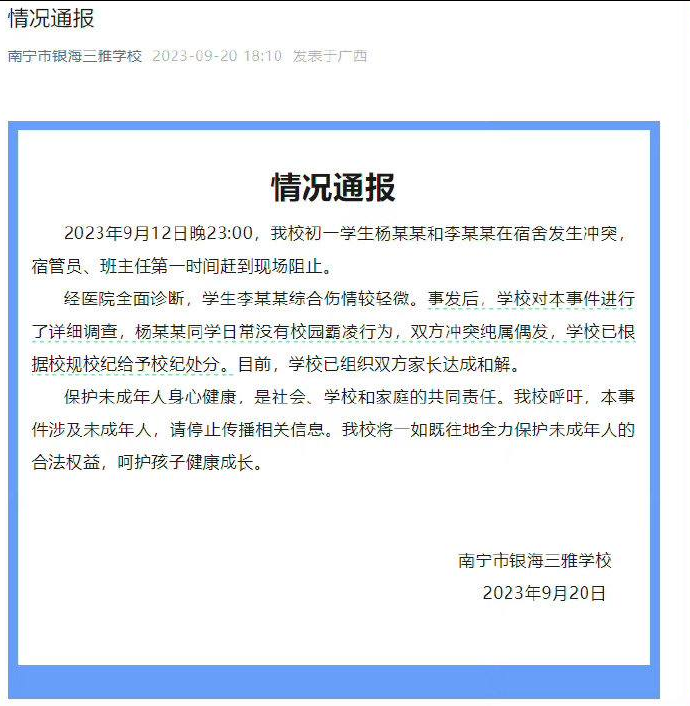  谁将十万横扫三江 北京时间 2023-09-21T06:26:48Z 1704623168177238473 吉林省白城市通榆县，一米业公司拖欠工人工资，工人堵大门拉横幅讨薪
时间：2023-09-17
地点：吉林省-白城市-通榆县-风电大路4722号
行业：制造业/农产品及食品加工/仓储
公司名称：通榆县鑫域北显米业有限公司（曾用名：通榆县鑫域米业有限公司）
企业性质：民营企业
行动类型：堵塞出入交通/拉横幅
诉求：欠薪
参与人数：1-100
资料来源：
https://t.co/zQizBxaRaI
https://t.co/XYv5T7UgmJ
https://t.co/1mPKK88BuO

#欠薪事件
#吉林
#1至100   谁将十万横扫三江 北京时间 2023-09-21T06:32:03Z 1704624491937386959 广州撞死6人司机起诉社交平台索赔1.34亿

2023年1月11日，温某某在广州市天河区市中心驾车冲撞人群最终导致6人死亡，25人受伤。据查温某事发前后曾出现严重幻觉。而导致其精神失常最主要的原因是温某遭到来自“抖音”平台的持续近一年时间的严重网暴。

2023年9月4日，温某某及家人诉至北京市第一中级人民法院，要求“抖音”赔偿1.34亿元，用于补偿死伤者及家属，目前北京市第一中级人民法院已经受理此案 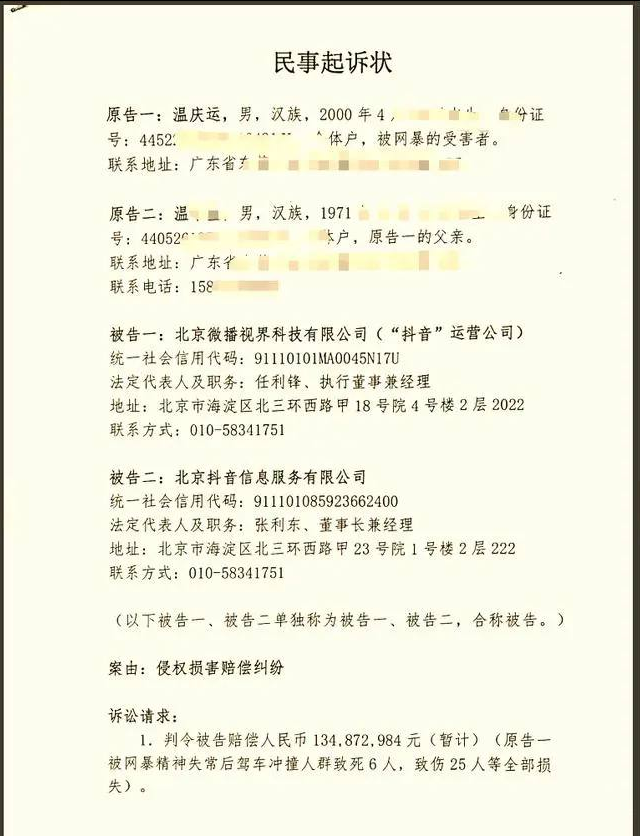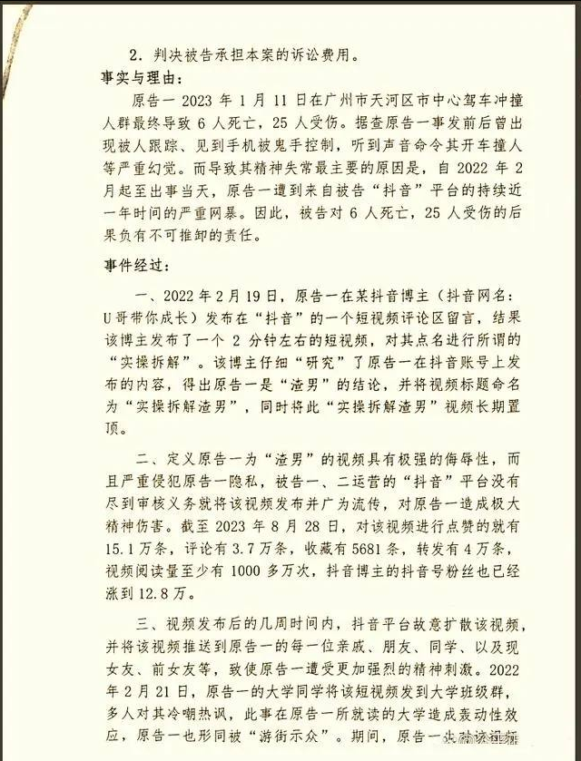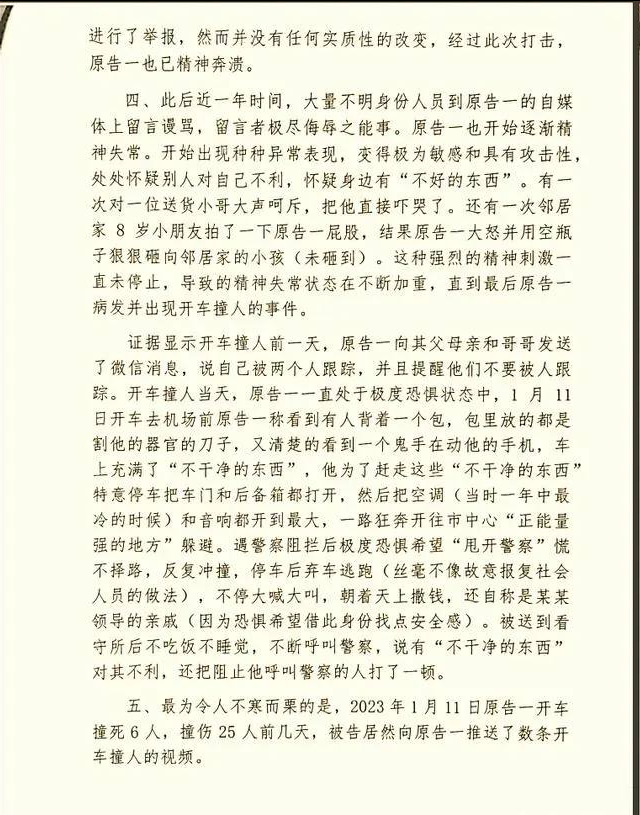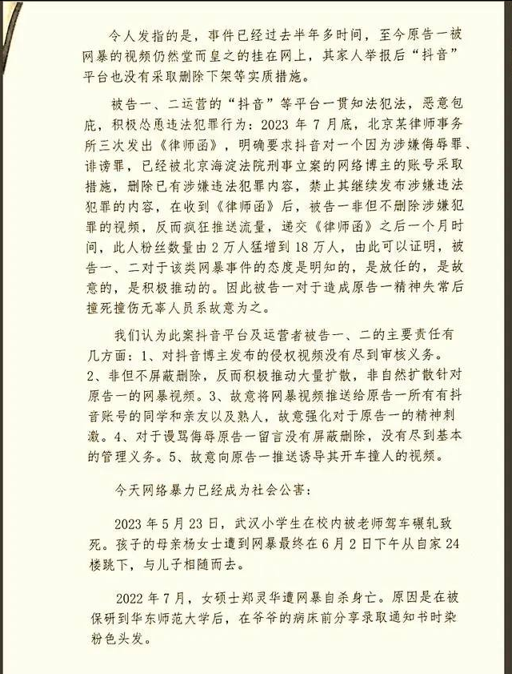  谁将十万横扫三江 北京时间 2023-09-21T06:37:45Z 1704625923939766449 9月20日9.20凌晨河南信阳暴雨洪水画面 https://t.co/jVTWVM629W   谁将十万横扫三江 北京时间 2023-09-21T06:30:51Z 1704624186738802950 某大厂员工:月薪税前5W，到手3W多点，在北京过得紧巴巴，后悔买房

坐标帝都,就职于某互联网大厂，月薪税前5W左右。以7月份为例:扣税7.5k,扣公积金4.5k，扣五险2.5k,到手3W多。要养孩子，还要还房贷…....，每天过的紧巴巴媳妇在家带娃没有上班,有天晚上躺床上聊天，媳妇说今年没有存多少钱，我非常惊讶,于是做了个统计表格统计了7月份的支出，突然发现买过房之后几乎成了月光族。7月份家庭开支:
房租5900元(两室一厅,海淀区）;
房贷18649.38元(算1W9，这是扣除公积金抵消部分，8000多）;
房贷18649.38元(算1W9，这是扣除公积金抵消部分，8000多）;
水电燃气费360元(除了自来水,还包含桶装纯净水);
交通费200元(我上班主要是共享单车，媳妇主要是地铁);
话费180元(我120元,媳妇60元，我主要绑定了宽带和电视TV）;
家庭吃、玩消费3000元(做饭买食材,外出游玩,家庭聚餐，女儿营养等);
衣服650元(平常用不了多少，7月份遇到商场做活动,所以媳妇多买了几件）;护肤品500元(媳妇办的美容卡和护肤品,我就用个30多元的洗面奶,用好几个月）;女儿上幼儿园+兴趣班2800元(幼儿园一月1800元。兴趣班是学跳舞,一次交一年，平均每月1000元。）;
日用品150元(卫生纸、湿巾、洗衣液一类的);
人际交往500元（随份子、请吃饭等);双方父母孝敬1000（给双方家人买东西，过年包红包等）;
共计:35340元
我现在的阶段是上有老(父母没有退休金)，下有小(吞金兽,正处于花钱阶段),我们夫妻都出身农村,不敢花钱，不敢享受，节俭勤勉是刻进骨血的生存记忆和生活惯性。
我现在的阶段是上有老(父母没有退休金)，下有小(吞金兽,正处于花钱阶段),我们夫妻都出身农村,不敢花钱，不敢享受，节俭勤勉是刻进骨血的生存记忆和生活惯性。   谁将十万横扫三江 北京时间 2023-09-21T06:33:38Z 1704624889842594135 9月20日，深圳宝安鹤洲收费站旁发生爆炸，现场产生了巨型“蘑菇云”。
据目击者回忆，当时爆炸声响巨大，自己身处大楼也有震动感。 发生火情的地点为宝安区航城街道钟屋社区一居民楼，事故未造成人员伤亡。 https://t.co/nDKOcWQxqg   谁将十万横扫三江 北京时间 2023-09-21T06:37:42Z 1704625911059132477 9月19日吉林省白山市抚松县，一食药产业园建设项目拖欠工人工资，工人讨薪 https://t.co/XJ76C72EIE   谁将十万横扫三江 北京时间 2023-09-21T06:38:27Z 1704626100687802385 RT @Pandazhq: 国企为什么会亏损 https://t.co/iTXnacyI3t 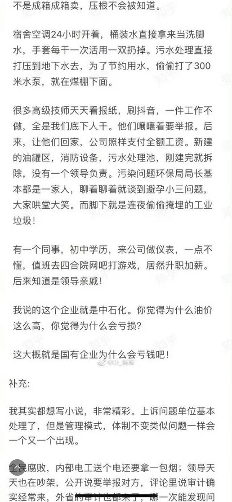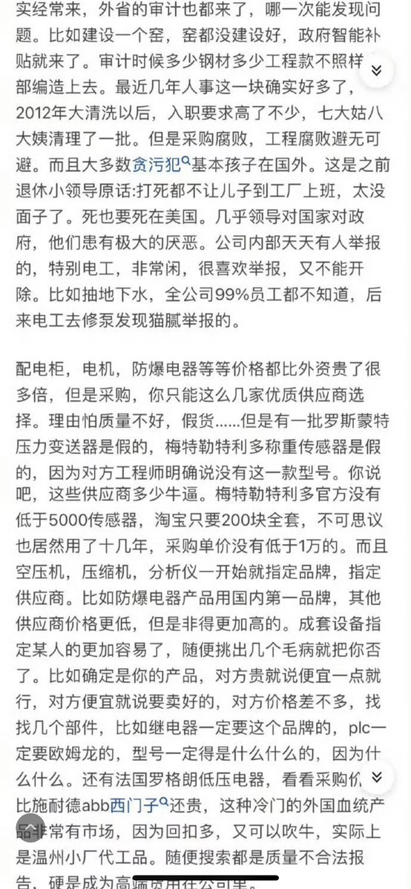  