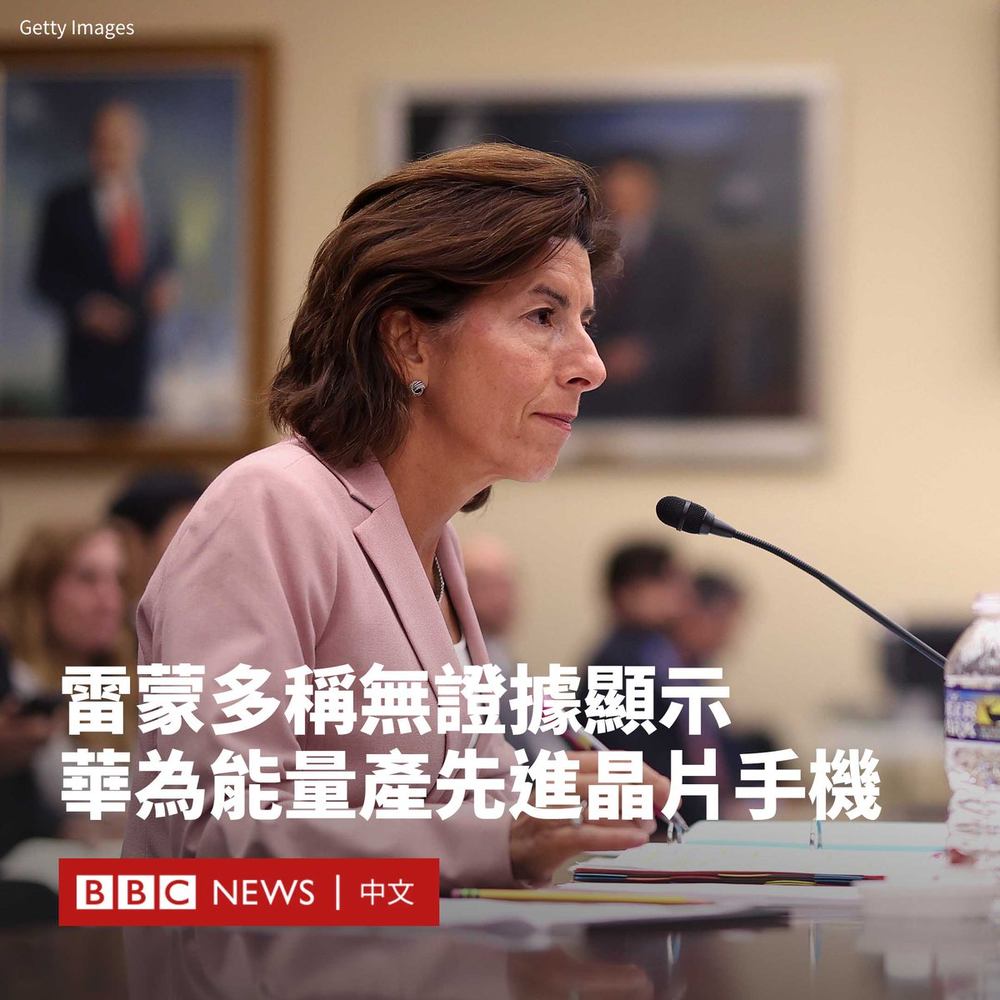
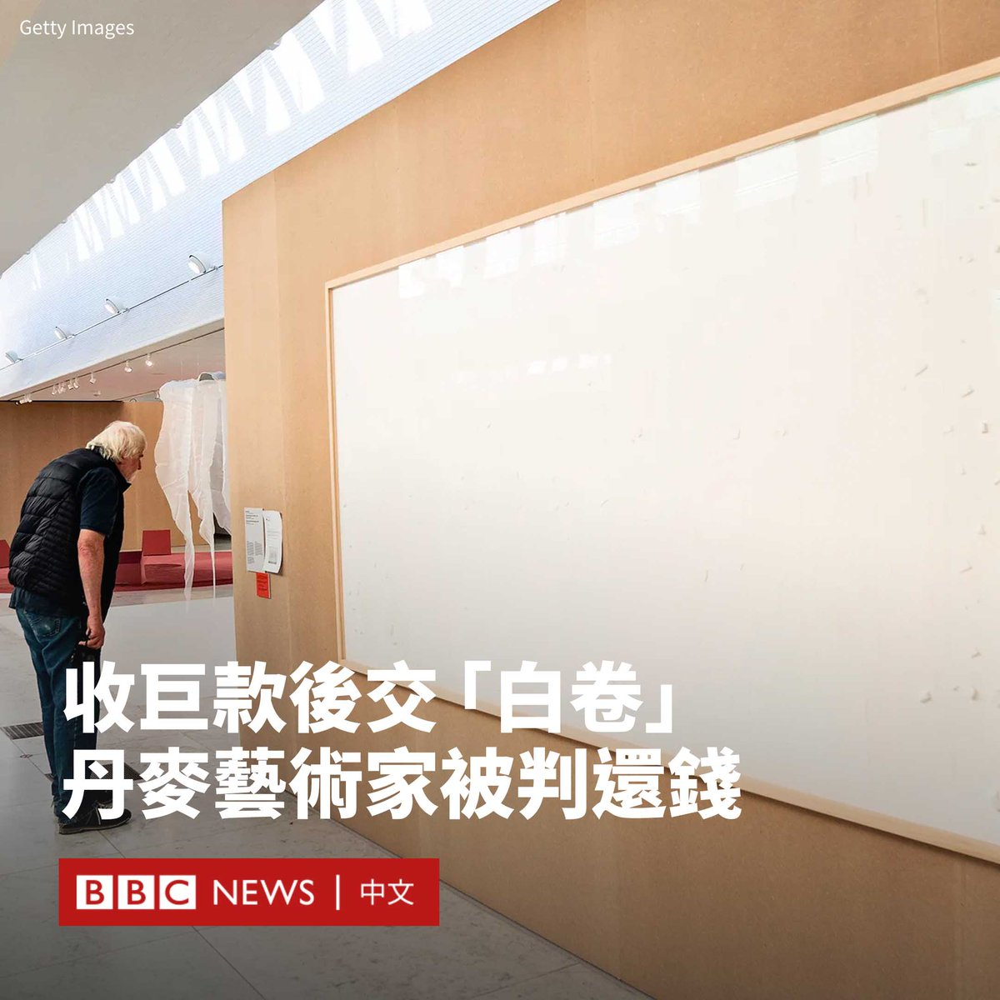
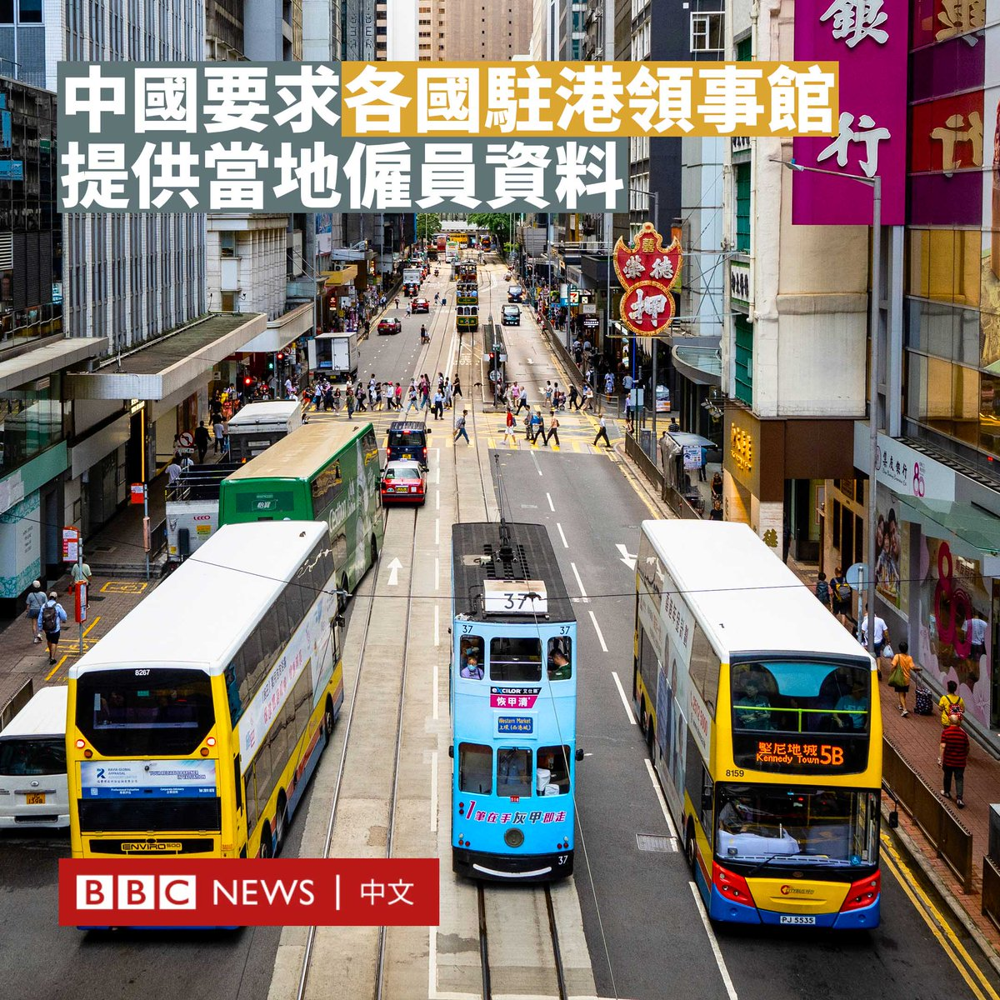
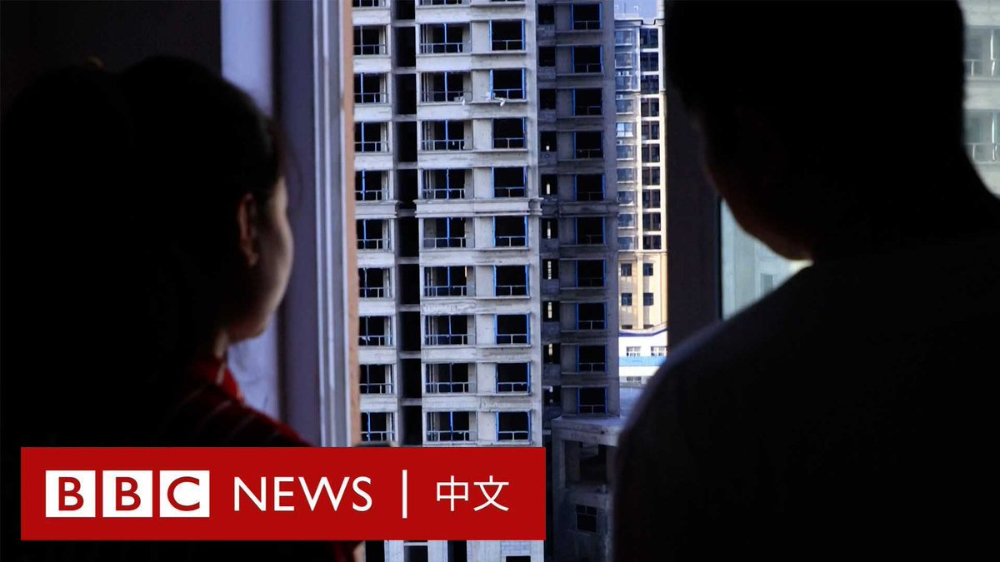

D英国广播公司BBC 北京时间 2023-09-20T20:29:45Z 1704472915637412132 印度和加拿大的外交争端白热化，加拿大锡克教领袖6月在卑诗省遇刺，加拿大总理特鲁多指控是印度政府特工所为，印度否认，两国随后互逐外交官。
https://t.co/eKlvLWRupB   D英国广播公司BBC 北京时间 2023-09-20T17:58:27Z 1704434838676373926 美国商务部长雷蒙多（Gina Raimondo）周二（9月19日）对华为推出新手机一事进行回应，表示没有证据表明中国通讯巨头华为具备大量生产先进手机晶片的能力。

“我们没有任何证据表明他们（华为）能大规模生产7纳米（晶片）。”雷蒙多在众议院的听证会上说。

华为今年8月底突然开售新款Mate 60智慧型手机。分析师认为，该机所使用的麒麟9000s晶片由中芯国际制造，并采用了先进的七纳米晶片技术。这意味着其可能在美国制裁下取得了重大技术突破。

美国商务部早前表示，当局已着手获取更多有关该款手机晶片的“特性和组成”信息。中芯国际与华为都被美国列入黑名单，被限制获得美国的技术。

不过，雷蒙多同时表示，她对这部在她访华期间发布的手机感到不安，称其“正试图利用我们掌握的每一种工具，阻止中国以伤害我们的方式发展技术”。

一些共和党议员认为，美国商务部应切断对华为和中芯国际的所有技术出口。

中国外交部发言人周三（9月20日）表示，北京反对华盛顿“泛化”国家安全概念。   D英国广播公司BBC 北京时间 2023-09-20T15:17:51Z 1704394422539231317 一位丹麦艺术家在收到博物馆提供的经费进行创作，但只提交了两张空白画布后，被勒令向博物馆返还近500,000克朗（72,000 美元）。

2021年，丹麦奥尔堡现代艺术博物馆原本打算让艺术家延斯·哈宁（Jens Haaning）用真钞纸币制作两件艺术品，表达丹麦和奥地利的工资问题。

但结果是，该博物馆收到了两件意料之外的作品——两幅名为《拿钱跑路》（Take the Money and Run）的全白画布，表示其作品就是“我拿了他们的钱”。

博物馆此前曾要求这位艺术家归还所有资金，即大约53.4万克朗，但哈宁拒绝了。

哥本哈根一家法院周一（9月18日）裁决哈宁退回这笔现金的大部分——49.3万克朗。

报道称，这个数字相当于博物馆给他的金额减去艺术家的工时费和装裱费。

博物馆馆长莱塞·安德森（Lasse Andersson）表示，当他在2021年第一次看到这两张空白的画布时笑出了声，并决定无论如何都要展出这些作品。

“他让我的策展员有点激动，也让我有点激动，但我也笑了，因为这真的很幽默。”安德森此前在BBC的一档节目中说道。

判决后，哈宁对丹麦媒体表示，他不打算提出上诉。他还辩护说，博物馆靠此事带来的宣传效应所赚的钱已经“远远超过了”投入。   D英国广播公司BBC 北京时间 2023-09-20T14:01:11Z 1704375130569499012 中国政府周一（9月18日）要求各国驻香港领事馆提供当地雇员的个人资料。

中国外交部驻香港特派员公署发言人周三（9月20日）证实了此前媒体报导的消息，并回应称这符合国际惯常做法。

“中国驻外领事机构亦根据当地政府要求向接受国提供当地雇员信息。”发言人在一份声明中写道。

此前有报道称，中国外交部已照会各国驻港领事馆，要求它们在10月18日之前提交当地雇员的信息，包括姓名、职位、聘用日期、住址、身份证等。

该要求适用于所有与领事馆订立雇佣合约的人员，包括香港永久居民和非永久居民。

虽然此前北京一直要求中国大陆的外国使领馆提交和登记有关中国雇员的信息，但据信这是在香港首次实施此类政策。

据当地媒体报道，当局要求领事馆在新员工入职后的15天内上报其个人资料。

据《南华早报》报道，信函中还表示，提供给该公署的个人资料，可能会传到其他部门和有关当局，“以行使其管理当地聘用人员的职能”。

自2020年香港《国安法》实施以来，北京不断加强对于香港的控制。香港目前有63间总领事馆，53间名誉领事馆。

《金融时报》去年报道，中国曾要求香港的外国使团提供其租用房产的资料，包括平面图。   D英国广播公司BBC 北京时间 2023-09-20T11:21:41Z 1704334992065572864 时速285公里的列车变身比赛擂台？🚄

日本的摔角迷们观看了一场特殊的比赛。两名职业摔角选手在东海道新干线“希望号”的过道上展开较量。

总部位于东京的DDT职业摔角组织了此次活动。据当地媒体报道，该车厢内有75名乘客。两名知名选手铃木实和高木三四郎在列车上缠斗了30分钟。 https://t.co/fIwmJSWwkd   D英国广播公司BBC 北京时间 2023-09-20T09:53:18Z 1704312748853575768 在中国陕西的工业城市铜川，上周有数十名房地产业主聚集在一起，高呼“我们要房子”的口号。他们是全国很多地方出现的被困在烂尾楼中的业主的一员。

自2021年中国房地产陷入危机以来，许多开发商面临资金周转问题，很多业主迟迟等不到住宅楼的完工和交付，只能在简陋的空壳里度日。 https://t.co/FtG2CezbjD   