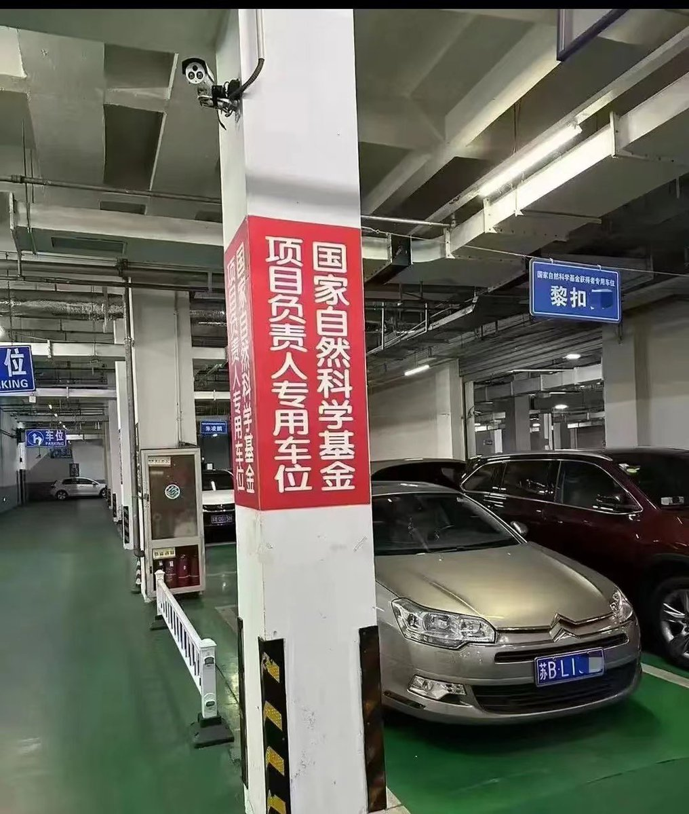
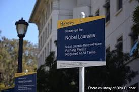
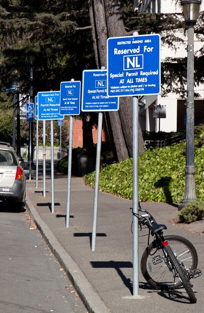
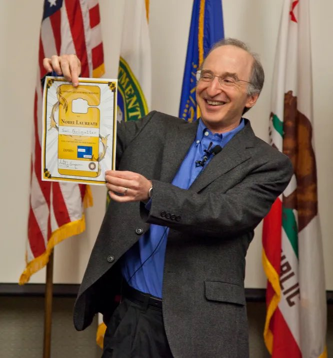
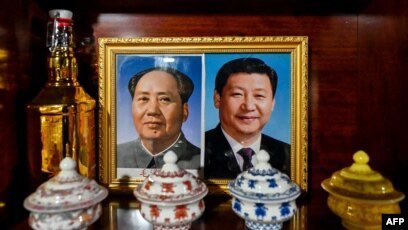
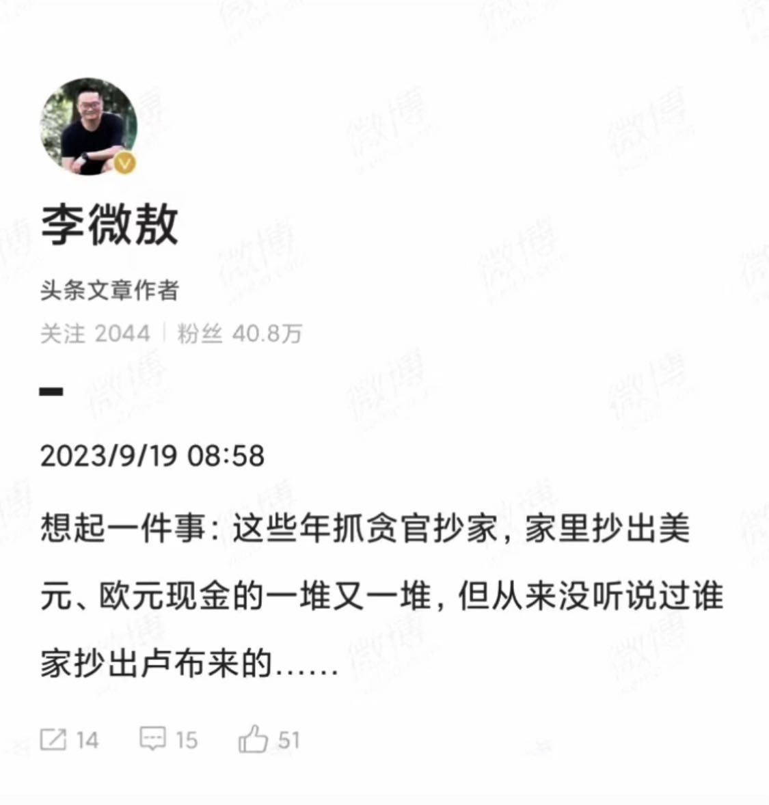
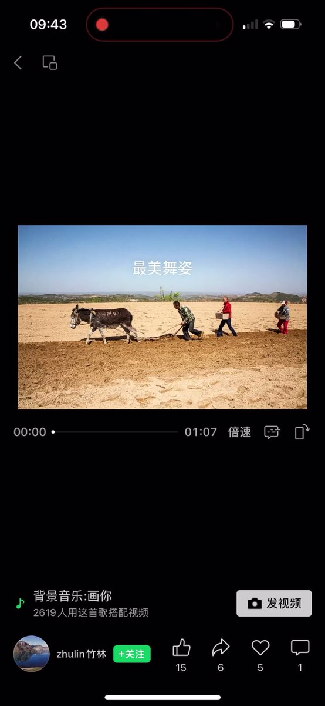

Petrichor 北京时间 2023-09-20T20:48:49Z 1704477716437770587 东施效颦。
不过格局低了许多。美国的大学，诺贝尔奖获得者可以有专用停车位。在中国某大学，获得中国自然科学基金的项目负责人就给专用停车位。这从一个侧面反映中美两国在科学研究特别是原创性研究方面的差距。 https://t.co/eEZSP0CnOR   Petrichor 北京时间 2023-09-20T08:58:05Z 1704298851492827158 花旗银行1902年在中国设立分行，经营47年，1949年撤离中国。

1983年在中国重新开设分行，经营40年，2023年宣布关闭中国的业务。

转了一圈，中国又回去了。习近平回到毛泽东，中间邓江胡没了。 https://t.co/snAyvdq3qY   Petrichor 北京时间 2023-09-20T09:23:10Z 1704305163681280491 如果现政权被人民推翻了，习明泽往哪个国家跑？俄罗斯、朝鲜还是美国？大家帮助猜猜。

王立军遇到麻烦后，躲到美国领事馆，而不是俄罗斯或朝鲜领事馆。王立军平时爱党爱国没少讲。中共官员的最大特点是虚伪，嘴上说的与心里的真实想法不一样。 https://t.co/TRCBdJlLml   Petrichor 北京时间 2023-09-20T09:30:33Z 1704307022915678489 一句话总结，那就是得道多助 失道寡助。 https://t.co/Fys0Y8HxhT   Petrichor 北京时间 2023-09-20T09:16:21Z 1704303449741902051 转发
“四人帮”被抄家时，抄出了多少钱？

        王张江姚“四人帮”，被抓前都是中共政治局常委，按现在的话说，都是国家级大干部。
        1976年10月6日，华国锋、叶剑英决定对“四人帮”隔离审查。
        逮捕四人帮后，汪东兴带人抄家，对四个人的“私人物品”进行封存。
        据汪东兴回忆录：他带领一行人首先前往江青住的房子，却发现十分简朴，根本看不出这是中央高级领导的住所。房子面积约有60来平方米，除了一些必要的家具，没有一件多余的东西。在江青家中翻找了一个小时，没有找到值钱的财物，仅从江青书房的抽屉里，找到8块钱。
        抄王洪文的家时，王洪文的妻子听完搜查组的情况说明，瞬间晕了过去。令人诧异的是，作为党中央副主席的王洪文家也是极其简朴，搜不到任何值钱的物件。
        最后前往张春桥、姚文元家，也和前两家情况一样。
        四人帮的家全部搜查完毕，总共搜到多少钱？——61块8毛钱。其中江青8块钱是最少的，王洪文的钱稍多一点，20多块。
        这让人不禁十分奇怪，威风一时的四人帮，怎么经济竟然如此拮据？
        都说毛泽东时代干部清廉，真没想到，连政治上罪大恶极的“四人帮”也如此清贫。想想现在的贪官动辄就能抄出几个亿，真令人默然无语。   Petrichor 北京时间 2023-09-20T00:31:07Z 1704171270361751660 即使国有银行，也不可信任。这就麻烦了，人们还能相信谁啊？信任危机，处处提防上当受骗，或互骗成风。 https://t.co/8o2TJ7HxGe   Petrichor 北京时间 2023-09-20T00:36:14Z 1704172556029178080 中国农村的耕种机械化落后美国100年以上。没有农业现代化，就没有国家的现代化。 https://t.co/T1YdLe75Av   