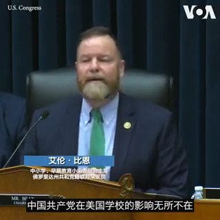
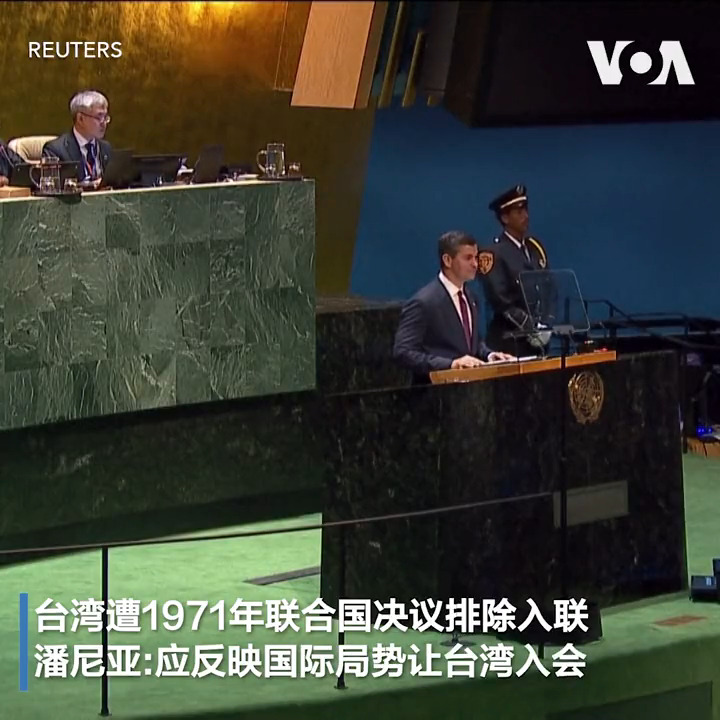
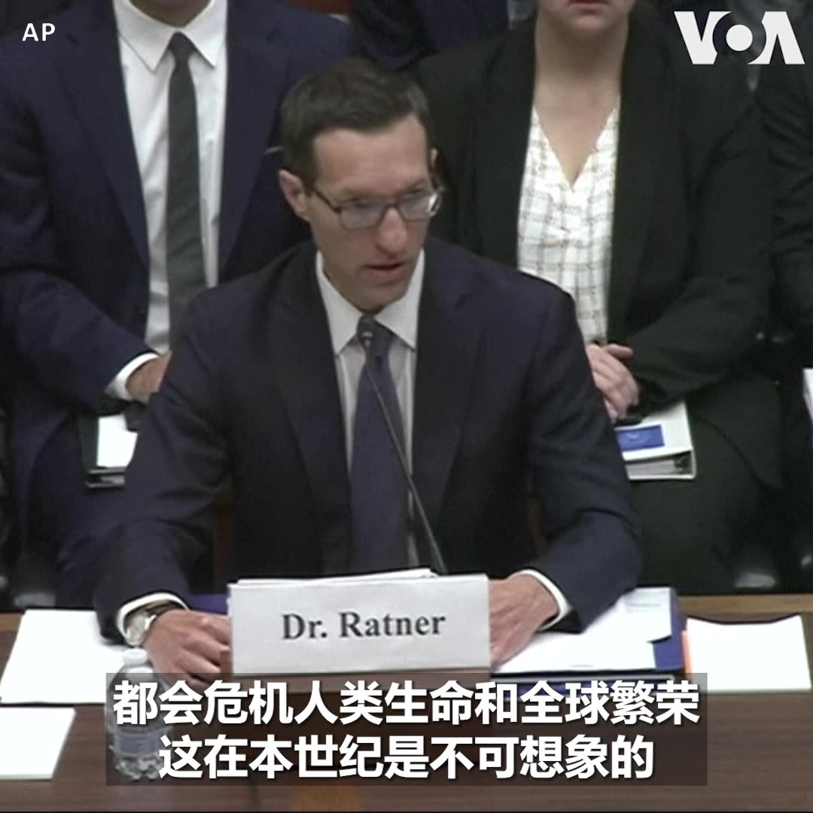
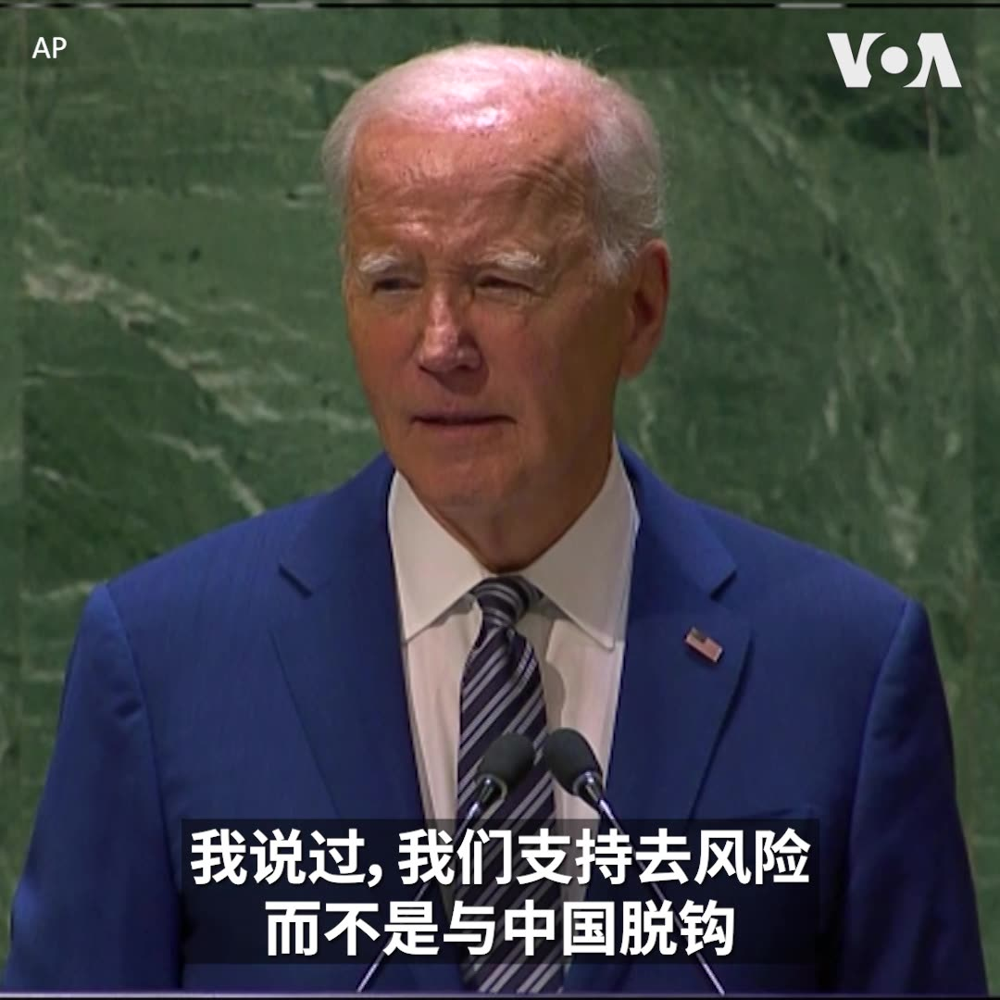
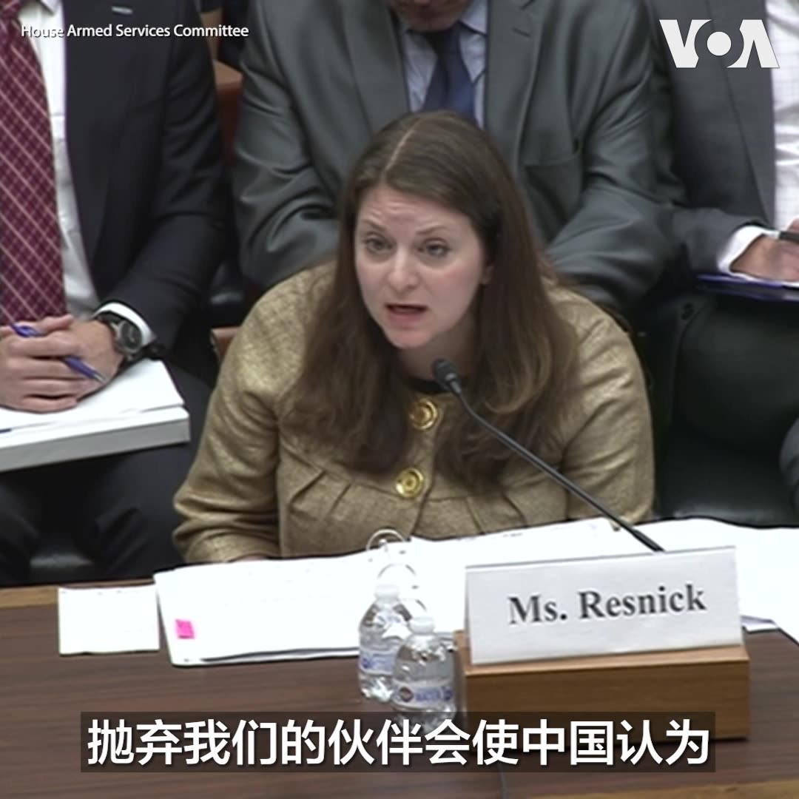
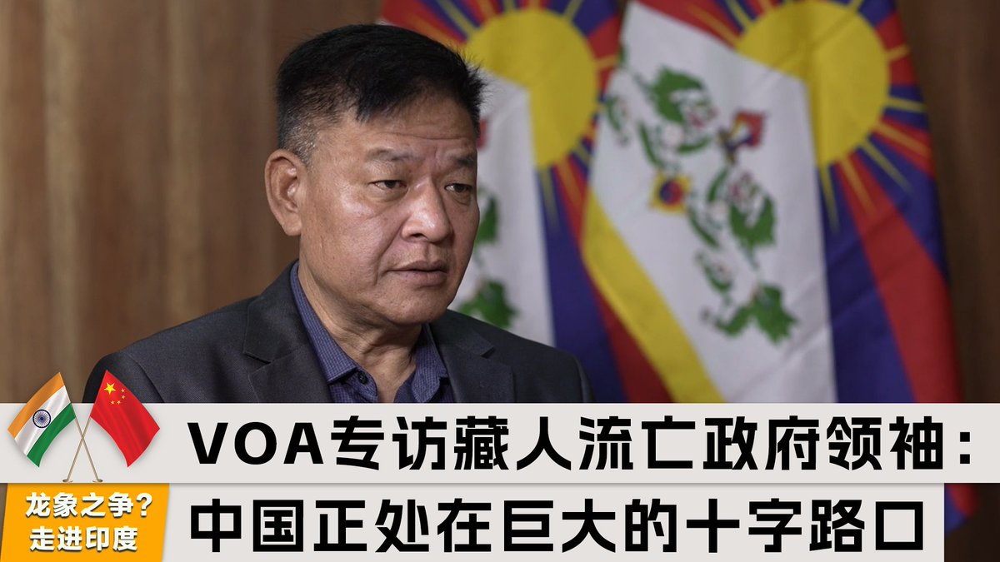

美国之音中文网 北京时间 2023-09-20T22:23:45Z 1704501606727749695 中国欧盟商会9月20日呼吁中国政府采取措施改善外企在华营商环境。该机构在当天发布的报告中说，中国政府发出的各种矛盾信息令在华欧盟企业无所适从。报告列举了在华外企面临的各种挑战，并警告中国经济决策者的去风险化努力不应成为贸易保护主义的借口。 https://t.co/9hM4JQi6mD   美国之音中文网 北京时间 2023-09-20T21:00:27Z 1704480642023481493 9/20 【#时事大家谈】王毅访问俄罗斯 北京如何拿捏中俄关系？谭德塞呼吁重启新冠溯源 敦促中国全面准入 

嘉宾：陈破空，政论作家；横河，时政评论者
主持人: 叶凡

YouTube：https://t.co/l7pdmYQvP0 https://t.co/qM7vPeKbGt   美国之音中文网 北京时间 2023-09-20T22:14:48Z 1704499351127568756 创台95年的台湾中央广播电台(央广)卸下对中国广播心战的任务后，见证并记录了台湾民主化和走向国际的历程。台湾总统蔡英文9月19日于央广台庆上期许，央广继续传达台湾追求和平的声音。作为台湾的关键基础设施，央广董事长赖秀如告诉美国之音，已进行过演习，因应战时可能遭中国锁定的攻击。 https://t.co/HJO391t3vM   美国之音中文网 北京时间 2023-09-20T23:37:08Z 1704520072587596054 台湾大选最新民调：民进党候选人赖清德支持度飙升至42.52% https://t.co/s3b9Gf10i8   美国之音中文网 北京时间 2023-09-20T23:51:16Z 1704523631550959749 两场龙卷风袭击江苏两城 致10死8伤 https://t.co/RekA9KygMF   美国之音中文网 北京时间 2023-09-20T21:40:56Z 1704490829862072788 亚洲开发银行9月20日表示，由于中国房市疲弱、圣婴现象等不利因素，增添了亚太区经济前景的风险，该行因此下修今年亚洲发展中国家的经济增长率，由4.8%微幅下修至4.7%，其中，中国今年的经济增长率也同步下修至4.9%。 https://t.co/HHZ857g15D   美国之音中文网 北京时间 2023-09-20T21:52:07Z 1704493643837358447 德国对华投资今年明显回落，但德企“去风险”动力不足 https://t.co/wiezWrzgt4   美国之音中文网 北京时间 2023-09-20T22:19:05Z 1704500432930840912 欧盟在联合国要求中国推动俄罗斯在乌克兰实现“公正和平” https://t.co/UINpHFYwtp   美国之音中文网 北京时间 2023-09-20T19:19:53Z 1704455333593096613 9月19日，美国众议院教育与劳动力委员会下属的中小学、早期教育小组委员会举行了题为“被攻击的学术自由:摆脱中共对美国学校的控制”的听证会。有关人士指出，美国各大院校终止“孔子学院”项目后，由中国政府资助的汉语教学项目仍在美国中小学继续。议员们担心美国中小学的“孔子课堂”扼杀美国的学术自由。 https://t.co/ulsAoIQmfy   美国之音中文网 北京时间 2023-09-20T20:27:13Z 1704472278958776608 巴拉圭总统潘尼亚9月19日于联合国大会发言，表态支持台湾重新加入联合国体系。巴拉圭是台湾在南美洲的唯一友邦。详细报道：https://t.co/VtQgutlGvA https://t.co/fbluIk5MFd   美国之音中文网 北京时间 2023-09-20T15:05:11Z 1704391234897522757 美气候特使克里再会韩正 呼吁中国加速脱碳 https://t.co/mSX2sqZUyN   美国之音中文网 北京时间 2023-09-20T17:16:04Z 1704424175405060399 美参院共和党领袖呼吁政府“认真投资”国防 以应对中国的军事扩张 https://t.co/nHlTXMiAuL   美国之音中文网 北京时间 2023-09-20T17:31:07Z 1704427961045389714 中国禁令生效镓锗出口归零 存货堆积致价格走跌 https://t.co/hbcKsj9ycM   美国之音中文网 北京时间 2023-09-20T18:03:06Z 1704436012083253256 台湾各友邦在联合国大会上 接连呼吁让台湾参与联合国 https://t.co/8mjgiDyQ24   美国之音中文网 北京时间 2023-09-20T15:18:36Z 1704394611068936350 美越关系持续升温 国防政策对话讨论推进合作 https://t.co/nYDmJ7hZbE   美国之音中文网 北京时间 2023-09-20T12:43:06Z 1704355480339181901 下周召集第二次峰会 白宫称拜登将重申对太平洋岛国的承诺 https://t.co/2yzt7FwK26   美国之音中文网 北京时间 2023-09-20T07:13:10Z 1704272447661613465 印军关注台海危局 周密研判应对策略 https://t.co/ZcrUdtIV3h   美国之音中文网 北京时间 2023-09-20T07:50:00Z 1704281717912252859 【家事国事天下事，你有何见解】中国的《治安管理处罚法》新草案大大扩大了公安权力，使警方可以对更广的人群提取人体生物识别信息和样本。有论者指出：在执法司法以及器官移植都严重不透明的中国，有人可能被按需抓捕处决采摘器官用于营利性的器官移植。中国当局是否能让民众消除或减轻这方面的忧虑？ https://t.co/1QKNhRm6fd   美国之音中文网 北京时间 2023-09-20T05:42:34Z 1704249650528817587 南北韩军事协议签署五年后面临不确定的命运 https://t.co/sdV07TAemZ   美国之音中文网 北京时间 2023-09-20T07:26:10Z 1704275721278128312 拜登总统联大演讲再促安理会改革，但“增常”前景依然渺茫 https://t.co/y7Uka28yHY   美国之音中文网 北京时间 2023-09-20T08:31:25Z 1704292143366373455 美国国会众议院中国特设委员会主席加拉格尔等数十名国会议员18日在国会大厦品尝由日本驻美大使馆准备的日本寿司和福岛酒，以显示对日本水产及福岛产品的支持。加拉格尔表示，科学验证已表明日本水产品的安全性没有因释放经处理的核废水而受到影响，中国全面禁止日本海鲜是经济胁迫。 https://t.co/bc2O9vMKrQ   美国之音中文网 北京时间 2023-09-20T09:53:32Z 1704312809184780473 拜登在联大会议间歇会晤中亚五国领导人 https://t.co/RdyZSo0bGH   美国之音中文网 北京时间 2023-09-20T10:09:09Z 1704316739071483999 美防长：艾布拉姆斯坦克将很快抵达乌克兰 https://t.co/XRurnxr94H   美国之音中文网 北京时间 2023-09-20T10:10:14Z 1704317007947075879 美国总统乔·拜登（Joe Biden） 星期二（9月19日）在联合国大会上发言时再次呼吁对联合国进行改革，增加安理会常任理事国和非常任理事国的数量。分析人士说，尽管安理会改革有高度的国际共识，但由于地缘政治以及程序方面的问题，增加安理会常任理事国的改革前景渺茫。https://t.co/RaarrwCRil https://t.co/AxwoljtoXI   美国之音中文网 北京时间 2023-09-20T04:31:07Z 1704231668872282335 阿塞拜疆宣布对亚美尼亚在纳卡地区的阵地发动“反恐行动” https://t.co/7IV4LxYm8j   美国之音中文网 北京时间 2023-09-20T07:00:01Z 1704269140083781673 王毅访问俄罗斯，莫斯科宣布普京将在10月访华并会见习近平。同时中美加紧互动，韩正对布林肯说，双方要相互成就，共同繁荣。美中关系回暖？北京如何拿捏中俄关系？谭德塞呼吁重启新冠溯源调查，国际社会如何推动中国当局予以配合？这场灾难就不了了之？请看9月20号的【#时事大家谈】并留言。 https://t.co/Xqe9aaYfuH   美国之音中文网 北京时间 2023-09-20T07:13:06Z 1704272431932989937 华为总裁任正非称苹果是其老师，被网民赞扬“理性”、“大气” https://t.co/mIMlqa4TEs   美国之音中文网 北京时间 2023-09-20T07:26:08Z 1704275713560600726 拜登在联大为乌克兰争取支持并关注全球挑战，泽连斯基发言警告勿与俄罗斯达成不正当交易 https://t.co/X20FE7d9Ho   美国之音中文网 北京时间 2023-09-20T08:11:34Z 1704287147908632647 美国敦促印度配合加拿大调查锡克教领袖被杀事件 https://t.co/fFsxhy45Hl   美国之音中文网 北京时间 2023-09-20T08:31:42Z 1704292214501752986 中国加大军机扰台之际，美国国防部高官伊莱.拉特纳(Ely Ratner) 周二在一场关于美台防务合作的国会听证会上表示，北京正利用解放军为胁迫工具，在台海地区进行更多危险活动。 众院军委会两党议员一致同意强化台湾防卫能力的重要性，并主张通过威慑手段来遏制中国武力犯台的企图。 https://t.co/st5LGLNrMK   美国之音中文网 北京时间 2023-09-20T09:06:11Z 1704300889186672722 美国汽车工人威胁称，如果谈判没有进展他们将扩大罢工 https://t.co/QQVJTOUo9N   美国之音中文网 北京时间 2023-09-20T02:30:55Z 1704201419627044997 “美国为所有人寻求一个更安全、更繁荣、更公平的世界，因为我们知道我们的未来与你们息息相关，”美国总统拜登9月19日在联合国大会发表讲话时说。谈到中国时，拜登重申，“我们寻求负责任地管理我们两国之间的竞争，以避免陷入冲突。”https://t.co/yQoD0Sm8dl https://t.co/dyrXAgkB17   美国之音中文网 北京时间 2023-09-20T04:48:34Z 1704236057821340094 美国制裁帮助伊朗无人机项目的个人与实体，包括中国公司与公民 https://t.co/tM6YUcswbw   美国之音中文网 北京时间 2023-09-20T05:46:18Z 1704250589612265773 美国国务院负责监督武器转让和对外军售事务的高官米拉·雷斯尼克(Mira Resnick)周二在美国会众院一场关于美台防务合作的听证会上表示，随着中国对台湾的威胁加大，台湾的防御能力也必须跟着提高，美国将在这方面加强与台湾的合作。“我们对台湾的承诺坚如磐石，这也对台海及地区的和平稳定有利，”她说。 https://t.co/qL49MK8wMt   美国之音中文网 北京时间 2023-09-20T05:49:12Z 1704251320171958301 “中国现在正处于巨大的十字路口，”藏人行政中央司政边巴次仁在接受美国之音专访时说。他认为，一个稳定的中国符合各方利益，但中国目前有诸多不确定性，一些高层领导的神秘失踪或解职让外界更难以了解习近平的真实想法。他说，没有人反对中国和平发展，但中国不能既要国际市场又想要地区霸权。 https://t.co/JlipDjhgi2   美国之音中文网 北京时间 2023-09-20T00:26:04Z 1704169998753640546 中国外长王毅9月18日抵达莫斯科，展开4日的访俄行程。他首日会晤俄罗斯外长谢尔盖·拉夫罗夫，会谈重点包括俄乌战事、中俄战略安全及俄罗斯总统普京10月访华事宜。王毅虽强调，中俄“战略协作不针对第三方”，但各界认为，两强联手旨在对抗美国主导国际事务的地位。报道: https://t.co/k14CjnJ7Mi https://t.co/HG7yM18K4j   美国之音中文网 北京时间 2023-09-20T00:39:05Z 1704173274975064330 两日逾150架次共机扰台海 军事专家：中国展现封锁南中国海能力 https://t.co/zcodl5rRWt   美国之音中文网 北京时间 2023-09-20T03:12:00Z 1704211758536077670 “只有俄罗斯要为这场战争负责，只有俄罗斯能立即结束这场战争，俄罗斯是唯一阻碍和平的国家，”美国总统拜登周二在联大发表讲话时说。
在场聆听这番话的包括俄罗斯常驻联合国代表涅边贾和乌克兰总统泽连斯基。拜登呼吁各国“今天必须站起来对抗这种赤裸裸的侵略，并遏阻其他明天的可能的侵略者”。 https://t.co/fBM3ebTPWP   美国之音中文网 北京时间 2023-09-20T03:45:05Z 1704220085601366488 “在中国等待我的是死亡”: 流亡波兰的哈萨克族难民担心被驱逐出境 https://t.co/R9XCEpAYiN   美国之音中文网 北京时间 2023-09-20T04:01:06Z 1704224114922459482 英国邀请中国参加全球人工智能峰会 https://t.co/m4MmCOqhCG   美国之音中文网 北京时间 2023-09-20T04:15:35Z 1704227761181913396 叙利亚总统阿萨德本周访华，北京试图加强在中东的影响力 https://t.co/E2KEw4LJK2   美国之音中文网 北京时间 2023-09-20T00:24:33Z 1704169618322104552 英国委任驻京贸易专员 向中国和香港推销商品服务 https://t.co/SpGsXUj02T   美国之音中文网 北京时间 2023-09-20T00:44:44Z 1704174698647396813 一位欧盟高级官员9月19日说，中国的数据法律缺乏足够的清晰度，很多概念定义模糊，令在华运营的欧洲企业无所适从。这位官员还表示，欧盟正在与中方沟通，希望中国当局协助欧洲企业了解相关法律定义和适用，以避免违规。 https://t.co/buutGBV6rG   美国之音中文网 北京时间 2023-09-20T01:25:36Z 1704184980212175285 北京要求外国驻港机构报告当地雇员信息，国安法的利齿继续撕咬个人权利 https://t.co/9pOBVJ3fwx   美国之音中文网 北京时间 2023-09-20T01:25:38Z 1704184988332347480 香港人移民台湾人数锐减 有港人抱怨申请遭刁难 https://t.co/AxfhmUempz   美国之音中文网 北京时间 2023-09-20T01:39:34Z 1704188497870082285 北京升高对台军事压力之际，台湾首艘自制潜艇下月初将亮相高雄 https://t.co/qNiPdtB0zR   美国之音中文网 北京时间 2023-09-20T01:54:34Z 1704192270755582116 拜登总统联大演讲：美国寻求负责任管理美中竞争，将对侵略与恐吓予以回击 https://t.co/29ReeZi6h9   美国之音中文网 北京时间 2023-09-20T00:24:35Z 1704169626484326674 融创中国向纽约法庭申请破产保护，中国房地产业债务危机仍在蔓延 https://t.co/Pu153h6oe4   