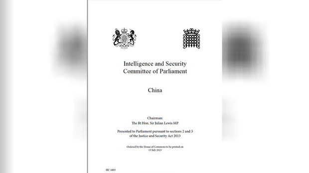
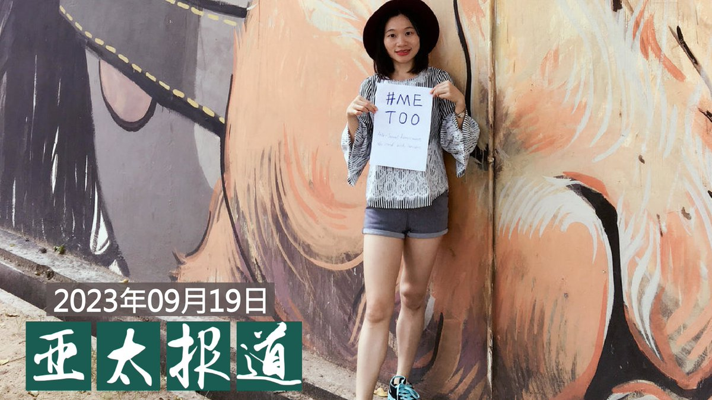
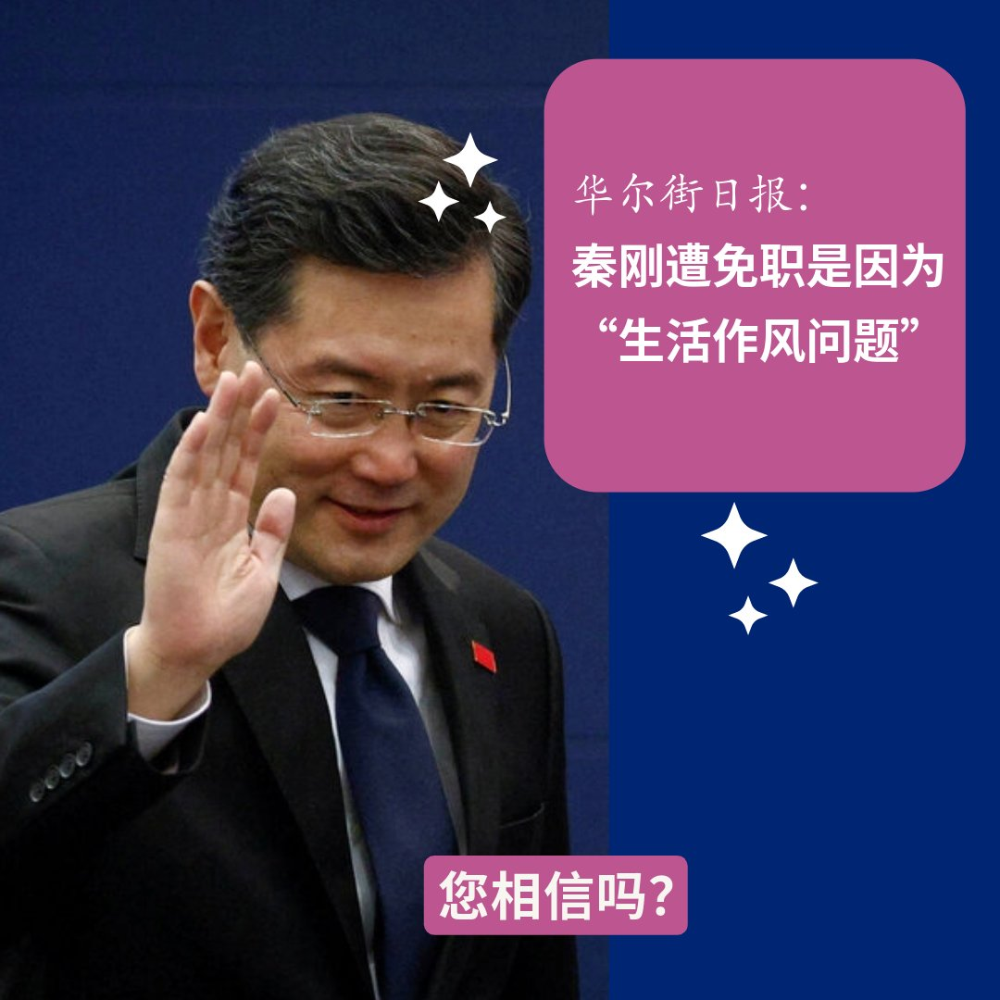
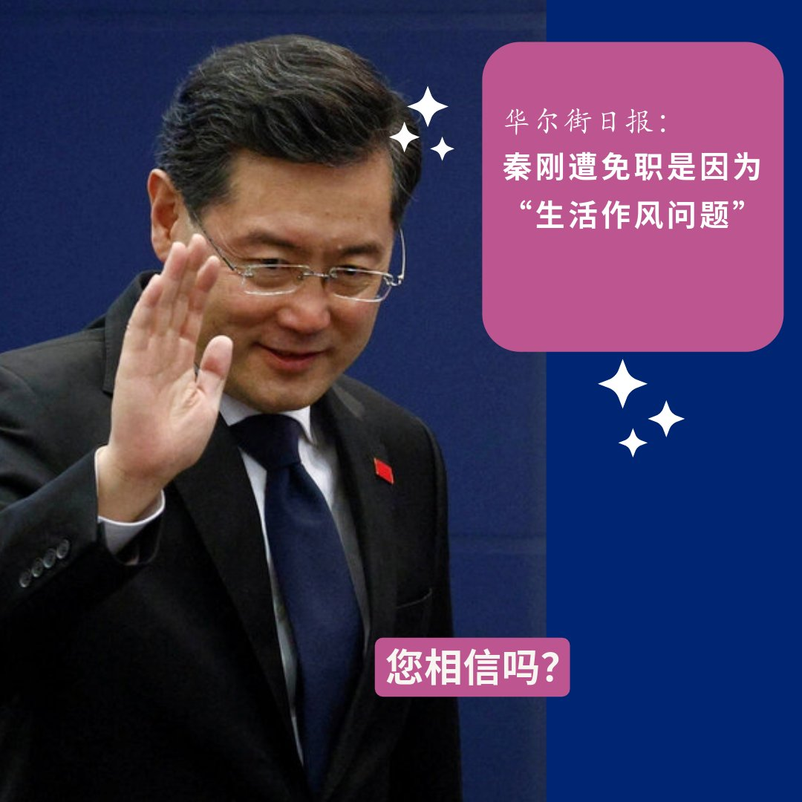

自由亚洲电台 北京时间 2023-09-20T04:20:32Z 1704229003056545941 美国总统拜登上任以来，连续批准 ＃对台军售 的举动引发中方不满。在本周二举行的众议院听证会上，多位美国官员强调，加强台湾自卫以及美国威慑能力是抵御中国入侵的核心战略。 https://t.co/m7Wt9Rb0j3   自由亚洲电台 北京时间 2023-09-20T05:30:01Z 1704246490267529279 ＃事实查核｜头盔上贴着“TOP GUN”，央视画面中的飞行员是 ＃解放军 吗？
 https://t.co/K722RP1yRz   自由亚洲电台 北京时间 2023-09-20T05:15:23Z 1704242810554024026 【“茶壶里的共谍风暴”】
据中央社19日发自伦敦的报道，“太阳报”（The Sun）援引知情人士报导，一名前英国驻中大使馆官员在离任返英前，获中方赠送道别礼：茶具一组。返英后，每当在家享用中式料理，就会拿出这组茶具使用。
某天，清洗中茶具不慎摔破。前驻中官员捡拾碎片，突然发现茶具内竟藏有录音设备．．．
https://t.co/t1uvnsQYiw   自由亚洲电台 北京时间 2023-09-20T07:29:35Z 1704276582150681075 【您怎么看】国民党总统候选人侯友宜在美国布鲁金斯研究所就两岸关系提出了“3D战略”，认为两岸关系的战略重点是Deterrence的吓阻、Dialogue的对话，还有De-escalating的降低紧张。您认为，他的“3D战略”对选举而言有何意义？能否让他在外交方面有所斩获？您分析，北京是否会因为“3D战略”而动怒？ https://t.co/aM00pNlHVX   自由亚洲电台 北京时间 2023-09-20T07:30:00Z 1704276687482159480 评论 | 王丹 ＠wangdan1989：#习近平 深陷“独裁者困境”
 https://t.co/ooh5yrl2XK   自由亚洲电台 北京时间 2023-09-20T04:19:35Z 1704228766443294904 近日，多位海外异议人士和学者齐聚一堂，以《中国是否到了历史节点：习政权加速崩解的可能与后果》为题召开了一场网络研讨会。
本台记者王允 @Jeff23Wang 有详细报道。 https://t.co/r5thifFwmp   自由亚洲电台 北京时间 2023-09-20T04:48:00Z 1704235917811261745 台湾能否加入联合国？最近成了加拿大政坛和媒体圈讨论的焦点之一。
多位加拿大参众议员公开在推特上发文支持 ＃台湾加入联合国。 https://t.co/h3UnfwYO35   自由亚洲电台 北京时间 2023-09-20T05:00:06Z 1704238962817323512 欢迎收听和订阅播客【亚太报道】 https://t.co/MjLNSvVMqc
【＃亚太报道（２０２３－９－１９）】
＃黄雪琴、＃王建兵 “煽颠”案举行庭前会议 / “＃广州区伯”不幸病逝 / 校园“＃预制菜”问题持续发酵 / 中国留美学生国内家人遭警方骚扰 / 台湾军方再次侦获55架次中方 ＃军机扰台 https://t.co/UOkFV7AAM4   自由亚洲电台 北京时间 2023-09-20T06:00:01Z 1704254042275557537 美国总统拜登19日在纽约举行的第78届联合国大会上发言时强调团结与全球合作。他再次重申，美国寻求负责任的管理美中之间的竞争，不寻求与中国脱钩，但将对侵略和恐吓行为进行回击。
 https://t.co/hvIP2IoBBP   自由亚洲电台 北京时间 2023-09-20T02:54:32Z 1704207361811042443 #中国人权律师团 特稿|中国人权律师团特稿 | 家园・乐土・理想国（二）
 https://t.co/hRZcZ6g132   自由亚洲电台 北京时间 2023-09-20T00:30:58Z 1704171232663392341 【#您怎么看？】华尔街日报：#秦刚 是因在美“生活作风问题”遭免职
知情人士称，上个月，包括部长和省级领导在内的中国高级官员听取了中共对秦刚的调查情况通报。他们被告知秦刚遭免职的正式原因是“#生活作风问题”。
调查发现秦刚有婚外情，并因此有一个在美国出生的孩子。
目前调查的重点是秦刚的婚外情或其他行为是否可能危及了中国的国家安全。
https://t.co/f3huVXkqBo   自由亚洲电台 北京时间 2023-09-20T00:56:08Z 1704177567245512813 中国继日前派出创纪录的103架 #军机扰台 后，台湾的国防部9月19日证实，当天再次侦获55架次中方军机，并有7艘次中方舰船在台海周边活动。美国参谋长联席会议主席 #米利（Mark Milley）则发出警告，中国若武力犯台将犯下严重战略错误。

 https://t.co/SIgSG6ngja   自由亚洲电台 北京时间 2023-09-20T01:42:46Z 1704189300366266732 定居澳洲的民运人士张晓刚 指出, 亲中的华人社交媒体群组上出现动员投票的讯息:“是一边倒地动员投'支持';很少人提到'反对'。但我觉得他们的原因,并不是因为真正地支持土著人的权益,而更是因为支持(推动公投的)工党──他们认为工党是亲共的, 所以就支持了。” https://t.co/tQFyH7V1q0   自由亚洲电台 北京时间 2023-09-20T02:13:44Z 1704197094263902240 兼任编舞的华裔Darren Lee曾在11 场百老汇剧目中演出。他​​说：“在威权与民主搏斗的当下，《#天安门》是一部勇敢而必要的作品。当中国（当局）试图从记忆中抹去 #天安门广场 上发生的一切时，这部作品能让世界历史产生转折。”
#六四 
 https://t.co/gVRgKpzWdP   自由亚洲电台 北京时间 2023-09-20T00:24:08Z 1704169511300018351 【#您怎么看？】华尔街日报：#秦刚 是因在美“生活作风问题”遭免职
知情人士称，上个月，包括部长和省级领导在内的中国高级官员听取了中共对秦刚的调查情况通报。秦刚曾在2021年7月至今年1月期间担任中国驻美国大使。这些高级官员被告知秦刚遭免职的正式原因是“生活作风问题”。
调查发现秦刚有婚外情，并因此有一个在美国出生的孩子。
目前调查的重点是秦刚的婚外情或其他行为是否可能危及了中国的国家安全。
详见 https://t.co/f3huVXkqBo   