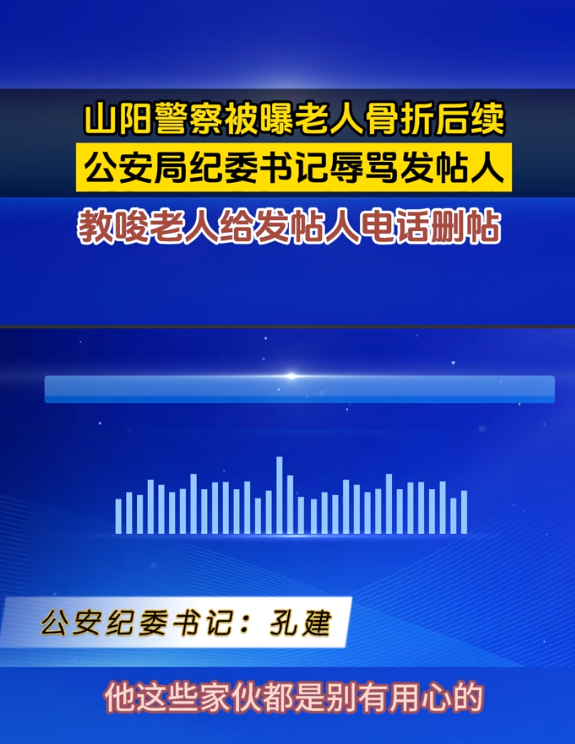
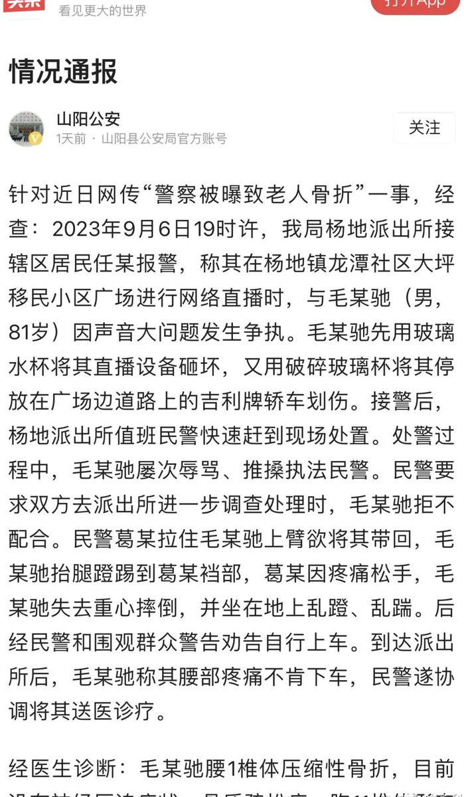
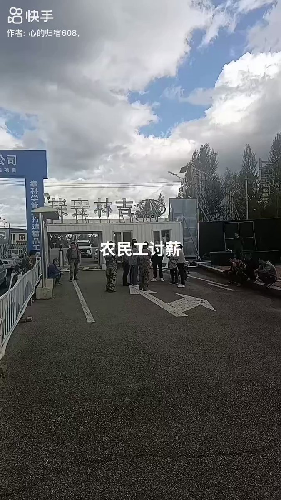
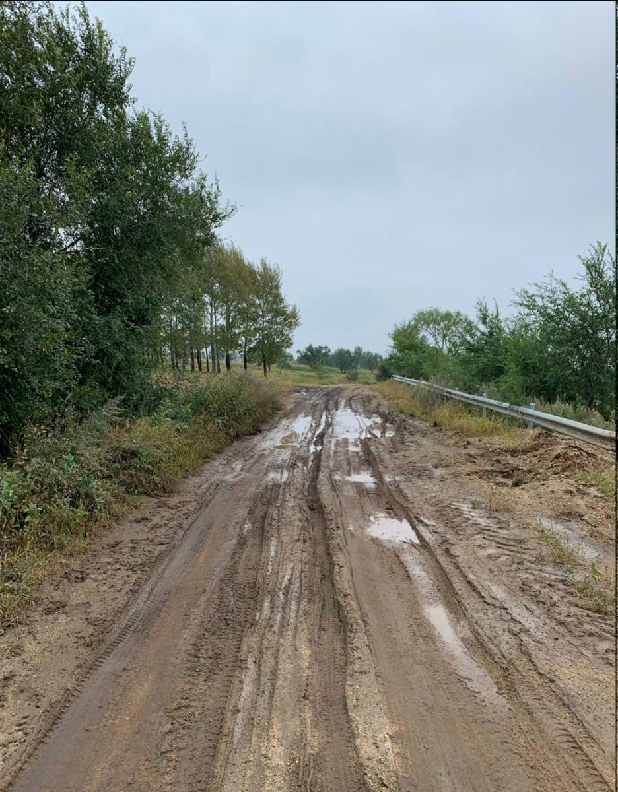
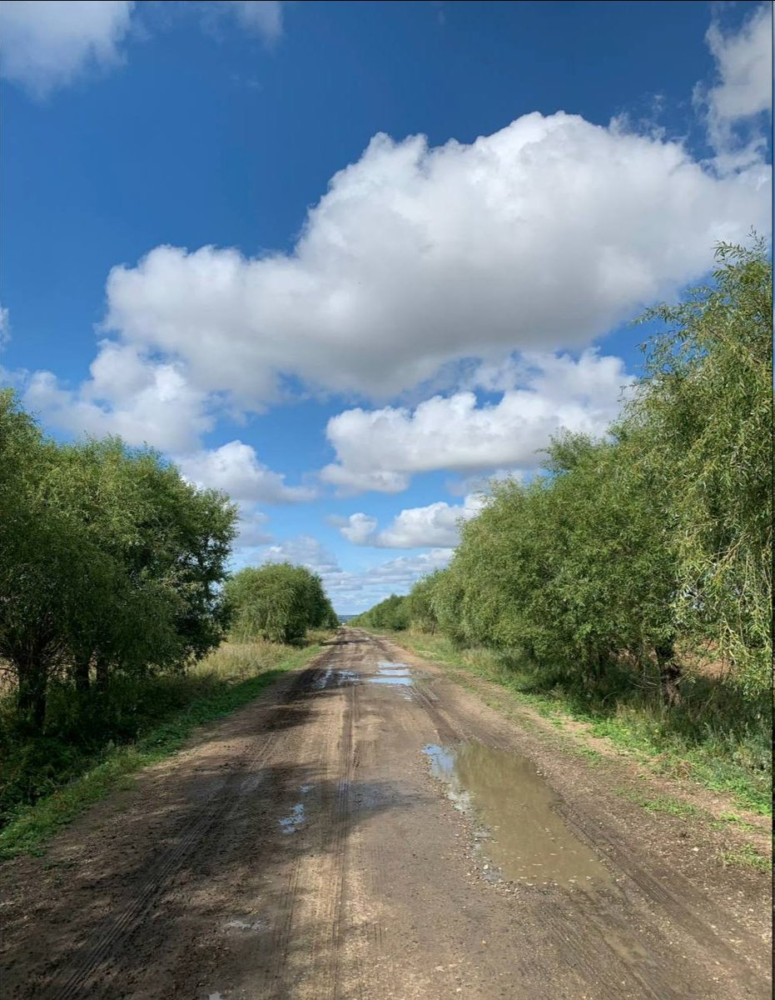
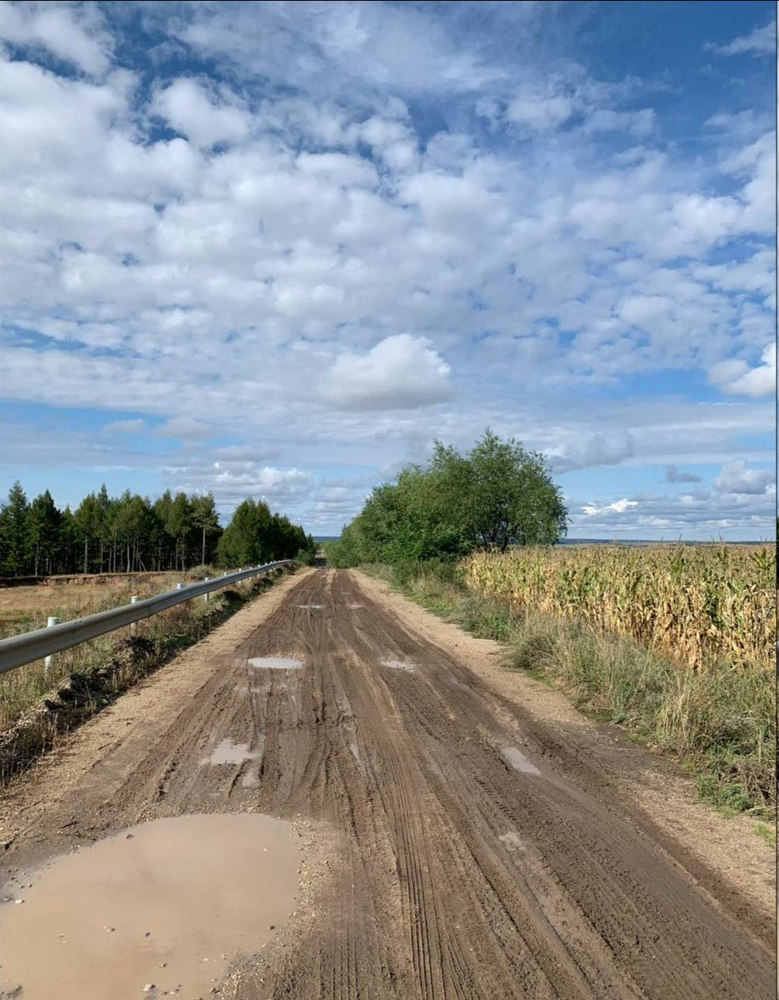
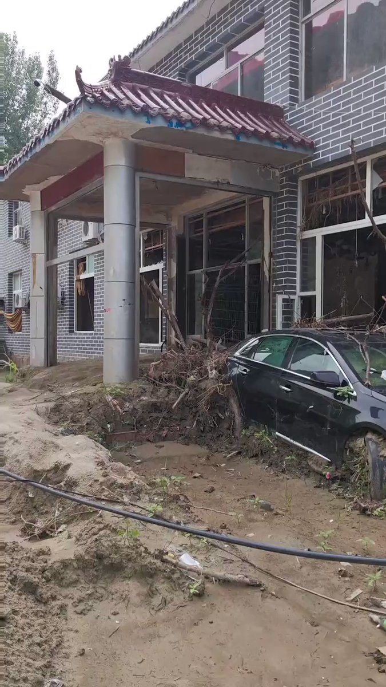
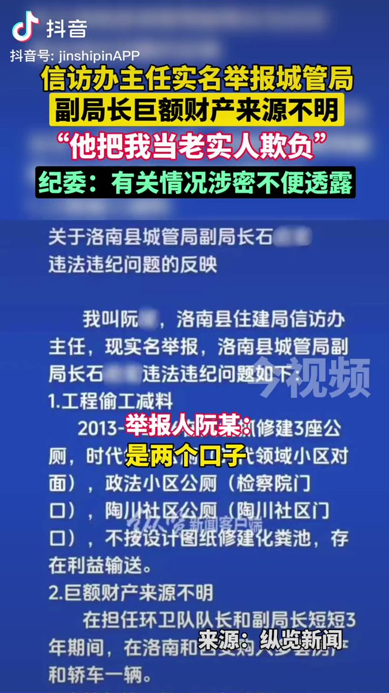

谁将十万横扫三江 北京时间 2023-09-20T23:07:34Z 1704512631099330918 陕西山阳警察被曝致老人骨折后续，公安局纪委书记辱骂发帖人，教唆老人给发帖人电话删帖 https://t.co/LdWveBvp1x   谁将十万横扫三江 北京时间 2023-09-20T23:14:50Z 1704514460050952225 胡某因女儿摔倒，衣服被手里的冰激凌弄脏，情绪失控殴打并用椅子砸向女儿，江先生和同事上前阻拦并将事发视频发布上网

事发后该女子多次来到餐厅称其不该把视频上网传播，并扬言要死在餐厅里。经调解，江先生向对方赔偿精神损失费及医药费1万元后，失去了他的工作

这种事如果发生在正常国家会如何？ https://t.co/9NvbDnEh8V   谁将十万横扫三江 北京时间 2023-09-20T15:04:00Z 1704390938402197668 RT @xiaojingcanxue: 对郑成月的一个纪念视频。 https://t.co/2qSGcXEblf   谁将十万横扫三江 北京时间 2023-09-20T18:53:57Z 1704448808317558935 吉林省白山市抚松县，一食药产业园建设项目拖欠工人工资，工人讨薪
时间：2023-09-19
地点：吉林省-白山市-抚松县-抚松工业园区南侧
行业：建筑业
承建公司：吉林安装集团股份有限公司
企业性质：民营企业
建设单位：吉林省参城投资有限公司
企业性质：国有企业
项目名称：吉林抚松工业园区食药纳米产业园项目
行动类型：其他
诉求：欠薪
参与人数：1-100
资料来源：
https://t.co/72btWw8u3k
https://t.co/jxQCTBqbuv
https://t.co/t0Kspkb0bC
https://t.co/kNsmKMsIoM
https://t.co/hNl47136xX

#劳工维权 
#讨薪

消息来源: https://t.co/0Eo3ZdLsAC   谁将十万横扫三江 北京时间 2023-09-20T19:22:10Z 1704455910272463129 Q1:＂一揽子化债方案”到底何时出台？
7.24政治局会议提出“一揽子化债方案”后，新一轮隐债摸排加速，平台－地方财政－省财政厅－财政部形成了”由下至上＂的层层汇报机制。原本计划9月中下旬正式出台，但部分省份仍在争取相关额度和部分细节尚需完善，十一前后大概率会公布，最晚应该拖不过十一之后的第一周。
Q2：一揽子化债方案和特殊再融资债的关系？
关系看，特殊再融资债作为地方债置换，是一揽子化债众多方案中的一种；范围看，一揽子化债方案针对全国，特殊再融资债针对的是短期流动性压力大的省份。
Q3：各省的化债方案出台了吗？
各省的化债方案是根据自己的实际情况来制定，启动时间不一，大部分省份是在7.24政治局会议之前就开始拟定，但目前都在等高层的"一揽子化债方案”出台后，再完善相关细节。比如，湖南省在8月底公布成为首个通过化债方案的省份，但具体细节没透露。
Q4:哪些省份获得了特殊再融资债额度？
12个省份中有11个基本确定：
天津：1500亿元基本确定，近两天在传1700亿元，尚待斟酌；
陕西：保底1000亿元，其中西咸110亿元，曲江也近100亿元；
广西：500亿元左右，主要在柳州；
云南：原计划是900亿元，其中昆明400亿元，但9月上旬，财政部新增2023年云南政府债务限额1182亿元，并提出加大转移支付力度后，特殊再融资债额度可能会有变化；
贵州：原计划是1300亿元，但在争取1700亿元，据传最终定在1680亿元；
河南：300亿元，全部给航空港（考虑河南部分区域非标和定融压力比较大，不排除有更大额度）；
湖北：600亿元，其中黄石100亿元，其余主要给部分地级市的建制县；
湖南：1000亿元，其中湘潭500亿元，株洲I、常德也会有一定额度；
重庆：2021年殊再融资债重庆获得500亿元的规模，踉辽宁省并列第一，其中沙坪坝128亿元；此次保底600亿元额度，甚至最多可能1000亿元，
沙坪坝80,大足42亿元；
吉林：650亿元左右，一半多给了长春，吉林市获得超100亿元，第三为松原市，大概为60亿元左右；
甘肃：2021年特殊再融资债甘肃省24亿元，本次据传50亿元，主要是兰州；
最后一个名额在山东和江苏的镇江（建制市）之间决定。
山东：政府、金融机构和平台三方口径均不一致，0额度、1000亿元、300亿元，机构认为0额度的可能性不大，几百亿元的额度应该是有的，淮坊将获得大部分；
江苏：如有的话，镇江是100亿元的额度，大概率没有，毕竟江苏在镇江前几年成为“网红”后在产业转型、城投整合、城投平台退出以及债务的管控等方面都走在化债前列。
Q5: 12个省份以外的省份就没有额度吗？
特殊再融资债的资金来源是2022年末地方政府债务的限额与余额的差值，理论最大空间是2.67万亿元，根据2022年下半年财政部对专项债”结  存限额按约70％比例由各省（区、市）留用，约 30％比例由中央收回用千各省（区、市）之间统筹调配”,具体比例今年会有所变化。因此，12个省外以外的额度主要来自千专项债的留存。
此外，还有—种声音说12+n,n指的是这次可能不止是12个省份，有可能会增加额外的省份，也有可能是根据明年的地方债的结存限额进一步作为特殊再融资债额度针对n进行再分配。
Q6：特殊再融资债是只针对隐债吗？
隐债和置换高成本的有息债务，尤其是一些非标和定融等产品的兑付，各省自行安排，有的省份可能会跟投资人商议提前兑付之前发行的成本高企的债券。
Q7: 本次债务的摸排，“应报尽报”还是针对2018年统计的隐债的一个剩余规模和进度？
刘昆部长曾在年初提到：十年化债用了1/2的时间却化解了不到1/3的债务，原先本次摸排是针对2018年隐债的摸排，但实际中各区域平台公司上报时存在瞒报和虚报的情形，但主要还是做到了“应报尽报＂。机构认为，本次是第四轮置换，中央这次化债的力度和决心很大，过期不候，既然要摸清债务，就应该“应报尽报”。
Q8：本轮化债会彻底扭转地方政府的债务压力问题吗？
希望很大。化债完成情况取决千化债能力和意愿。能力不足下，中央通过“—揽子化债方案”来统筹，但意愿是主观能动性，更确切说是责任问题。中央己多次在不同场合提到省政府要承担起化债的主体责任。从去年的9月到今年的2月，短短不到半年内，从国务院、财政部和银保监会连续“点“山东可看出山东省政府在债务统筹和化债方面需要更加的积极主动。据传本次化债的主体责任压实到省级政府层面，化债成效踉zz前途挂钩，本轮化债从上到下都极其重视。
Q9:城投风险和金融机构风险的转嫁问题？
化解了城投风险，增加了金融机构尤其是银行端的风险，这是高层不愿看到的，也不符合常识原理。而且近年银行端的压力持续增加，2021、2022、2023年上半年国内银行利息差分别为2.08%、
1.91％和1.74%，银行利息差的下降考验其盈利和运营能力，且银行有自己的风险监管指标。因此本轮化债，5+2银行是化债主力，5指的是中农工建交，2指的是国开行和农发行。今年以来，各大学者针对地方政府债务的化解都提到了中央加杠杆，概率不大，地方政府加显性杠杆是主选。
Q10：本次第四轮化债是否是为十年化债进展缓慢的解压？
第四轮化债是解决十年化债提出以来，2020-2022年三年疫情和房地产景气度低迷造成地方财力承压下的部分省份的短期流动性压力问题，并通过此举实现“以新换旧、以长换短、以低换高”，实现“以时间换空间”。
考虑到各地方中有很多基建等纯公益性项目的资金是各大行20年的长期贷款，而这部分债务涉及到隐债。因此，2028年全国隐债大概率不可能实现清零的目标，而是将隐债控制在合理的范围内是比较务实的目标。
Q11:3899名单是哪个部门口径的名单？
2018年之前银保监会和财政部定期披露城投平台名单，但之后不再更新。本次名单主要以财政部口径为主，但范围更大，据传已经发给金监局、央行和证监会，未来可通过征信系统和主要国有的授信行进行查看，目前这种方式仍在论证中。
a12:3899名单的企业只能借新还旧？
名单制是真的。两个关键词“3899”和“借新还旧”,
(1) 目前现有的任何口径统计出来的存续债城投都不超过3500家，即使加上类城投的也不会超过3899, 因此，3899名单不止针对千存续债城投，而是包括了之前发过债现在没有存续债、甚至是之前都没有发过债的城投；至千3899这个数字的准确性就不用太纠结，更关注这个名单里都有哪些企业；
(2) 现有的有存续债但资质很差的城投也不在这个名单里面；
(3)进入名单的，会借新还旧，这个旧指的是有息债务，而不仅仅是债券，但有一定要求，银行间只能借新偿还银行间的债券，而交易所相对比较开放，可以跨发行场所偿还。
Q13：名单外的平台风险是不是更大？
不—定，需辩证看待。如果是已经完成市场化转型、实现较好的盈利和现金流的平台，风险可控，这—类平台已经脱离政府性融资平台的范围，可看作产业类公司；如果没有完成市场化转型，未来的资金来源将主要依赖自有资金、政府和金融机构的支持，但鉴千资质比较差，支持的力度不得而知，逼迫着进行市场化转型。
Q14：以后还会有新平台出来发债吗？
会。新平台可以理解为两类，一类是之前发过债但现在没有存续债，这种可能会采取“大瓶套小瓶”
（即对区域内平台进行整合，由大平台出来发债）方式发债融资；另—类是“新瓶套旧瓶＂，即新成立一家新的平台，把目前有存续债平台的资产和债务套进来，同时注入新的区域内优质资产，进行发债融资。两种方式都是达到降低融资成本的目的。
Q15：只能借新还旧下，平台自筹的那部分资金来源？
大部分是银行贷款，但地方银行更希望以买债的形式进行资金授信支持，而不是以信贷形式，因为前者相较千后者，对银行的风控更安全。
Q16：未来基建和土地开发等纯公益性业务的资金来源和化债的矛盾怎么看？
基建等公益性业务的债务以前主要是由平台来自筹，未来由政府财力返还形式进行偿还，但围于近年财力承压，回款周期拖长，但基建等公益性项目托底经济持续进行，化债化解的主要就是这类之前平台替政府承担的隐性债务。而未来公益性业务的资金主要是由政府发行专项债的形式承担，或者说债务人由平台转移到了地方政府，将隐债显性化，政府债务杠杆将加重。
Q17:城投平台越来越少吗？
必然事件，开前门堵后门下，平台整合和市场化转型接下来会加速，近两年江浙等平台整合力度较大的区域经常会公布多家平台退出政府融资平台的名单也能看出端倪。
Q18：城投有息债务达到顶峰了？
可以这么理解。截至2022年末，我国地方政府债务余额35万亿元，考虑非官方统计的城投债近60万亿元，我国地方债务总量接近百万亿元，按融资成本4％估算，每天的利息支出逾100亿元，部分省份固千自身财力化债工作推进异常艰难，这也是中央下定决心进行化债的原因。这次特殊再融资债会化解完一批，政府债会承担之前城投承担的融资职能，城投有息债务未来下滑是趋势。
Q19：怎么理解央行提出的SPV工具？
这是央行首次针对城投提出SPV工具，主要是针对“—揽子化债方案”后央行提出的化债配套方案，也是—种劣后方案。资金流动性依赖千央行，由主要银行参与，通过应急流动性金融工具给地方城投提供流动性，利率较低、期限较长。历史上也只是针对疫情爆发后针对普惠小微企业提供过贷款延期支持工具和信用贷款支持计划两个工具，合计4400亿元。本次SPV具体方案和额度尚未确定，作为一种劣后方案，预计细节待一揽子方案确定后方能明确。
Q20: "一揽子化债方案“下，“城投信仰“能维持多久？
方案下的清绪面和“资产荒“下金融机构盈利的压力，短期内下沉清绪较为明显，但通过第二次和第三次的置换债看，情绪面的影晌不持久，终究要回归到基本面。考虑到经济增长目标的诉求，出口、消费、房地产投资和制造业投资都不温不火下，基建投资依然是抓手，短期内“城投信仰“依然在。接下来城投转型和区域化债没有了退路，产业和金融都有违约史，若化债不及预期和转型不够成功，城投“信仰”为什么不能打破？—切交给债券市场来判断吧。   谁将十万横扫三江 北京时间 2023-09-20T20:01:35Z 1704465827167379928 黑龙江某地，村村通 https://t.co/NeXJIc0MWL   谁将十万横扫三江 北京时间 2023-09-20T20:10:36Z 1704468097086918664 9月12早上8点，长沙比亚迪工厂，22岁男子在宿舍猝死

9月17日父母接受不了打击要跳楼

9月20日家属来比亚迪工厂门口维权，整天一言不发没有表情不吃不喝 https://t.co/JA6UUdzGVQ   谁将十万横扫三江 北京时间 2023-09-20T20:26:25Z 1704472079540904001 北京房山十渡现状
如果这是美国飞地，粉红一定会反过来嘲讽体制弊病了 https://t.co/KWFK1GZnyW   谁将十万横扫三江 北京时间 2023-09-20T20:31:43Z 1704473411572175064 信访办主任相比普通人的优势是什么？是不会被截访，或者说自己有反截访的经验。就是这样的人，都走不通制度的路子，只能以身份搞反差，媒体问政 https://t.co/1P33ER4055   谁将十万横扫三江 北京时间 2023-09-20T15:40:56Z 1704400233353085189 RT @CDTChinese: 自称“南海圣人”的康有为当年没出国时，最喜欢谴责白人种族歧视，主张全世界人种应该无论黑白黄，都要实现种族平等，平权和通婚......可后来慈禧太后把他赶去了海外，一在美国下船，看到码头上搬货的黑人，“康圣人”就震惊了——黑人怎么这么黑？这么丑？于…   谁将十万横扫三江 北京时间 2023-09-20T14:45:09Z 1704386194900177284 9月19日晚信阳市及罗山县特大暴雨 https://t.co/HVs7XNu78L   谁将十万横扫三江 北京时间 2023-09-20T14:52:29Z 1704388039928373562 RT @xiaojingcanxue: 女司机一番话在中文网上火了：所谓“穷人的孩子早当家”，实际上只是会做家务而已。在人情世故上，是远远不及那些家境优越的孩子的，我是到30岁了才开始明白一点点。很多穷人家庭出来的女孩子可能别人对她一点点好，就做出错误的选择，因为以前从来没有过…   谁将十万横扫三江 北京时间 2023-09-20T15:41:46Z 1704400442871128333 RT @tankman2002: 今天印度政府派出特工公然在加拿大暗杀锡克教领袖的事，真的是让人对三哥的底线震惊。一个所谓的民主国家公然在另一个民主国家执行暗杀，这之前是俄国老毛子的作风。锡克教并不是邪教，但是因为教义和印度教不对付，而且一直有独立倾向，深为印度政府忌惮。但真没…   谁将十万横扫三江 北京时间 2023-09-20T11:33:39Z 1704338003832045717 RT @torontobigface: 天津政府最近传出非常多离谱得事情
比如公交车司机停发工资，找寺庙借钱
其实这样的情况，在中国并不稀奇，现在很多城市都这样
但天津作为中国GDP总量排名第11的城市，出现这样的问题让人很意外
今天说说为什么暴雷的会是天津？其他的城市安全吗？…   谁将十万横扫三江 北京时间 2023-09-20T09:17:38Z 1704303773802508664 【洪水 - 抗议 - 利比亚】应对气候危机的正确姿势 - 在利比亚德尔纳，数以千计的居民正在举行示威游行，要求议会下台。
两座维护不善的水坝决堤后，灾难性的洪水肆虐该市，造成 11,300 人死亡，10,000 人失踪。 https://t.co/K23lTJ5j9Y   谁将十万横扫三江 北京时间 2023-09-20T08:44:49Z 1704295512101519396 RT @jakobsonradical: 据网友分享，近年来，中国法院裁判文书的网上公开率断崖式下跌。上一年度，行政案件一审裁判文书网上公开率仅0.06%，已经逐渐走向“内部化”。 https://t.co/ajbEAbT7sq   谁将十万横扫三江 北京时间 2023-09-20T02:24:00Z 1704199677359370631 9月19日下午4点，江苏宿迁南蔡乡镇突发龙卷风强对流天气，造成部分房屋受损，有人死亡 https://t.co/IdYFEpyxmV   谁将十万横扫三江 北京时间 2023-09-20T03:17:00Z 1704213015208546714 9月19日郑州，我老公高铁职工一个月上了27天班，晚上干活白天还要加班，7月26号上班时突发脑梗死，现在还有ICU抢救，两个月了单位啥说法都没有，来了几次见不到段长，昨天见到啥也没说，让我们在会议室等了两天，我婆婆快活不下去了 https://t.co/sAzgUFhNkX   谁将十万横扫三江 北京时间 2023-09-20T04:18:00Z 1704228366310637630 9月19日苏州张家港，娃儿在学校跳楼死亡（消息被封锁），娃儿爹撒钱。据说是娃儿跳楼的赔偿金，具体不详 https://t.co/vnexFAvQaj   谁将十万横扫三江 北京时间 2023-09-20T02:04:59Z 1704194892690510257 “大块人心” https://t.co/GE2j8U393C   谁将十万横扫三江 北京时间 2023-09-20T00:04:01Z 1704164450083999904 陕西省咸阳市，一房产项目拖欠工人工资，多次讨要无果后工人联系媒体
时间：2023-09-19
介绍：
【（节选自原微博）咸阳市高新锦业壹号项目，拖欠农民工工资36万多，为何工友讨薪3年之久！
     近日四川工友龙先生(电话18384857788）求助，他们2018年10月份开始到咸阳市高新锦业壹号项目干钢筋工，2020年7月份退场，至今还拖欠他们工资36万多元没有结清，多次讨要无果。
    工友说他们干的S1区、S2区，1、2号楼及部分车库钢筋工。劳务单位：陕西中彦建筑工程有限公司。总承包单位：陕西建工第六建设集团有限公司。
    笔者从咸阳市住房和城乡建设局了解到：锦业壹号小区建设单位是咸阳高新锦业房地产有限公司，目前小区完成房屋交付工作，部分业主已经入住。对于拖欠农民工工资一事，需要到陕建六建集团公司或者劳务公司去了解情况。 】
地点：陕西省-咸阳市-秦都区-高新区永昌路与咸平路交叉口西南角
行业：建筑业/住宅
建设单位：咸阳高新锦业房地产有限公司
企业性质：国有企业
劳务单位：陕西中彦建筑工程有限公司
承包单位：陕西建工第六建设集团有限公司
项目名称：高新·锦业壹号项目
行动类型：联系媒体
诉求：欠薪
参与人数：1-100
资料来源：
https://t.co/aFgAGTgeda
https://t.co/hJusovr0w2

#欠薪事件
#陕西
#1至100   谁将十万横扫三江 北京时间 2023-09-20T00:15:33Z 1704167353569915263 辽宁省大连市，一房产项目装修工程拖欠工人工资，工人讨薪
时间：2023-09-13
介绍：
【（原视频介绍）这是在中海海港城三期干活的工人，装修公司是江苏江中集团，两年了，工资一分也没有，再次来中海地产】
地点：辽宁省-大连市-中山区-长江路与职工街交汇处北侧（中海海港城-B区）
行业：建筑业/室内装修
公司名称：江苏江中集团有限公司
企业性质：民营企业
项目名称：中海海港城三期
行动类型：其他
诉求：欠薪
参与人数：1-100
资料来源：
https://t.co/SLmLYGVaJA
https://t.co/AsTXpBC4PB

消息来源: https://t.co/EEroo8Gdg5

#劳工维权 #讨薪   