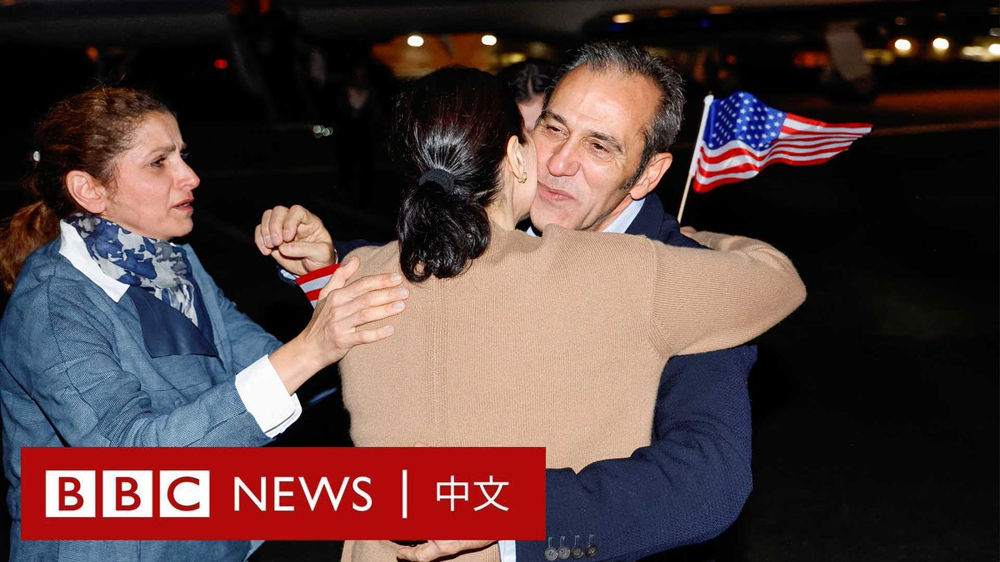
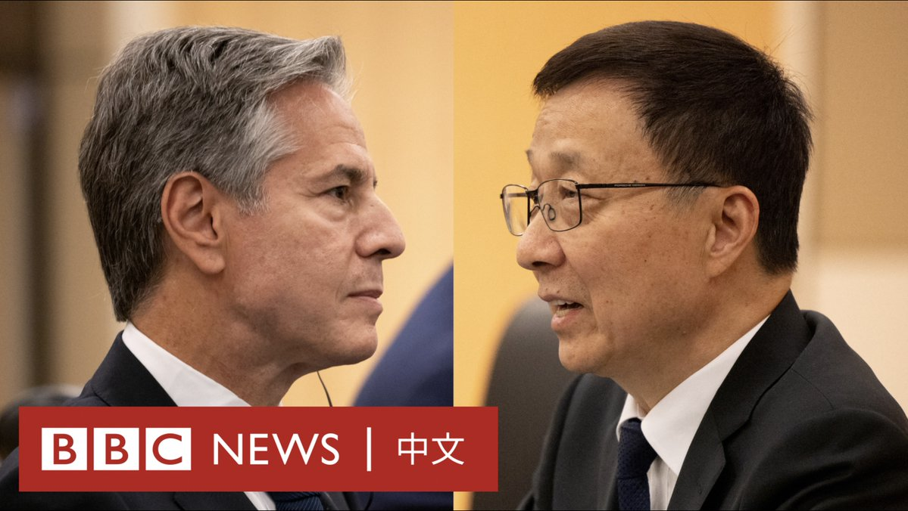
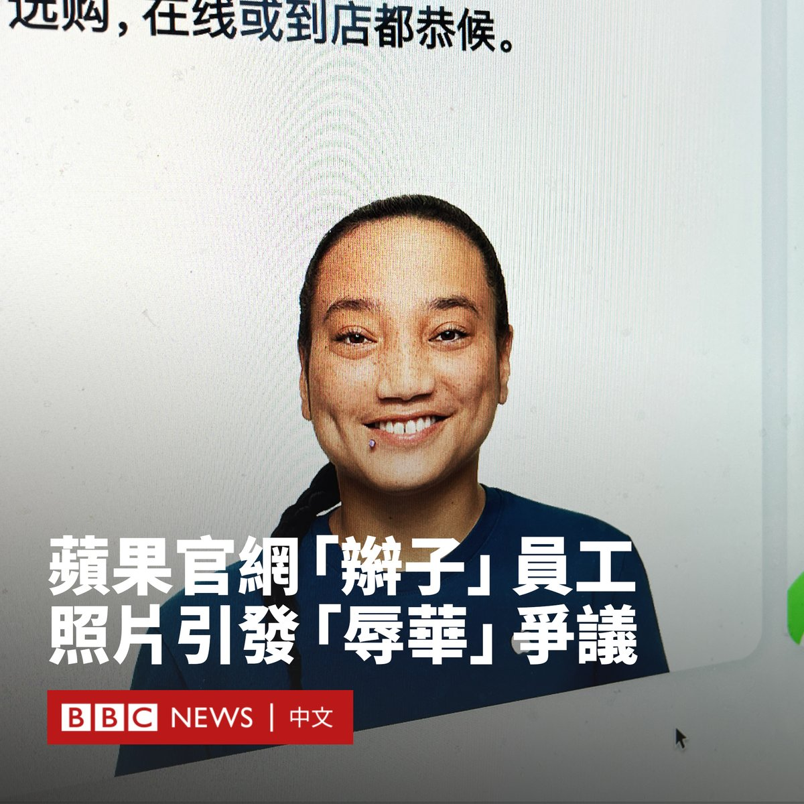
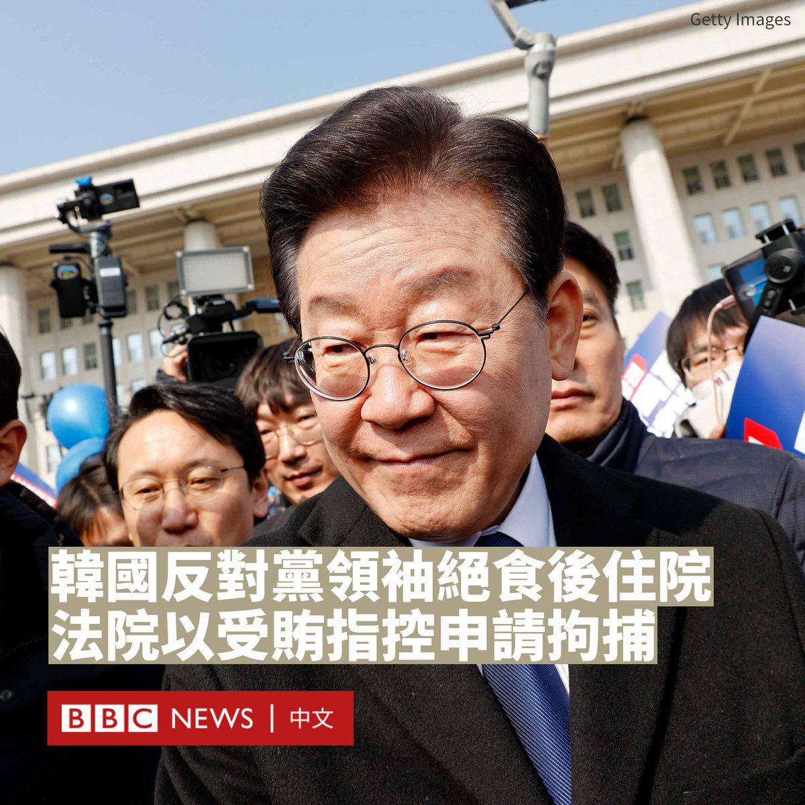
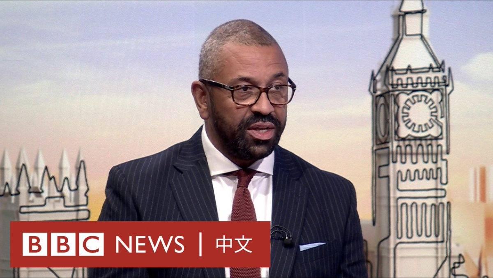
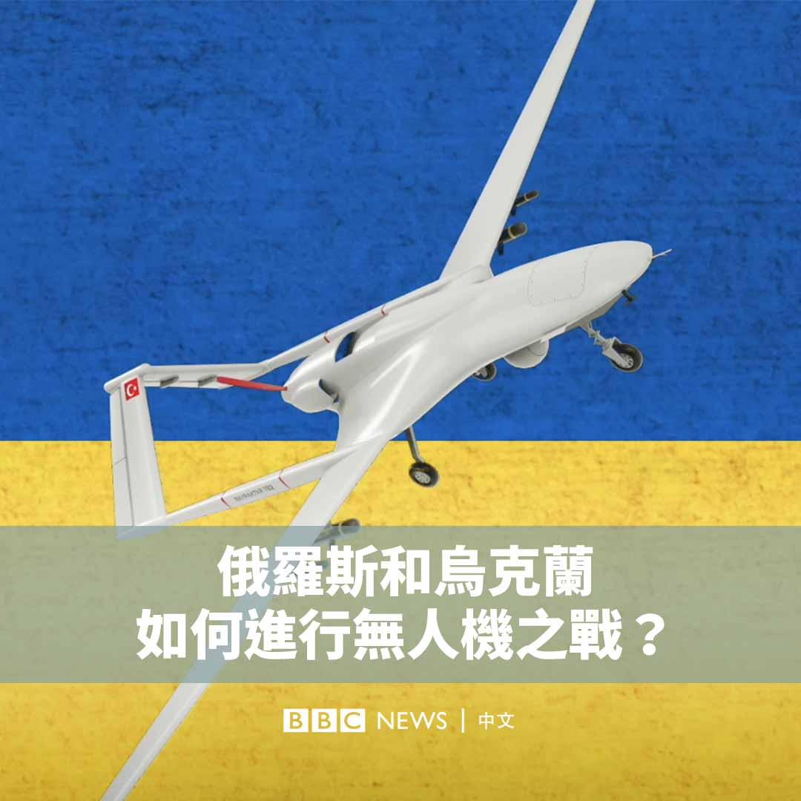

D英国广播公司BBC 北京时间 2023-09-19T21:54:22Z 1704131823939584028 美国和伊朗执行换囚和资产解冻协议，五名被伊朗关押的美国公民获释，踏上回家的旅途。

BBC首席国际事务记者杜塞特（Lyse Doucet）报导说，这是一个非同寻常的时刻。经过近一年的复杂谈判，没有外交关系的伊朗和美国进行了罕见的合作。 https://t.co/MRe7fWQsml   D英国广播公司BBC 北京时间 2023-09-19T19:44:01Z 1704099020002763181 美国国务卿布林肯与中国国家副主席韩正在纽约出席联合国大会期间举行会晤。
 
中美两国近期正在举行一系列会谈，以缓和两国的紧张关系。分析人士认为，此次会谈可能是为今年晚些时候习近平与拜登的会面铺路，但两国很难再回到此前的友好关系。 https://t.co/tDaaFXFwNS   D英国广播公司BBC 北京时间 2023-09-19T17:40:02Z 1704067817883017336 当伊朗在韩国银行中被冻结的60亿美元资金解冻后，伊朗释放了五名被监禁多年并被广泛视为人质的美国公民，这四名男子和一名女子已成功踏上归国的旅途。https://t.co/vVnBUlEMMc   D英国广播公司BBC 北京时间 2023-09-19T16:11:18Z 1704045489174487127 苹果（Apple）网站上的一张员工照片在中国互联网上掀起巨大争议，一名留有长辫子的客服人员照片被一些中国网民批评涉嫌“辱华”。

这张陷入争议的照片位于苹果旗下手表Apple Watch的导购页面。一名看似亚裔长相的苹果员工身穿蓝色、带有苹果标志的T恤、露出笑容，而其辫子则垂于肩上。

照片上方的简介没有透露其身份和性别信息，只是称其是“Specialist专家”，在苹果的体系中类似客户经理。

这张照片引发不满中国网民的不满。他们认为，这是苹果公司的“小动作”，意在用满清时期的男子造型丑化中国人。一名网友评论道：“辫子咱们都剪掉100年了，还来羞辱我们，居心何在。”

一段在视频网站“哔哩哔哩”上有超过18万次观看的影片将其形容为“中国人专属导购专家”，强调“辫子、麻子、蒜头鼻、宽眼距”都是西方对中国的刻板印象。

实际上，这张照片并非仅被用于苹果的中国网站。苹果的国际版网站和其他语言版本也使用了相同的照片。

多家中国媒体还报道称，这名苹果员工实际上是美国的一名印第安人。官方媒体《环球时报》则引述知情人士称其是加州的一名女员工。

苹果公司没有回应BBC的置评请求。

尽管如此，一些以民族主义著称的博主和中国官方媒体记者仍呼吁苹果撤换这张照片。中国环球电视网（CGTN）记者韩鹏写道：“苹果把一个印第安员工挂这给中国人看，正中了西方人挑衅我们的‘眯眯眼’‘留辫子’等辱华符号。”

也有不少网民对此不以为然，认为动辄“上纲上线”才是真正的自卑。还有网友问道：“除了中日韩，蒙古、越南、菲律宾还有拉丁美洲都有黄种人，难道她们都不能留辫子了吗？”

这次针对苹果的愤怒正值中国和美国科技战加剧之际。不久前，华为新推出的Mate 60手机被中国媒体和网民称赞是对于美国科技制裁的胜利，同时传出中国越来越多的政府机构和国企都开始禁止使用iPhone。   D英国广播公司BBC 北京时间 2023-09-19T13:55:55Z 1704011415420621265 韩国总统尹锡悦周二（9月19日）批准了法院针对反对派领导人李在明提出的拘捕请求书。

最大在野党、共同民主党党首李在明周一因绝食抗议政府多项政策而被送医治疗，但与此同时检察官以腐败指控提出对他的逮捕令。

李在明于8月31日开始绝食抗议，理由包括政府对经济的不当管理、媒体自由受到威胁以及不反对福岛核废水排放等。

共同民主党表示，他因脱水和晕厥在周一上午从首尔的国会被送医。

执政党人民力量党党首金起炫敦促李在明停止绝食，表示已准备好与他就政策问题进行对话。

在李在明被送医的数小时后，检方表示已对他发出逮捕令。

李在明被控在担任城南市长期间，因滥用职权导致城南城市开发公社蒙受200亿韩元（1500万美元）的损失。

他还被指收受一家民营企业的贿赂。该企业曾向朝鲜汇款800万美元，其中300万被指是李在明访朝的费用。

李在明否认有任何不当行为，称这些指控是“虚构的”和“政治阴谋”。

韩联社报道称，由于李在明是现任国会议员，任内享有未经国会同意不受拘留的特权。他曾在2月被提请批捕，但因国会否决而被驳回。

据报道，此次拘捕的请求书也将报送国会。国会可能在周四（9月21日）对是否采取拘捕行动进行表决。   D英国广播公司BBC 北京时间 2023-09-19T11:13:56Z 1703970654184435952 英国外交大臣詹姆斯·克莱弗利（James Cleverly）周日（9月17日）参加BBC节目录制时被问及是否在出访北京期间向中方提出有关议会间谍的指控，他多次回应称：“不对情报和安全相关问题发表评论”。 https://t.co/5sZVJ4rZUH   D英国广播公司BBC 北京时间 2023-09-19T09:32:12Z 1703945049212616863 自俄罗斯入侵乌克兰以来，无人机的技术和战术都发生了很大变化。两方通过无人机进行袭击的事件越来越多。什么类型的无人机被运用于战场？双方的目标是什么？ https://t.co/z4rPdK6qXM   