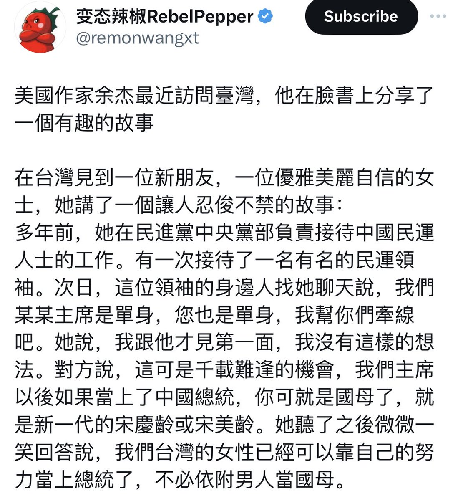
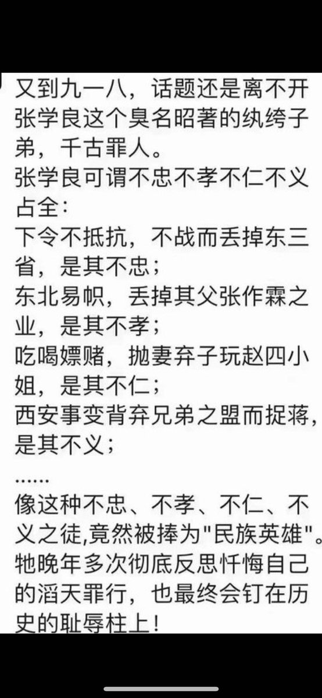
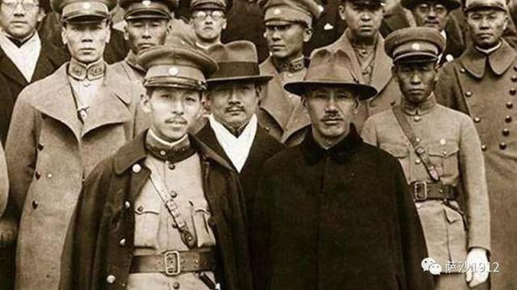

Petrichor 北京时间 2023-09-19T10:57:03Z 1703966405685653915 特想知道这位“有名”的民运人士是谁？他真的从事着民主运动吗？ https://t.co/8k7NCrnN26   Petrichor 北京时间 2023-09-19T11:21:02Z 1703972437765833106 中国官员的文字游戏：保护性拆除、休假式治疗、嫖宿幼女、轻度型追尾、幻想型自由、试探性自杀、合约式宰客、政策性调控、挽救性枪毙、正确性错误、保护性销毁、礼节性受贿、政策性提价、钓鱼式执法、确认性选举、灵活就业、临时性强奸、隐蔽收入……等等。

鲁迅说中国是一个“文字的游戏国”，他说：“有明说要做，其实不做的；有明说不做，其实要做的；有明说做这样，其实做那样的；有其实自己要这么做，倒说别人要这么做的；有一声不响，而其实倒做了的。然而也有说这样，竟这样的。难就在这地方。”

在这样一个语境下面，如果你真的相信别人说的话，那就是笨，那就是不合时宜。问题是谁都知道在说谎，谁都知道是假的，但是所有人都愿意做出相信谎言的样子。最高统治者每天都在说谎，时时刻刻在欺骗，我也知道你骗我，但是我说对对对，相信你。这就是游戏规则。如果有人破坏游戏规则，说句真话，大家会觉得这个人不懂规矩，这个人太不成熟了，太幼稚了，然后大家一起把他灭掉。   Petrichor 北京时间 2023-09-19T09:48:49Z 1703949231935865097 張學良1936年12月12日發動「西安事變」，在扣押蔣介石期間，張學良偷看蔣介石的隨身日記後，深感羞愧汗顏。據說，看了蔣介石日記後，張學良對自己發動叛變悔恨交加，更多次在蔣介石面前痛哭。蔣介石在日記中，每天都以「雪恥」警示自己，並制定長期細緻的抗日規劃，其中包括修訂陸軍法典，購買先進武器、擴充陸軍空軍、建立兵工廠，更計劃用六年時間，在德國支持下，以德式裝備，伺機收復張學良的老家—東北三省，有了強大德國的支持，也讓張學良看到了打回老家去的希望。   Petrichor 北京时间 2023-09-19T07:00:29Z 1703906868597338180 如果单纯靠钱砸，用利益而不是意识形态吸引过来大批留学生，你觉得这一计划能长久吗？上世纪50-70年代想，苏联也对非洲留学生给以高额补贴，还有苏联女学生做学伴。但是最后非洲留学生计划还是失败了。苏联当时的目的就是为了加强国际话语权，让这帮非洲国家成为自己的小弟，因为他们在联合国也有投票权。

如果苏联的确有高科技和先进的理论，外国留学生自然会来留学。靠钞能力吸引过来的那帮人，多数也只是街溜子，只会激化和本国学生的矛盾。别看当时留学生对苏联一脸恭敬，一旦给他们断了奶粉，他们反目成仇。苏联的教训，邻国的200斤没有吸取。   