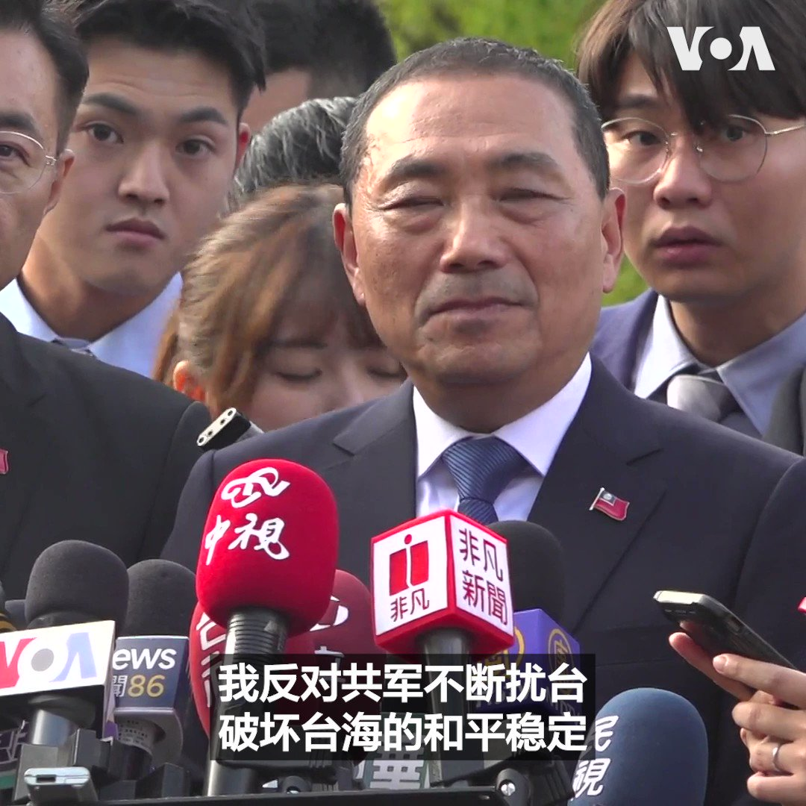
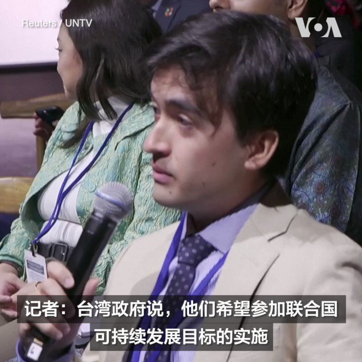

美国之音中文网 北京时间 2023-09-19T03:15:05Z 1703850147833098355 国民党总统参选人侯友宜9月18日在华盛顿提出“3D战略”作为台湾维护两岸和平的政策。侯友宜说，3D指的是“吓阻、对话和降低冲突”。对于中共军机扰台次数日益增长，侯友宜呼吁北京当局停止这类行为，“因为这只会徒增台湾人民的反感，对两岸的和平没有助力”。 https://t.co/qpnwoQGx2x   美国之音中文网 北京时间 2023-09-19T04:01:09Z 1703861738687606908 拜登将与太平洋岛国举行第二次峰会 https://t.co/8xQPLHwVsi   美国之音中文网 北京时间 2023-09-19T04:17:10Z 1703865770466566274 中国与欧盟在新的紧张关系中就人工智能与跨界数据流动举行会谈 https://t.co/XpW2FiFCTu   美国之音中文网 北京时间 2023-09-19T01:31:12Z 1703824003604050383 60亿美元伊朗资金被解冻后，五名被关押的美国公民飞离伊朗 https://t.co/oU5vB7S68V   美国之音中文网 北京时间 2023-09-19T02:08:05Z 1703833286278017381 联合国大会第78届会议一般性辩论将于9月19日在纽约联合国总部拉开帷幕。一位联合国高级官员日前在被问及台湾参与联合国事务时表示，将任何一方排除在联合国系统外都不利于实现全球发展目标。 不过，也有联合国官员随后补充说，联合国持续奉行“一个中国”政策。 https://t.co/nEGJTyx504   