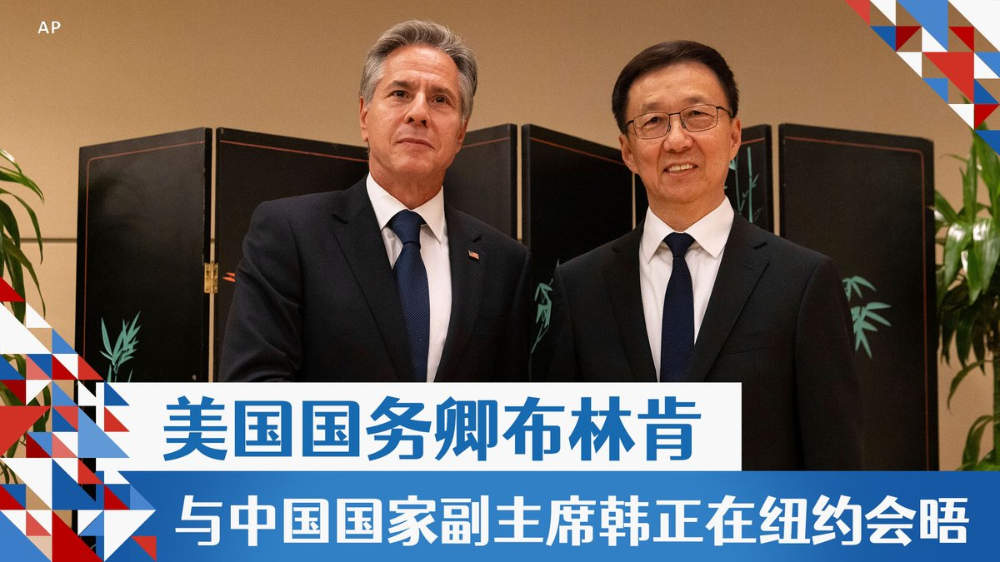
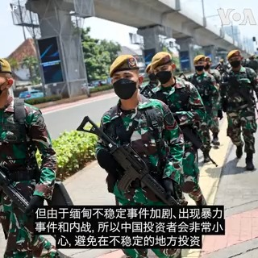

美国之音中文网 北京时间 2023-09-19T07:39:16Z 1703916628952375385 一年一度的联合国大会本周拉开帷幕。拜登总统19日将在联大发言，中国领导人习近平不出席，而是派国家副主席韩正参加本年度的联大一般性辩论。联合国大会开什么？此次大会将讨论哪些重要议题？四分钟短片了解。 https://t.co/6drNACKEtw   美国之音中文网 北京时间 2023-09-19T08:14:04Z 1703925387989066014 利比亚洪灾幸存者亲述：我们失去了挚爱 https://t.co/yZpYlI5B7T   美国之音中文网 北京时间 2023-09-19T08:29:10Z 1703929188842192897 王毅先会沙利文再赴莫斯科 北京在美俄之间找平衡 https://t.co/FZCUVzs3IK   美国之音中文网 北京时间 2023-09-19T08:58:06Z 1703936467603763523 当局在南卡州找到失踪F-35碎片散落区,美海军陆战队宣布暂停行动两天以强化飞安 https://t.co/KoApPBvqr3   美国之音中文网 北京时间 2023-09-19T08:58:09Z 1703936481809834288 美伊换囚，被中国拘押的美国公民家人敦促政府与北京换囚 https://t.co/ptOEoPeqtH   美国之音中文网 北京时间 2023-09-19T09:00:01Z 1703936951567733204 一键解锁 #美国热搜 榜1、经济崩盘习就要打台湾？习近平需要发动对台战争来转移国内矛盾吗？2、中美间谍战全球升级，拜登想探查习近平的脑回路；3、新时代岳母刺字：尽力出国4、国家反诈APP，其实就是国家防造反APP5、杭州亚运会彩排6、香港中文大学学生毕业典礼高喊民主口号https://t.co/fTd0XufWTO https://t.co/9t5utWo6T9   美国之音中文网 北京时间 2023-09-19T04:30:33Z 1703869140015210677 中俄最高外交官在莫斯科会谈，夸赞“战略协作” https://t.co/ZhA2wwn4Yg   美国之音中文网 北京时间 2023-09-19T04:55:11Z 1703875337904423228 美国国务卿布林肯周一在联合国大会期间和中国国家副主席韩正举行了会谈，这是美中高级官员之间近来一系列高层会谈的最新一次。过去这个周末，白宫国安顾问沙利文与中国外长王毅在马耳他会晤。有分析认为，这些会谈可能为今年晚些时候的拜习会奠定基础。 https://t.co/igwHgQiFbX   美国之音中文网 北京时间 2023-09-19T05:21:00Z 1703881832943739108 缅甸军事政变延烧2年多未歇，尽管军政府饱受国际制裁，但据统计，中国和泰国企业正在大举进驻当地。观察人士分析，中国看似正在填补西方撤出缅甸的经济真空、泰国也保持与缅甸军政府相当密切的政经关系，同时缅甸军方也正刻意宣传释放政治犯的消息，盼稍稍缓解制裁冲击。https://t.co/aVsSwPNqsd https://t.co/hHykBeTp2K   美国之音中文网 北京时间 2023-09-19T05:29:12Z 1703883898948874561 美国指控一名俄罗斯公民利用香港空壳公司从事洗钱并非法购买军民两用微电子产品 https://t.co/X8g7NMs54t   美国之音中文网 北京时间 2023-09-19T05:43:33Z 1703887510643068954 布林肯会晤韩正，强调“负责任地”管控美中关系 https://t.co/Us12FCLVKy   美国之音中文网 北京时间 2023-09-19T05:56:34Z 1703890786725908820 伊朗美国完成囚犯交换 https://t.co/04I0R57QNX   美国之音中文网 北京时间 2023-09-19T06:13:03Z 1703894934523433153 美国维吾尔穆斯林社区筹建礼拜场所 https://t.co/5I0rcPB8Hb   美国之音中文网 北京时间 2023-09-19T01:16:05Z 1703820198183313411 阿里巴巴计划在土耳其投资20亿美元，建设“世界级数据和物流中心” https://t.co/lAebqoSB7v   美国之音中文网 北京时间 2023-09-19T03:00:34Z 1703846492866527695 中国泰国企业争相进驻缅甸 将如何影响当地情势？ https://t.co/K76Qk6W1mc   美国之音中文网 北京时间 2023-09-19T03:00:36Z 1703846500709855318 加州州长纽森十月访华能为美中关系带来什么影响？ https://t.co/3CalwuU3Cz   美国之音中文网 北京时间 2023-09-19T03:15:05Z 1703850147833098355 国民党总统参选人侯友宜9月18日在华盛顿提出“3D战略”作为台湾维护两岸和平的政策。侯友宜说，3D指的是“吓阻、对话和降低冲突”。对于中共军机扰台次数日益增长，侯友宜呼吁北京当局停止这类行为，“因为这只会徒增台湾人民的反感，对两岸的和平没有助力”。 https://t.co/qpnwoQGx2x   美国之音中文网 北京时间 2023-09-19T04:01:09Z 1703861738687606908 拜登将与太平洋岛国举行第二次峰会 https://t.co/8xQPLHwVsi   美国之音中文网 北京时间 2023-09-19T04:17:10Z 1703865770466566274 中国与欧盟在新的紧张关系中就人工智能与跨界数据流动举行会谈 https://t.co/XpW2FiFCTu   美国之音中文网 北京时间 2023-09-19T01:31:12Z 1703824003604050383 60亿美元伊朗资金被解冻后，五名被关押的美国公民飞离伊朗 https://t.co/oU5vB7S68V   美国之音中文网 北京时间 2023-09-19T02:08:05Z 1703833286278017381 联合国大会第78届会议一般性辩论将于9月19日在纽约联合国总部拉开帷幕。一位联合国高级官员日前在被问及台湾参与联合国事务时表示，将任何一方排除在联合国系统外都不利于实现全球发展目标。 不过，也有联合国官员随后补充说，联合国持续奉行“一个中国”政策。 https://t.co/nEGJTyx504   