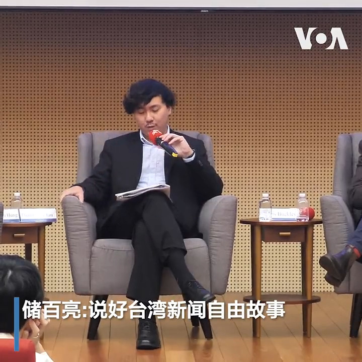
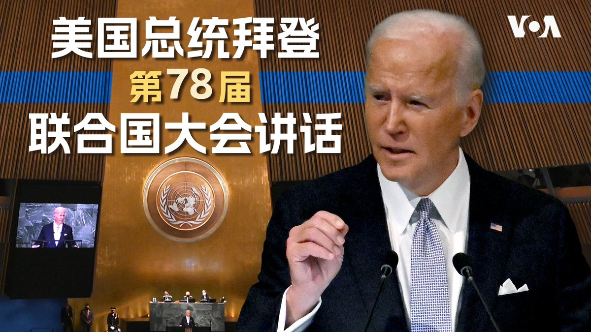
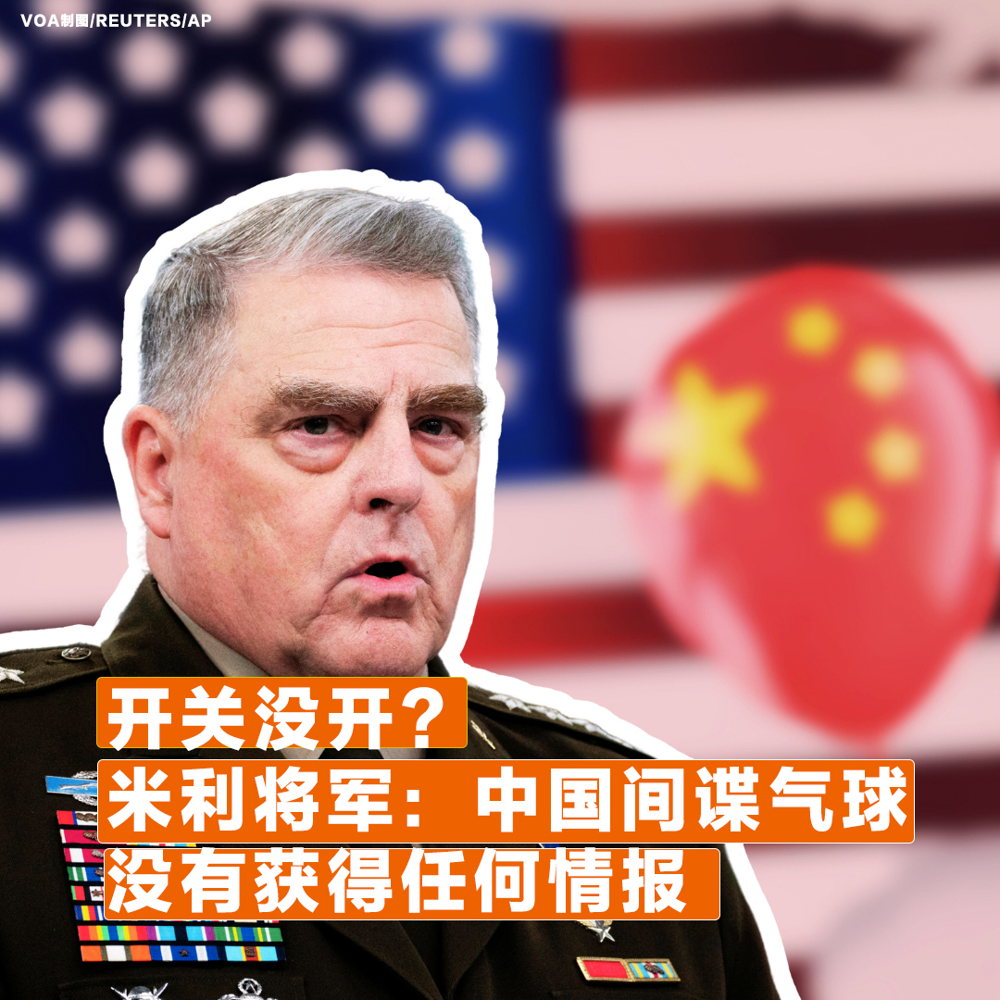

美国之音中文网 北京时间 2023-09-19T21:00:23Z 1704118239557558523 9/19【#时事大家谈】第78届联合国大会特别节目

嘉宾：纽约城市大学政治学教授夏明; 中国民主党全国委员会执行长陈闯创
主持人：樊冬宁

Youtube🔗 https://t.co/ma3DFctMxG https://t.co/B751NrDi8c   美国之音中文网 北京时间 2023-09-19T21:13:35Z 1704121560628670929 遭国际刑事法院通缉后首次出国，普京十月将赴北京会晤习近平 https://t.co/M2Hq18tQCp   美国之音中文网 北京时间 2023-09-19T23:32:34Z 1704156533783756803 在上海当了十年婚礼策划师的袁家良（音译）已改行做起了婚礼摄影师，他说：“整个大环境促使现在的婚礼行业不是非常景气，这个也是客观事实。”他对整个行业的前景是担忧多于乐观的。据统计，中国去年共有680万对新人结婚，比21年减少了80万对。此外，结婚率的大幅下降有可能会进一步拖累中国的生育率。 https://t.co/nbeq5RGP74   美国之音中文网 北京时间 2023-09-19T23:53:53Z 1704161902127943935 台湾的中央广播电台9月18日举行“综观亚洲媒体生态变化”论坛。《纽约时报》记者储百亮等多位外籍记者表示，中国传媒环境十年来急遽恶化，迫使他们离开北京、转往台北工作。他们建议台媒要“说好台湾的新闻自由故事”，并凸显台湾不是“中国的台湾”，也不仅是美中博弈下的一枚棋子。https://t.co/yAlO0IV5Qa https://t.co/RtYfMeLI4W   美国之音中文网 北京时间 2023-09-19T17:08:34Z 1704059898609418338 “说好台湾故事” 外媒看台湾有望成亚洲媒体枢纽 https://t.co/tZyD8UoSKq   美国之音中文网 北京时间 2023-09-19T21:54:33Z 1704131870668304750 中共内部就秦刚问题进行通报，军政高官成为安全审查对象 https://t.co/OVrXAaXNHL   美国之音中文网 北京时间 2023-09-19T17:43:05Z 1704068586049093868 调查显示美国企业对中国前景的乐观情绪跌至历史新低 https://t.co/1Gtnu6XRcU   美国之音中文网 北京时间 2023-09-19T17:26:05Z 1704064306491580576 共和党总统初选聚焦抗中 前副总统彭斯批中国正成为邪恶帝国 https://t.co/gVBIRcADrj   美国之音中文网 北京时间 2023-09-19T17:58:05Z 1704072360935206984 澳大利亚提升无人机和巡逻机能力加强海上监视 https://t.co/GmKmhLL4qh   美国之音中文网 北京时间 2023-09-19T12:41:04Z 1703992581607313884 “这只会徒增台湾人民反感” 国民党总统参选人侯友宜呼吁北京停止军事扰台 https://t.co/KfUJzvO3iz   美国之音中文网 北京时间 2023-09-19T14:29:35Z 1704019890133434386 美国18州的检察长支持蒙大拿州禁用TikTok 呼吁法官驳回诉讼 https://t.co/hbShGNTKI9   美国之音中文网 北京时间 2023-09-19T12:55:05Z 1703996107918057894 FBI局长：中国黑客计划的庞大程度超越所有竞争对手的总和 https://t.co/jVxiSn892n   美国之音中文网 北京时间 2023-09-19T07:00:00Z 1703906749139542295 第78届联大“五常缺四”是否反映出联合国影响力式微？韩正与布林肯在纽约会晤，泽连斯基首次现身，如何从今年联大观察美中关系走向与乌克兰局势变化？拜登总统的演说有何观察重点？台湾入联又是否有任何进展？美东时间周二上午9-11点半【#时事大家谈】联合国大会特别节目，欢迎事先在X留言互动。 https://t.co/9rSl0bKSfy   美国之音中文网 北京时间 2023-09-19T09:30:35Z 1703944642218369155 FBI就人工智能危险发出警告 https://t.co/eaiIWjMbna   美国之音中文网 北京时间 2023-09-19T07:30:00Z 1703914296726769867 【家事国事天下事，你有何见解】中国国防部长失踪，外交部长失踪，火箭军司令和政治委员失踪。一连串的失踪导致外界分析家惊呼中共中央总书记习近平统治的不确定性。但也有分析家指出，十多年来，低、中、高级官员的无预警失踪一向是习政权的特色，其不确定性就是其确定性。这种确定性的怪圈出口何在？ https://t.co/OiVt3nG92U   美国之音中文网 北京时间 2023-09-19T08:00:00Z 1703921846372991211 即将于本月底退休的美国参谋长联席会议主席马克·米利17日接受美国CBS电视台采访时说，美国高度确信，7个月前在美国上空的中国间谍气球传感器从未启动，气球没有获得任何情报，也没有将任何情报传回中国。至于它为何飘到美国？米利称主流说法认为它是被风吹离轨道。您怎么看？ https://t.co/6xRnakdGwk   美国之音中文网 北京时间 2023-09-19T08:29:06Z 1703929171028918288 出席联合国会议的领导人聚焦发展 https://t.co/ars4kcBxJP   美国之音中文网 北京时间 2023-09-19T09:43:34Z 1703947909358866787 拜登为联大和中亚峰会做好准备 https://t.co/GRdnkhQp1F   美国之音中文网 北京时间 2023-09-19T05:03:51Z 1703877520204968180 数万名抗议者9月17日在纽约集会游行，呼吁停止使用化石燃料。示威者说，煤炭、石油等能源是造成气候变化的原因。与此同时，全球商界、政界和艺术界的领导者齐聚纽约，准备参加本周晚些时候的联合国气候峰会。报道：https://t.co/dUsS7dtk32 https://t.co/R8NrWOTCDf   美国之音中文网 北京时间 2023-09-19T05:29:09Z 1703883886273659151 苹果员工相貌被批“辱华” 中国网民：“看了不舒服” https://t.co/Ll0azWWydS   美国之音中文网 北京时间 2023-09-19T06:27:00Z 1703898442375041317 引发强烈反应的中国《治安管理处罚法》草案，除拟禁穿戴“伤害民族感情”服饰外，也允许公安对“违反治安管理行为”者进行人身检查，采集血液、尿液等生物样本。该做法原只针对严重刑事犯罪，新规将此延伸至轻罪。民众和法律专家提出对隐私保护和公安职权扩大的担忧，您怎么看？ https://t.co/nwl01Su0Iu   美国之音中文网 北京时间 2023-09-19T07:00:36Z 1703906900243550394 美国一穆斯林镇长就恐怖分子观察名单起诉美国政府 https://t.co/NPCJnXjA38   美国之音中文网 北京时间 2023-09-19T07:39:16Z 1703916628952375385 一年一度的联合国大会本周拉开帷幕。拜登总统19日将在联大发言，中国领导人习近平不出席，而是派国家副主席韩正参加本年度的联大一般性辩论。联合国大会开什么？此次大会将讨论哪些重要议题？四分钟短片了解。 https://t.co/6drNACKEtw   美国之音中文网 北京时间 2023-09-19T08:14:04Z 1703925387989066014 利比亚洪灾幸存者亲述：我们失去了挚爱 https://t.co/yZpYlI5B7T   美国之音中文网 北京时间 2023-09-19T08:29:10Z 1703929188842192897 王毅先会沙利文再赴莫斯科 北京在美俄之间找平衡 https://t.co/FZCUVzs3IK   美国之音中文网 北京时间 2023-09-19T08:58:06Z 1703936467603763523 当局在南卡州找到失踪F-35碎片散落区,美海军陆战队宣布暂停行动两天以强化飞安 https://t.co/KoApPBvqr3   美国之音中文网 北京时间 2023-09-19T08:58:09Z 1703936481809834288 美伊换囚，被中国拘押的美国公民家人敦促政府与北京换囚 https://t.co/ptOEoPeqtH   美国之音中文网 北京时间 2023-09-19T09:00:01Z 1703936951567733204 一键解锁 #美国热搜 榜1、经济崩盘习就要打台湾？习近平需要发动对台战争来转移国内矛盾吗？2、中美间谍战全球升级，拜登想探查习近平的脑回路；3、新时代岳母刺字：尽力出国4、国家反诈APP，其实就是国家防造反APP5、杭州亚运会彩排6、香港中文大学学生毕业典礼高喊民主口号https://t.co/fTd0XufWTO https://t.co/9t5utWo6T9   美国之音中文网 北京时间 2023-09-19T04:30:33Z 1703869140015210677 中俄最高外交官在莫斯科会谈，夸赞“战略协作” https://t.co/ZhA2wwn4Yg   美国之音中文网 北京时间 2023-09-19T04:55:11Z 1703875337904423228 美国国务卿布林肯周一在联合国大会期间和中国国家副主席韩正举行了会谈，这是美中高级官员之间近来一系列高层会谈的最新一次。过去这个周末，白宫国安顾问沙利文与中国外长王毅在马耳他会晤。有分析认为，这些会谈可能为今年晚些时候的拜习会奠定基础。 https://t.co/igwHgQiFbX   美国之音中文网 北京时间 2023-09-19T05:21:00Z 1703881832943739108 缅甸军事政变延烧2年多未歇，尽管军政府饱受国际制裁，但据统计，中国和泰国企业正在大举进驻当地。观察人士分析，中国看似正在填补西方撤出缅甸的经济真空、泰国也保持与缅甸军政府相当密切的政经关系，同时缅甸军方也正刻意宣传释放政治犯的消息，盼稍稍缓解制裁冲击。https://t.co/aVsSwPNqsd https://t.co/hHykBeTp2K   美国之音中文网 北京时间 2023-09-19T05:29:12Z 1703883898948874561 美国指控一名俄罗斯公民利用香港空壳公司从事洗钱并非法购买军民两用微电子产品 https://t.co/X8g7NMs54t   美国之音中文网 北京时间 2023-09-19T05:43:33Z 1703887510643068954 布林肯会晤韩正，强调“负责任地”管控美中关系 https://t.co/Us12FCLVKy   美国之音中文网 北京时间 2023-09-19T05:56:34Z 1703890786725908820 伊朗美国完成囚犯交换 https://t.co/04I0R57QNX   美国之音中文网 北京时间 2023-09-19T06:13:03Z 1703894934523433153 美国维吾尔穆斯林社区筹建礼拜场所 https://t.co/5I0rcPB8Hb   美国之音中文网 北京时间 2023-09-19T01:16:05Z 1703820198183313411 阿里巴巴计划在土耳其投资20亿美元，建设“世界级数据和物流中心” https://t.co/lAebqoSB7v   美国之音中文网 北京时间 2023-09-19T03:00:34Z 1703846492866527695 中国泰国企业争相进驻缅甸 将如何影响当地情势？ https://t.co/K76Qk6W1mc   美国之音中文网 北京时间 2023-09-19T03:00:36Z 1703846500709855318 加州州长纽森十月访华能为美中关系带来什么影响？ https://t.co/3CalwuU3Cz   美国之音中文网 北京时间 2023-09-19T03:15:05Z 1703850147833098355 国民党总统参选人侯友宜9月18日在华盛顿提出“3D战略”作为台湾维护两岸和平的政策。侯友宜说，3D指的是“吓阻、对话和降低冲突”。对于中共军机扰台次数日益增长，侯友宜呼吁北京当局停止这类行为，“因为这只会徒增台湾人民的反感，对两岸的和平没有助力”。 https://t.co/qpnwoQGx2x   美国之音中文网 北京时间 2023-09-19T04:01:09Z 1703861738687606908 拜登将与太平洋岛国举行第二次峰会 https://t.co/8xQPLHwVsi   美国之音中文网 北京时间 2023-09-19T04:17:10Z 1703865770466566274 中国与欧盟在新的紧张关系中就人工智能与跨界数据流动举行会谈 https://t.co/XpW2FiFCTu   美国之音中文网 北京时间 2023-09-19T01:31:12Z 1703824003604050383 60亿美元伊朗资金被解冻后，五名被关押的美国公民飞离伊朗 https://t.co/oU5vB7S68V   美国之音中文网 北京时间 2023-09-19T02:08:05Z 1703833286278017381 联合国大会第78届会议一般性辩论将于9月19日在纽约联合国总部拉开帷幕。一位联合国高级官员日前在被问及台湾参与联合国事务时表示，将任何一方排除在联合国系统外都不利于实现全球发展目标。 不过，也有联合国官员随后补充说，联合国持续奉行“一个中国”政策。 https://t.co/nEGJTyx504   