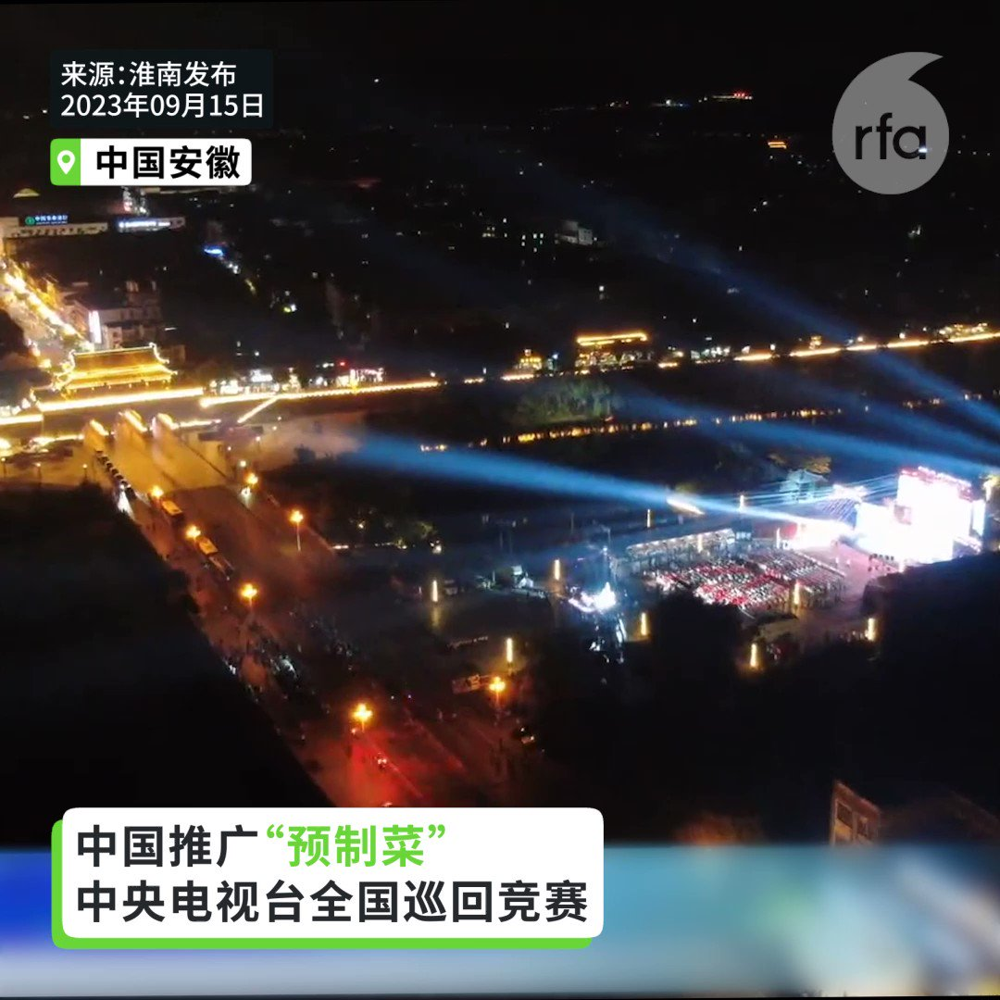
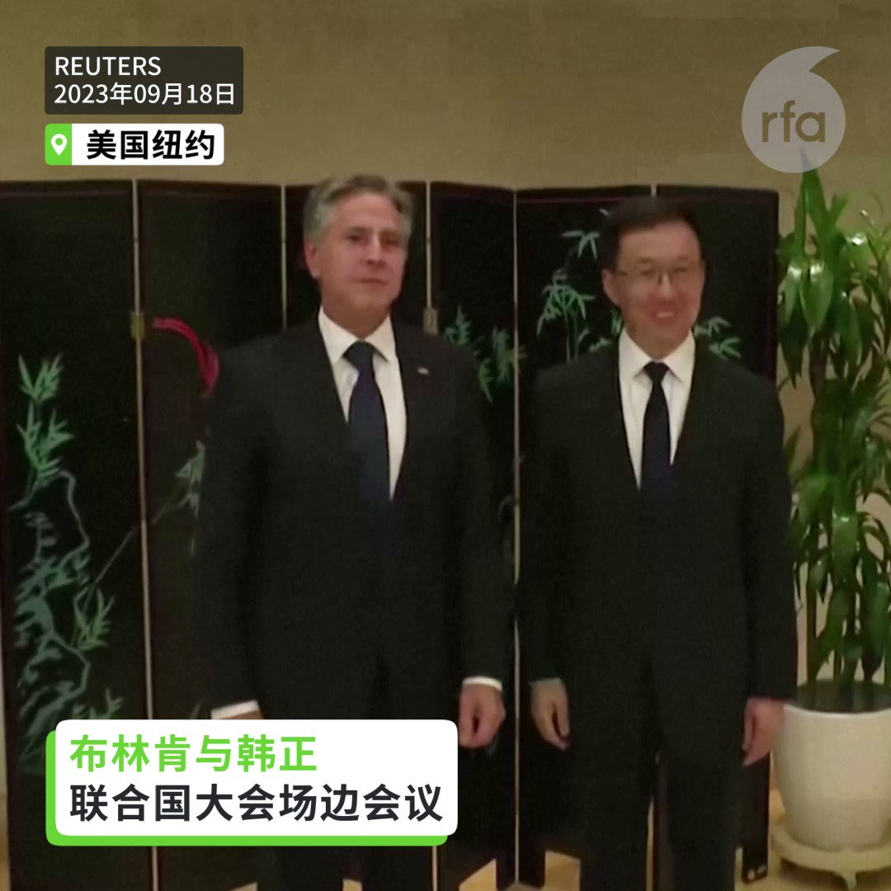
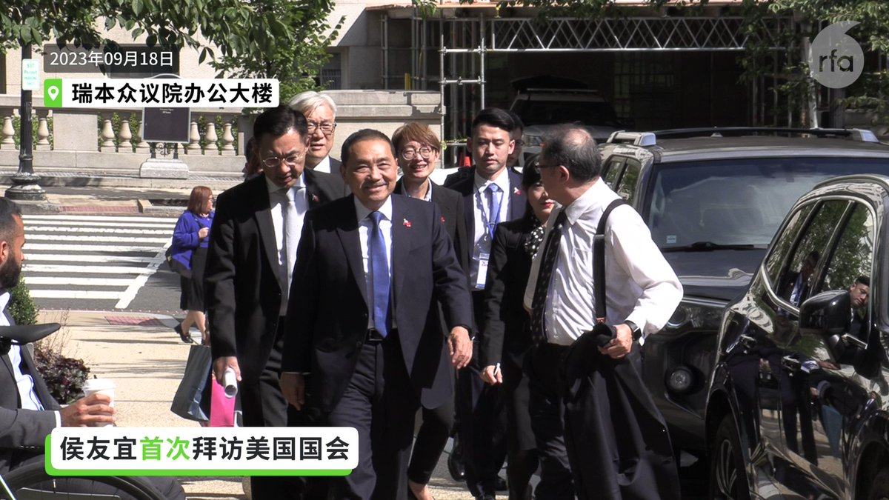
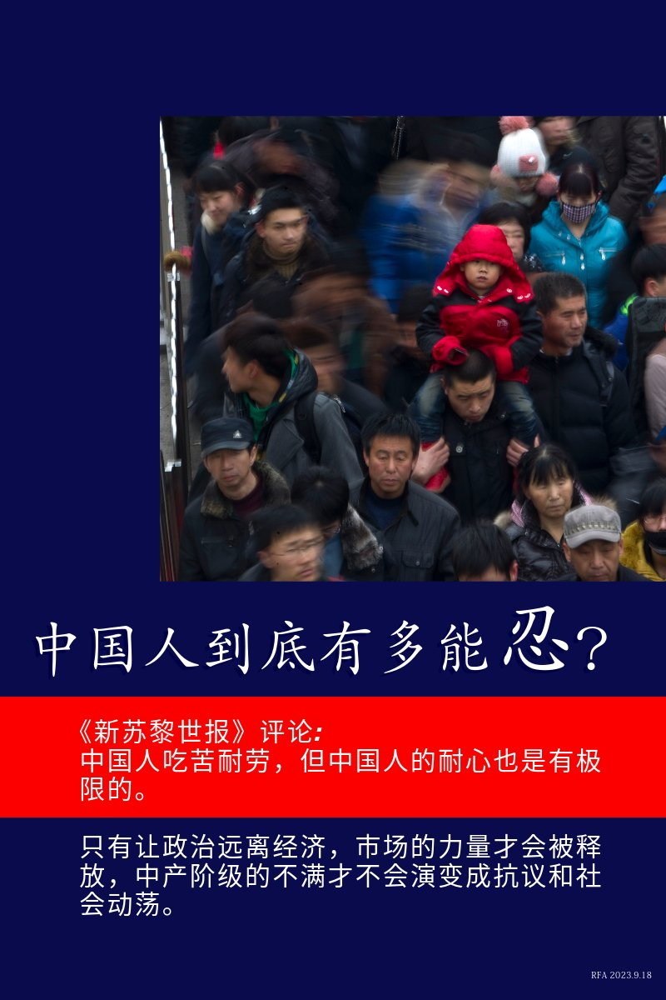

自由亚洲电台 北京时间 2023-09-19T22:45:41Z 1704144736133529645 被关押刚满2周年的中国独立记者 #黄雪琴 与劳工活动人士 #王建兵，被控“煽动颠覆国家政权”案，19日召开庭前会议。
他们的朋友对于两人被关押长达2年感到愤怒，又说，黄雪琴健康状况让人担忧，更担心他们在不公平状况下被审讯和重判，呼吁国际社会关注。

 https://t.co/jYkPUYLxR4   自由亚洲电台 北京时间 2023-09-19T23:08:49Z 1704150557014061423 9月1日学生开学，家长们发现今年3月的 #历史课本 再一次被修改。原有的“我国坚持人民至上、生命至上，开展 #抗击疫情 人民战争......”改成“以 #习近平 同志为核心的党中央坚持人民至上、生命至上......”。不过，未提及疫情导致的真实死亡人数和患者人数。 https://t.co/txIW7cmghs   自由亚洲电台 北京时间 2023-09-19T23:25:06Z 1704154658359689707 【中国突然推行“预制菜” 校园首当其冲】
【家长抵制预制菜 出现“送饭潮”】
中国近几个月政策推行半成品的“#预制菜”，中央电视台还在全国举办竞赛推广。传出 #校园 可能成为“预制菜”的主攻市场，多地 #家长抗议，要求学校允许家长送饭给孩子。出现了校园门口挤满家长送饭，学生在校门口吃饭的景象。 https://t.co/8hjuIkPgoK   自由亚洲电台 北京时间 2023-09-19T23:29:11Z 1704155683015512366 原名区少坤的区伯生于广州。2011年，#广州区伯 在路上发现一名警察“公车私用”接送孩子后，向公安局和政府部门投诉。有人甚至形容，区伯是利用社媒监察政府的先驱。广州维权人士廖剑豪说，区伯的行动打破了广州人的传统... https://t.co/GFITwWz9kl   自由亚洲电台 北京时间 2023-09-19T20:49:06Z 1704115398134681854 RT @RFA_Chinese: 【#您怎么看？】
自9月开学以来，中国 #抵制预制菜进校园 的浪潮一浪高过一浪。 家长恐慌而愤怒，为防止孩子在学校食堂吃 #预制菜，有家长每天中午给孩子送饭。
2021年起，预制菜概念像龙卷风一样席卷了中国大江南北。2022年中国预制菜市场规模…   自由亚洲电台 北京时间 2023-09-19T22:12:34Z 1704136404752605294 RT @RFA_Chinese: 【如何“吓阻”军机？侯友宜：呼吁大陆】侯友宜9月１８日在 ＃布鲁金斯研究所 参加活动。美国在台协会前理事Richard Bush会后表示，“侯市长清楚地听到了美方利益和关切。” 对于 ＃中方军机 近期扰台103架次，侯友宜表示：“我反对共军不断…   自由亚洲电台 北京时间 2023-09-19T20:01:16Z 1704103361308504368 RT @RFA_Chinese: 【#您怎么看】德国外长贝尔伯克（Annalena Baerbock）上周访美，在接受美国媒体访问时力挺乌克兰，她犀利发问：“如果普京赢得了这场战争，对于世界上其他独裁者，例如中国国家主席习近平，会是什么讯号”？… https://t.co/Gf…   自由亚洲电台 北京时间 2023-09-19T15:04:14Z 1704028609202344374 【中国由上至下推广“预制菜”】
【家长爆出反对声浪】
近几个月，中国各地政府突然大力推广可能含有添加物防腐剂的 #预制菜，校园成为此次推广行动的第一站。多地学生家长担心预制菜中的防腐剂危害学生身体，出现 #送饭潮，相关话题冲上热搜。
https://t.co/gCWYGkb0ir https://t.co/2mQbLAk2eE   自由亚洲电台 北京时间 2023-09-19T11:31:18Z 1703975022522675709 【布林肯与韩正 联合国大会场边会晤】
【布林肯：世界期待两国负责处理关系】
【韩正：推动中美关系重回健康稳定】
美国国务卿 #布林肯 18日在联合国大会场边会议会见中国国家副主席 #韩正。
美国国务院发表声明，表示会谈涉及“坦诚和建设性的讨论”。两人同意保持开放的沟通管道，并讨论到俄罗斯入侵乌克兰、朝鲜以及台海议题。韩正则表示，中国的发展对美国是机遇而不是挑战，希望推动 #中美关系 重回健康稳定轨道。
详细报道：https://t.co/vlwAGcLm8N   自由亚洲电台 北京时间 2023-09-19T12:22:45Z 1703987971991404624 RT @RFA_Chinese: 【欢迎加入自由亚洲电台电报群】https://t.co/UkKZmFSRkG https://t.co/Qid2LNZxJn   自由亚洲电台 北京时间 2023-09-19T09:57:04Z 1703951307323916525 欢迎收听和订阅播客 https://t.co/MjLNSvVMqc
【亚太报道（2023-9-19）】
沙利文会晤 #王毅 铺路“#拜习会”？ / 台湾侦获103架次 #中国军机扰台 / #侯友宜 提出两岸问题新战略; / 北京艺术家 #严正学 病危 / 阻碍中国民企的“#隐性壁垒”何在？ https://t.co/caIL8neeOV   自由亚洲电台 北京时间 2023-09-19T10:36:06Z 1703961133584154719 评论 | #陈破空：政局惊人动荡，习政权到底出了什么事？
 https://t.co/pR8anrnrHm   自由亚洲电台 北京时间 2023-09-19T10:57:56Z 1703966625073107372 #苹果 公司在中国大陆官网上的一张苹果客服人员照片，因为眼睛小，还留了一条辫子，近期被中国部分网民指涉嫌 #辱华，相关热议冲上热搜。不过，被指样貌“辱华”的是一位 #印第安人。
https://t.co/SAKi9sVMn0   自由亚洲电台 北京时间 2023-09-19T11:39:09Z 1703976997775388713 【#侯友宜 首度拜访美国国会山  获赠“暖心小礼物”】 https://t.co/KfIVC0m3yd   自由亚洲电台 北京时间 2023-09-19T05:28:56Z 1703883831042879872 【#您怎么看 】德国《新苏黎世报》近日发表评论说，中国人吃苦耐劳，但中国人的耐心也是有极限的。  详见https://t.co/VD6t32Rzs2 https://t.co/yoBSIZv2Uv   自由亚洲电台 北京时间 2023-09-19T06:22:44Z 1703897369622790461 【如何“吓阻”军机？侯友宜：呼吁大陆】侯友宜9月１８日在 ＃布鲁金斯研究所 参加活动。美国在台协会前理事Richard Bush会后表示，“侯市长清楚地听到了美方利益和关切。” 对于 ＃中方军机 近期扰台103架次，侯友宜表示：“我反对共军不断扰台"。 寄望未来可加强与 ＃陆生 陆客经贸交流以缓和局势。 https://t.co/qHnxmawu8L   自由亚洲电台 北京时间 2023-09-19T06:23:36Z 1703897586015617475 #事实查核｜#马斯克 表态 #台湾 是中国的一部分？
 https://t.co/NC8Lh54cig   自由亚洲电台 北京时间 2023-09-19T10:12:59Z 1703955314918273231 【#您怎么看？】
自9月开学以来，中国 #抵制预制菜进校园 的浪潮一浪高过一浪。 家长恐慌而愤怒，为防止孩子在学校食堂吃 #预制菜，有家长每天中午给孩子送饭。
2021年起，预制菜概念像龙卷风一样席卷了中国大江南北。2022年中国预制菜市场规模为4196亿元，预计2026年将升至万亿元级别。
为什么中国家长这么抵制预制菜进校园？您预测他们能做到吗？   自由亚洲电台 北京时间 2023-09-19T04:20:39Z 1703866644752470201 在美港人团体, #美国香港人会馆 日前举办了成立三周年的庆祝活动。参加活动的该团体成员表示，成立这一团体的意义在于凝聚海外港人，并希望香港重新获得自由。

 https://t.co/7tyk5o5Wjb   自由亚洲电台 北京时间 2023-09-19T06:25:09Z 1703897976626913430 【#变态辣椒：牢笼止于何处?】
五名因为触犯抢劫、强暴与谋杀罪在等待审判的朝鲜犯人，八月份利用监狱整修屋顶、警戒松懈的机会，溜过监狱围墙而脱逃。五人中有一名遭逮，另有一人自首，其他三名犯人则据信企图逃往相对自由一些的中国。越狱的事情在全世界最严厉的警察国家朝鲜，实属罕见罕闻。 https://t.co/FSOYyCIsdG   自由亚洲电台 北京时间 2023-09-19T04:40:50Z 1703871724692078826 #侯友宜 18日上午在美国华府智库布鲁金斯研究院，面对众多的台湾问题专家，发表了《以和平共创台湾愿景与印太未来》的专题演说，明确提出吓阻 (Deterrence) 、对话 (Dialogue) 、降低风险 (De-escalation) 的“#三D战略”，以实现台海安定、台湾安全、世界安心的目标。

 https://t.co/j6m1aBDND3   自由亚洲电台 北京时间 2023-09-19T06:00:41Z 1703891820470739186 专栏 | #夜话中南海：#俞正声 声名显赫而又错综复杂的海外关系在中共党内绝无仅有
 https://t.co/5wRoWVjWjo   自由亚洲电台 北京时间 2023-09-19T00:57:00Z 1703815398209266138 在福建福州市聚餐纪念“#鞭炮案”而被当局扣查的访民 #叶钟，至今仍未获释。有消息说，他已被刑事拘留。叶钟多年来因征地问题与当局争持不下。家属相信，当局拒绝放人与叶钟坚持上访维权有关。

 https://t.co/XDPq6sJ3Bh   自由亚洲电台 北京时间 2023-09-19T02:29:04Z 1703838565938176489 正当美中双方公布有关美国白宫国家安全顾问沙利文（Jake Sullivan）与中国外交部长 #王毅 会晤的消息之际，台湾在一天内却侦获多达103架次中方军机扰台，创下最高记录。台湾的国防部就此呼吁北京当局，停止恶化区域安全的破坏性单边行为。

 https://t.co/zB6V4ZDGAd   自由亚洲电台 北京时间 2023-09-19T03:12:06Z 1703849394012028944 中国外交部长 #王毅 17日与美国白宫国家安全顾问苏利文（Jake Sullivan）周六（17日）起连续两日于马耳他会晤后，18日随即开启了为期4天的俄罗斯访问行程，期间 #中俄 双方将会提高战略伙伴关系。在此前一天，北京的盟友及朝鲜最高领导人 #金正恩 刚结束了6天的俄罗斯访问。

 https://t.co/cPIY3iq7NE   自由亚洲电台 北京时间 2023-09-19T03:57:16Z 1703860762828042616 【#您怎么看】德国外长贝尔伯克（Annalena Baerbock）上周访美，在接受美国媒体访问时力挺乌克兰，她犀利发问：“如果普京赢得了这场战争，对于世界上其他独裁者，例如中国国家主席习近平，会是什么讯号”？ 
9月18日中国外交部发表严正声明称，“这些言论极其荒谬，严重侵犯了中国的政治尊严，是公开的政治挑衅”。 
今年6月20日，美国总统拜登也称习近平是“独裁者”。中国外交部21日回应称拜登的言论“极其荒谬”，“是公开的政治挑衅”。 
您认为，习近平是不是独裁者？   自由亚洲电台 北京时间 2023-09-19T04:01:51Z 1703861913321607523 外界观察到，消费、就业等指标的改善似乎展现了 #中国经济 近期正在复苏的迹象。然而，国际货币基金组织（IMF）总裁格奥尔基耶娃日前接受媒体采访时，敦促中国将经济增长模式转向专注提振国内消费，而不是依赖债务驱动的基建投资和房地产。

 https://t.co/hC9ybBuWUL   自由亚洲电台 北京时间 2023-09-19T01:28:01Z 1703823203465052410 谁是 #民企 衰败始作俑者？ 谁是 #隐性壁垒？“没人敢跟习说真话”

 https://t.co/THeOgHf7ze   自由亚洲电台 北京时间 2023-09-19T00:15:42Z 1703805001334915502 #郑雁雄 通过阅兵，对外宣示他是香港最高"话事人"？

 https://t.co/NFh6zwjT0a   