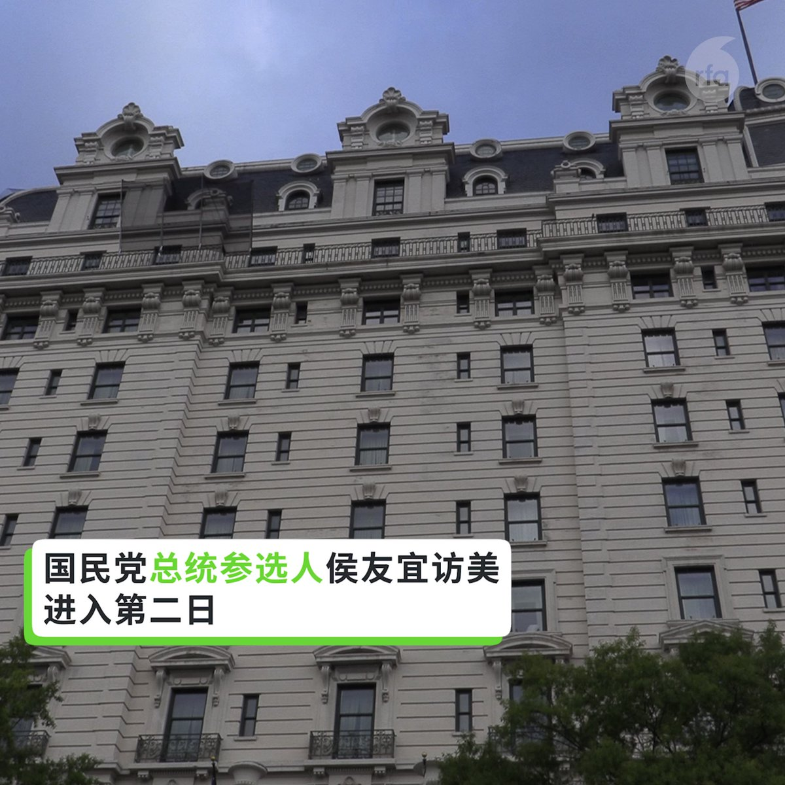
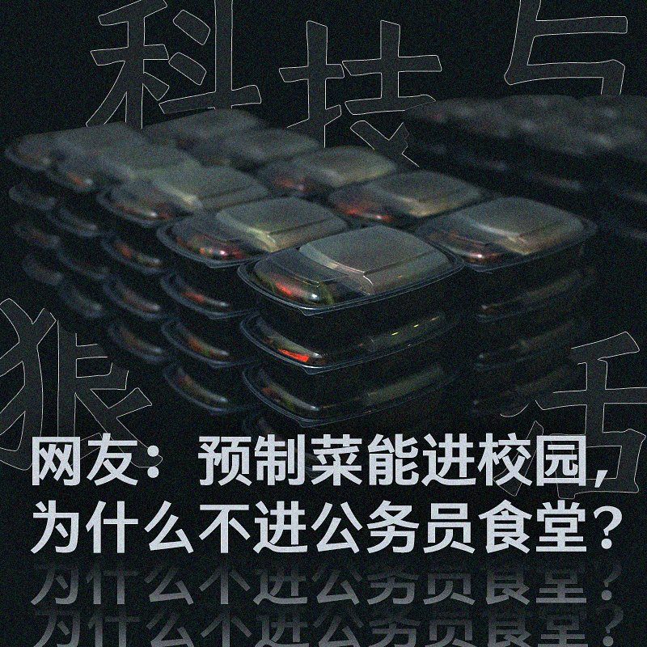

自由亚洲电台 北京时间 2023-09-19T06:22:44Z 1703897369622790461 【如何“吓阻”军机？侯友宜：呼吁大陆】侯友宜9月１８日在 ＃布鲁金斯研究所 参加活动。美国在台协会前理事Richard Bush会后表示，“侯市长清楚地听到了美方利益和关切。” 对于 ＃中方军机 近期扰台103架次，侯友宜表示：“我反对共军不断扰台"。 寄望未来可加强与 ＃陆生 陆客经贸交流以缓和局势。 https://t.co/qHnxmawu8L   自由亚洲电台 北京时间 2023-09-19T06:23:36Z 1703897586015617475 #事实查核｜#马斯克 表态 #台湾 是中国的一部分？
 https://t.co/NC8Lh54cig   自由亚洲电台 北京时间 2023-09-19T10:12:59Z 1703955314918273231 【#您怎么看？】
自9月开学以来，中国 #抵制预制菜进校园 的浪潮一浪高过一浪。 家长恐慌而愤怒，为防止孩子在学校食堂吃 #预制菜，有家长每天中午给孩子送饭。
2021年起，预制菜概念像龙卷风一样席卷了中国大江南北。2022年中国预制菜市场规模为4196亿元，预计2026年将升至万亿元级别。
为什么中国家长这么抵制预制菜进校园？您预测他们能做到吗？   自由亚洲电台 北京时间 2023-09-19T04:20:39Z 1703866644752470201 在美港人团体, #美国香港人会馆 日前举办了成立三周年的庆祝活动。参加活动的该团体成员表示，成立这一团体的意义在于凝聚海外港人，并希望香港重新获得自由。

 https://t.co/7tyk5o5Wjb   自由亚洲电台 北京时间 2023-09-19T06:25:09Z 1703897976626913430 【#变态辣椒：牢笼止于何处?】
五名因为触犯抢劫、强暴与谋杀罪在等待审判的朝鲜犯人，八月份利用监狱整修屋顶、警戒松懈的机会，溜过监狱围墙而脱逃。五人中有一名遭逮，另有一人自首，其他三名犯人则据信企图逃往相对自由一些的中国。越狱的事情在全世界最严厉的警察国家朝鲜，实属罕见罕闻。 https://t.co/FSOYyCIsdG   自由亚洲电台 北京时间 2023-09-19T04:40:50Z 1703871724692078826 #侯友宜 18日上午在美国华府智库布鲁金斯研究院，面对众多的台湾问题专家，发表了《以和平共创台湾愿景与印太未来》的专题演说，明确提出吓阻 (Deterrence) 、对话 (Dialogue) 、降低风险 (De-escalation) 的“#三D战略”，以实现台海安定、台湾安全、世界安心的目标。

 https://t.co/j6m1aBDND3   自由亚洲电台 北京时间 2023-09-19T06:00:41Z 1703891820470739186 专栏 | #夜话中南海：#俞正声 声名显赫而又错综复杂的海外关系在中共党内绝无仅有
 https://t.co/5wRoWVjWjo   自由亚洲电台 北京时间 2023-09-19T00:57:00Z 1703815398209266138 在福建福州市聚餐纪念“#鞭炮案”而被当局扣查的访民 #叶钟，至今仍未获释。有消息说，他已被刑事拘留。叶钟多年来因征地问题与当局争持不下。家属相信，当局拒绝放人与叶钟坚持上访维权有关。

 https://t.co/XDPq6sJ3Bh   自由亚洲电台 北京时间 2023-09-19T02:29:04Z 1703838565938176489 正当美中双方公布有关美国白宫国家安全顾问沙利文（Jake Sullivan）与中国外交部长 #王毅 会晤的消息之际，台湾在一天内却侦获多达103架次中方军机扰台，创下最高记录。台湾的国防部就此呼吁北京当局，停止恶化区域安全的破坏性单边行为。

 https://t.co/zB6V4ZDGAd   自由亚洲电台 北京时间 2023-09-19T03:12:06Z 1703849394012028944 中国外交部长 #王毅 17日与美国白宫国家安全顾问苏利文（Jake Sullivan）周六（17日）起连续两日于马耳他会晤后，18日随即开启了为期4天的俄罗斯访问行程，期间 #中俄 双方将会提高战略伙伴关系。在此前一天，北京的盟友及朝鲜最高领导人 #金正恩 刚结束了6天的俄罗斯访问。

 https://t.co/cPIY3iq7NE   自由亚洲电台 北京时间 2023-09-19T03:57:16Z 1703860762828042616 【#您怎么看】德国外长贝尔伯克（Annalena Baerbock）上周访美，在接受美国媒体访问时力挺乌克兰，她犀利发问：“如果普京赢得了这场战争，对于世界上其他独裁者，例如中国国家主席习近平，会是什么讯号”？ 
9月18日中国外交部发表严正声明称，“这些言论极其荒谬，严重侵犯了中国的政治尊严，是公开的政治挑衅”。 
今年6月20日，美国总统拜登也称习近平是“独裁者”。中国外交部21日回应称拜登的言论“极其荒谬”，“是公开的政治挑衅”。 
您认为，习近平是不是独裁者？   自由亚洲电台 北京时间 2023-09-19T04:01:51Z 1703861913321607523 外界观察到，消费、就业等指标的改善似乎展现了 #中国经济 近期正在复苏的迹象。然而，国际货币基金组织（IMF）总裁格奥尔基耶娃日前接受媒体采访时，敦促中国将经济增长模式转向专注提振国内消费，而不是依赖债务驱动的基建投资和房地产。

 https://t.co/hC9ybBuWUL   自由亚洲电台 北京时间 2023-09-19T01:28:01Z 1703823203465052410 谁是 #民企 衰败始作俑者？ 谁是 #隐性壁垒？“没人敢跟习说真话”

 https://t.co/THeOgHf7ze   自由亚洲电台 北京时间 2023-09-19T00:15:42Z 1703805001334915502 #郑雁雄 通过阅兵，对外宣示他是香港最高"话事人"？

 https://t.co/NFh6zwjT0a   