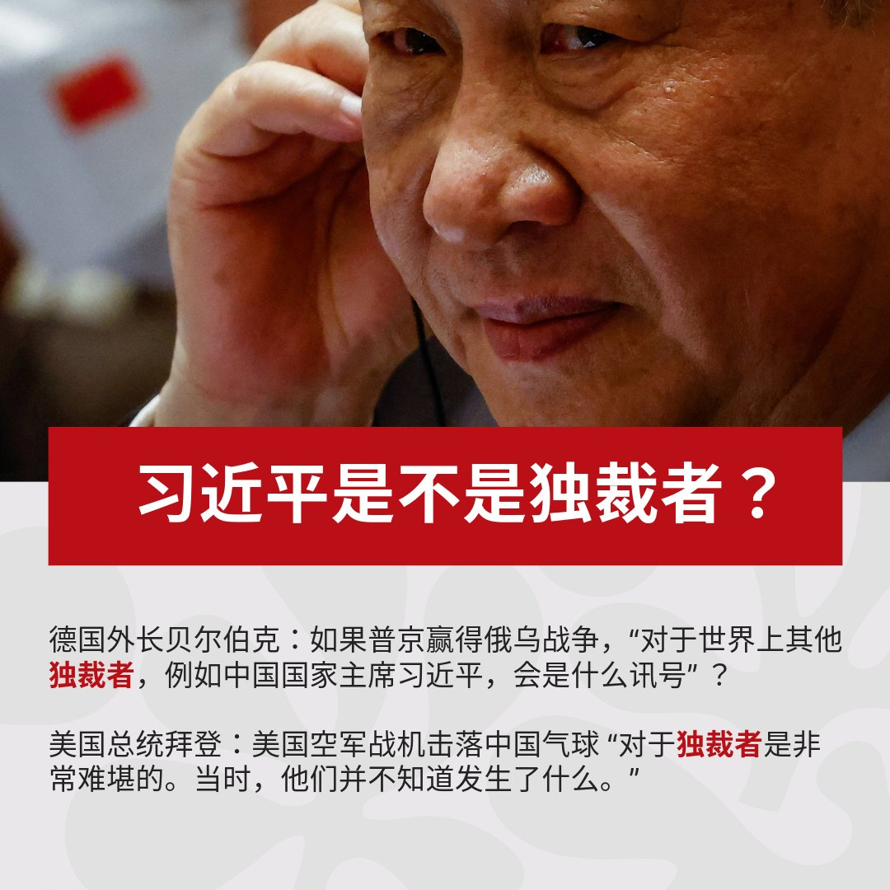

自由亚洲电台 北京时间 2023-09-19T06:00:41Z 1703891820470739186 专栏 | #夜话中南海：#俞正声 声名显赫而又错综复杂的海外关系在中共党内绝无仅有
 https://t.co/5wRoWVjWjo   自由亚洲电台 北京时间 2023-09-19T00:57:00Z 1703815398209266138 在福建福州市聚餐纪念“#鞭炮案”而被当局扣查的访民 #叶钟，至今仍未获释。有消息说，他已被刑事拘留。叶钟多年来因征地问题与当局争持不下。家属相信，当局拒绝放人与叶钟坚持上访维权有关。

 https://t.co/XDPq6sJ3Bh   自由亚洲电台 北京时间 2023-09-19T02:29:04Z 1703838565938176489 正当美中双方公布有关美国白宫国家安全顾问沙利文（Jake Sullivan）与中国外交部长 #王毅 会晤的消息之际，台湾在一天内却侦获多达103架次中方军机扰台，创下最高记录。台湾的国防部就此呼吁北京当局，停止恶化区域安全的破坏性单边行为。

 https://t.co/zB6V4ZDGAd   自由亚洲电台 北京时间 2023-09-19T03:12:06Z 1703849394012028944 中国外交部长 #王毅 17日与美国白宫国家安全顾问苏利文（Jake Sullivan）周六（17日）起连续两日于马耳他会晤后，18日随即开启了为期4天的俄罗斯访问行程，期间 #中俄 双方将会提高战略伙伴关系。在此前一天，北京的盟友及朝鲜最高领导人 #金正恩 刚结束了6天的俄罗斯访问。

 https://t.co/cPIY3iq7NE   自由亚洲电台 北京时间 2023-09-19T03:57:16Z 1703860762828042616 【#您怎么看】德国外长贝尔伯克（Annalena Baerbock）上周访美，在接受美国媒体访问时力挺乌克兰，她犀利发问：“如果普京赢得了这场战争，对于世界上其他独裁者，例如中国国家主席习近平，会是什么讯号”？ 
9月18日中国外交部发表严正声明称，“这些言论极其荒谬，严重侵犯了中国的政治尊严，是公开的政治挑衅”。 
今年6月20日，美国总统拜登也称习近平是“独裁者”。中国外交部21日回应称拜登的言论“极其荒谬”，“是公开的政治挑衅”。 
您认为，习近平是不是独裁者？   自由亚洲电台 北京时间 2023-09-19T04:01:51Z 1703861913321607523 外界观察到，消费、就业等指标的改善似乎展现了 #中国经济 近期正在复苏的迹象。然而，国际货币基金组织（IMF）总裁格奥尔基耶娃日前接受媒体采访时，敦促中国将经济增长模式转向专注提振国内消费，而不是依赖债务驱动的基建投资和房地产。

 https://t.co/hC9ybBuWUL   自由亚洲电台 北京时间 2023-09-19T01:28:01Z 1703823203465052410 谁是 #民企 衰败始作俑者？ 谁是 #隐性壁垒？“没人敢跟习说真话”

 https://t.co/THeOgHf7ze   自由亚洲电台 北京时间 2023-09-19T00:15:42Z 1703805001334915502 #郑雁雄 通过阅兵，对外宣示他是香港最高"话事人"？

 https://t.co/NFh6zwjT0a   