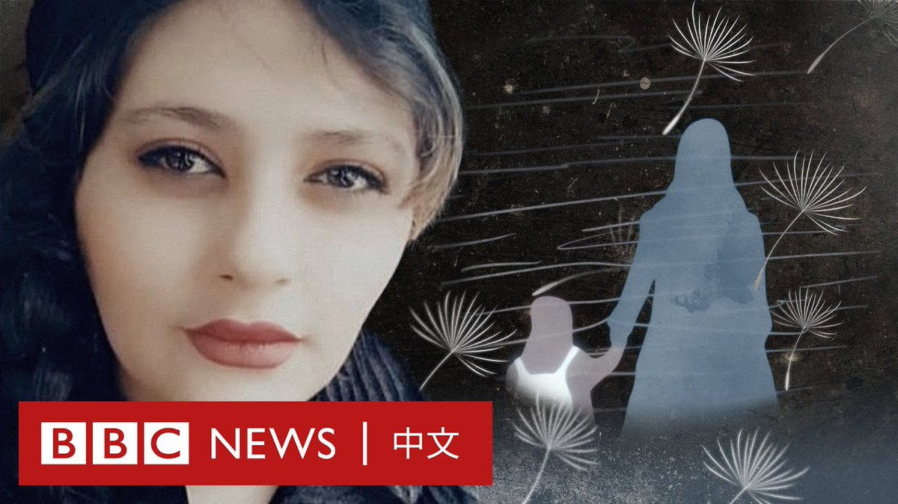

D英国广播公司BBC 北京时间 2023-09-18T09:27:51Z 1703581566155255961 一年前，马赫萨·阿米尼（Mahsa Amini）在医院去世，她此前因涉嫌违反伊朗要求女性遮盖头发的规定而被伊朗道德警察拘留。她的死亡引发了一场大规模的抗议活动。

在该事件发生一周年之际，马赫萨的母亲首次与BBC讲述了她短暂的一生的细节。 https://t.co/myJeBszrhL   