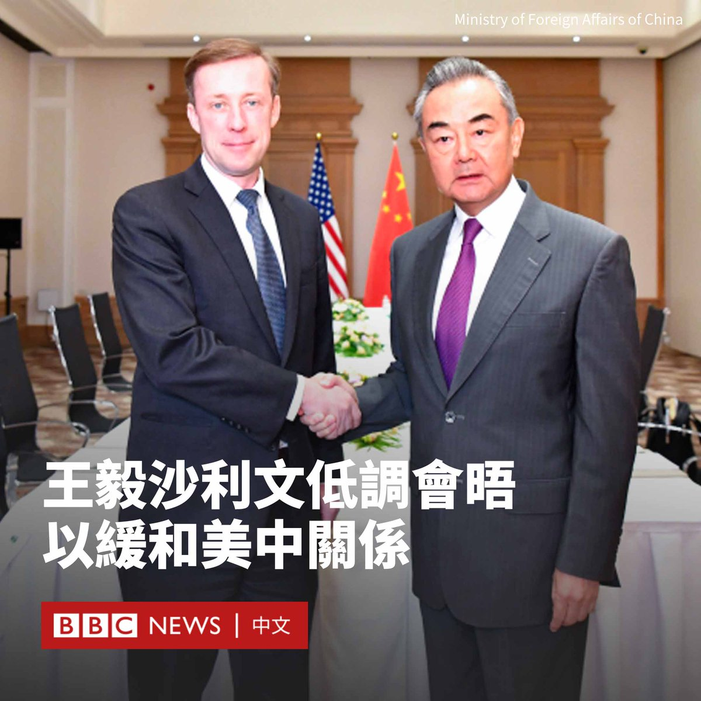

D英国广播公司BBC 北京时间 2023-09-18T18:22:37Z 1703716144933454260 世界卫生组织总干事谭德塞（Tedros Adhanom Ghebreyesus）敦促中国提供更多关于新冠疫情起源的信息，并称已准备派遣第二个小组进行溯源。

谭德塞在《金融时报》（Financial Times ）周日（9月17日）刊发的一篇采访中做出上述表述。

“我们正在促使中国提供全面访问权，我们也要求各国在双边会议上提出这一问题，（以敦促北京）予以合作。”谭德塞说道。

2021年1月，世卫组织的一个专家小组前往武汉进行溯源。该小组在3月发布了首份研究报告，称新冠病毒“非常可能”是通过另一种中间动物宿主从蝙蝠传播给人类的，实验室泄漏的说法“极不可能”。

但该报告一经发布便受到外界普遍质疑，甚至谭德塞本人也表示在获取原始数据时遇到困难，并称“需要进一步调查”实验室泄露论。

在那之后，谭德塞多次呼吁中国分享有关新冠疫情起源的信息，并表示在这之前，所有假设都有待商榷。

他对《金融时报》说，在溯源工作上，由于北京没有提供足够的信息，因此世卫组织与中国“先进行了私下沟通，然后当他们拒绝合作时，我们就公开（表态）了”。

“如果我们知道（起源），那么我们就可以阻止下一次疫情。所以这是科学问题。”他补充道。

新冠病毒于2019年12月在中国武汉首次被报告。目前的主流科学研究猜测，病毒先在一个活体动物市场传播，然后对外蔓延。

美国政府在病毒起源问题上陷入分歧。能源部与联邦调查局（FBI）认为病毒可能泄漏自实验室，其他四个美国情报机构倾向于新冠病毒是通过自然传播出现的。

中国则斥责实验室泄露论是对中国的“抹黑”，并通过官方媒体散布阴谋论，暗示新冠病毒可能是美国生物武器计划的产物。   D英国广播公司BBC 北京时间 2023-09-18T19:57:41Z 1703740071298670868 “这里的空气中都弥漫着一股很重的腐烂、死亡的味道。”

利比亚洪灾发生至今已过一周，各方统计的遇难人数从6000人到1.1万人不等，仍有数千人失踪。

BBC记者安娜·福斯特（Anna Foster）来到灾情最严重的德尔纳市海岸边。她表示，直到现在仍有罹难者遗体被冲刷上岸。 https://t.co/hi6TuO6syz   D英国广播公司BBC 北京时间 2023-09-18T14:55:53Z 1703664121009308090 来自45个国家和地区的12,500名运动员，将在杭州展开对第19届亚洲运动会奖牌的角逐。我们来看看在这个因疫情而延期一年举行的亚运会上有哪些看点。https://t.co/wNnK5NzoxD   D英国广播公司BBC 北京时间 2023-09-18T16:23:02Z 1703686050864934943 乌克兰从今年6月开始反攻，试图将俄罗斯军队从其占领的领土上击退。乌克兰曾称已经突破俄军在南部的第一道防线。

乌克兰的反攻是否正在取得进展？反攻比预期缓慢的原因是什么？我们用图片为你解释。https://t.co/n39yD2d3aa   D英国广播公司BBC 北京时间 2023-09-18T12:40:33Z 1703630062317445236 美国国家安全顾问沙利文（Jake Sullivan）上周末与中国最高外交官员王毅在马耳他举行了为期两天的会谈。

在这次低调举行的会谈中，沙利文与王毅讨论了习近平和拜登可能举行的会晤以及两国之间的沟通渠道。

双方在新闻稿中都表示，两人进行的讨论是“坦诚、实质性和建设性的”。

美国表示，两国政府承诺“未来几个月”在关键领域进行“更多的高层接触和磋商”。

“这次会议是为保持开放的沟通渠道和负责任地管理双边关系做出的持续努力之一。”美国国务院在一份声明中写道。

中国外交部表示，双方同意保持高层交往，举行中美亚太事务磋商、海洋事务磋商、外交政策磋商。

中国外交部表示，王毅强调了台湾问题是中美关系“第一条不可逾越的红线”。双方还讨论了亚太地区局势、乌克兰、朝鲜半岛等国际和地区问题。

亚太经合组织（APEC）峰会将于11月在旧金山举行。届时中国领导人习近平有机会与拜登总统会晤。他们两人的上次会面是在2022年11月的巴厘岛G20峰会期间。   D英国广播公司BBC 北京时间 2023-09-18T11:11:52Z 1703607746543726884 “政府以前曾和外星人有过接触，但它们刻意保密。”

在YouTube，大量由AI生成、含有错误资讯的影片正被标注以“教育性质”的影片推送给儿童。BBC发现有超过50个频道在制作20种语言以上的错误影片，内容包含各式伪科学与阴谋论。

这些YouTube创作者透过频道获得数百万观看，并且能从内置广告赚取收益。 https://t.co/3jSpNH4Bt3   D英国广播公司BBC 北京时间 2023-09-18T09:27:51Z 1703581566155255961 一年前，马赫萨·阿米尼（Mahsa Amini）在医院去世，她此前因涉嫌违反伊朗要求女性遮盖头发的规定而被伊朗道德警察拘留。她的死亡引发了一场大规模的抗议活动。

在该事件发生一周年之际，马赫萨的母亲首次与BBC讲述了她短暂的一生的细节。 https://t.co/myJeBszrhL   