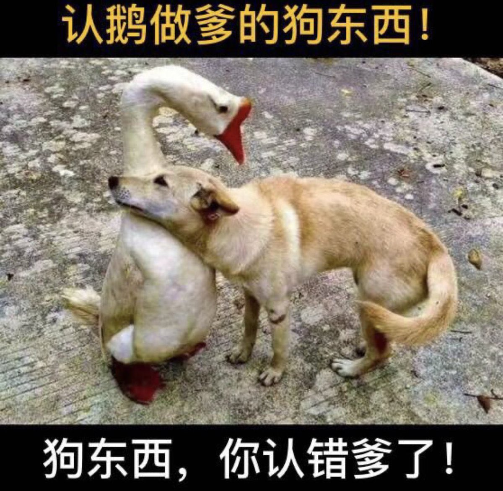

Ivy未央 北京时间 2023-09-18T11:07:32Z 1703606654032294288 抗战时，美国是中国最大的援助国。不仅提供大量财力物力，还派出空军，直接参与抗战。美国在太平洋击垮日本，更最终导致日军退出中国。中共建政之后却忘恩负义，投向苏联怀抱，粗暴驱逐美国驻华使节。金日成一手挑起朝鲜战争后，中共听苏联的派出军队，与美军直接交手。从此，认俄做爹，中美对立。 https://t.co/9ZQfITRTPh   Ivy未央 北京时间 2023-09-18T11:15:27Z 1703608648444875010 中国人失业了不骂中共政府却骂美国，洪涝灾害损失惨重还是骂美国，骂美国能转移所有的矛盾和问题，有这样的人民，中共能不继续奴役中国吗？   