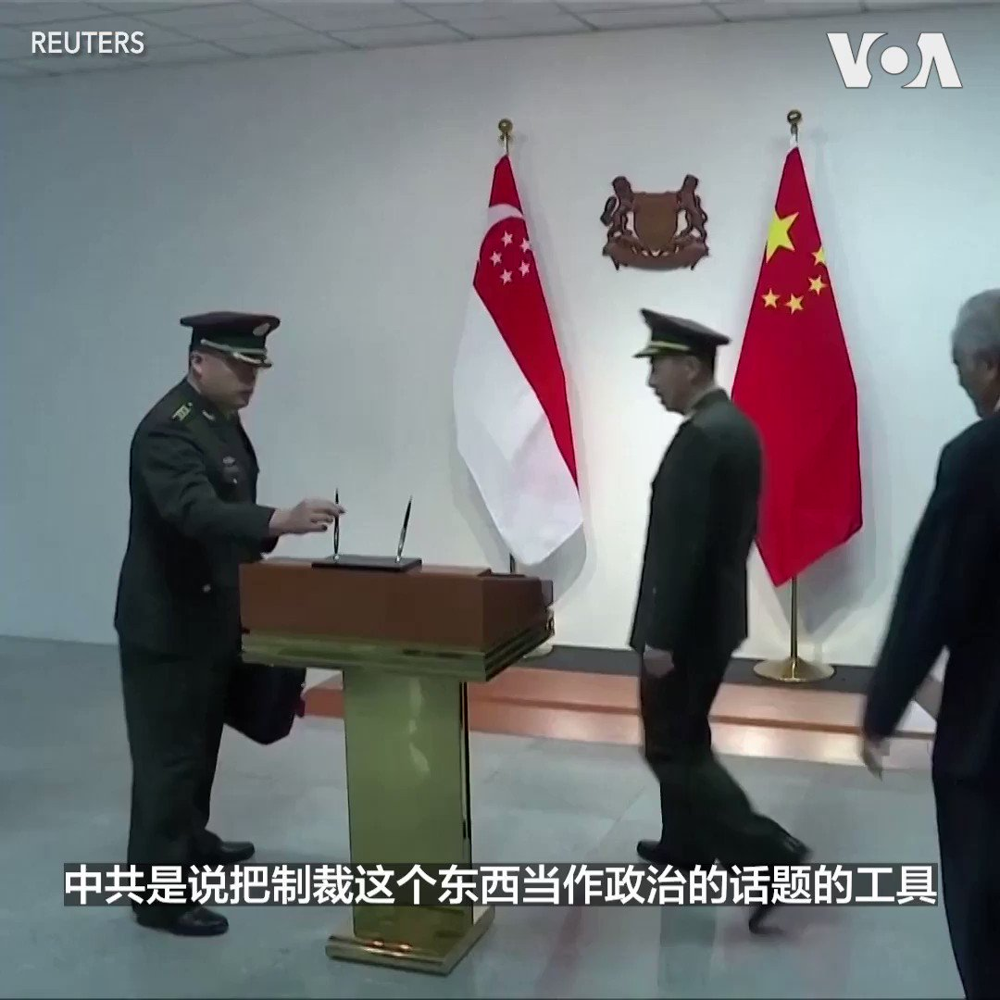

美国之音中文网 北京时间 2023-09-18T23:21:26Z 1703791347839156454 5名被伊朗扣押的美国人9月18日乘飞机离开伊朗首都德黑兰。美国与伊朗政府此前经过旷日持久的谈判达成了囚犯交换协议。作为交换，美国同意释放5名伊朗人，其中3人选择不返回伊朗。该协议还将解禁此前被冻结的大约60亿美元伊朗资金。 https://t.co/o7pK7qvIAg   美国之音中文网 北京时间 2023-09-18T23:24:06Z 1703792017741168927 中国房企巨头碧桂园再次面临1500万美元票息支付期限 https://t.co/sqI655KUn6   美国之音中文网 北京时间 2023-09-18T23:24:10Z 1703792033977278763 财富管理经理周末被拘，恒大股价周一曾暴跌25% https://t.co/u4TWZ9fDFO   美国之音中文网 北京时间 2023-09-18T21:00:23Z 1703755851058561477 9/18【#时事大家谈】外长防长接连失踪，怎么看中共近期的官场震动？美德外长齐批北京独裁，中国渐成西方最大威胁？

嘉宾：美国资深媒体人魏碧洲；台湾政治大学国际关系研究中心资深研究员宋国诚。
主持人：许波

Youtube🔗 https://t.co/a7S4cLDG06 https://t.co/23TfM3AVy1   美国之音中文网 北京时间 2023-09-18T21:26:06Z 1703762323532591258 金正恩结束访俄满载而归，俄向其赠送步枪、防弹衣和无人机涉违反联合国制裁 https://t.co/g3xgZ6sDF7   美国之音中文网 北京时间 2023-09-18T21:29:10Z 1703763095406137725 中俄加强能源领域合作 共同投资50亿人民币兴建石油转运综合体 https://t.co/W3aTNsYzGe   美国之音中文网 北京时间 2023-09-18T20:14:07Z 1703744206014177514 黄浦江封：北京政权命系一线：王毅马耳他会沙利文寻求缓和 https://t.co/trFYhadsI4   美国之音中文网 北京时间 2023-09-18T13:49:06Z 1703647313816932418 气候峰会即将召开 成千上万的人在纽约游行 https://t.co/K3tpJvE0bi   美国之音中文网 北京时间 2023-09-18T16:33:11Z 1703688606039318937 曾公开质疑IAEA的权威性 中国辩称未受邀参与对日本福岛处理水排海的认证 https://t.co/HJzvuLj4xI   美国之音中文网 北京时间 2023-09-18T16:49:34Z 1703692728763326767 欧盟严重依赖中国电池 犹如俄乌战前依赖俄罗斯能源 https://t.co/mAfRsB1TwQ   美国之音中文网 北京时间 2023-09-18T17:20:05Z 1703700408777200008 习近平再被称是独裁者 中国“强烈不满”德国外长言论 https://t.co/NrMIcaq50J   美国之音中文网 北京时间 2023-09-18T13:57:32Z 1703649435383681486 “中华民国坚持自由民主制度，也是主权独立的，”国民党总统参选人、新北市长侯友宜9月17日在大华盛顿地区的侨宴上发表演讲说。侯友宜表示，明年台湾总统大选各界最关注的议题就是台海两岸是否安全稳定。他说，台湾要和中国大陆对话，也要和美国持续深化关系，发展实力，以实力来确保和平。 https://t.co/0BkJxXt2pR   美国之音中文网 北京时间 2023-09-18T14:34:06Z 1703658638387396977 台湾军方称103架次共机抵近飞行 促中国立即停止“破坏性单边行为” https://t.co/ohVL1iJiDg   美国之音中文网 北京时间 2023-09-18T15:34:06Z 1703673739093897603 王毅访问俄罗斯谈战略安全 美国表达关切 https://t.co/q1IVQfxYcz   美国之音中文网 北京时间 2023-09-18T10:34:24Z 1703598316154479054 虽然外界认为李尚福消失事件可能让中国再也没法以李尚福遭制裁为由而拒绝与美国国防部长会面，但接受美国之音采访的分析人士普遍认为，就算中国换了一个新防长，也不代表美中防长的会面将一帆风顺。报道： https://t.co/T6ZMIslGt8 https://t.co/fW5kvA6v4y   美国之音中文网 北京时间 2023-09-18T12:31:05Z 1703627682070802504 欧盟对中国电动车启动反补贴调查 王毅访欧吁抛弃保护主义 https://t.co/P0MCYqkbbh   美国之音中文网 北京时间 2023-09-18T14:18:34Z 1703654731040858127 破纪录103架次共机骚扰台海 台湾国防部指责北京恶化区域安 https://t.co/zHQna4wGHX   美国之音中文网 北京时间 2023-09-18T11:59:33Z 1703619745155793203 北约秘书长：“必须为长期的乌克兰战争做准备” https://t.co/JGQl0bdKnW   美国之音中文网 北京时间 2023-09-18T10:14:11Z 1703593229005046029 纽约数万人上街游行 要求结束化石燃料 迎接联合国气候峰会 https://t.co/8glnyxuKsk   美国之音中文网 北京时间 2023-09-18T06:26:34Z 1703535945843429390 美国汽车工人继续罢工 https://t.co/x2khUG6xB6   美国之音中文网 北京时间 2023-09-18T06:39:33Z 1703539215429247351 李尚福的“消失”对美中军事关系的影响为何？ https://t.co/1OosVws9Nm   美国之音中文网 北京时间 2023-09-18T07:00:01Z 1703544364360724738 两位副国级内阁大员两个月内相继失踪，一个大军种的高级将领被连锅端，中共官场近期出现了罕见的人事动荡和丑闻。秦刚李尚福为何丢官？习家军接连折将丢了谁的面子？美国国务卿称中国正走向独裁，德国外长称习近平为独裁者，西方国家对北京独裁和威胁已有共识？请看周一时事大家谈并留言互动。 https://t.co/YHHOD5eo4s   美国之音中文网 北京时间 2023-09-18T08:13:09Z 1703562768270676225 特朗普：“不太可能”，但并不排除赦免自己 https://t.co/jJDe7fL3xb   美国之音中文网 北京时间 2023-09-18T08:25:09Z 1703565788026917210 习近平“着魔”于安全问题，国安部高调为中国外交指明方向 https://t.co/jOL2SXnfe4   美国之音中文网 北京时间 2023-09-18T05:28:06Z 1703521232782774535 中国警方拘留恒大财富管理部分人员 https://t.co/ZqigvBj4pL   美国之音中文网 北京时间 2023-09-18T00:26:35Z 1703445353801171149 白宫国安顾问沙利文在马耳他会晤中办主任王毅 https://t.co/7gVSWhBDQv   美国之音中文网 北京时间 2023-09-18T04:00:11Z 1703499106671596025 美印的“经济走廊”不是“画大饼”，未来可能威胁到中国 https://t.co/wkNUhlHyZL   美国之音中文网 北京时间 2023-09-18T00:57:06Z 1703453032737046657 谭德塞敦促中国允许第二批专家组全面进入调查新冠病毒起源 https://t.co/GdSvq8UX5f   