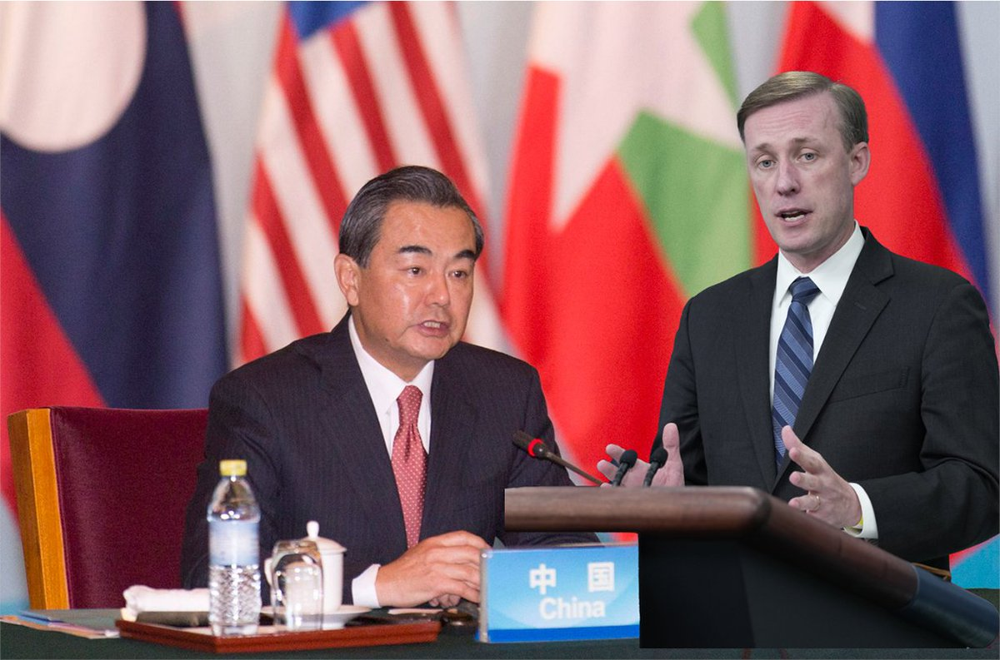
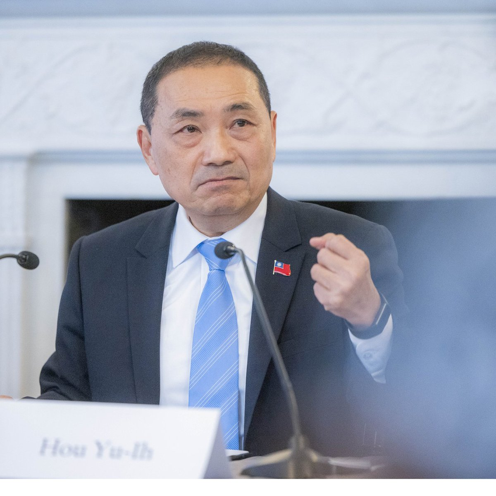
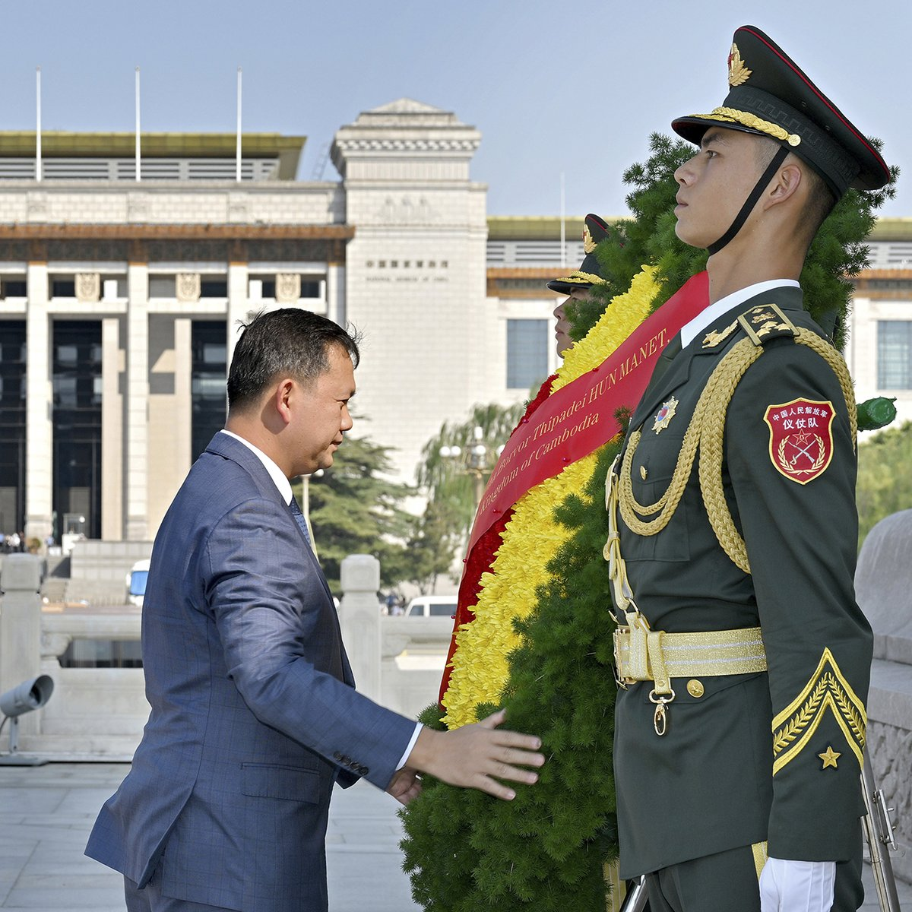
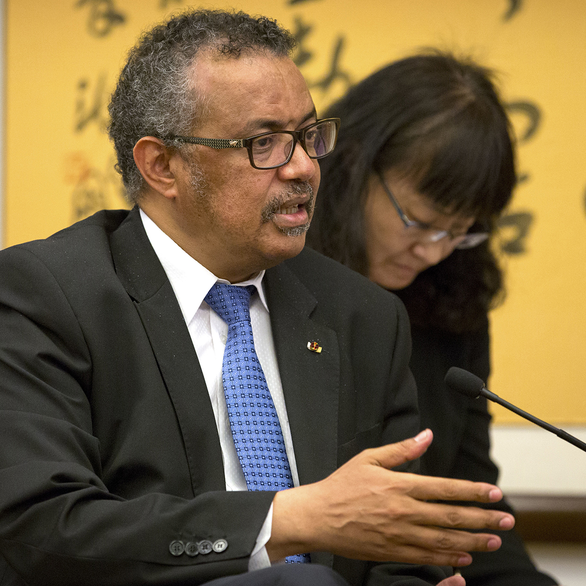

自由亚洲电台 北京时间 2023-09-18T05:02:48Z 1703514866063909137 【“雪饼案”即将开庭】独立记者 #黄雪琴 与劳工活动人士 #王建兵 被控“#煽动颠覆国家政权”一案将于9月19日，在广州中级法院召开庭前会议。黄雪琴曾任《南都周刊》记者，关注性别平权、官员贪腐等议题，王建兵曾加入广州恭明社会组织发展中心，关注职业病工人的权益倡导。
https://t.co/qvhrILU1Bl https://t.co/6ab0FCUhnp   自由亚洲电台 北京时间 2023-09-18T07:58:22Z 1703559047755051470 【伸伸筋骨也有罪?】人权活动人士 #张宝成 因八月在天安门广场 #竖中指 拍照，遭警方以涉嫌“#寻衅滋事罪”刑拘并与外界失联。上周五获取保候审，现已回家。
https://t.co/XT2VZTOWU1 https://t.co/356exztK8H   自由亚洲电台 北京时间 2023-09-18T05:55:22Z 1703528094156374184 【来去匆匆】白宫和中国外交部同日通报，美国国家安全顾问 #沙利文 与中国外长 #王毅 于9 月 16 日至 17 日举行了会晤，可能为美国总统拜登与中国国家主席习近平在今年会面奠定基础。
https://t.co/Mvl1B97oSv https://t.co/n5SmxAUIUo   自由亚洲电台 北京时间 2023-09-18T01:09:13Z 1703456083426021834 【侯友宜抵达华府，会讲多D台海战略？】 #台湾大选 国民党总统参选人 #侯友宜 开始华盛顿访问，预计9月18日将发表有关 #两岸问题 的演说，对外公开其“#3D战略”，Deterrence（阻吓), Dialogue（对话）De-escalating (降险）。
https://t.co/Q7J2f3XAtl https://t.co/5RiZQbUNNO   自由亚洲电台 北京时间 2023-09-18T02:30:49Z 1703476619824841100 【金正恩或朝拜中国，妹妹开路哥哥跟随?】韩联披露，#金正恩 有可能以23日开幕的杭州 #亚运会 为契机会晤中国国家主席习近平。舆论推测，金正恩一向使用火车，而杭州距离平壤较远，因此他可能先派出妹妹 #金与正 中方进行协调，之后乘列车前往北京或东北地区同中方举行首脑会谈。
https://t.co/3j0WJUCHLC   自由亚洲电台 北京时间 2023-09-18T03:23:48Z 1703489950581198927 【柬埔寨感谢中国援助，称台湾为中国内政】#柬埔寨 首相洪玛奈近日到访北京，与习近平会谈后发表《联合公报》，感谢中方长期为柬发展提供的帮助，又称认同台湾是中国领土不可分割的一部分是中柬“#命运共同体”的核心要义，引发台北抨击。
https://t.co/sGDRMNwWYt https://t.co/A9Ps4n5mtL   自由亚洲电台 北京时间 2023-09-18T01:39:10Z 1703463621420867600 【疫情已然四年，现在急有用吗?】世卫(WHO)总干事 #谭德赛 本周日再次敦促中国提供 #新冠疫情 全部信息和准入权限，并准备派遣第二支世卫团队重启病毒溯源调查。并且要求各国在与北京会晤时敦促中方合作。
https://t.co/ssBcn8W5wr https://t.co/3ZPsBTXCoG   