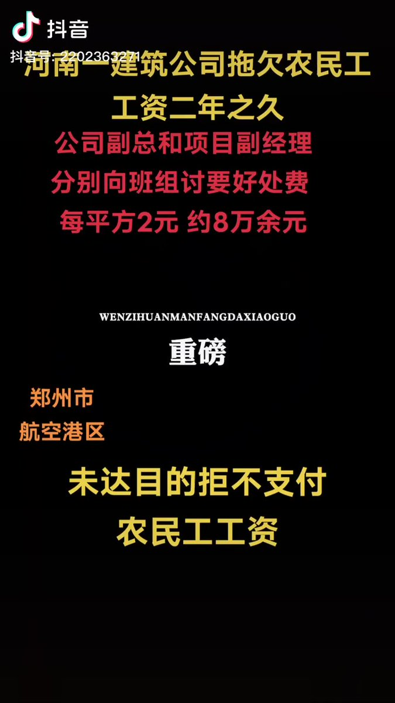

谁将十万横扫三江 北京时间 2023-09-18T08:38:12Z 1703569071839613278 河南省郑州市，一小区项目装修时期拒不支付工人工资。反应情况到当地劳动监察部门后无果
时间：2023-09-11
介绍：
【（选自原作者视频描述）河南一建筑公司，郑州市航空港区龙中金源小区项目部。公司副总和项目部副经理分别向班组长讨要好处费每平方2元，约8万余元，未达目的拒不支付农民工工资，两年来工人多次到郑州市郑港办事处劳动监察部门反映情况，并举报到国务院农民工讨薪平台。而郑港办事处劳动监察部门在没有充分调查了解，也没有积极处理的情况下让工人去法院起诉。】
地点：河南省-郑州市-中牟县-航空港区凌霜街中建森林上郡东侧约140米
行业：建筑业/室内装修
项目名称：龙中金源小区项目
公司名称：河南港鼎建筑工程有限公司
企业性质：民营企业
行动类型：请求劳动司法等机关介入
诉求：欠薪
参与人数：1-100
官方反应：相关部门不作为
资料来源：
https://t.co/E6NwvknHPL
https://t.co/JFLKYDQy1d
https://t.co/gNALXT46Ta
https://t.co/BGDyjA86KZ   谁将十万横扫三江 北京时间 2023-09-18T08:44:59Z 1703570778904474079 美国一点都不民主😒他只想连任他有什么错 https://t.co/gu0NswqnjM   