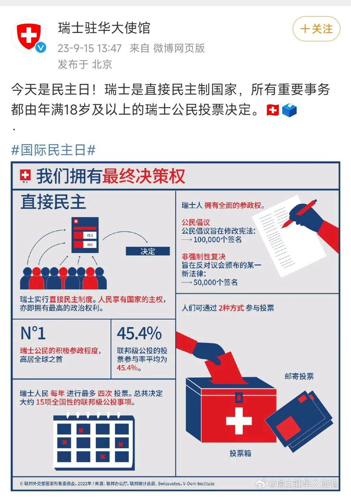
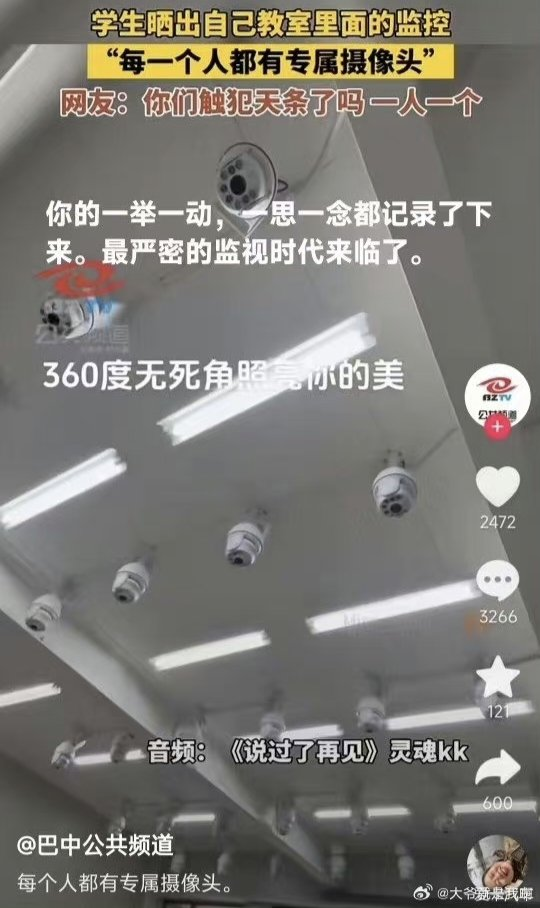

谁将十万横扫三江 北京时间 2023-09-18T20:45:49Z 1703752184821911855 辽宁省沈阳市，一楼盘项目拖欠工人工资，工人前往该楼盘营销中心静坐讨薪
时间：2023-09-18
地点：辽宁省-沈阳市-和平区-和平南大街101号（阳光城和平101营销中心）
行业：建筑业/住宅
公司名称：辽宁高校后勤集团房地产开发有限公司
企业性质：台港澳与境内合资
项目名称：阳光城·和平101
行动类型：静坐
诉求：欠薪
参与人数：1-100
官方反应：警察出动
资料来源：
https://t.co/a6N6biozv7
https://t.co/VbvhuApzPS
https://t.co/Rxk3SUYcGx

#欠薪事件   谁将十万横扫三江 北京时间 2023-09-18T21:54:06Z 1703769368511811584 RT @jakobsonradical: 近日，瑞士大使馆在微博上庆祝世界民主日，并科普自己的民主制度，表示所有重大事务由年满18岁的全体公民决定。结果被网友怒骂“虚伪民主”。 https://t.co/xqJqIkQwKk   谁将十万横扫三江 北京时间 2023-09-18T20:43:05Z 1703751495714582587 新疆维吾尔自治区乌鲁木齐市，一小区项目拖欠工人工资，工人堵项目工地大门讨薪
时间：2023-09-18
地点：新疆维吾尔自治区-乌鲁木齐市-新市区-天津北路1166号（保利堂悦以北建设区域，友兴街与长沙路交汇处西南）
行业：建筑业/住宅
公司名称：中建新疆建工（集团）有限公司
企业性质：国有企业
项目名称：堂悦小区项目B地块
行动类型：其他
诉求：欠薪
参与人数：1-100
资料来源：
https://t.co/MbnsJQHV4z
https://t.co/w8g7GmB3Dr
https://t.co/dZCgINwf65

#欠薪事件   谁将十万横扫三江 北京时间 2023-09-18T21:08:24Z 1703757866140856426 RT @whyyoutouzhele: 自媒体时代，政府是如何做好宣传工作的？
针对《治安管理处罚法》的讨论，所有表达过反对意见的大V被全部统计成表格“拉清单”，下发全国各地网警部门，要求组织动员体制内人员前往它们的评论区进行控评（如图4）。
也就是说，你在热门社会话题下方所看…   谁将十万横扫三江 北京时间 2023-09-18T22:04:05Z 1703771880212353064 河南省安阳市，一房产项目拖欠工人工资，工人拉横幅讨薪
时间：2023-09-18
地点：河南省-安阳市-北关区-平原路北段（市实验中学北侧）
行业：建筑业/住宅
开发商：安阳建业城市建设有限公司
承建公司：河南中获建设工程有限公司
企业性质：民营企业
项目名称：建业城三期 云著
行动类型：其他
诉求：欠薪
参与人数：1-100
资料来源：
https://t.co/0EK5CvANtY
https://t.co/T2vcYEdls8
https://t.co/hTbLccIm9U
https://t.co/KRZ9bA9R6K   谁将十万横扫三江 北京时间 2023-09-18T20:36:03Z 1703749726947156320 辽宁省沈阳市，沈阳铁路局沈阳工务机械段拖欠工人工资，推卸责任，工人现场拉横幅讨薪
时间：2023-09-18
地点：辽宁省-沈阳市-铁西区-虹桥路7号（沈阳铁路局沈阳工务机械段）
行业：建筑业/基础建设
公司名称：中国铁路沈阳局集团有限公司
企业性质：国有企业
行动类型：向劳动司法等机关反映/其他
诉求：欠薪
参与人数：1-100
资料来源：
https://t.co/HZQ7W4HXR5
https://t.co/rvehHIAV4h
https://t.co/xiqfmx0f4G
https://t.co/gZIBUPfE6z
https://t.co/4pIOksuEG1
https://t.co/zAeXMl4OPO
https://t.co/c6WwcVxrz5

#欠薪事件   谁将十万横扫三江 北京时间 2023-09-18T11:00:18Z 1703604834237022408 昨天晚上，示威者在伊朗各地勇敢地面对镇压。

伊朗政权在全国各地都部署了大批的警察，以防止在起义一周年之际再次爆发示威活动。

Qarchak女子监狱发生反叛行动。该监狱用来关押起义中被逮捕的政治犯。

在反对伊朗政权的起义中，至少有551名示威者被杀害，其中包括68名儿童和49名妇女。22,000人被捕。   谁将十万横扫三江 北京时间 2023-09-18T14:27:00Z 1703656852460834839 成都火车站，坐火车开箱开包搜查 https://t.co/8PAJe78hdJ   谁将十万横扫三江 北京时间 2023-09-18T10:58:06Z 1703604278584078680 RT @jakobsonradical: 9月14日拍摄于湖南某学校。只能说太可怕了，全景式监狱看到墙国学校这么做，都得直接下跪。 https://t.co/rnqQsYx81Z   谁将十万横扫三江 北京时间 2023-09-18T11:03:10Z 1703605555560890764 江西省南昌市,一建设工程公司承建-高速公路隧道项目拖欠工人工资，工人在公司门口拉横幅讨薪，后在公司现场爆发冲突
时间：2023-09-15
地点：江西省南昌市新建区望城新区玉壶山大道188号
行业：建筑业/基础建设
项目名称：鹤剑兰高速公路鹤剑2号隧道进口端项目
承建公司：核工业华东建设工程集团有限公司
施工公司：云南建投第二建设有限公司
企业性质：国有企业
行动类型：静坐/其他
诉求：欠薪
参与人数：1-100
资料来源：
https://t.co/t4CnHQ0ura
https://t.co/WQFGdcoOmV
https://t.co/l3EZLMkR6L   谁将十万横扫三江 北京时间 2023-09-18T08:03:36Z 1703560366926475752 RT @lilaoshizuikeai: 上海疫苗家长华秀珍的悲剧其实是很多人曾经内心最深处的恐惧——生一场病，遇上一场意外，两代人的人生就全完了。
而你的人生完了，却仅仅只是你悲惨遭遇的开始
你必须接受命运，不能有任何反抗，你的任何反抗都会造成你更加悲惨的命运。
为什么中国人…   谁将十万横扫三江 北京时间 2023-09-18T10:29:00Z 1703596957204123693 中国每年猝死55万人，如果是为了你的安全，那应该把劳动法的执法力度提高到现在的交通法一样，把医疗行业变成免费的民生工程，抓你罚款只是为了他的工资而已 https://t.co/fqNwMJugiU   谁将十万横扫三江 北京时间 2023-09-18T10:59:44Z 1703604692322803844 【生活成本抗议 - 瑞士】通货膨胀：2万人在瑞士伯尔尼示威，要求提高工资和养老金，以应对不断上涨的物价。 https://t.co/C67pmGNyJU   谁将十万横扫三江 北京时间 2023-09-18T11:01:36Z 1703605163095646650 【气候危机 - 法国】大雨过后，圣马丹－德隆德尔洪水泛滥。昨天下午开始，埃罗省已进入红色警戒状态。 https://t.co/8LhZkQLUGO   谁将十万横扫三江 北京时间 2023-09-18T11:04:41Z 1703605938442117598 山东省滨州市，一建材公司拖欠工人工资，工人拉横幅讨薪
时间：2023-09-16
地点：山东省滨州市滨城区杜店街道滨州经济开发区黄河六路215号
行业：制造业/建材
公司名称：山东瑞峰新型环保建材有限公司
企业性质：民营企业
行动类型：其他
诉求：欠薪
参与人数：1-100
资料来源：
https://t.co/yvxtpWTKc9
https://t.co/8gtflLBqv2   谁将十万横扫三江 北京时间 2023-09-18T08:24:45Z 1703565688646852953 RT @ziyang8964: #九一八 #国耻
纪念在九一八贵州大巴事件中死难的27名平民🕯️🕯️🕯️
勿忘国耻，吾辈自强！
愿如此耻辱永远不会再在中华大地上出现🙏🙏🙏 https://t.co/8bsIuvags8   谁将十万横扫三江 北京时间 2023-09-18T08:40:48Z 1703569725593121247 RT @Captxueinshai: 月薪一万以上的人数，退休的比工作的多，凭这一点，这个国家就没戏了。政府、事业单位退休人员拿那么高的退休金，无非是加重企业负担所得，是这个人群利用手中的权力，通过立法获得的不义之财。
当然，我家这样的钱没少拿，所以第一次批评。 https:/…   谁将十万横扫三江 北京时间 2023-09-18T09:25:35Z 1703580999601275067 9月17日广东，公安限制这些人出境，没任何不良记录 https://t.co/Ujigt0n0FN   谁将十万横扫三江 北京时间 2023-09-18T09:30:15Z 1703582172630663466 网红＂广州区伯＂于9月17日因病逝世，享年70岁。他因监督公车私用闻名，被称为＂全国监督公车私用第一人＂ https://t.co/o1t5t16CUw   谁将十万横扫三江 北京时间 2023-09-18T08:04:21Z 1703560554218922260 山东省临沂市，一环境治理工程项目越界超采盗采和拖欠挖掘机人员工程款，上访及举报无果
时间：2022-10-15～2023-09-17
介绍：
【兰山区自然资源局，山东地矿开元勘探施工总公司，层层转包相互推诿，我们讨要挖掘机工钱无门，恳请正义人士相关部门及媒体帮助】
地点：山东省临沂市兰山区茶芽山片区内
行业：采矿业
公司名称：山东地矿开元勘察施工总公司
企业性质：民营企业
项目名称：临沂兰山区茶芽山片区历史遗留废弃矿山地质环境治理工程项目
行动类型：上访/求助相关部门及媒体帮助
诉求：欠薪/司法、行政部门不公或腐败
参与人数：1-100
官方反应：警察出动/人员被打/政府不作为
资料来源：
https://t.co/3cq75zuOSL
https://t.co/RsLYCWiPF0
https://t.co/JQsazgQJEt
https://t.co/JhCYJnUXme
https://t.co/ku3tKqIjww
https://t.co/vah1P8TYkG
https://t.co/4SMYGF606U
https://t.co/t3ldlDH6rw   谁将十万横扫三江 北京时间 2023-09-18T08:27:42Z 1703566429646184867 RT @sheep1919810: 请选择你今天要勿忘的国耻 https://t.co/OBAGbvjQfC   谁将十万横扫三江 北京时间 2023-09-18T08:34:56Z 1703568250586402841 RT @whyyoutouzhele: 今天是贵州隔离大巴事件一周年
2022年9月18日凌晨，贵州黔南州一辆转运隔离的大巴车发生侧翻，导致27人遇难。
一年之后，我们所有人依然还在这辆大巴上。
遵从着“是有点搞笑但是需要服从”的指令，开向未知的前方。 https://t.co…   谁将十万横扫三江 北京时间 2023-09-18T08:38:12Z 1703569071839613278 河南省郑州市，一小区项目装修时期拒不支付工人工资。反应情况到当地劳动监察部门后无果
时间：2023-09-11
介绍：
【（选自原作者视频描述）河南一建筑公司，郑州市航空港区龙中金源小区项目部。公司副总和项目部副经理分别向班组长讨要好处费每平方2元，约8万余元，未达目的拒不支付农民工工资，两年来工人多次到郑州市郑港办事处劳动监察部门反映情况，并举报到国务院农民工讨薪平台。而郑港办事处劳动监察部门在没有充分调查了解，也没有积极处理的情况下让工人去法院起诉。】
地点：河南省-郑州市-中牟县-航空港区凌霜街中建森林上郡东侧约140米
行业：建筑业/室内装修
项目名称：龙中金源小区项目
公司名称：河南港鼎建筑工程有限公司
企业性质：民营企业
行动类型：请求劳动司法等机关介入
诉求：欠薪
参与人数：1-100
官方反应：相关部门不作为
资料来源：
https://t.co/E6NwvknHPL
https://t.co/JFLKYDQy1d
https://t.co/gNALXT46Ta
https://t.co/BGDyjA86KZ   谁将十万横扫三江 北京时间 2023-09-18T08:44:59Z 1703570778904474079 美国一点都不民主😒他只想连任他有什么错 https://t.co/gu0NswqnjM   