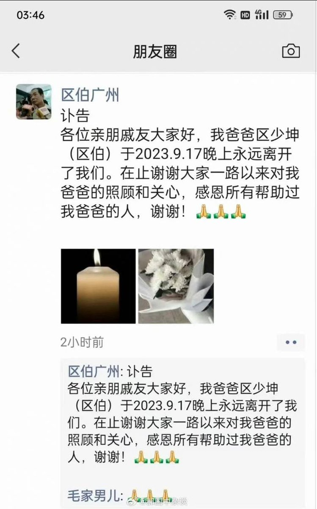

谁将十万横扫三江 北京时间 2023-09-18T09:30:15Z 1703582172630663466 网红＂广州区伯＂于9月17日因病逝世，享年70岁。他因监督公车私用闻名，被称为＂全国监督公车私用第一人＂ https://t.co/o1t5t16CUw   谁将十万横扫三江 北京时间 2023-09-18T08:04:21Z 1703560554218922260 山东省临沂市，一环境治理工程项目越界超采盗采和拖欠挖掘机人员工程款，上访及举报无果
时间：2022-10-15～2023-09-17
介绍：
【兰山区自然资源局，山东地矿开元勘探施工总公司，层层转包相互推诿，我们讨要挖掘机工钱无门，恳请正义人士相关部门及媒体帮助】
地点：山东省临沂市兰山区茶芽山片区内
行业：采矿业
公司名称：山东地矿开元勘察施工总公司
企业性质：民营企业
项目名称：临沂兰山区茶芽山片区历史遗留废弃矿山地质环境治理工程项目
行动类型：上访/求助相关部门及媒体帮助
诉求：欠薪/司法、行政部门不公或腐败
参与人数：1-100
官方反应：警察出动/人员被打/政府不作为
资料来源：
https://t.co/3cq75zuOSL
https://t.co/RsLYCWiPF0
https://t.co/JQsazgQJEt
https://t.co/JhCYJnUXme
https://t.co/ku3tKqIjww
https://t.co/vah1P8TYkG
https://t.co/4SMYGF606U
https://t.co/t3ldlDH6rw   谁将十万横扫三江 北京时间 2023-09-18T08:27:42Z 1703566429646184867 RT @sheep1919810: 请选择你今天要勿忘的国耻 https://t.co/OBAGbvjQfC   谁将十万横扫三江 北京时间 2023-09-18T08:34:56Z 1703568250586402841 RT @whyyoutouzhele: 今天是贵州隔离大巴事件一周年
2022年9月18日凌晨，贵州黔南州一辆转运隔离的大巴车发生侧翻，导致27人遇难。
一年之后，我们所有人依然还在这辆大巴上。
遵从着“是有点搞笑但是需要服从”的指令，开向未知的前方。 https://t.co…   谁将十万横扫三江 北京时间 2023-09-18T08:38:12Z 1703569071839613278 河南省郑州市，一小区项目装修时期拒不支付工人工资。反应情况到当地劳动监察部门后无果
时间：2023-09-11
介绍：
【（选自原作者视频描述）河南一建筑公司，郑州市航空港区龙中金源小区项目部。公司副总和项目部副经理分别向班组长讨要好处费每平方2元，约8万余元，未达目的拒不支付农民工工资，两年来工人多次到郑州市郑港办事处劳动监察部门反映情况，并举报到国务院农民工讨薪平台。而郑港办事处劳动监察部门在没有充分调查了解，也没有积极处理的情况下让工人去法院起诉。】
地点：河南省-郑州市-中牟县-航空港区凌霜街中建森林上郡东侧约140米
行业：建筑业/室内装修
项目名称：龙中金源小区项目
公司名称：河南港鼎建筑工程有限公司
企业性质：民营企业
行动类型：请求劳动司法等机关介入
诉求：欠薪
参与人数：1-100
官方反应：相关部门不作为
资料来源：
https://t.co/E6NwvknHPL
https://t.co/JFLKYDQy1d
https://t.co/gNALXT46Ta
https://t.co/BGDyjA86KZ   谁将十万横扫三江 北京时间 2023-09-18T08:44:59Z 1703570778904474079 美国一点都不民主😒他只想连任他有什么错 https://t.co/gu0NswqnjM   