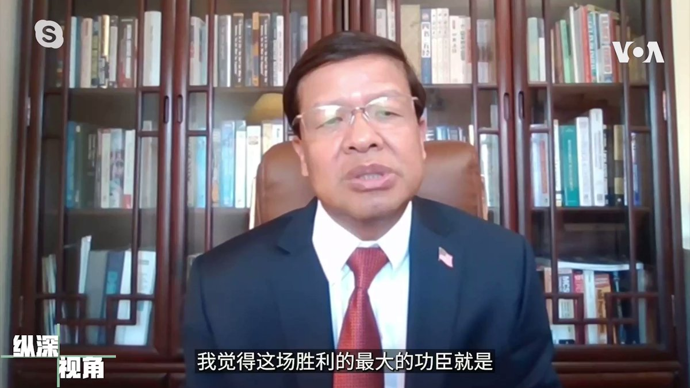

美国之音中文网 北京时间 2023-09-17T05:30:36Z 1703159472871665759 乌克兰：两艘货轮驶向乌克兰黑海港口装运粮食 https://t.co/HM1RKEmvGB   美国之音中文网 北京时间 2023-09-17T03:33:10Z 1703129920904565229 聿文视界：李尚福传涉腐，中共“存量腐败”让习防不胜防 https://t.co/qtB13Sfldc   美国之音中文网 北京时间 2023-09-17T00:30:06Z 1703083851067928651 解放军清理门户 习近平借查办李尚福向中共太子党宣战? https://t.co/q5j9SGkcdu   美国之音中文网 北京时间 2023-09-17T01:01:06Z 1703091652628549632 泽连斯基将首次现身联大，国际社会是否会因此更加分裂？ https://t.co/APWT3sawgi   美国之音中文网 北京时间 2023-09-17T01:52:06Z 1703104487068778720 中国推出“网络安全宣传周”分析：凸显内外安全焦虑 https://t.co/QTAgiV2kkC   美国之音中文网 北京时间 2023-09-17T02:00:49Z 1703106679502786915 社会活动家、亚裔教育联盟主席赵宇空说 ，哈佛败诉是因为布鲁姆先生领导的学生公平录取组织加入了亚裔抗争队伍，美国顶尖律师的加入和大量经济资源投入，还有新进入最高法院的三位大法官的作用以及作为平权法受害最深的亚裔受到了美国社会媒体的同情。#美国之音纵深视角：https://t.co/zNoT05NGUy https://t.co/6yLwQcyawy   美国之音中文网 北京时间 2023-09-17T02:20:35Z 1703111653364236752 为因应越来越大的中国威胁，美国空天军计划进行重大改革调整 https://t.co/hVr77fgBq9   美国之音中文网 北京时间 2023-09-17T00:00:01Z 1703076281544228963 在过去的40年里，来自香港的老资格记者、学者林和立博士以他对中国的报道和研究而著称于世界媒体和中国研究学界。我最近采访了林和立博士，请他谈谈对习近平以及对中国政治的最新研究心得。我们的对话从他最近出版的新书开始，书名是《习近平，中国终身统治者的隐秘愿景》。https://t.co/kiVniMiJBA https://t.co/65Tu9dSyls   