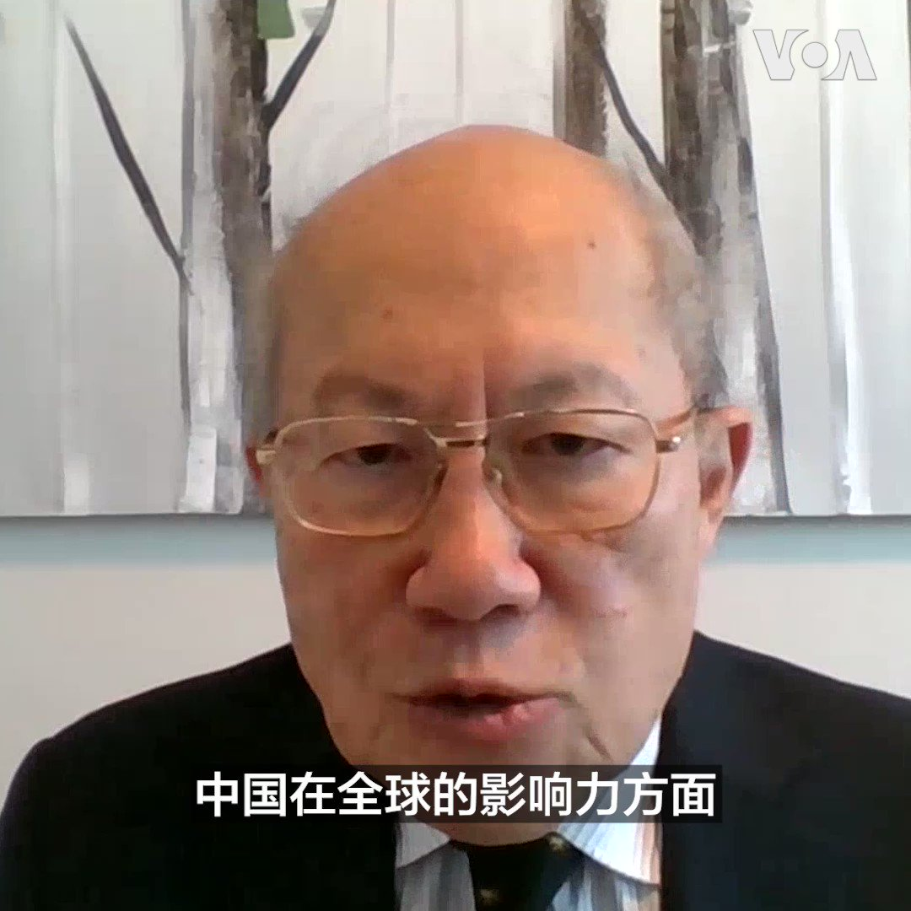

美国之音中文网 北京时间 2023-09-17T00:00:01Z 1703076281544228963 在过去的40年里，来自香港的老资格记者、学者林和立博士以他对中国的报道和研究而著称于世界媒体和中国研究学界。我最近采访了林和立博士，请他谈谈对习近平以及对中国政治的最新研究心得。我们的对话从他最近出版的新书开始，书名是《习近平，中国终身统治者的隐秘愿景》。https://t.co/kiVniMiJBA https://t.co/65Tu9dSyls   