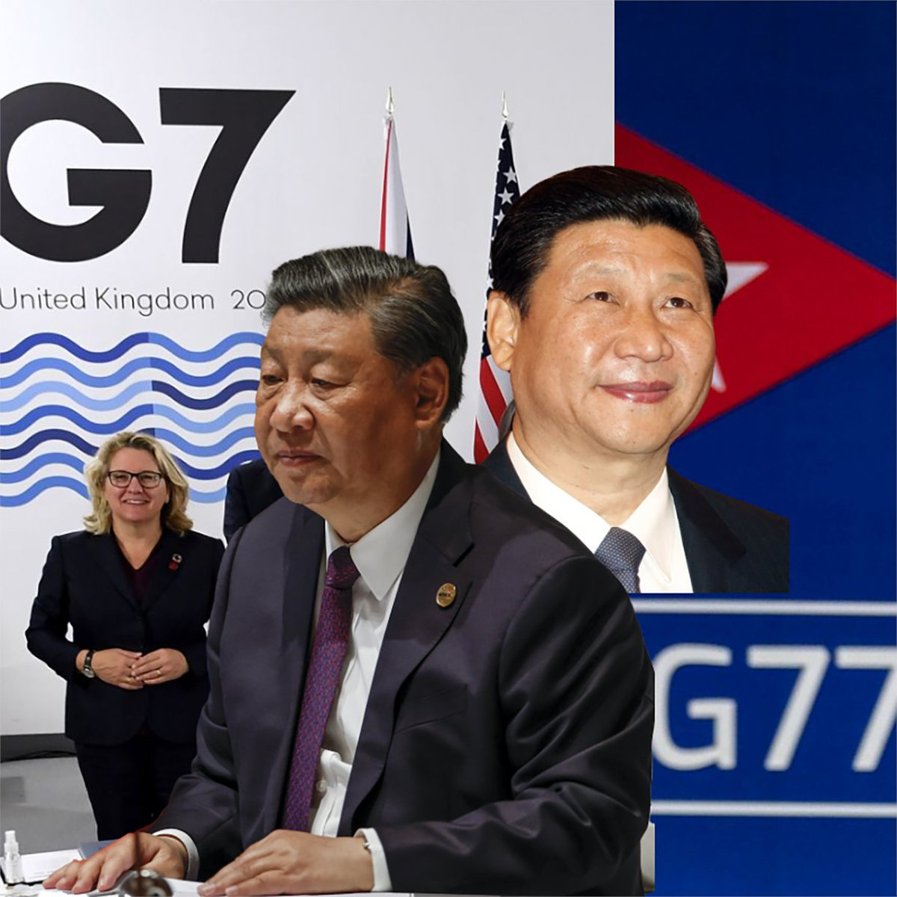
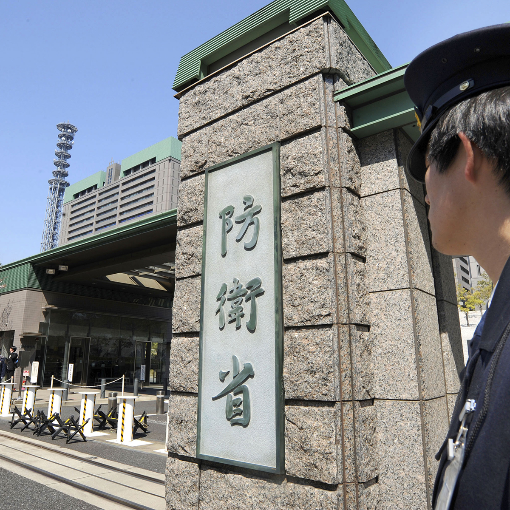
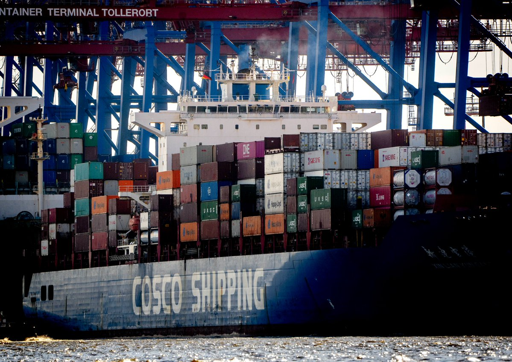
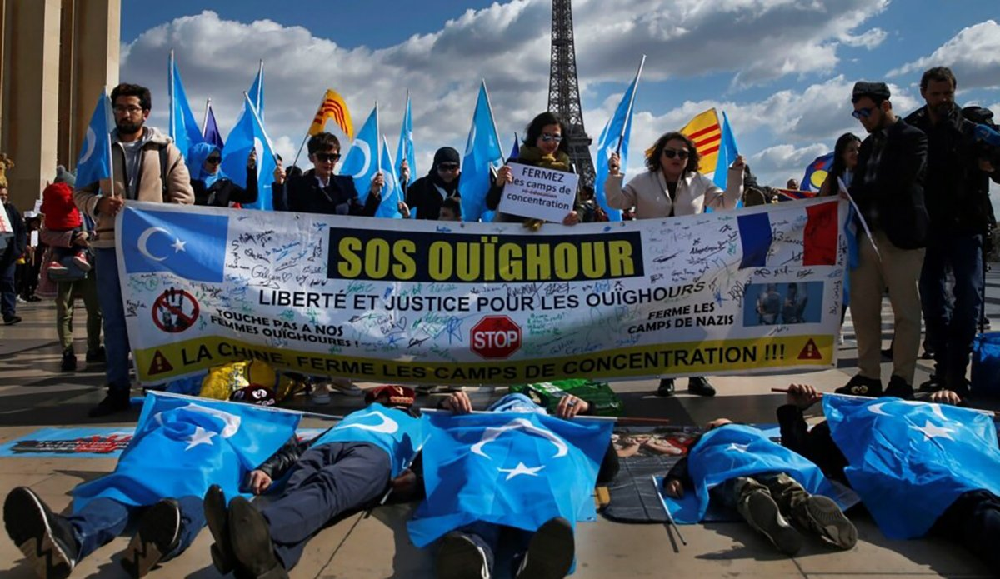

自由亚洲电台 北京时间 2023-09-17T20:46:23Z 1703389939793006793 RT @RFA_Chinese: 【为了房产，再苦的婚姻也过下去?】中国离婚人数连续3年减少，#房市低迷　据指是主因之一。专办离婚案件的律师表示现在房子难卖，夫妻要分割财产更加困难，进而影响离婚意愿。#财产分割　通常是棘手环节 -… https://t.co/WamNALrSY0   自由亚洲电台 北京时间 2023-09-17T10:53:45Z 1703240798236525046 【G7玩不了，G20不想玩，改玩G77？】由亚非拉国家组成的 “G77+中国”峰会16日在 #古巴哈瓦那 闭幕，呼吁“改变世界规则”，建立更能满足发展中国家的 #世界秩序。虽中国从未承认自己是成员国，但G77官网上将中国列为成员。李希致辞称中国“永远是南方国家”。
https://t.co/xqplaWrE63 https://t.co/G1rgDJATIK   自由亚洲电台 北京时间 2023-09-17T11:16:51Z 1703246609973170551 【9.12 ＃鞭炮案 五周年纪念日, 叶钟被捕】唐兆星、林兰英、＃叶钟、廖俊、林兰英、张秀苹、唐何宗旺、陈光、林后勤、吴宏福等11人在望江楼酒店吃饭时被 ＃国保 包围，搜查手机。叶钟被刑事拘留。
https://t.co/fncg0Jcx8P https://t.co/6wBlONqiq5   自由亚洲电台 北京时间 2023-09-17T11:43:21Z 1703253278840988156 【 数学题：中国造舰力是美国多少倍?】2021年海军研究所报告中国有超355艘舰艇；同年智库CSIS报告美国有296艘舰艇。
《财经内幕》杂志:　答案是232倍。 
https://t.co/yTdiLQxZTt https://t.co/RsTtBSYK99   自由亚洲电台 北京时间 2023-09-17T12:16:23Z 1703261591876084180 【日称解放军入侵其领海】据日本防卫省，#中国海军 舰艇９月15日侵入 ＃鹿儿岛县 口之岛海域，日本派出“三隈号”、“白鹰号”监视，并向中方表达强烈忧虑。
https://t.co/TmnaiUUAgv https://t.co/q2oqDKHaoG   自由亚洲电台 北京时间 2023-09-17T09:27:58Z 1703219211529531667 【德国以安全为重，有钱也不要】自2021年12月以来，德国政府审查了54宗中国对德国企业的收购和投资案。3宗被完全禁止，6宗受限制， 6宗自行放弃，7宗审查中止。#Cosco 公司在大大缩减资金规模后才获准投资 #汉堡港。
https://t.co/6fwDHPZkQ2 https://t.co/ai1y0hWvcv   自由亚洲电台 北京时间 2023-09-17T09:58:39Z 1703226932987355459 【对付金正恩, 空军还不够, 要太空军】美国计划在日本设立 #太空军（Space Force）指挥部，应对 #朝鲜核武 导弹发展动态。是继印太太空军和驻韩太空军后成立的又一太空部队。
https://t.co/Fa0NGRcy1g https://t.co/FPFkRXSez0   自由亚洲电台 北京时间 2023-09-17T07:20:46Z 1703187200152633733 【IMF给中国政府上经济课】＃国际货币基金组织（IMF）总裁格奥尔基耶娃在即将出炉的咨询文件中呼吁中国将#经济增长模式 转向专注提振国内消费，不再依赖债务基础设施投资和房地产。IMF希望中国提振疲弱的消费、正视房地产困境和#政府债务以及其他拖累全球经济增长的问题。https://t.co/RcPtN2LQ6F   自由亚洲电台 北京时间 2023-09-17T08:15:23Z 1703200942189928605 【为了房产，再苦的婚姻也过下去?】中国离婚人数连续3年减少，#房市低迷　据指是主因之一。专办离婚案件的律师表示现在房子难卖，夫妻要分割财产更加困难，进而影响离婚意愿。#财产分割　通常是棘手环节 - 随着离婚咨询的深入，谈到夫妻双方共同房产分割时，当事人的犹豫又多了一层。https://t.co/EcBChKRcKV   自由亚洲电台 北京时间 2023-09-17T08:21:07Z 1703202387605778934 【中国说维吾尔抗议属“种族歧视”？法国：Non】 去年法共人道报邀请中国驻法使馆参与活动，引发在法维吾尔社群抗议，向使馆展台喷洒红油漆。事后，中国驻法使馆向法国司法部门指控抗议民众中的维吾尔学者迪利奴尔女士犯有种族歧视罪与破坏财产罪。近日，司法部取消该指控。
https://t.co/7rPEPZej1r https://t.co/BAXWCy6yMc   自由亚洲电台 北京时间 2023-09-17T08:51:13Z 1703209962611044496 【网协重返中国，是出尔反尔？】＃网球职业女子锦标赛　将于九一八在广州举行，距离女子网球协会（＃WTA）发誓抵制中国还不到两年。2021年彭帅发帖称她遭前副总理张高丽性侵犯后，WTA于同年暂停了在华活动，并坚持在确保彭帅安全之前，不会在中国举办赛事。https://t.co/5UD9V4HSaQ https://t.co/fon8dpXkka   