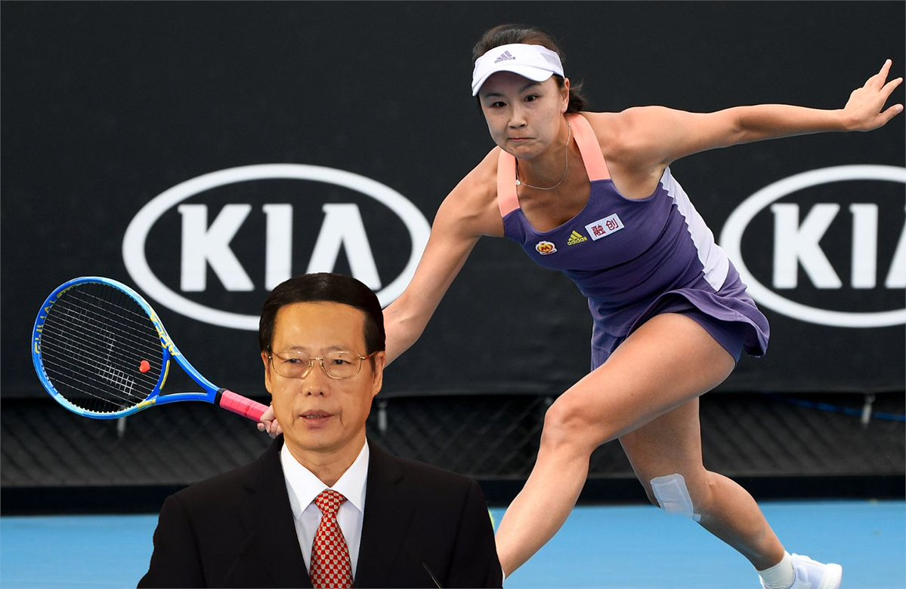

自由亚洲电台 北京时间 2023-09-17T08:51:13Z 1703209962611044496 【网协重返中国，是出尔反尔？】＃网球职业女子锦标赛　将于九一八在广州举行，距离女子网球协会（＃WTA）发誓抵制中国还不到两年。2021年彭帅发帖称她遭前副总理张高丽性侵犯后，WTA于同年暂停了在华活动，并坚持在确保彭帅安全之前，不会在中国举办赛事。https://t.co/5UD9V4HSaQ https://t.co/fon8dpXkka   