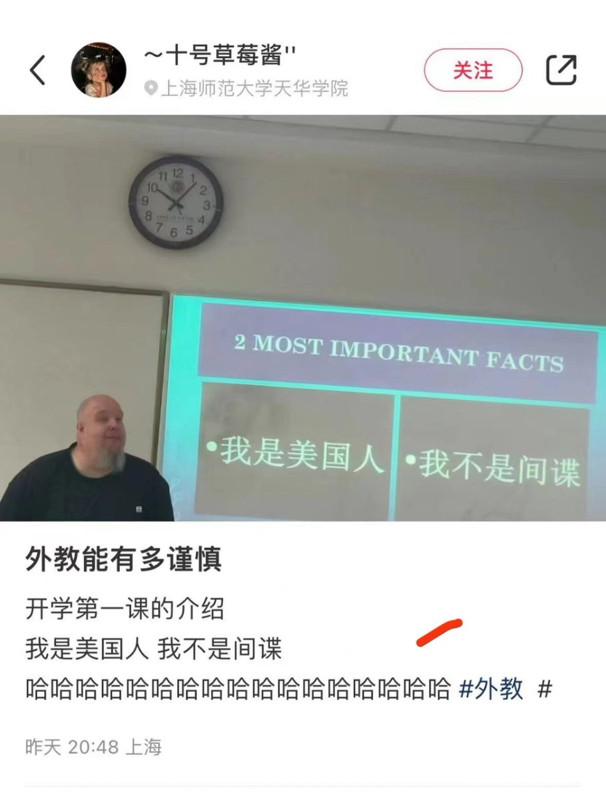
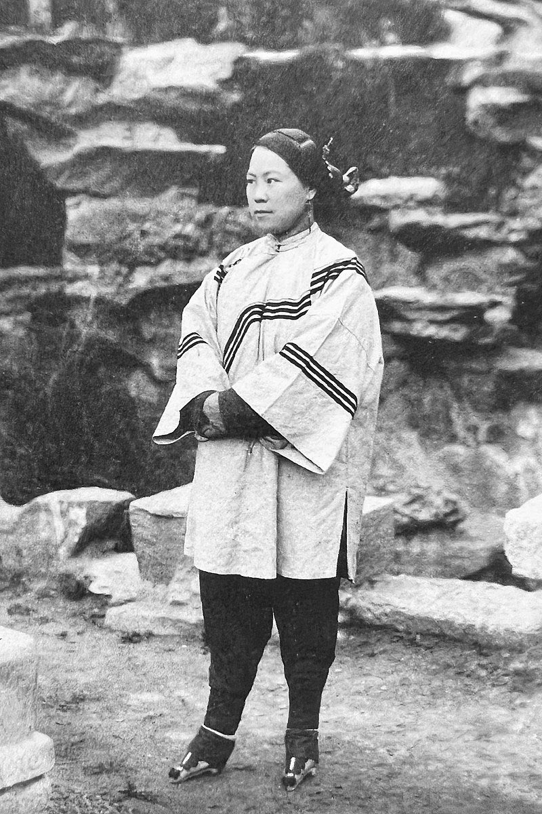
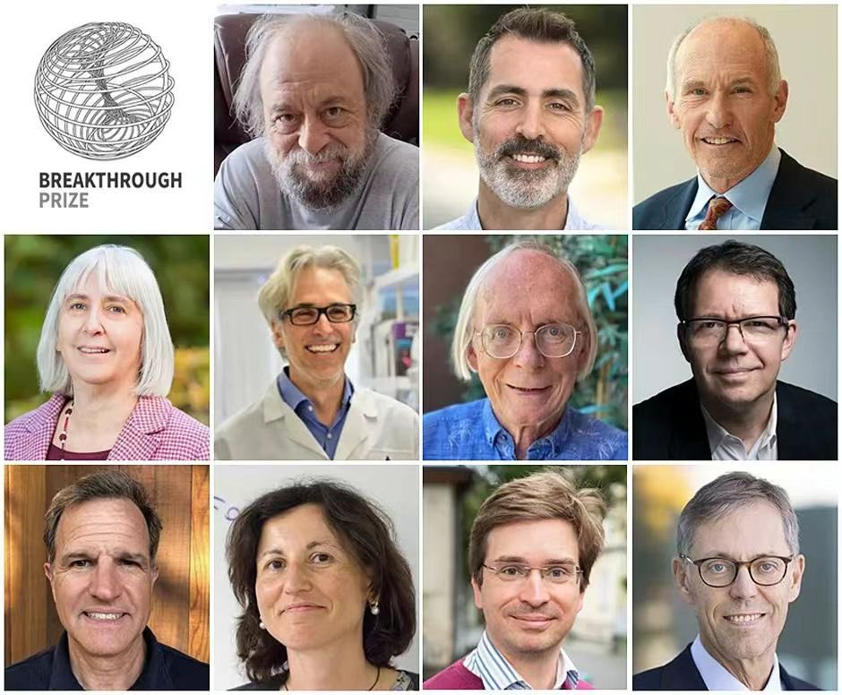
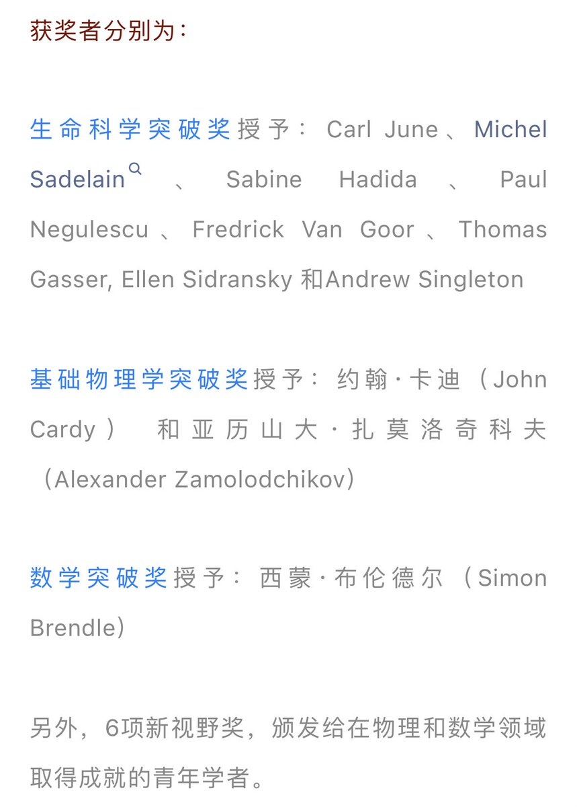

Petrichor 北京时间 2023-09-16T10:49:58Z 1702877455642444038 武大郎、潘金莲、西门庆，凑齐了。 https://t.co/7x3JOmbuEa   Petrichor 北京时间 2023-09-16T10:44:38Z 1702876117395263855 最绝的是最后一句！
可是他们人民政府的官员叫人民代表、在人民大会堂开会、受贿收的是人民币。 https://t.co/quLF0Rbcu3   Petrichor 北京时间 2023-09-16T10:53:29Z 1702878344063115442 开学了，外国人学中文，第一课：“我是xx国家人，我不是间谍”。 https://t.co/STcInDYU3a   Petrichor 北京时间 2023-09-16T07:35:27Z 1702828506562863369 钱袋空那位没有去 https://t.co/QrRJfKzsaa   Petrichor 北京时间 2023-09-16T05:09:49Z 1702791856256352450 你们知道这些是什么工具吗？抓大龙虾🦞的。 https://t.co/furx2ffXwa   Petrichor 北京时间 2023-09-16T05:28:03Z 1702796444397166820 你去日本、台湾、欧美等国家，你见不到这样牙齿残缺的老人。毛泽东好、共产党好、习近平好，但他们都没有给你带来富裕和尊严，你依然没有牙医和护理。可怜、可悲！ https://t.co/F8u4EXihGw   Petrichor 北京时间 2023-09-16T03:13:31Z 1702762588549816816 古代裹脚只裹妇女，现在裹脑男女老少都裹。 https://t.co/AxQt3PH4Nb   Petrichor 北京时间 2023-09-16T00:15:54Z 1702717891416596990 今年科学突破奖(Breakthrough Prize) 的得主，没有中国人。中国大学最多、研究所最多、研究人员最多、研究经费全球第二。但是，真正的科学突破几乎没有。为什么？总不能总是归因于体制？

该奖创立于2012年，由俄罗斯亿万富翁尤里·米尔纳夫妇、谷歌（google）联合创始人谢尔盖·布林夫妇、阿里巴巴集团创建人马云和张瑛夫妇、脸书（Facebook）联合创始人马克·扎克伯格夫妇、以及苹果公司董事长亚瑟·莱文森等知名实业家共同设立，旨在表彰在生命科学、数学和基础物理学领域做出杰出贡献的人士。

科学突破奖的奖金十分丰厚，堪称科学界“第一巨奖”，并被誉为“科学界的奥斯卡”。其中，生命科学、基础物理学和数学突破奖三大奖项的获奖者，每人可获得300万美元奖金。   