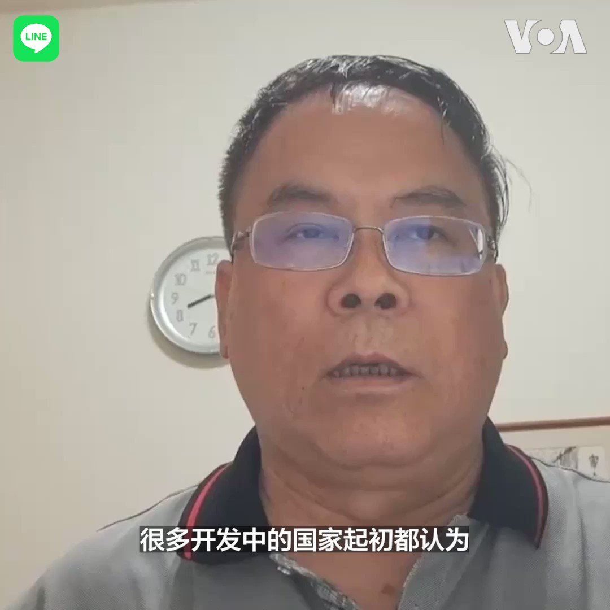
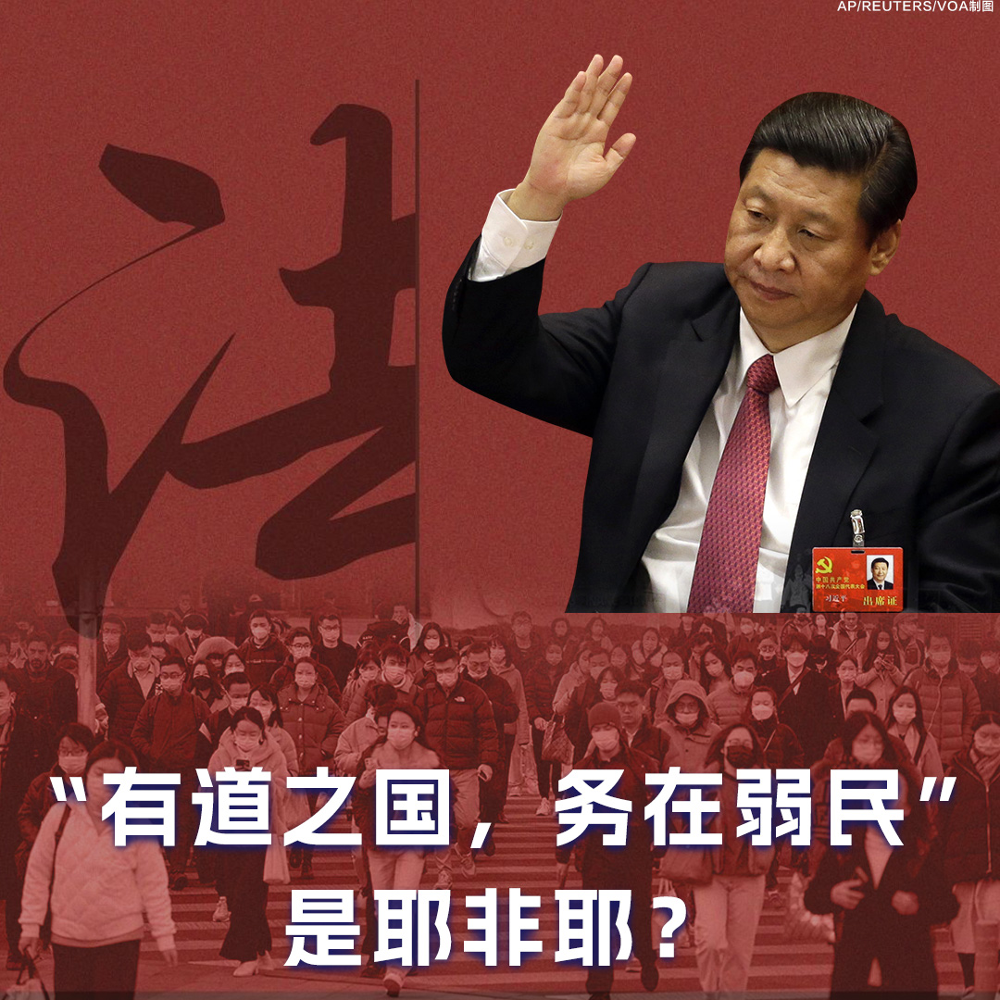
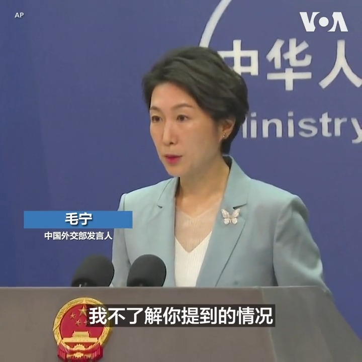
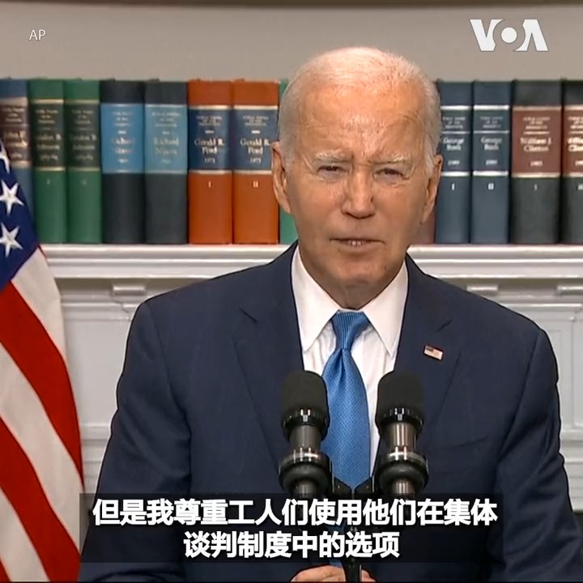
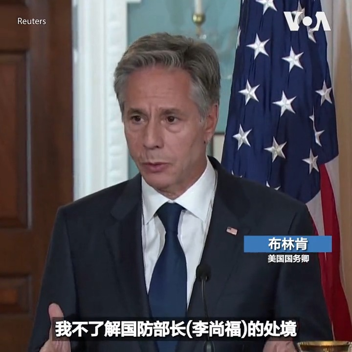

美国之音中文网 北京时间 2023-09-16T12:36:00Z 1702904140568129809 一键解锁#美国热搜 榜：1、美官员证实李尚福已经被撤职，王毅会是下一个吗？2、大厂低薪雇佣技校实习生训练AI，人肉芯片加持中国人工智能 3、河南大学生乘核酸检测车下农村 4、丢掉斗争，准备幻想 5、列车车厢里的批斗会 6、被独裁者习近平逼疯了的人工智能小助手 7、叙利亚球迷对阵中国保安 https://t.co/mx6zixLDMU   美国之音中文网 北京时间 2023-09-16T13:03:13Z 1702910992370618501 陪护病危严正学 异议艺术家季风遭北京国保私刑死亡威胁 https://t.co/HZPEO2l99z   美国之音中文网 北京时间 2023-09-16T11:34:35Z 1702888685518385463 拜登下周在白宫会晤泽连斯基 将向乌克兰提供更多援助 https://t.co/coJF2djaAY   美国之音中文网 北京时间 2023-09-16T12:08:53Z 1702897318188458380 台湾2024年总统大选国民党参选人、新北市长侯友宜9月15日在纽约拜访中华公所时表示，他参选 “最主要是要捍卫中华民国，保护台澎金马这块土地上的人民”，强调其与执政的民进党“去中国化”路线的不同。详细内容：https://t.co/1PeJp7u5FJ https://t.co/eKx730DYRH   美国之音中文网 北京时间 2023-09-16T09:52:13Z 1702862924048683187 联大开幕在即，全球南方关注发展，拜登将继续号召支持乌克兰 https://t.co/mSkanlXET4   美国之音中文网 北京时间 2023-09-16T06:42:05Z 1702815077131595798 北京宣布派韩正出席联大会议，习近平不来赴会，王毅似乎亦将缺席 https://t.co/cOzq1EeBBm   美国之音中文网 北京时间 2023-09-16T07:13:05Z 1702822876330573911 台湾战略专家表示，在经济攻势下与台湾结束外交关系转向中国的开发中国家未必有得到实质帮助。国际法学者认为，台湾可以积极参与欧美提出的计划，因应中国一带一路的攻势。报道： https://t.co/M9wnvOkyMk https://t.co/6zqn71L3Lc   美国之音中文网 北京时间 2023-09-16T07:53:05Z 1702832945340559661 门庭冷落盼回春：香港试图重新吸引中国大陆游客 https://t.co/FYd7Xpx7TB   美国之音中文网 北京时间 2023-09-16T08:10:00Z 1702837199706972208 【家事国事天下事，你有何见解】中国宣布再度对台湾居民开放团队旅游。让台湾居民成群结队地观赏世界主要媒体和社交媒体都被封锁、百姓对领导人只能唱赞歌不得发批评否则就要下狱的当今中国，这种威慑会增加台湾人对中国的向心力，还是会促使他们痛感中国已与台湾渐行渐远？中国怎样能令台湾人有好感？ https://t.co/UgIVdBK0hW   美国之音中文网 北京时间 2023-09-16T08:22:09Z 1702840259690770920 真假佛牌：中国游客重返泰国，针对他们的诈骗也随之而来 https://t.co/1pxUW5zyXu   美国之音中文网 北京时间 2023-09-16T08:30:00Z 1702842234469544443 哈佛和北卡大学考虑种族因素的招生政策被美国最高法院以6:3裁定违宪。反对者称这是对公民权利的攻击，加深教育领域的种族不平等。支持者认为这捍卫美国宪法精神，减少对亚裔的歧视。请看9月16日上午9点纵深视角，亚裔教育联盟主席赵宇空分析大学如何在多元平权和择优录取中寻找平衡。 https://t.co/CskDGExk5z   美国之音中文网 北京时间 2023-09-16T08:35:30Z 1702843617524478191 欧盟将加强对跨国科技企业的监管，防止大型企业利用市场优势地位进行不正当竞争。社交网站有义务打击假新闻，同时向独立研究人员开放算法防止操控舆论、干预选举。原名Twitter的社交平台X和TikTok将面临严厉的监管压力。详细报道：https://t.co/pnaZshCvkO https://t.co/RPsvEMcV0u   美国之音中文网 北京时间 2023-09-16T08:54:06Z 1702848300255469872 美国、英国和加拿大在阿米尼之死周年纪念日前对伊朗实施制裁 https://t.co/B1OTlpzOi6   美国之音中文网 北京时间 2023-09-16T09:00:01Z 1702849789530923086 【家事国事天下事，你有何见解】中共领袖习近平十分欣赏两千多年前的法家治国治民思想。法家名人商鞅说：”民弱国强，国强民弱。故有道之国，务在弱民”。有报道说，习反对政府发钱纾困也是因为担心让人们有能力花更多的钱会削弱党的控制。商鞅虽死于其自建的法家暴政，但法家思想仍是治国法宝？ https://t.co/N0eilPUHxT   美国之音中文网 北京时间 2023-09-16T09:00:01Z 1702849789640007934 一键解锁#美国热搜 榜：1、美官员证实李尚福已经被撤职，王毅回事下一个吗？2、大厂低薪雇佣技校实习生训练AI，人肉芯片加持中国人工智能 3、河南大学生乘核酸检测车下农村 4、丢掉斗争，准备幻想 5、列车车厢里的批斗会 6、被独裁者习近平逼疯了的人工智能小助手 7、叙利亚球迷对阵中国保安 https://t.co/FgWJySMBtB   美国之音中文网 北京时间 2023-09-16T03:00:20Z 1702759269387436361 在中国陕西省铜川市，一些民众12日高呼着”我们要房子” 、举着购房合同在一栋烂尾楼前示威。建筑工人施铁牛(音译)8年前花了约3万8千美元预购公寓，到现在仍未建成。现在他和另外一些购买者住到没水没电的烂尾楼，希望向政府施加压力，早日解决他们的问题。
更多: https://t.co/ilhx6CUiTE https://t.co/JTUqQqRvcn   美国之音中文网 北京时间 2023-09-16T03:07:06Z 1702760972535079163 美俄宇航员乘联盟号飞船抵达国际空间站 https://t.co/frMG9icMEl   美国之音中文网 北京时间 2023-09-16T05:03:05Z 1702790162898682259 以对抗中国为目标，印度将建设世界海拔最高的战斗机场 https://t.co/sE3hBqDBxn   美国之音中文网 北京时间 2023-09-16T05:19:35Z 1702794312399126723 推特上的中国：危险的习近平内阁，国防部长李尚福出事进一步被实锤？  https://t.co/yOjyt1aWsO   美国之音中文网 北京时间 2023-09-16T05:40:51Z 1702799667031924875 欧盟将加强对跨国科技企业的监管，防止大型企业利用市场优势地位进行不正当竞争。社交网站有义务打击假新闻，同时向独立研究人员开放算法防止操控舆论、干预选举。原名Twitter的社交平台X和TikTok将面临严厉的监管压力。报道：https://t.co/uGenA9CAAK https://t.co/XnCe0GaqXM   美国之音中文网 北京时间 2023-09-16T05:51:36Z 1702802372056187157 乌军宣布激战后收复巴赫穆特附近重要村庄，英国评估证实俄两舰艇及维修设施遭瘫痪式打击 https://t.co/giuR0Bpgkm   美国之音中文网 北京时间 2023-09-16T00:01:35Z 1702714288333529116 华为在葡萄牙提起诉讼或另有所图 https://t.co/1gEuDQO3ba   美国之音中文网 北京时间 2023-09-16T01:07:06Z 1702730774682677607 中国国防部长李尚福已两周多没有公开露面，引起广泛关注。中国外交部9月15日在回答有关李尚福下落以及他是否正在接受调查的问题时表示“不了解情况”。路透社从了解此事的官员们那里了解到，李尚福上周突然“爽约”了与越南国防领导人的会晤。相关报道：https://t.co/uddoL2K0nV https://t.co/3IO45beD6V   美国之音中文网 北京时间 2023-09-16T01:14:09Z 1702732550530355321 普京会晤卢卡申科，后者提议白俄罗斯、俄罗斯和朝鲜建立三方伙伴关系 https://t.co/IHwTzcoq7q   美国之音中文网 北京时间 2023-09-16T02:35:33Z 1702753035490042107 李尚福失联多日凶多吉少，习近平究竟看上他什么？ https://t.co/Cp3Yd49Vd5   美国之音中文网 北京时间 2023-09-16T03:30:04Z 1702766752847851588 美国总统拜登15日表示已派遣代理劳工部长苏维思和白宫顾问斯帕林到底特律帮助解决汽车制造业工人的罢工。拜登总统说三大汽车制造商应该与工人公平地分享 “创纪录的利润” ,并希望双方回到谈判桌达成双赢的协议。全美汽车工人联合会与通用汽车、福特和斯泰兰蒂斯的谈判破裂后宣布在三个工厂举行罢工。 https://t.co/MgjqAIQkJe   美国之音中文网 北京时间 2023-09-16T03:39:05Z 1702769021953908755 欧盟加强监管互联网巨头，TikTok面临高额罚款 https://t.co/SaN28zIA8M   美国之音中文网 北京时间 2023-09-16T03:39:10Z 1702769044414489068 汽车工人罢工，拜登呼吁汽车制造商与工人分享利润 https://t.co/uWu86Mx9QK   美国之音中文网 北京时间 2023-09-16T04:10:27Z 1702776915688325353 美国国务卿布林肯15日表示他并不了解中国国防部长李尚福的处境。布林肯还强调这些是中国政府要决定的问题。李尚福已两个多星期未露面,  引发多种猜测。 https://t.co/xq59orP4dh   美国之音中文网 北京时间 2023-09-16T00:01:37Z 1702714295950377407 美驻联合国大使: 美国资助世界粮食计划署50%资金，中国不到1% https://t.co/JokWu3fC9d   美国之音中文网 北京时间 2023-09-16T01:14:06Z 1702732536332660816 香港举行一带一路论坛，与会者对美印竞争方案持欢迎态度 https://t.co/oNDBlNpPsN   美国之音中文网 北京时间 2023-09-16T01:14:11Z 1702732558780473612 中国政府政策加剧贫富差距 习近平“共同富裕”欺人变自欺 https://t.co/VsNWnFv5n7   美国之音中文网 北京时间 2023-09-16T01:46:10Z 1702740607146533150 港府雨灾下推夜经济启动仪式 各界质疑对刺激经济成效不大 https://t.co/f9HT4NRlSl   美国之音中文网 北京时间 2023-09-16T00:14:06Z 1702717435810554230 微信中对加拿大国会议员的信息战？ https://t.co/l2EBOvfCbt   