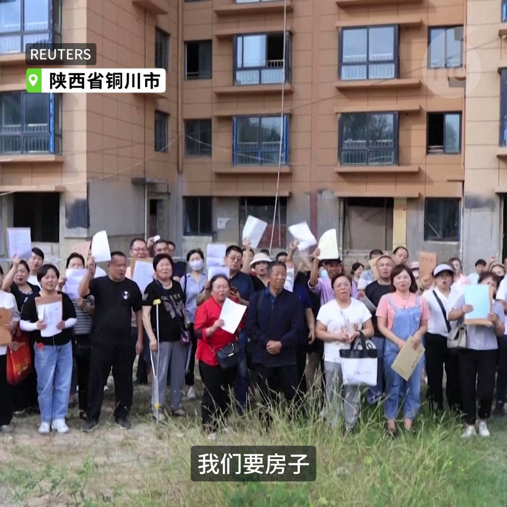
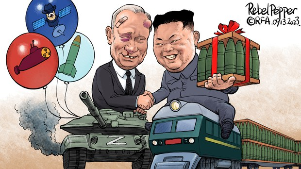
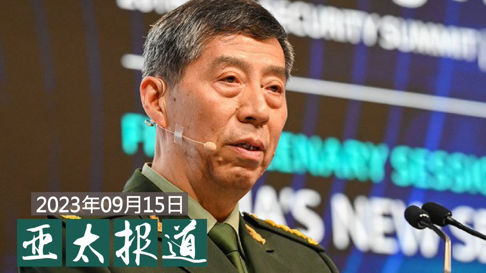
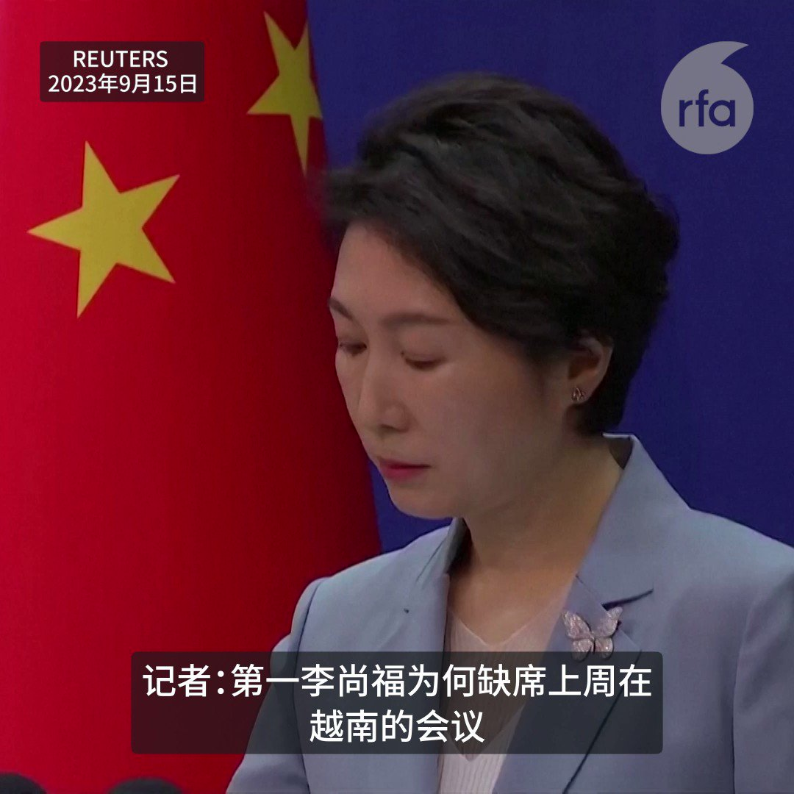

自由亚洲电台 北京时间 2023-09-16T22:43:01Z 1703056903822032988 RT @RFA_Chinese: 【#李尚福消失 为哪桩？军方高层接连被调查】
【#火箭军 案牵连？中国援助俄国用品获差评】
【共产资本主义 共党军队贪腐无解方】
#亚洲很想聊 完整视频 https://t.co/yzyP36iv1G https://t.co/Sopvz9WS…   自由亚洲电台 北京时间 2023-09-16T22:43:22Z 1703056989775872149 RT @RFA_Chinese: #事实查核｜美商务部长代言 #华为？登上时代广场广告牌？
 https://t.co/BUX3rywA8m   自由亚洲电台 北京时间 2023-09-16T22:54:52Z 1703059885829636169 RT @RFA_Chinese: 专栏 | #夜话中南海：抛 #孙志刚 震慑 #俞正声？
 https://t.co/PlUszMaYcL   自由亚洲电台 北京时间 2023-09-16T23:06:25Z 1703062789835682210 RT @RFA_Chinese: 【委内瑞拉总统访华，竟称百年雨灾为“好雨”？】
委内瑞拉总统尼可拉斯.马杜罗访华多日，昨日宣布和其最大债主国中国的关系升级为“#全天候”。
#马杜罗 9月8日抵达饱受 #洪灾 的深圳时，称暴雨为“好雨”，好在哪里？
不过当国民有难时，马杜罗至少…   自由亚洲电台 北京时间 2023-09-16T23:07:36Z 1703063088222622084 RT @RFA_Chinese: "大家都觉得，我是一个笑话，是一个祥林嫂。"
河南律师 #刘莹莹 因为转发 #新冠肺炎 死者家属排长龙领骨灰照片遭到处分，过去三年来事业蒙受影响。刘莹莹认为自己只是转述真相却成为牺牲者，决定起诉郑州市律师协会。

 https://t.co/F…   自由亚洲电台 北京时间 2023-09-16T23:08:33Z 1703063328841449480 RT @RFA_Chinese: 【#您怎么看】 9月12日，中国教育部颁布《校外培训行政处罚暂行办法》，指出擅自举办校外培训机构举办者最高或面临10万人民币的罚款。该办法将于自2023年10月15日起施行。
2021年7月，中国政府祭出“双减”政策，被指希望降低育儿成本，帮助…   自由亚洲电台 北京时间 2023-09-16T21:00:01Z 1703030981635248421 #禁书解读 | #余杰：从俄国运来的午餐肉罐头及共产主义与中国之命运 - 《一九二七：反共之年》自序
 https://t.co/ZR7JoFMDpI   自由亚洲电台 北京时间 2023-09-16T19:06:00Z 1703002287801504030 RT @RFA_Chinese: 【烂尾楼业主求告无门】
9月12日中国陕西省铜川市一座未完工住宅区前数十名购房者手持住房合同，高呼“我们要房子！” https://t.co/EOeTjzZvwR   自由亚洲电台 北京时间 2023-09-16T20:00:01Z 1703015881201303970 专栏 | #周嘉有话说：中西方“十恶”之不同（上）
#周孝正 
 https://t.co/jtHDVU5zDG   自由亚洲电台 北京时间 2023-09-16T11:50:57Z 1702892805985575035 RT @RFA_Chinese: 【#李尚福消失 为哪桩？军方高层接连被调查】
【#火箭军 案牵连？中国援助俄国用品获差评】
【共产资本主义 共党军队贪腐无解方】
#亚洲很想聊 完整视频 https://t.co/yzyP36iv1G https://t.co/Sopvz9WS…   自由亚洲电台 北京时间 2023-09-16T11:51:16Z 1702892883823472787 RT @RFA_Chinese: 欢迎收听和订阅播客【亚太报道】 https://t.co/MjLNSvVMqc
【亚太报道（2023-9-15）】
中国防长 #李尚福 失踪 / #网信办 警告“从严处置”#网暴 账号 / #家乐福 半年关闭百多家分店 / 中国 #就业 状况改…   自由亚洲电台 北京时间 2023-09-16T06:19:34Z 1702809411079876910 专栏 | #夜话中南海：抛 #孙志刚 震慑 #俞正声？
 https://t.co/PlUszMaYcL   自由亚洲电台 北京时间 2023-09-16T06:32:31Z 1702812666233036864 【烂尾楼业主求告无门】
9月12日中国陕西省铜川市一座未完工住宅区前数十名购房者手持住房合同，高呼“我们要房子！” https://t.co/EOeTjzZvwR   自由亚洲电台 北京时间 2023-09-16T06:35:50Z 1702813502233248073 #事实查核｜#台湾 在 #巴拉圭 援建的大学是“空壳”吗？
 https://t.co/Ct5kzqK0Vr   自由亚洲电台 北京时间 2023-09-16T06:38:04Z 1702814066463703190 【#变态辣椒：子弹炸弹兄弟情】
#金正恩 与 #普京 在俄罗斯远东航天城举行峰会，被视为是平壤和莫斯科面对西方经济制裁与排斥而巩固其双边关系所做出的努力。作为80年前由莫斯科扶植的金日成之孙，金正恩发誓要在与"反对帝国主义的统一战线中和俄罗斯站在一起"。 https://t.co/wdRlhF0VuT   自由亚洲电台 北京时间 2023-09-16T06:47:48Z 1702816515886899472 #事实查核｜美商务部长代言 #华为？登上时代广场广告牌？
 https://t.co/BUX3rywA8m   自由亚洲电台 北京时间 2023-09-16T06:55:44Z 1702818509049237924 RT @RFA_Chinese: 【《部长去哪儿？》第二季 毛宁仍然“不了解”】
中国外交部发言人毛宁在9月15日的记者会上表示，“不了解”中国国防部长 #李尚福 的情况。李尚福最后一次出现在北京是8月29日在与非洲国家举行的安全论坛上发表主旨演讲。 https://t.co/…   自由亚洲电台 北京时间 2023-09-16T07:15:40Z 1702823526489895099 欢迎收听和订阅播客【亚太报道】 https://t.co/MjLNSvVMqc
【亚太报道（2023-9-15）】
中国防长 #李尚福 失踪 / #网信办 警告“从严处置”#网暴 账号 / #家乐福 半年关闭百多家分店 / 中国 #就业 状况改善了吗？ / 新加坡前外长提出两岸“#中华联邦”模式 https://t.co/ZqNGn3wKUn   自由亚洲电台 北京时间 2023-09-16T07:30:01Z 1702827138892837314 专栏 | #周末茶馆：北京 #门头沟水灾 灾民徐永海呼吁救助 https://t.co/8wPu2n25L3   自由亚洲电台 北京时间 2023-09-16T02:28:22Z 1702751226616750468 【《部长去哪儿？》第二季 毛宁仍然“不了解”】
中国外交部发言人毛宁在9月15日的记者会上表示，“不了解”中国国防部长 #李尚福 的情况。李尚福最后一次出现在北京是8月29日在与非洲国家举行的安全论坛上发表主旨演讲。 https://t.co/QsgyuQFv8Z   自由亚洲电台 北京时间 2023-09-16T05:45:45Z 1702800899708518843 【#您怎么看】近日，欧盟委员会宣布将针对中国电动车发起反补贴调查，其主席冯德莱恩说，中国"借助巨额国家补贴人为压低汽车价格"。
中国商务部做出回应称，欧盟的相关计划是"是赤裸裸的保护主义行为，将严重扰乱和扭曲包括欧盟在内的全球汽车产业链供应链，并将对中欧经贸关系产生负面影响。"
您分析，欧盟此举是否会引发中欧之间的贸易战？   自由亚洲电台 北京时间 2023-09-16T03:29:17Z 1702766557594800498 中国网信办9月15日发布一份文件，表示要从严处置 #网络暴力。在这份文件中，也提到了不少与 #举报 有关的内容。这意味着什么呢？

 https://t.co/aQ4L2lQ0S8   自由亚洲电台 北京时间 2023-09-16T03:38:51Z 1702768964651409564 美国参议院金融委员会14日全票通过了获跨党派支持的《美国-台湾加快免除双重课税法案》(U.S.-Taiwan Expedited Double Tax Relief Act)。该法案旨在通过直接修改美国国内税法的方式，免除对美台之间投资的双重征税，强化双方伙伴关系。

 https://t.co/pGz3KctshO   自由亚洲电台 北京时间 2023-09-16T04:05:45Z 1702775733553422724 中国国防部长 #李尚福 从公众视野消失超过两周之后，本周五，有关李尚福因涉及贪腐而正接受当局调查的消息被多家外国媒体曝光。那么，中国核心官员连续"#被失踪"的现象，反映出 #习近平 政权内部怎样的运行状况呢？

 https://t.co/88HwgMzDWL   自由亚洲电台 北京时间 2023-09-16T00:59:59Z 1702728983648018535 中国国家统计局9月15日表示，八月份 #失业率 下降，#青年人就业 呈整体改善趋势。然而，当局对此却没有提供任何具体数据。中国实际的就业状况真的改善了吗？

 https://t.co/TPbTasMEsf   自由亚洲电台 北京时间 2023-09-16T01:14:13Z 1702732564719636834 #台湾 的外交部14日发声明指出，#杨荣文 提到“台湾是美国用来对付中国一枚可牺牲的棋子”、“台海现状实际上是不可持续的，应达成‘一个中国’的未来”，是严重认知偏颇，完全与事实不符。

 https://t.co/dT6s0d6tFu   自由亚洲电台 北京时间 2023-09-16T01:58:15Z 1702743648490889391 中国外交部15日宣布，由于参与美国出售台湾武器，对两家美国军工企业诺斯洛普·格鲁曼、洛克希德·马丁圣路易市分公司实施制裁，并称这是根据《中华人民共和国 #反外国制裁法》。

 https://t.co/eGj4Q7MJ4m   自由亚洲电台 北京时间 2023-09-16T00:10:49Z 1702716609092341878 英国政府2021年开放“#救生艇计划”，让持英国国民海外护照的香港人移居英国，同时拨款让港人组织及当地慈善机构举办活动。然而近日传出有英国政府官员不满港人批评怀疑和中共有密切关系的组织，以及用政府资金举办“政治活动”，威胁停止发放资助，在英港人忧虑。 https://t.co/wyDdkMUu1Y   