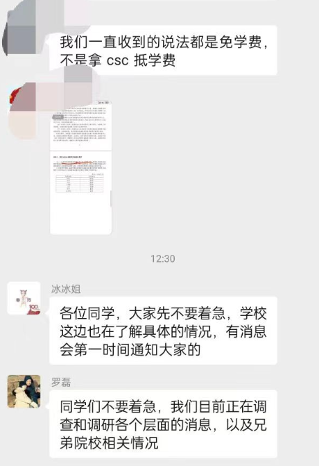
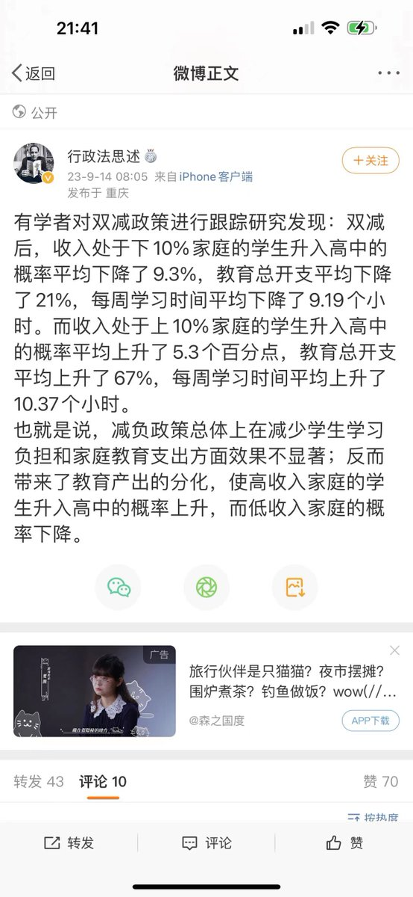
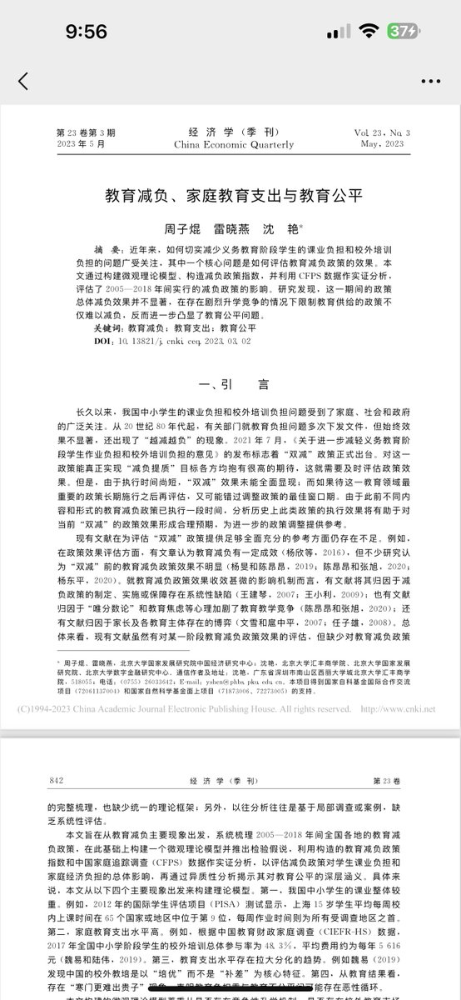

谁将十万横扫三江 北京时间 2023-09-16T21:27:45Z 1703037963071008893 陕西省山阳县公安局杨地派出所民警在出警时， 被指将一位八旬老人按倒在地导致骨折。媒体曝光后，山阳县公安局展开了“先吓唬，再忽悠”式的删稿行动。山阳县公安局纪委书记竟然跑到了医院，指挥病床上骨折的老人联系发帖人删稿。 https://t.co/eobLn4su1T   谁将十万横扫三江 北京时间 2023-09-16T19:05:59Z 1703002283473326169 河北保定前律师李庄公开喊话河北阜平法院院长聂纪周：请您主动投案 https://t.co/TcmAJKtkHy   谁将十万横扫三江 北京时间 2023-09-16T19:29:17Z 1703008146141397343 辽宁省大连市，一石化公司建设项目拖欠工人工资，工人拉横幅静坐讨薪，去劳动司法机关反映后无果
时间：2023-09-12
地点：辽宁省大连市长兴岛经济区
行业：建筑业
公司名称：中石化第四建设有限公司
企业性质：国有企业
行动类型：静坐/要求劳动司法等机关介入
诉求：欠薪
参与人数：1-100
官方反应：警察出动/政府不作为
资料来源：
https://t.co/dMNETZUNiD
https://t.co/alYhNmBfI4
https://t.co/aXth2wM8TN   谁将十万横扫三江 北京时间 2023-09-16T19:30:06Z 1703008351549084029 河南省台前县，一公交公司拖欠员工工资，员工拉横幅讨薪
时间：2023-09-15
地点：河南省濮阳市台前县金水路51号
行业：交通运输、仓储和邮政业/公交及长途巴士
公司名称：濮阳市交通运输集团有限公司
企业性质：国有企业
第二企业名称：濮阳交运台前县公共交通有限公司
第二企业性质：国有企业
行动类型：阻塞公共交通
诉求：欠薪
参与人数：1-100
资料来源：
https://t.co/BMtKwLehB0
https://t.co/Xkh78xFEZU
https://t.co/zMzEWV3fAz   谁将十万横扫三江 北京时间 2023-09-16T16:33:53Z 1702964005869142221 甘肃省定西市，一医学中心建设项目拖欠工人工资，工人拉横幅讨薪
时间：2023-09-16
地点：甘肃省定西市安定区西川园区
行业：建筑业
公司名称：武威市第四建筑工程有限责任公司
企业性质：国有企业
项目名称：定西市安定区区域医学影像及检验中心建设项目
行动类型：其他
诉求：欠薪
参与人数：1-100
资料来源：
https://t.co/PxkJCkErKa
https://t.co/JPBRFriCod
https://t.co/1EKggCP5iE

#欠薪事件   谁将十万横扫三江 北京时间 2023-09-16T16:50:09Z 1702968101669880083 RT @seamalaya: #红右世界
极右保守独裁国家的发言人，不同面孔，同一声音。

中国毛宁：“中国要求俄乌尽快举行和谈。如果美国真关心乌克兰人民的生命安全，就必须停止向乌克兰供应武器。”

俄国扎哈罗娃：“现在的拜登（白左）政府并不代表美国人民。他正在操纵乌克兰军队屠…   谁将十万横扫三江 北京时间 2023-09-16T17:52:34Z 1702983809619370294 RT @whyyoutouzhele: 网友投稿
近日，有学生曝出哈尔滨工业大学开始停止为公派留学生支付莫斯科航空学院的学费。
西北工业大学也发生了同样的情况。
学校领导称，学校也在了解具体情况。 https://t.co/gvkWj2oPiP   谁将十万横扫三江 北京时间 2023-09-16T15:52:04Z 1702953483601871034 RT @feizhongxuanxie: Di Magagaping Diwa / 无敌精神
新人民军宣传歌曲 https://t.co/PmeLPlDE8I   谁将十万横扫三江 北京时间 2023-09-16T16:16:34Z 1702959647639142854 RT @handongfang: 广东省中山市，一外资音箱厂工人罢工，抗议严格安检措施，工会到场 https://t.co/7barUehIcU   谁将十万横扫三江 北京时间 2023-09-16T08:07:01Z 1702836451300548841 RT @whyyoutouzhele: 《我们终于习惯了学生自杀》

“现在的学生真的很厉害,我们批评权力批评黑暗都会被他们视为敌人, 被他们口诛笔伐, 他们真的很凶。

可他们自己遭遇压迫时他们却不敢反抗, 他们不敢反抗权力, 他们畏惧校方。 甚至他们身边的同学选择自杀时,…   谁将十万横扫三江 北京时间 2023-09-16T00:09:42Z 1702716327738417176 上海市，一日化用品公司拖欠员工工资，断缴五险一金，员工走劳动仲裁及法律途径后无果。
时间：2023-09-15
介绍：
【一、无故拖欠工资、断缴五险一金，员工向公司董事长李建飞讨要说法对方以各种理由一次次搪塞员工；二：员工被非法解除劳动合同且无任何经济赔偿；三、员工先后通过劳动仲裁，劳动监察等多种法律途径维护自身合法权益但迟迟无法得到有效解决；4、李佳琦花西子事件爆发后，代工厂三个老头开设直播间，三天内涨粉二三百万，是真的要做好国货品牌还是借助网友的同情心做的一场营销，请理性判断。我们不是眼红也不是水军，也觉得活力28本身是不错的，但是我们打工人需要自己打工的工资。】
地点：上海市
行业：制造业/日化用品
公司名称：湖北活力集团有限公司
企业性质：民营企业
第二企业名称：活力二八实业（上海）有限公司
第二企业性质：民营企业
行动类型：申请仲裁/要求劳动司法等机关介入
诉求：欠薪/社保/公积金
参与人数：1-100
官方反应：劳动仲裁
资料来源：
https://t.co/WN5Bm36NlN
https://t.co/clBFveSFeA
https://t.co/iIEhJo58DK

#欠薪事件   谁将十万横扫三江 北京时间 2023-09-16T00:13:13Z 1702717213206368331 RT @xiaojingcanxue: 研究显示，双减导致收入不平等的家庭在教育不平等上进一步分化。 https://t.co/VT1zCoFS8l   