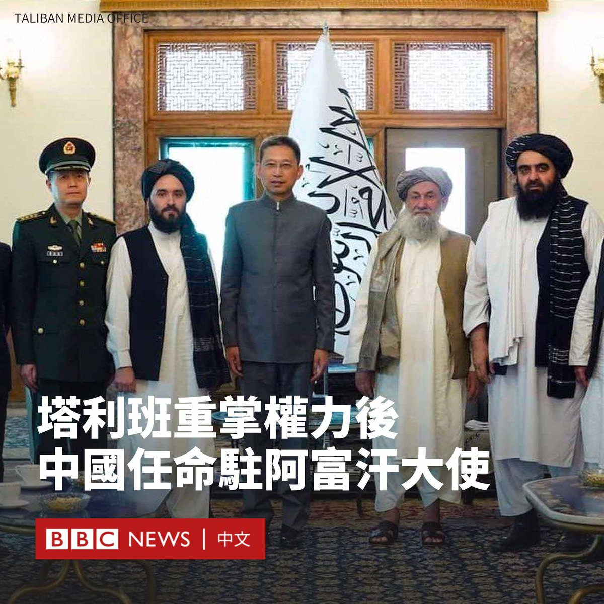
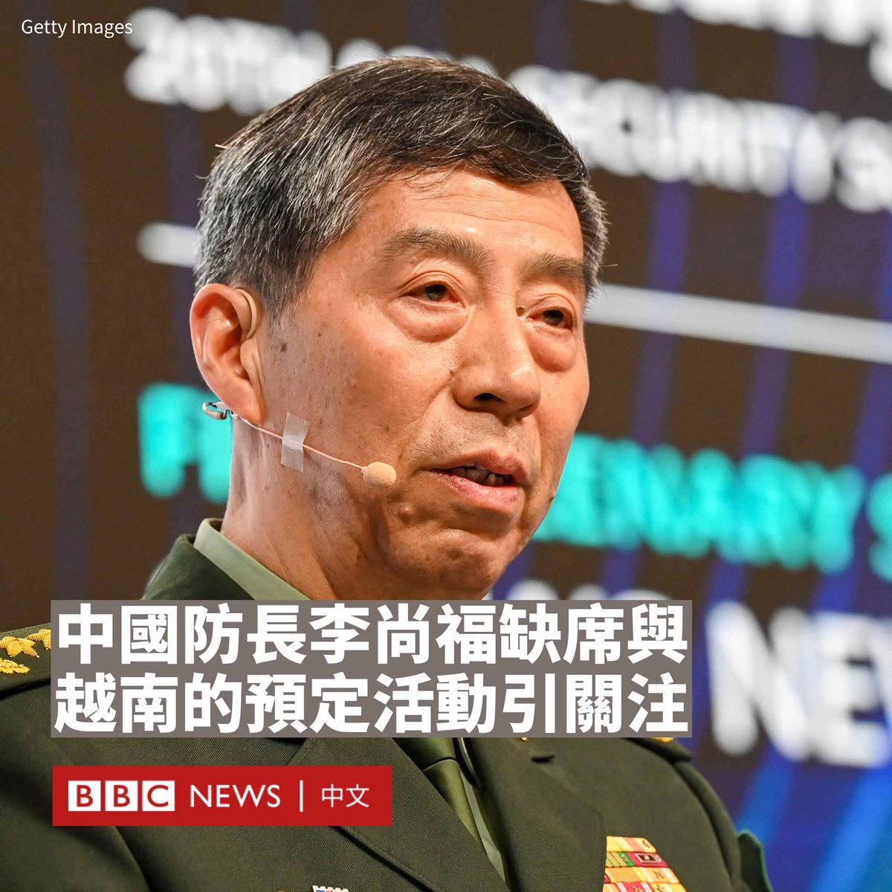
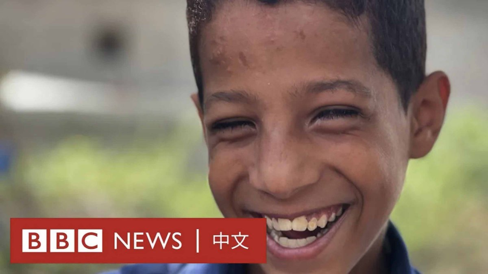

D英国广播公司BBC 北京时间 2023-09-15T15:08:44Z 1702580191627792676 中国经济在疫情限制放开后复苏疲弱，尤其是地产领域，这使得依赖卖地收入的地方政府财政紧张。很多人曾预测当局将很快开始征收房地产税，但经历了多番波折，房地产税却始终“千呼万唤不出来”。这背后发生了什么？https://t.co/KfsxtHQwHh   D英国广播公司BBC 北京时间 2023-09-15T13:42:46Z 1702558555415744538 中国周三（9月13日）向阿富汗派出新大使。这是塔利班自2021年重新掌权以来，首次有国家向阿富汗派驻大使。

在喀布尔举行的一个仪式上，新任中国驻阿富汗大使赵星向塔利班官员递交了国书。

塔利班政府代理总理穆罕默德·哈桑·阿洪德（Mohammad Hassan Akhund）和代理外交部长阿米尔·汗·穆塔基（Amir Khan Muttaqi）都出席了仪式。

塔利班表示，新大使的任命是外国与塔利班政府建立联系的标志。由于塔利班政府因侵犯人权受到批评，目前尚未有国家正式承认它所建立的“阿富汗伊斯兰酋长国”。

中国外交部表示，这是中国驻阿富汗大使的正常轮换，旨在继续推进中阿之间的对话与合作，并称北京的政策是“明确和一贯的”。它未说明此次任命是否预示着将进一步承认塔利班政府。

中国上一任驻阿富汗大使为王愚，他2019年履新，2023年8月离任。

目前，在阿富汗的其他大使是塔利班掌权之前任命的，而如巴基斯坦和欧盟等国家或组织则通过派遣高级外交官来领导外交工作，使用“代办”头衔。   D英国广播公司BBC 北京时间 2023-09-15T11:29:57Z 1702525130939961363 据路透社报道，中国国防部长李尚福上周突然以健康状况为由，缺席了与越南国防官员的会晤。

越南政府曾在上月底宣布，越中第八次边境国防友好交流活动将于9月7日至8日在越南老街省和中国云南省举行。李尚福将与越南防长潘文江共同出席。

但路透社援引两名越南官员的话称，北京在该活动前几天告知河内，李尚福因“健康状况”无法出席活动，希望活动延期进行。

一名不愿具名的美国官员说，华盛顿知悉李尚福取消与越南官员会面的消息。

在秦刚突然被免职中国外长以及解放军火箭军的领导层突然被撤换的背景下，李尚福的缺席引起外界注意。他在过去半个多月内都没有在公众视野中露面。

美国驻日本大使拉姆·伊曼纽尔（Rahm Emanuel）上周公开发帖称：“先是（中国）外交部长秦刚失踪，然后是火箭军司令员失踪，现在国防部长李尚福已经两周没有公开露面了。这场失业大赛谁会获胜？中国年轻人还是习近平的内阁？”

中国政府未回应置评请求。此前，中国外交部发言人毛宁在被问及伊曼纽尔有关李尚福的发言时表示不了解情况。

另据《金融时报》援引多名美国知情人士的话称，美国政府相信李尚福已接受调查，无法履行国防部长的职责。BBC不能独立核实该说法。

65岁的李尚福于今年3月被任命为新一任防长，他也是中国五位国务委员之一。

李尚福最后一次公开现身是8月29日，当时他在北京举行的中非和平安全论坛上发表演说。

李尚福曾在中国航天系统工作，负责中国探月工程的火箭发射任务。他后来任解放军战略支援部队副司令员，在升任国防部长前担任中央军委装备发展部部长。

2018年，美国曾因中国军队采购俄罗斯武器，对当时主管装备工作的李尚福实施制裁。   D英国广播公司BBC 北京时间 2023-09-15T09:26:03Z 1702493951398207607 11岁的艾哈迈德·瑞吉布（Ahmed Rageeb）从出生起就失明，四个兄弟姐妹也是视障人士。他的童年都在内战中度过，在断壁残垣中上课。

也门是阿拉伯世界最贫穷的国家，内战使其长期处于崩溃的边缘。现在，交战已经减少，但生活依然艰难。 https://t.co/TzuY85lrT0   