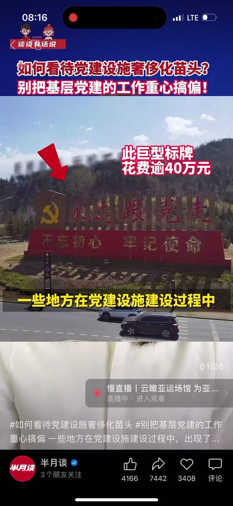
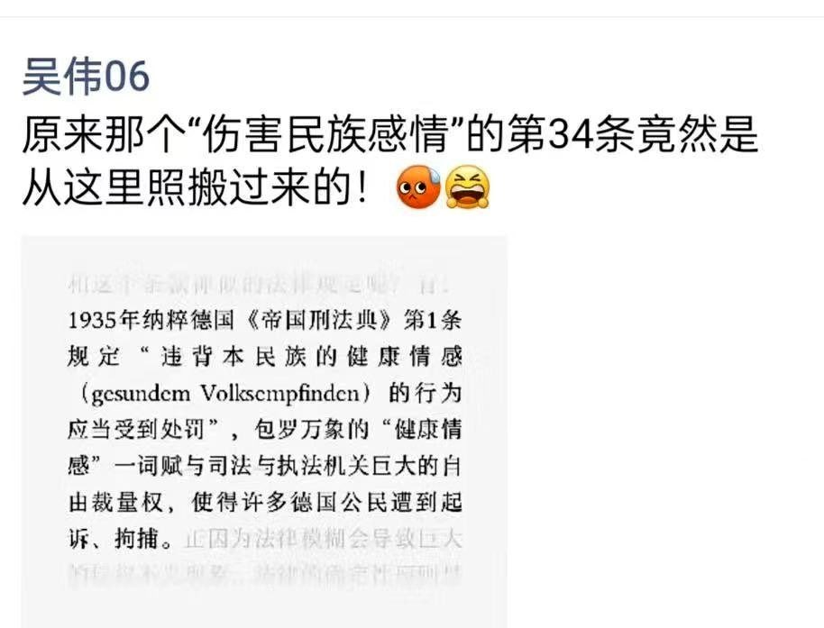
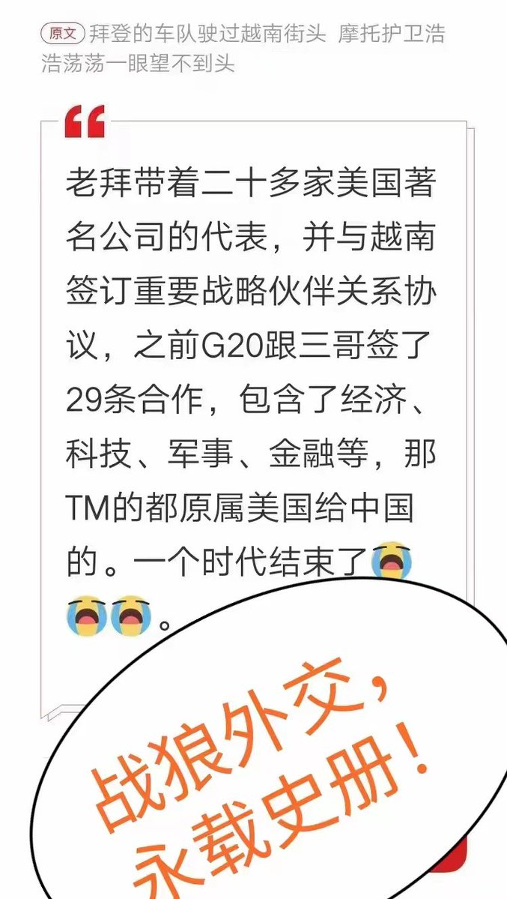
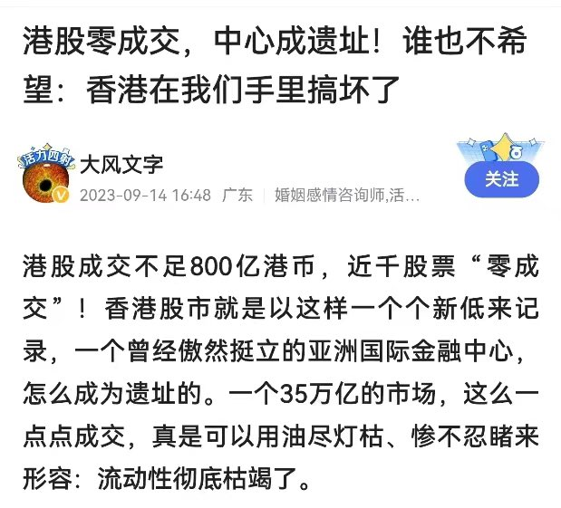
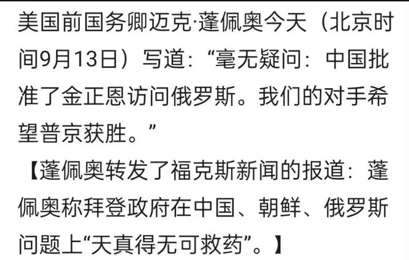
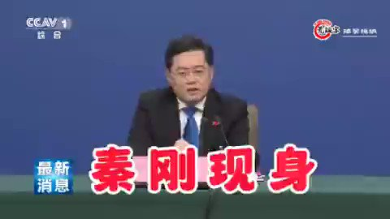
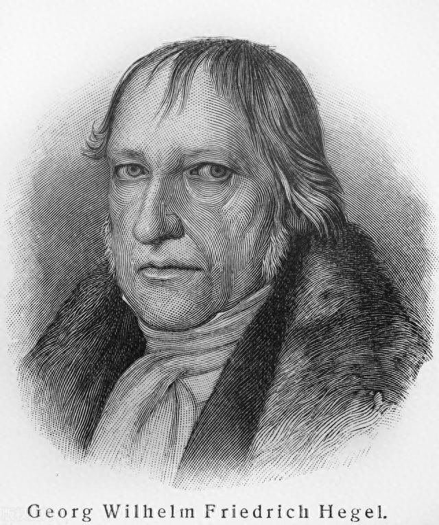
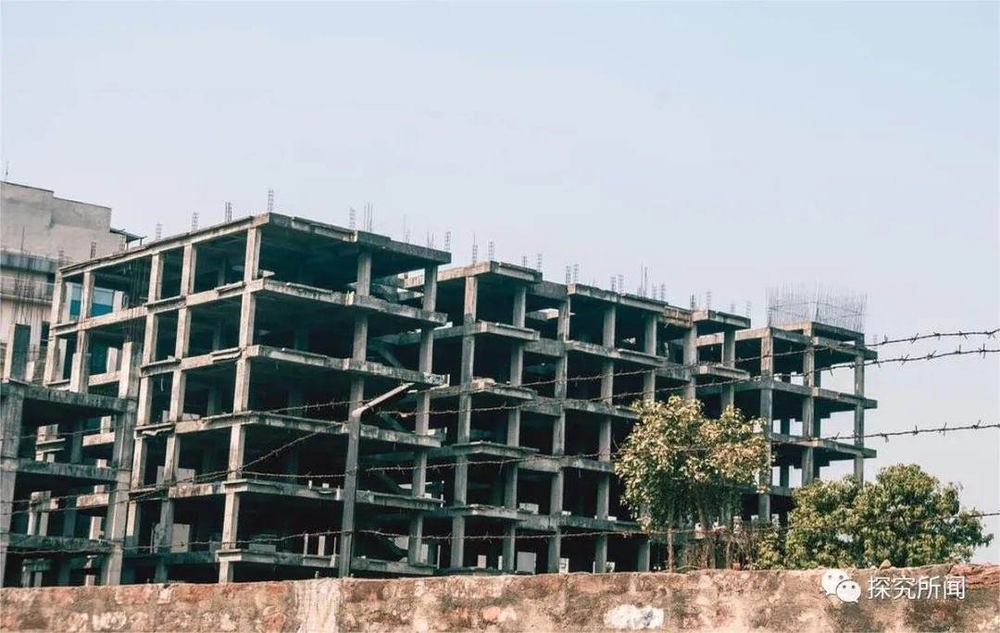
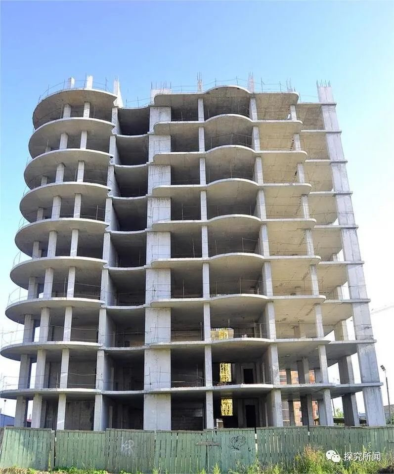
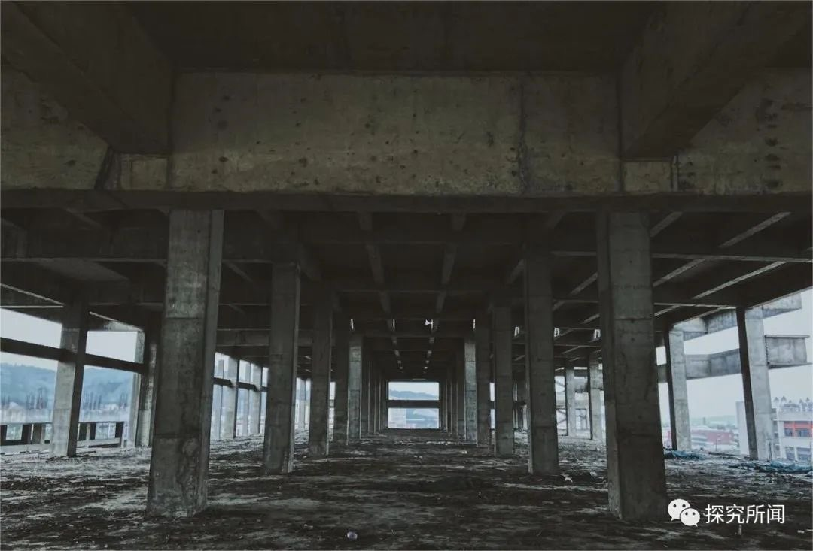

Petrichor 北京时间 2023-09-15T20:23:41Z 1702659450362790101 共产党能不能就花自己党员的上缴的党费，而不该使用百姓的纳税钱。

在中部某村旁的高速下道口，半月谈记者看到一块巨幅党建标牌，目测长逾10丈，高逾3丈。询问当地一名基层干部获悉，这个党建标牌建成于2021年下半年，总花费逾44万元。承揽这一项目的企业负责人说，今年还有好几个上百万的项目，有的正在洽谈，有的在做图纸设计。

在北方某地一处休闲文化广场，半月谈记者看到“有困难找党员、要服务找支部”12个红色大字。承接工程的黄姓老板说：“每个字6米长、6米高，制作安装费共31.18万元。”

这些都是共产党变相剥削人民。   Petrichor 北京时间 2023-09-15T09:36:47Z 1702496651393310776 原来中国《治安管理处罚法》的修订草案的第34条是抄袭1935年希特勒纳粹德国的《帝国刑法典》的。

万万没想到，情况是这样的。中国人，也该醒醒了。 https://t.co/vuQippWXnS   Petrichor 北京时间 2023-09-15T05:34:18Z 1702435628363759632 No zuo no die (Chinese: 不作死就不會死 or 不作不死) is a Chinese internet meme. The original wording of the Chinese phrase, meaning "one would not be in trouble had one not asked for it", is half-translated to Chinglish where it retains one of its Chinese characters in pinyin.”Zuo" (作) is a Shanghainese word meaning to "act silly or daring (for attention)".

The original Chinese phrase has become very popular in China. When its Chinglish translation was included in Urban Dictionary in 2014, it generated a lot of interest in the media, interpreted by many Chinese as a sign of China's growing soft power.

以上维基百科的解释。   Petrichor 北京时间 2023-09-15T07:47:03Z 1702469037719007674 这样视频竟然流传到海外，这不是给华春莹等说“中国人民有言论自由”一耳光？在微信群里说几句话，就受到如此非人待遇。

Such a video has been circulated overseas. Isn't this a slap in the face to Hua Chunying and others who said that "Chinese people have freedom of speech"? If you say a few words in a WeChat group, you will be treated so
inhumanely.   Petrichor 北京时间 2023-09-15T08:13:55Z 1702475800228835734 朱镕基说过：“如果香港搞不好，不但你们（港府官员）有责任，我们（北京中央政府）也有责任！”“香港回归祖国了，如果在我们手里搞坏了，那我（中央政府）岂不成了民族罪人？”

一语成谶。民族罪人是谁？ https://t.co/DOLE4OStaN   Petrichor 北京时间 2023-09-15T08:59:54Z 1702487372376481852 会不会中国武器假过朝鲜送到俄军手中？ https://t.co/qZqt2kpR9k   Petrichor 北京时间 2023-09-15T06:08:41Z 1702444281938489454 假新闻，CCAV，😄，做的跟真的似的。哈哈，我晕。 https://t.co/3HcV7taLJo   Petrichor 北京时间 2023-09-15T02:12:44Z 1702384905743729078 德国哲学家黑格尔曾经断言：“任何进步都不会从中国产生。” 人们不得不佩服他的聪明和洞察力。

从历史角度看，中国始终没有找到长治久安的制度，周期性的通过战争改朝换代，使得中国的社会结构和经济体系长期缺乏变革和进步的动力。相比之下，西方社会在历史的长河中，经历了多次工业革命和社会制度的变革，从而推动了科技和社会的进步。

从文化角度看，中国的文化传统强调君君臣臣，搞愚民教育和打击言论和思想自由，抑制了社会的发展和进步。相比之下，西方文化强调思想自由、言论自由和自由竞争。

“中国的历史从本质上看是没有历史的，它只是君主覆灭的一再重复而已。任何进步都不可能从中产生。” ——黑格尔的《法哲学原理》。黑格尔，伟大。   Petrichor 北京时间 2023-09-15T02:19:39Z 1702386642491789333 数据显示，2022年国内土地财政收入占总财政收入的比重为28.8%。其中，三四线城市的土地财政收入占比高达35.6%，一二线城市为23.4%。

烂尾楼愈演愈烈。烂尾楼是指因为开发商资金链断裂或其他原因导致无法完工或交付的楼盘。根据媒体报道，三四线城市的烂尾楼项目占比超过60%。烂尾楼的问题损害了购房者权益，引发诉讼纠纷和群体抗议。

经济下行，农民返乡，大城市人口外流问题日趋严重，导致城市房屋高空置率。   