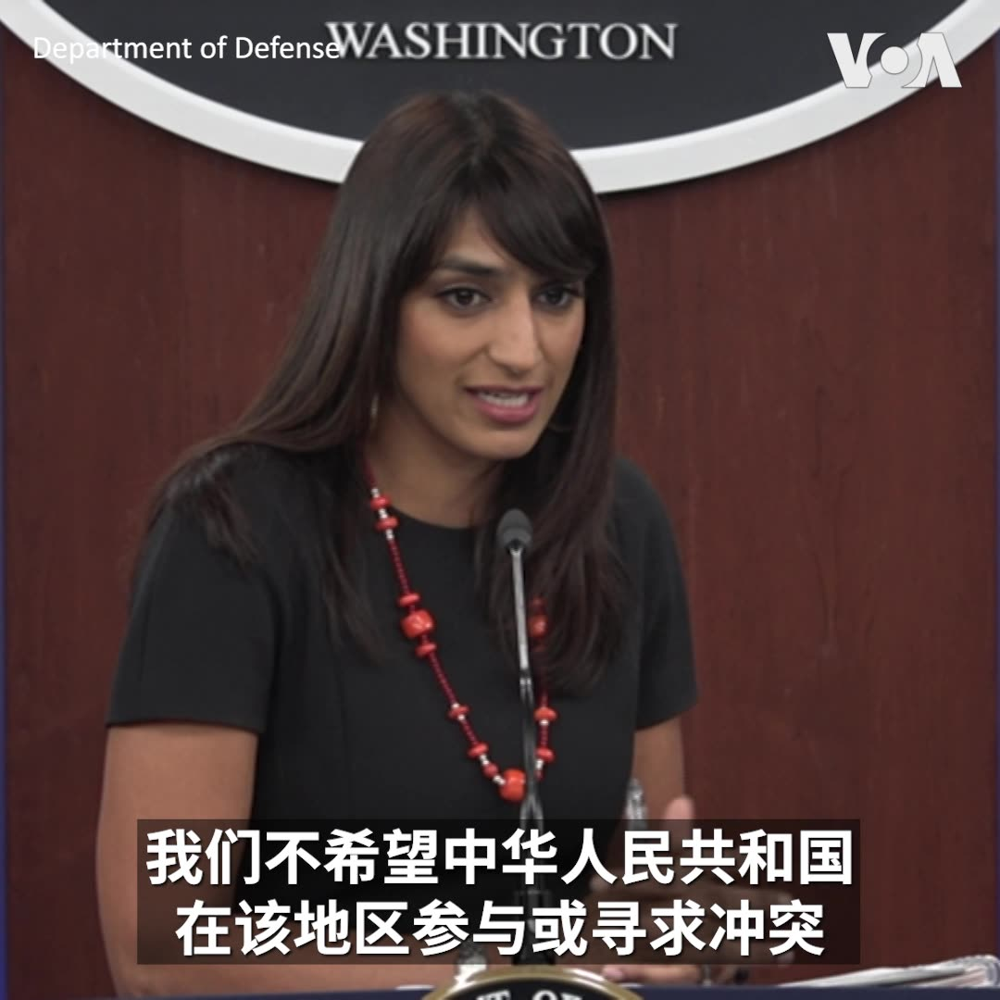
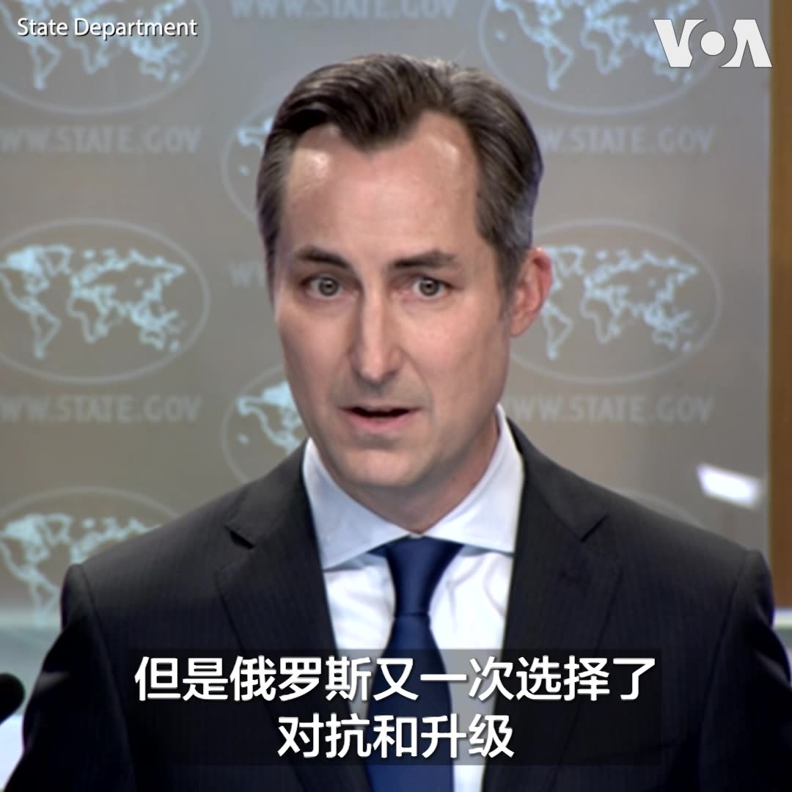
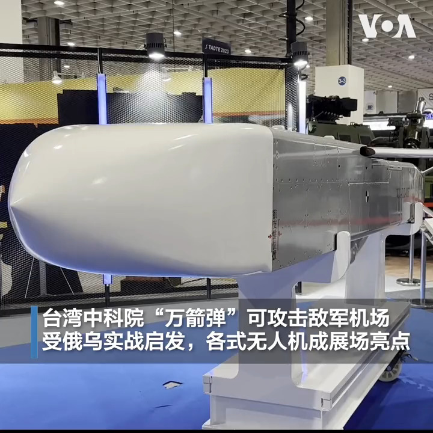

美国之音中文网 北京时间 2023-09-15T05:28:39Z 1702434209334243668 针对解放军军机军舰近日加大扰台力度，美国国防部副发言人辛格9月14日在例行记者会上说，美国国防部会持续监视印太局势，并表示不希望中国在该地区参与或寻求冲突。 台湾国防部周四宣布，在过去24小时内侦查到共机68架次、其中逾越海峡中线的有40架次。 https://t.co/qkzJOGxRcm   美国之音中文网 北京时间 2023-09-15T06:12:36Z 1702445267348287490 “这种对美国外交人员的无端驱逐是毫无根据的，”美国国务院发言人米勒在9月14日对莫斯科驱逐两名美国驻俄使馆人员发表声明时说。他同时宣布，美国将对超过150名与俄罗斯侵乌有关的个人和实体施加制裁，并任命前商务部长普利兹克为乌克兰经济重建特别代表。 https://t.co/O50Pq7FCyR   美国之音中文网 北京时间 2023-09-15T01:35:05Z 1702375430828040310 台湾大选：赖佩霞任郭台铭副手加分一时? 分析：对绿营冲击不大 https://t.co/tbgeGCIc1i   美国之音中文网 北京时间 2023-09-15T02:30:25Z 1702389353215910032 美国国会参议院多数党领袖舒默正计划率领国会代表团访问中国。众议院中国特设委员会主席加拉格尔(Rep. Mike Gallagher)告诉美国之音，他还不清楚代表团行程，但如果能有机会去拜访“非波将金村”版本（即未经政府虚假修饰）的真实新疆，可能会有价值。 https://t.co/sL98gQ52ON   美国之音中文网 北京时间 2023-09-15T02:48:09Z 1702393815456244055 特斯拉首席执行官伊隆·马斯克9月13日说，对人工智能产业实施立法监管事关人类未来文明和福祉。当天，马斯克和比尔·盖茨等24位美国科技高管出席了由参议院多数党领袖舒默牵头主办的人工智能论坛。舒默参议员正在推动通过两党立法，以鼓励人工智能发展，并降低潜在风险。 https://t.co/SRfCf9ou0U   美国之音中文网 北京时间 2023-09-15T03:03:41Z 1702397724774085036 中国教育部近日颁布《校外培训行政处罚暂行办法》，擅自举办校外培训机构者最高可能面临10万人民币罚款。在人口大国印度，升学和就业的激烈竞争不亚于中国，许多年轻人为了挤进优秀的理工医科学院，都选择校外补习。美国之音记者黄耀毅@VOAYYH带您看看在新德里一间已经开办十年的补习班。 https://t.co/yavIzLr4ly   美国之音中文网 北京时间 2023-09-15T03:25:28Z 1702403206435762687 柬埔寨新首相洪马内于9月14日抵达北京，正式开启他为期3天的访华行。观察人士表示，柬中会谈将聚焦经济合作、双边关系也将因此进一步获得深化，但洪马内访中后不久将启程赴美显示，金边政府也将在未来致力与扩大与华盛顿的经贸合作。 https://t.co/1xl5i4Ijbu   美国之音中文网 北京时间 2023-09-15T04:17:35Z 1702416324776116708 俄罗斯以“非法活动”为名驱逐两名美国外交官 https://t.co/ppfNexDRYU   美国之音中文网 北京时间 2023-09-15T01:21:06Z 1702371909042839635 利比亚洪灾死亡人数恐增至两万，联合国称灾难原本可以避免 https://t.co/wNXrH4zzbI   美国之音中文网 北京时间 2023-09-15T01:50:34Z 1702379327005007899 中国防长失踪谜团加重，路透社报道李尚福“爽约”与越南国防官员的会晤 https://t.co/zl0oMqMd6l   美国之音中文网 北京时间 2023-09-15T02:04:29Z 1702382826283315632 台湾总统参选人郭台铭9月14日公布艺人赖佩霞为副手。对此，有台北选民说，赖佩霞形象清新，可为郭台铭加分，但恐仅有短暂的新闻效应。分析人士则说，“郭赖配”是非典型组合，易吸引中间选民，可望拉抬郭台铭在非绿阵营的谈判话语权，但对民调领先的赖清德影响有限。
报道: https://t.co/3IaLGUZ24S https://t.co/UkLgyQjdGc   美国之音中文网 北京时间 2023-09-15T02:08:10Z 1702383754550059175 先访中再赴美 柬国新首相巩固政权也扩大经贸布局 https://t.co/AgrP5TKjX9   美国之音中文网 北京时间 2023-09-15T00:16:20Z 1702355610933542949 2023年台北国际航天暨国防工业展9月14日于台北开幕，除展出台湾新型的防空、反舰导弹等军事科技外，还邀请到美国战机制造商洛克希德马丁(Lockheed Martin)等41家欧美航天科技巨头参展。受到俄乌战事的启发，各式侦搜、攻击型无人机成为全场亮点。报道: https://t.co/H6KMvEG2OV https://t.co/MuQzVn5ELb   美国之音中文网 北京时间 2023-09-15T00:16:33Z 1702355664402858286 中国有医院扣发医生奖金，有些人担心医疗反腐扩大化 https://t.co/14SoF3ZdO4   