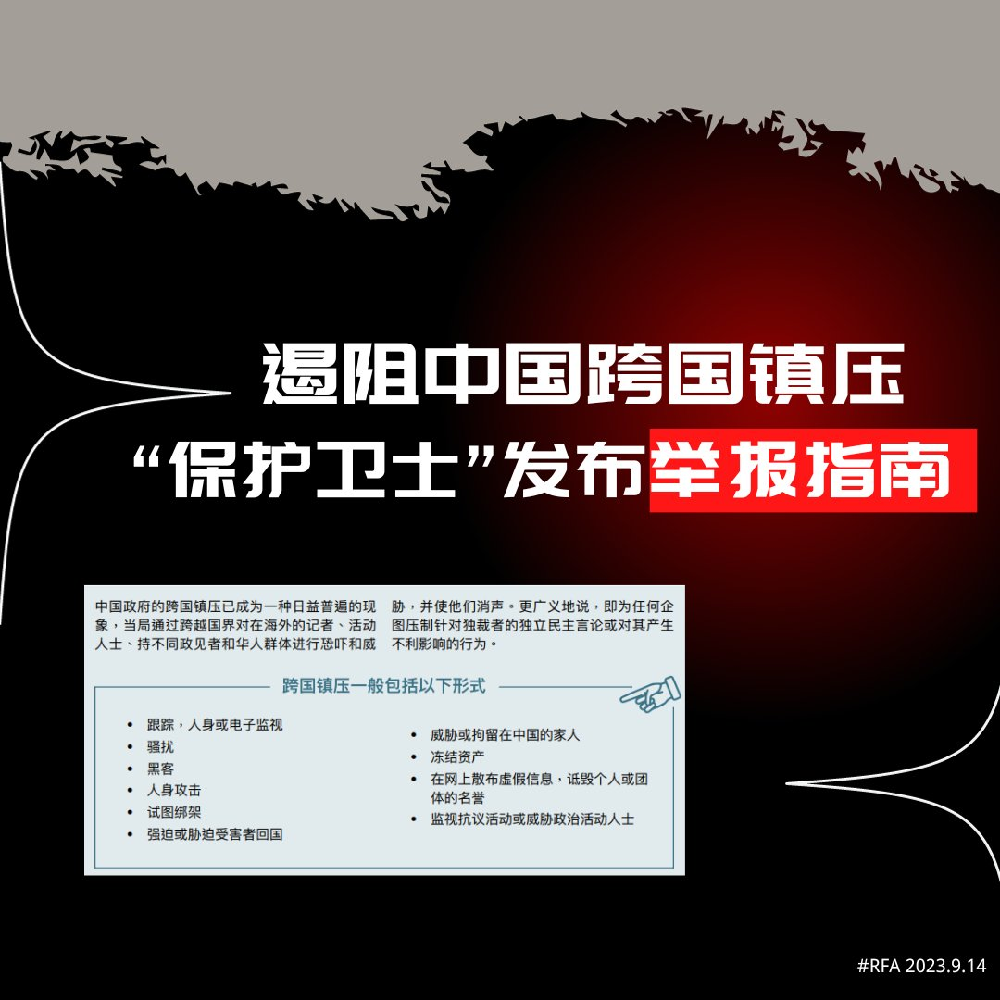

自由亚洲电台 北京时间 2023-09-15T06:17:09Z 1702446412099883222 在《海外110 》报告发布一周年之际，保护卫士组织12日又发表一份适用于中国跨国镇压目标群体的试点举报指南。该指南作为未来将发布的全面互动式举报工具包的前身，列出中国跨国镇压的十大样态，并为受害者提供了各国的一些举报途径。https://t.co/rOwPt4q8D3 https://t.co/05BzzvmphX   自由亚洲电台 北京时间 2023-09-15T00:26:23Z 1702358139923034470 "大家都觉得，我是一个笑话，是一个祥林嫂。"
河南律师 #刘莹莹 因为转发 #新冠肺炎 死者家属排长龙领骨灰照片遭到处分，过去三年来事业蒙受影响。刘莹莹认为自己只是转述真相却成为牺牲者，决定起诉郑州市律师协会。

 https://t.co/FvZymiTXL9   自由亚洲电台 北京时间 2023-09-15T01:52:58Z 1702379929999122742 中国国家主席 #习近平 和到访的 #委内瑞拉 总统 #马杜罗 13日下午举行会谈。双方宣布将中委两国关系提升为“全天候战略伙伴关系”。两国还签署了共建“一带一路”、以及经贸、旅游、航天、民航等领域多项双边合作文件。 https://t.co/4kWntsYGew   自由亚洲电台 北京时间 2023-09-15T03:22:53Z 1702402557270991006 在美国媒体Axios中国事务记者贝书颖 @BethanyAllenEbr 的最新著作《#北京规则》（Beijing Rules）中，她详细描述了中国如何将其日益增长的经济实力武器化，并以此对抗国际秩序来维护中共的利益。

 https://t.co/cqsHsmHx0C   自由亚洲电台 北京时间 2023-09-15T03:38:46Z 1702406553838788798 近五十天来持续为 #卢思位 奔走的对华援助协会创始人 #傅希秋 9月14日向本台证实，卢思位 #老挝 的律师在当地时间下午两点左右与负责案件的老挝公安部的高级官员通话时被告知，卢思位已经被遣返回中国。 https://t.co/SjOD3TKQQi   自由亚洲电台 北京时间 2023-09-15T00:56:02Z 1702365601552015591 #福建惠台21条措施，仅仅是为了吸纳台湾资金、人才，提振其内部经济吗？
请在评论区分享高见。
 https://t.co/Vwz3mxrFPh   自由亚洲电台 北京时间 2023-09-15T02:16:33Z 1702385863299309587 在英国议会日前传出有关 #中国间谍 丑闻之后，#英国议会 下议院周三（13日）批准了一项新法案，禁止中国生产的 #监控设备 进入政府大楼和军事基地。

 https://t.co/pKee5q5JeT   自由亚洲电台 北京时间 2023-09-15T00:01:31Z 1702351883707482416 专栏 | #绿色情报员：绿潮起浪（上）#浒苔 入侵东亚捎来信息
 https://t.co/0vtVPcAgCy   