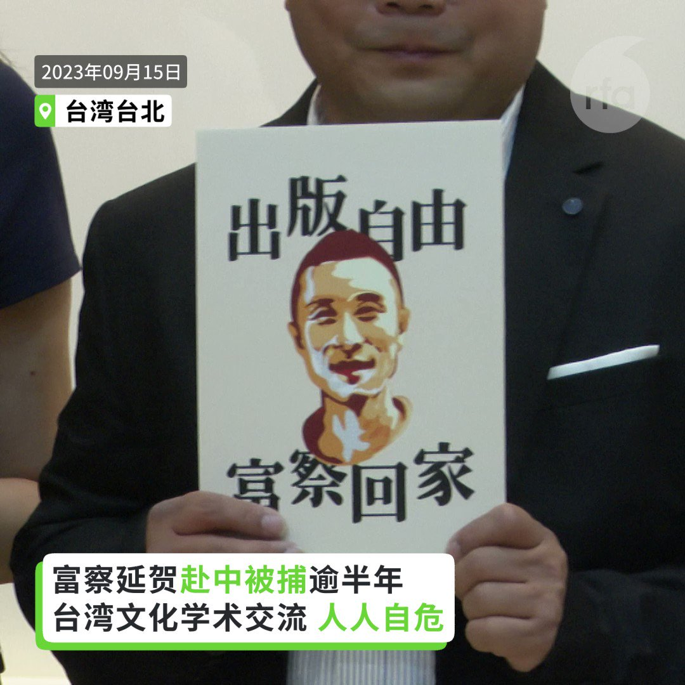
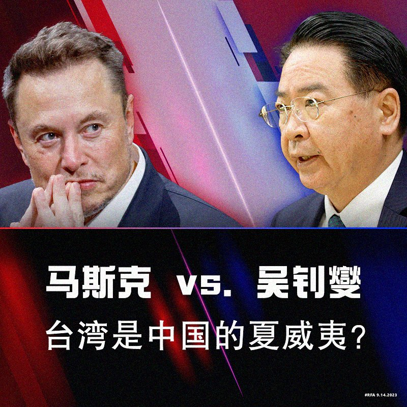
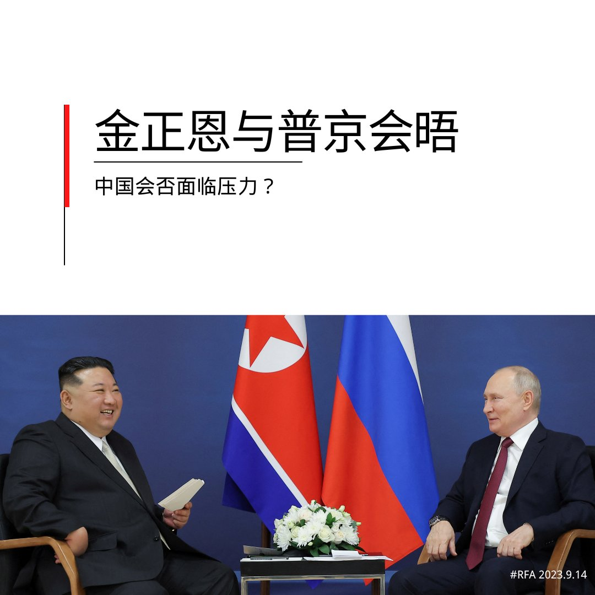
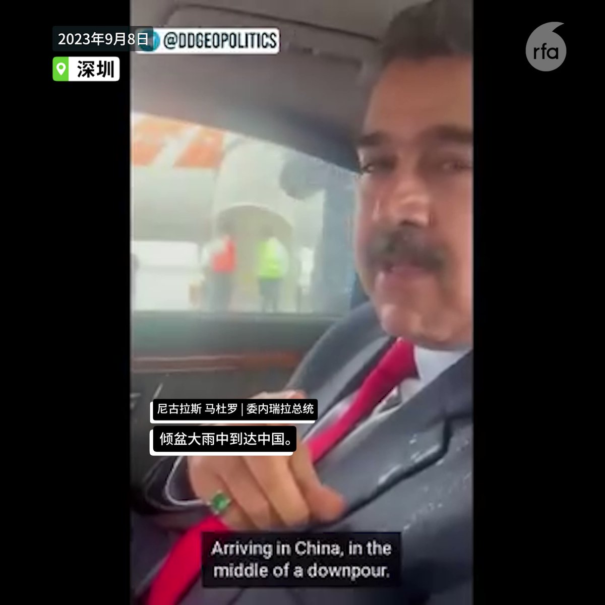
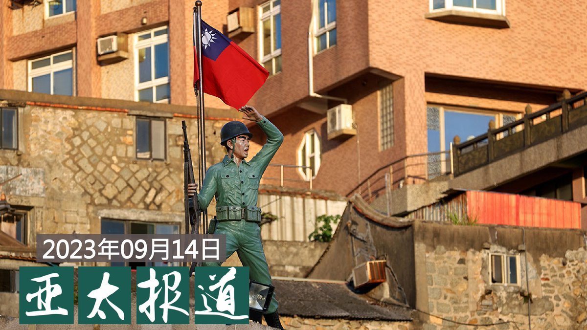
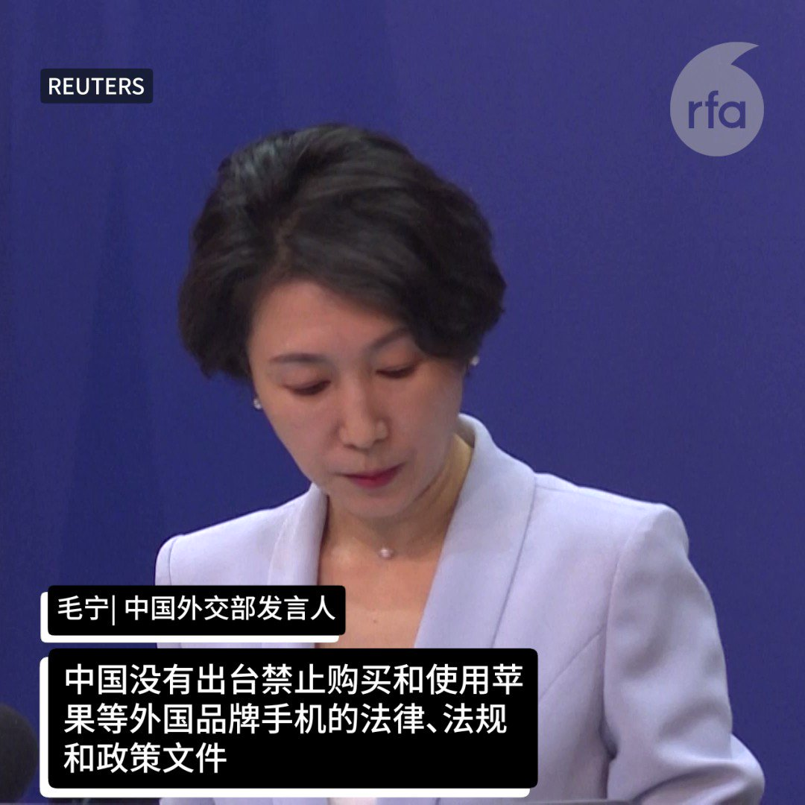

自由亚洲电台 北京时间 2023-09-15T23:35:58Z 1702707841151475873 台湾 #八旗文化出版社 总编辑 #李延贺(笔名 #富察)自今年3月赴中国探亲被捕后，至今仍下落不明。本周五，台湾学界公开声援李延贺的同时，呼吁台湾总统参选人关注两岸交流中的安全问题。

 https://t.co/4YHaSmFf99   自由亚洲电台 北京时间 2023-09-15T21:55:03Z 1702682445189959919 RT @RFA_Chinese: 本周是 #中国人权律师团 成立十周年。该机构发起征稿，收到海内外人士的一系列投稿。本台很荣幸成为这批稿子的首发平台，现在《#404共和国》栏目刊出，以飨读者。

  https://t.co/QmeCvNgj0w   自由亚洲电台 北京时间 2023-09-15T15:22:27Z 1702583644504944729 【半年关106门店 #家乐福 掀倒闭潮】
【北京最后一间家乐福结业】
中国广州、深圳、成都等地家乐福分店纷纷关闭，继两周前，广州及上海最后一间家乐福分店结束营业后，周四，北京最后一间家乐福分店亦已停业。据苏宁易购公布2023年上半年财报显示，1至6月，家乐福关闭门店106家。详细报道：https://t.co/CnJIZNPsmf   自由亚洲电台 北京时间 2023-09-15T16:13:24Z 1702596466500604122 【#富察 赴中国被捕将满半年】
【李昂吁总统参选人具体回应】
八旗文化总编辑富察（李延贺）3月赴中国被捕至今，即将届满半年，台湾声援富察工作小组15日举行记者会，作家李昂呼吁多位总统参选人在政治的场域中“做些什么事”，让参与两岸文化与学术交流的人能免于恐惧与困惑。她呼吁总统参选人们在21日富察失踪届满半年这天之前，提出具体回应。台大教授陶仪芬说，中国近日提出建设两岸融合发展示范区，她说习近平政府如果要让两岸安心交流，最好的做法就是释放富察。   自由亚洲电台 北京时间 2023-09-15T05:38:25Z 1702436664893657440 【#您怎么看？】
特斯拉总裁 #马斯克（Elon Musk）近日又激怒 #台湾。
他在接受采访时，自称"很了解中国"，认为统一台湾是中国的“根本”问题。他说对于北京而言，“从他们的角度来说，这可能很像夏威夷之类的，(台湾)是中国不可分割的一部分，但被武断分离，主要是因为美国特别地阻止了任何方式的统一努力和武力（统一）。”他认为，如果武统发生，美国将很难保护台湾。

专家学者们纷纷批评马斯克帮助北京做宣传，不考虑台湾民众的意志和利益。台湾外交部长吴钊燮在官方X帐号上回怼："台湾不是中国的一部分，也绝对不能被出卖！"

您分析，马斯克何出此言？您同意他的观点吗？   自由亚洲电台 北京时间 2023-09-15T06:16:26Z 1702446234651492825 【#您怎么看】
9月13日，朝鲜领导人金正恩与俄罗斯总统普京会晤，全面加强两国在经济和军事安全等领域的深入合作，被朝鲜官媒称为“历史性会晤”。您认为，俄罗斯与朝鲜接触，中国会否面临压力？朝俄迅速走近，是否会削弱中国对朝鲜的影响力？ https://t.co/oLxXSyWwcu   自由亚洲电台 北京时间 2023-09-15T09:39:01Z 1702497214071734518 【委内瑞拉总统访华，竟称百年雨灾为“好雨”？】
委内瑞拉总统尼可拉斯.马杜罗访华多日，昨日宣布和其最大债主国中国的关系升级为“#全天候”。
#马杜罗 9月8日抵达饱受 #洪灾 的深圳时，称暴雨为“好雨”，好在哪里？
不过当国民有难时，马杜罗至少敢亲临一线救灾。习近平去哪了？ https://t.co/a9wQKwJFIv   自由亚洲电台 北京时间 2023-09-15T04:31:10Z 1702419739774263782 专栏 | #军事无禁区：军事服从政治－#习近平对台攻略 准则
 https://t.co/mFypdofUoO   自由亚洲电台 北京时间 2023-09-15T06:00:03Z 1702442110019137957 美国国务卿 #布林肯（Antony Blinken）13日在约翰·霍普金斯大学高级国际研究学院（SAIS）发表演讲，阐述了拜登政府在当前这个历史转折点——后冷战时代接近尾声，为影响今后世界格局而进行的激烈竞争刚刚开始——对美国外交力量和目标的看法。

 https://t.co/cVjXAWU9nO   自由亚洲电台 北京时间 2023-09-15T07:00:07Z 1702457226437488963 【#亚太报道（2023-9-14）】
欢迎收听和订阅播客 https://t.co/MjLNSvVMqc

中国高中新增  #习近平思想概论 / 河南律师 #刘莹莹 起诉律协 / 欧盟启动 #中国电动车 调查 / 陆委会回应 #福建对台示范区 措施 / #台湾大选升温 https://t.co/gDqjRf9K2C   自由亚洲电台 北京时间 2023-09-15T04:41:39Z 1702422380747042962 【中国限用苹果手机？毛宁否认】
在有报道称北京禁止公务员使用苹果手机后，中国政府9月13日否认。 https://t.co/HqbMBaJvue   自由亚洲电台 北京时间 2023-09-15T04:44:12Z 1702423020277752178 本周是 #中国人权律师团 成立十周年。该机构发起征稿，收到海内外人士的一系列投稿。本台很荣幸成为这批稿子的首发平台，现在《#404共和国》栏目刊出，以飨读者。

  https://t.co/QmeCvNgj0w   自由亚洲电台 北京时间 2023-09-15T04:51:12Z 1702424781440860590 【闽台一体化  ”统一“自说自话？】
中国将制定“特别”政策措施放宽台湾企业进入福建。 https://t.co/M0PX14Xnsf   自由亚洲电台 北京时间 2023-09-15T05:17:53Z 1702431498673242216 据本台和"有组织犯罪和腐败报导项目"（Organized Crime and Corruption Reporting Project，OCCRP） 审查的公司和土地纪录，至少两人因涉嫌参与涉及上十亿美元的 #中国洗钱集团 而在新加坡被捕，这两个人与价值超过五千六百万美元的 #伦敦房地产 有关联。

 https://t.co/FKbbFkgcnM   自由亚洲电台 北京时间 2023-09-15T05:22:08Z 1702432566920552903 欧盟委员会主席冯德莱恩9月13日宣布，将 #对中国电动汽车启动反补贴调查 。
这一消息不但引起外界关注，尤其在刚刚成为世界第一大汽车出口国的中国也反响强烈。#欧盟 调查有无合理依据？将如何进行？调查会对 #中国电动车 产业造成什么影响？本台记者王允 @Jeff23Wang 报道

 https://t.co/JQ6P6Plpsl   自由亚洲电台 北京时间 2023-09-15T06:00:04Z 1702442112548208793 专栏 | #中国透视: 从“别了司徒雷登”到“别了川普拜登”
 https://t.co/RbxzCOUnaS   自由亚洲电台 北京时间 2023-09-15T06:17:09Z 1702446412099883222 在《海外110 》报告发布一周年之际，保护卫士组织12日又发表一份适用于中国跨国镇压目标群体的试点举报指南。该指南作为未来将发布的全面互动式举报工具包的前身，列出中国跨国镇压的十大样态，并为受害者提供了各国的一些举报途径。https://t.co/rOwPt4q8D3 https://t.co/05BzzvmphX   自由亚洲电台 北京时间 2023-09-15T00:26:23Z 1702358139923034470 "大家都觉得，我是一个笑话，是一个祥林嫂。"
河南律师 #刘莹莹 因为转发 #新冠肺炎 死者家属排长龙领骨灰照片遭到处分，过去三年来事业蒙受影响。刘莹莹认为自己只是转述真相却成为牺牲者，决定起诉郑州市律师协会。

 https://t.co/FvZymiTXL9   自由亚洲电台 北京时间 2023-09-15T01:52:58Z 1702379929999122742 中国国家主席 #习近平 和到访的 #委内瑞拉 总统 #马杜罗 13日下午举行会谈。双方宣布将中委两国关系提升为“全天候战略伙伴关系”。两国还签署了共建“一带一路”、以及经贸、旅游、航天、民航等领域多项双边合作文件。 https://t.co/4kWntsYGew   自由亚洲电台 北京时间 2023-09-15T03:22:53Z 1702402557270991006 在美国媒体Axios中国事务记者贝书颖 @BethanyAllenEbr 的最新著作《#北京规则》（Beijing Rules）中，她详细描述了中国如何将其日益增长的经济实力武器化，并以此对抗国际秩序来维护中共的利益。

 https://t.co/cqsHsmHx0C   自由亚洲电台 北京时间 2023-09-15T03:38:46Z 1702406553838788798 近五十天来持续为 #卢思位 奔走的对华援助协会创始人 #傅希秋 9月14日向本台证实，卢思位 #老挝 的律师在当地时间下午两点左右与负责案件的老挝公安部的高级官员通话时被告知，卢思位已经被遣返回中国。 https://t.co/SjOD3TKQQi   自由亚洲电台 北京时间 2023-09-15T00:56:02Z 1702365601552015591 #福建惠台21条措施，仅仅是为了吸纳台湾资金、人才，提振其内部经济吗？
请在评论区分享高见。
 https://t.co/Vwz3mxrFPh   自由亚洲电台 北京时间 2023-09-15T02:16:33Z 1702385863299309587 在英国议会日前传出有关 #中国间谍 丑闻之后，#英国议会 下议院周三（13日）批准了一项新法案，禁止中国生产的 #监控设备 进入政府大楼和军事基地。

 https://t.co/pKee5q5JeT   自由亚洲电台 北京时间 2023-09-15T00:01:31Z 1702351883707482416 专栏 | #绿色情报员：绿潮起浪（上）#浒苔 入侵东亚捎来信息
 https://t.co/0vtVPcAgCy   