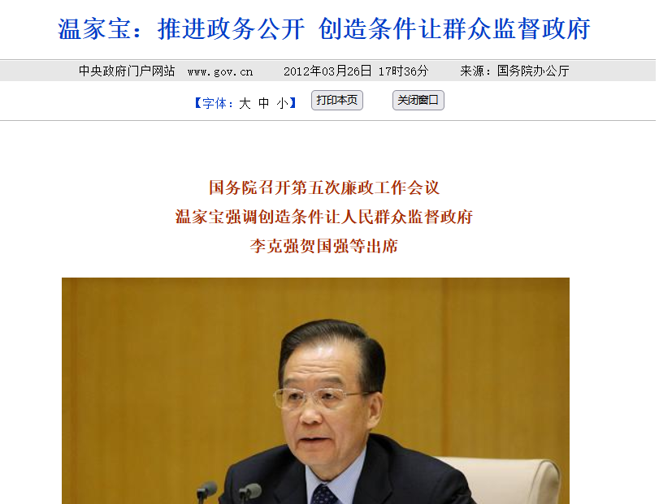
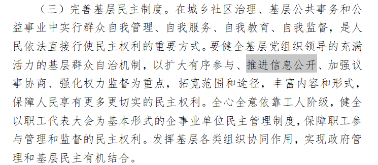
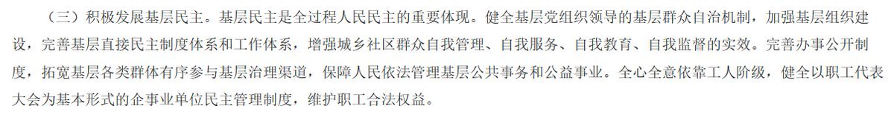
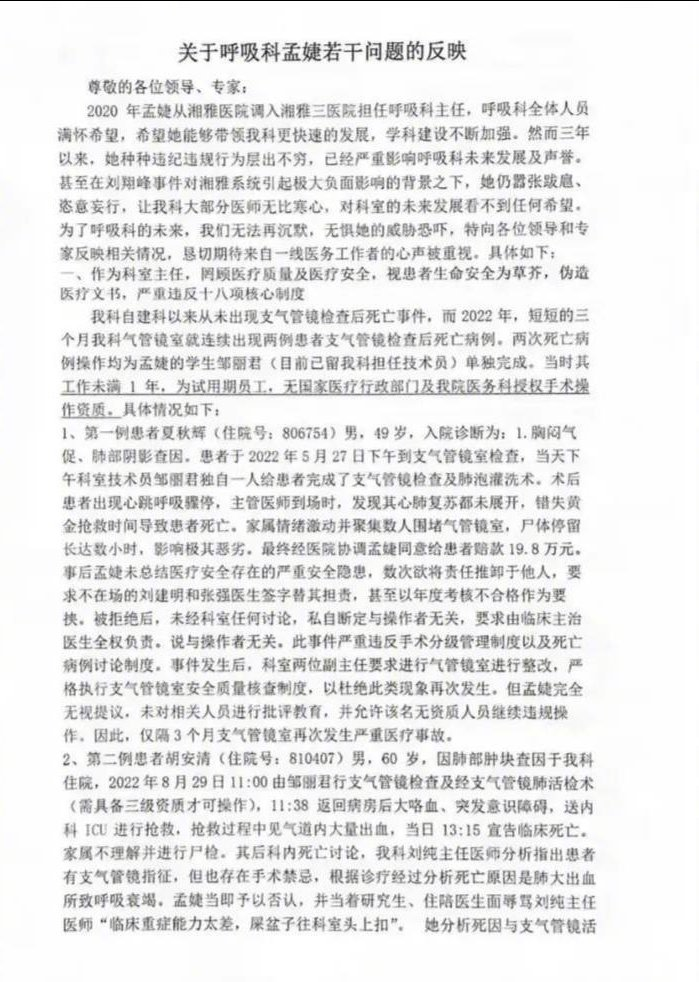

谁将十万横扫三江 北京时间 2023-09-15T11:31:38Z 1702525555219079593 江西省抚州市，一房产项目拖欠工人工资，工人讨薪被打，后工人家属前往当地市政府挂牌讨要说法
时间：2023-09-14
介绍：【（转自视频发布者）抚州市高新区当代阅农民工工资几年不给，我们农民工来了二十多天讨薪，被当代阅关在项目部打，身上的钱也用光了，逼得没办法了！
抚州当代阅做了3年，工钱一直不给，从湖北来了无数次，带班在项目部问工钱，被5、6个人关在项目部打，胸部骨头断了几根，做验伤。
2023年8月28日被殴打，伤情报告已构成刑事犯罪条件，9月11号至今已有15个工作日，犯罪份子至今逍遥法外，老父亲迫于无奈连夜从湖北赶到抚州为儿子讨公道，结果门都不让进！】
地点：江西省-抚州市-临川区-高新区文昌大道2388号
行业：建筑业/住宅
公司名称：抚州蓝绿深耕置业有限公司
企业性质：民营企业
项目名称：当代阅MOMΛ（别名：抚州当代阅）
行动类型：上访/要求劳动司法等机关介入
诉求：欠薪
参与人数：1-100
官方反应：工人被打/政府不作为
资料来源：
https://t.co/j6SQMx7KHA
https://t.co/Yx0Qmnbgnt
https://t.co/FLM7imhSR8

#欠薪事件   谁将十万横扫三江 北京时间 2023-09-15T06:56:37Z 1702456347009409282 吉林省长春市，吉粮集团拖欠职工工资及社保，职工前往吉粮控股拉横幅讨薪
时间：2023-09-14
介绍：https://t.co/6qhLHKTiO8吉粮集团欠薪事件介绍转自视频发布者视频-09-14
地点：吉林省-长春市-南关区-天普路399号
行业：制造业/农产品及食品加工
公司名称：吉林粮食控股集团股份有限公司
企业性质：国有企业
第二企业名称：吉林粮食集团有限公司
第二企业性质：国有控股
行动类型：其他
诉求：欠薪/社保
参与人数：100-1000
官方反应：警察出动
资料来源：
https://t.co/3ONtzgQbYk
https://t.co/qeTiJtZFeG
https://t.co/P9PA2EQyi8
https://t.co/hIVojvxtVy   谁将十万横扫三江 北京时间 2023-09-15T08:02:48Z 1702473000396992612 9月14日湖南娄底民营市场附近，环卫工人猝死 https://t.co/5bAvfQYMDA   谁将十万横扫三江 北京时间 2023-09-15T07:29:26Z 1702464605342351819 网友投稿：北极鲇鱼是必然，自我监督不需要对你公布

十八大：以扩大有序参与、推进信息公开、加强议事协商、强化权力监督为重点，拓宽范围和途径，丰富内容和形式，保障人民享有更多更切实的民主权利。

二十大改为：自我管理、自我服务、自我教育、自我监督。完善办事公开制度，拓宽基层各类群体有序参与基层治理渠道，保障人民依法管理基层公共事务和公益事业。   谁将十万横扫三江 北京时间 2023-09-15T07:32:29Z 1702465370073030900 RT @torontobigface: 中国的医保，社保属于狗都嫌弃的状态
对此很多小粉红说是因为中国人太多，人均GDP太低才这样的
那根据其他国家的支出推算
中国实现全民医保，实现老有所依的状态需要每年花多少钱？
如果没有中共趴我们身上吸血，中国人该过什么样的生活？
方脸说：…   谁将十万横扫三江 北京时间 2023-09-15T07:37:58Z 1702466752637247558 8月9日前后，一封指向中南大学湘雅三医院呼吸与危重症医学科主任孟某的联名举报信流传网络，举报信内容一经曝光便迅速冲上热搜榜首，将湘雅三医院与孟某推上风口浪尖。

8月10日，湖南省卫生健康委在其官网发布情况通报，湖南卫健委与中南大学高度重视，已成立联合调查组，正对相关情况逐一进行核实。一经查实，将依法依规严肃处理。

9月14日，距通报发布已过去一个多月，大皖新闻记者再次致电湖南省卫生健康委询问调查进展。湖南卫健委宣传处一卢姓工作人员告诉记者，“到目前为止还在调查阶段，还没有出结果。”   谁将十万横扫三江 北京时间 2023-09-15T08:22:20Z 1702477914691022865 如何看待华北水利水电大学教官特权事件

PS：现在这样没什么大不了的，等战时军队免予刑事处罚了，可就不是让座这么简单了 https://t.co/0Q13vdl9tc   谁将十万横扫三江 北京时间 2023-09-15T08:29:26Z 1702479702773080199 河南平顶山业主入住烂尾楼 https://t.co/Al1TeubEUX   