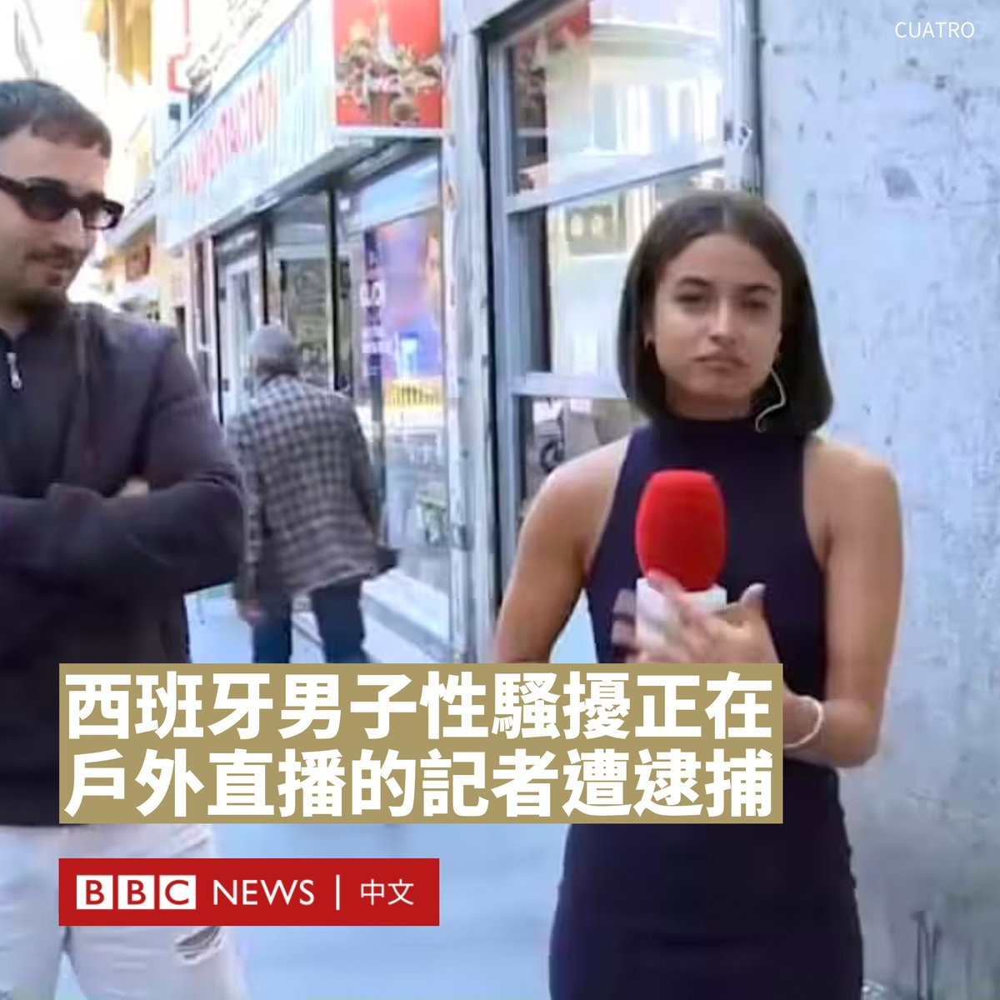
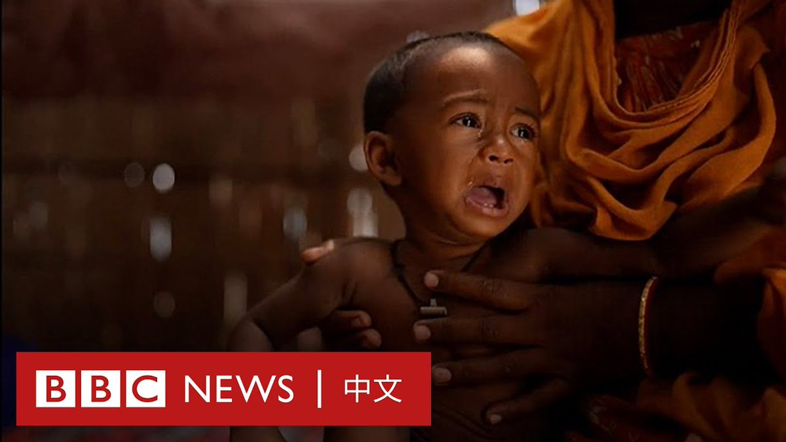
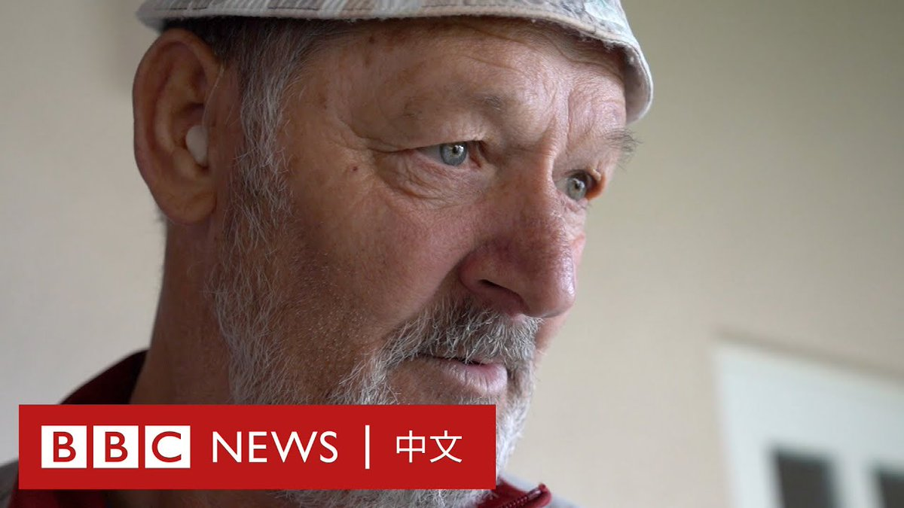

D英国广播公司BBC 北京时间 2023-09-14T20:15:50Z 1702295085902336378 西班牙警方逮捕了一名男子，他涉嫌在电视直播期间公然非礼一名女记者。

周二（9月12日），女记者伊萨·巴拉多（Isa Balado）在马德里街头直播报导一起劫案时，一名男子走近她并似乎触碰了她的臀部。

巴拉多试图继续进行播报，但演播室内的节目主持人纳乔·阿巴德（Nacho Abad）打断了她，问道：“伊萨，抱歉我打断你……但他刚刚是触碰了你的臀部吗？”

记者确认后，阿巴德告诉她让这个“白痴”入镜，当时这么男子仍带着微笑站在她身边。

“尽管你想问我们是哪个频道的，但你真的有必要摸我的屁股吗？我在做直播节目，我在工作。”巴拉多对该男子说道。

该男子矢口否认，并在离开时还试图伸手摸她的头发。

警方后来在社交平台X（推特）上发文表示，一名男子因涉嫌在记者进行直播连线时进行袭击而被逮捕。

巴拉多所属的西班牙四频道（Cuatro）所有者Mediaset Espana发表声明，表示其遭遇“绝对不能容忍”，并“坚决谴责任何形式的骚扰或攻击”。

西班牙劳工大臣约兰达·迪亚斯（Yolanda Díaz）称，罪犯不应逍遥法外。她在X上写道：“是大男子主义让记者遭受了这样的性侵犯，而侵犯者在镜头前却毫无悔意”。   D英国广播公司BBC 北京时间 2023-09-14T17:29:00Z 1702253099900186731 在孟加拉国，粮食与能源价格飞涨让这个本就不富裕的国家的情况雪上加霜。因为买不起口粮，许多年幼的孩子营养不良，体重甚至只有正常水平的一半。 https://t.co/Nhu70rnttU   D英国广播公司BBC 北京时间 2023-09-14T15:45:07Z 1702226956853403933 分析人士认为，郭台铭选择赖佩霞为副手是一步“好棋”，其知名度及亲和力短期内都有助于提升郭台铭的声势，但长远而言选情很难逆转。https://t.co/HwZQR6njj2   D英国广播公司BBC 北京时间 2023-09-14T13:58:31Z 1702200132811534414 波黑是全球因空气污染死亡比例最高的国家之一，据统计每年有约3000人死于空气污染。

该国有多座大型燃煤发电厂，附近村庄的居民一辈子暴露在污染下，许多人已患病多年。有居民表示，当地人正陆续离开，而患病者却“无处可去”。 https://t.co/S9KMkIWwhX   D英国广播公司BBC 北京时间 2023-09-14T11:56:42Z 1702169476467478647 上周，台风海葵带来的创纪录降雨让香港很多地区浸泡在水中。香港北部的一家养猪场老板表示，此次暴雨令他损失了1000多头猪。

而在100多公里之外的华南制造业城市东莞，暴雨和山洪同样让许多商户蒙受巨大损失。有商户称“至少需三年”才能恢复。 https://t.co/eoDoXUdk1N   D英国广播公司BBC 北京时间 2023-09-14T10:15:15Z 1702143946145862033 台湾电子大亨、鸿海集团创办人郭台铭参与角逐2024年大选后，周四（9月14日）宣布由在热门台剧《人选之人－造浪者》中饰演总统候选人的艺人赖佩霞担任其副手，这是台湾首次有演艺圈人士投身总统大选。

郭台铭在一次演讲中宣布了这一消息。他将赖佩霞形容为“万中选一”的最佳人选，也是他考虑的“唯一人选”。

郭台铭称，赖佩霞是女性运动提倡者与推动者，也是追求和平的身心灵工作者，她还有“丰富学经历，对政治领域毫不陌生”。

“我将借由赖佩霞女士的沟通技巧凝聚台湾社会集体共识，让台湾不再充满内耗与冲突，而是走向团结，因此更加茁壮。”他说道。

赖佩霞则表示，她的任务是落实郭台铭“整合在野”的心愿。

60岁的赖佩霞是一名歌手与演员，也是杂志发行人和作家，她拥有法学博士学位。

据台湾媒体报导，她的父亲是一名在越战期间派驻台湾的美国军人，母亲当时则是一名保姆。后来她的母亲独力抚养她长大。

上个月，郭台铭宣布以独立参选人身份加入台湾2024年总统选战，称希望整合在野势力，以终止民进党的继续执政。然而，他的参选造成泛蓝阵营进一步分裂，国民党批评郭台铭没有诚信，并警告党内人士不要替他助选。

由于郭台铭没有政党推荐，唯有透过连署方式才能取得大选入场券。

依据台湾法律，连署人数应达最近一次总统副总统选举的选举人总数1.5%。依据2020年大选计算，本次选举需要29万人连署才能登记为总统候选人。   