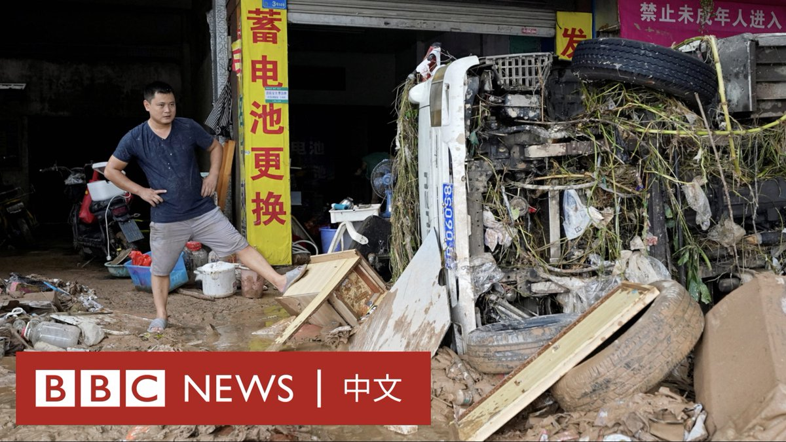
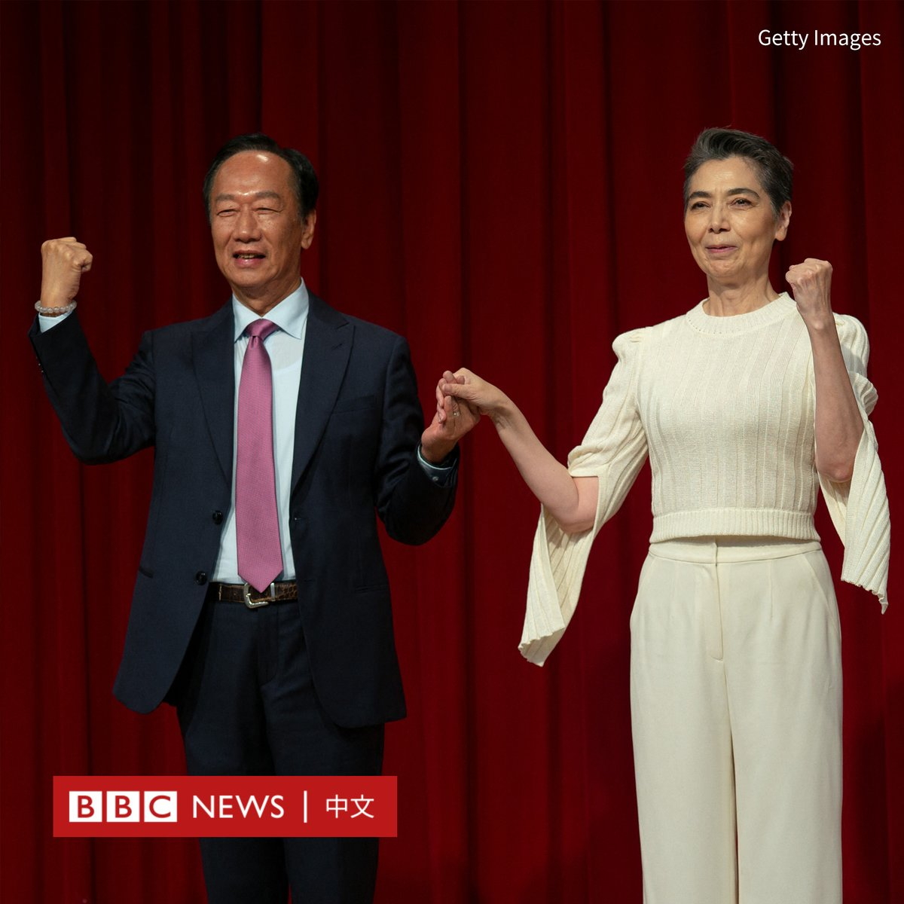

D英国广播公司BBC 北京时间 2023-09-14T11:56:42Z 1702169476467478647 上周，台风海葵带来的创纪录降雨让香港很多地区浸泡在水中。香港北部的一家养猪场老板表示，此次暴雨令他损失了1000多头猪。

而在100多公里之外的华南制造业城市东莞，暴雨和山洪同样让许多商户蒙受巨大损失。有商户称“至少需三年”才能恢复。 https://t.co/eoDoXUdk1N   D英国广播公司BBC 北京时间 2023-09-14T10:15:15Z 1702143946145862033 台湾电子大亨、鸿海集团创办人郭台铭参与角逐2024年大选后，周四（9月14日）宣布由在热门台剧《人选之人－造浪者》中饰演总统候选人的艺人赖佩霞担任其副手，这是台湾首次有演艺圈人士投身总统大选。

郭台铭在一次演讲中宣布了这一消息。他将赖佩霞形容为“万中选一”的最佳人选，也是他考虑的“唯一人选”。

郭台铭称，赖佩霞是女性运动提倡者与推动者，也是追求和平的身心灵工作者，她还有“丰富学经历，对政治领域毫不陌生”。

“我将借由赖佩霞女士的沟通技巧凝聚台湾社会集体共识，让台湾不再充满内耗与冲突，而是走向团结，因此更加茁壮。”他说道。

赖佩霞则表示，她的任务是落实郭台铭“整合在野”的心愿。

60岁的赖佩霞是一名歌手与演员，也是杂志发行人和作家，她拥有法学博士学位。

据台湾媒体报导，她的父亲是一名在越战期间派驻台湾的美国军人，母亲当时则是一名保姆。后来她的母亲独力抚养她长大。

上个月，郭台铭宣布以独立参选人身份加入台湾2024年总统选战，称希望整合在野势力，以终止民进党的继续执政。然而，他的参选造成泛蓝阵营进一步分裂，国民党批评郭台铭没有诚信，并警告党内人士不要替他助选。

由于郭台铭没有政党推荐，唯有透过连署方式才能取得大选入场券。

依据台湾法律，连署人数应达最近一次总统副总统选举的选举人总数1.5%。依据2020年大选计算，本次选举需要29万人连署才能登记为总统候选人。   